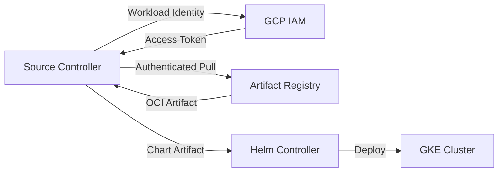

# How to Configure HelmRepository with Google Artifact Registry for Helm OCI in Flux

Author: [nawazdhandala](https://github.com/nawazdhandala)

Tags: Flux CD, GitOps, Kubernetes, Helm, HelmRepository, Google Cloud, Artifact Registry, OCI, GKE

Description: Learn how to configure a Flux HelmRepository to pull Helm charts from Google Artifact Registry using the OCI protocol with GKE Workload Identity.

---

## Introduction

Google Artifact Registry is Google Cloud's recommended service for storing container images and other artifacts, including Helm charts in OCI format. Flux CD supports pulling Helm charts from Artifact Registry using an OCI-type HelmRepository with the `gcp` provider. This provider leverages GKE Workload Identity for automatic authentication, eliminating the need to manage service account keys.

This guide covers the complete setup, from creating an Artifact Registry repository to deploying Helm charts with Flux.

## Prerequisites

- A GKE cluster with Flux CD v2.x installed
- GKE Workload Identity enabled on the cluster
- The `flux` CLI, `kubectl`, `gcloud` CLI, and `helm` CLI installed
- A Google Cloud project with Artifact Registry API enabled

## Step 1: Create an Artifact Registry Repository

Create a Docker-format repository in Artifact Registry to store Helm OCI charts.

```bash
# Enable the Artifact Registry API
gcloud services enable artifactregistry.googleapis.com

# Create a Docker-format repository for Helm OCI charts
gcloud artifacts repositories create helm-charts \
  --repository-format=docker \
  --location=us-central1 \
  --description="Helm charts repository"
```

## Step 2: Push a Helm Chart to Artifact Registry

Authenticate Helm with Artifact Registry and push a chart.

```bash
# Authenticate Helm with Artifact Registry
gcloud auth print-access-token | helm registry login \
  -u oauth2accesstoken \
  --password-stdin us-central1-docker.pkg.dev

# Package the Helm chart
helm package ./my-app-chart/

# Push the chart to Artifact Registry
helm push my-app-1.0.0.tgz oci://us-central1-docker.pkg.dev/my-project-id/helm-charts
```

Verify the chart is available.

```bash
# List images in the repository
gcloud artifacts docker images list \
  us-central1-docker.pkg.dev/my-project-id/helm-charts \
  --include-tags
```

## Step 3: Configure GKE Workload Identity

GKE Workload Identity allows the Flux source controller to authenticate with Artifact Registry using a Google Cloud service account.

### Create a Google Cloud Service Account

```bash
# Create a service account for Flux
gcloud iam service-accounts create flux-source-controller \
  --display-name="Flux Source Controller"
```

### Grant Artifact Registry Reader Access

```bash
# Grant the Artifact Registry Reader role
gcloud projects add-iam-policy-binding my-project-id \
  --member="serviceAccount:flux-source-controller@my-project-id.iam.gserviceaccount.com" \
  --role="roles/artifactregistry.reader"
```

### Bind the Google SA to the Kubernetes SA

```bash
# Allow the Kubernetes service account to impersonate the Google service account
gcloud iam service-accounts add-iam-policy-binding \
  flux-source-controller@my-project-id.iam.gserviceaccount.com \
  --role="roles/iam.workloadIdentityUser" \
  --member="serviceAccount:my-project-id.svc.id.goog[flux-system/source-controller]"
```

### Annotate the Kubernetes Service Account

```bash
# Annotate the Flux source controller service account with the Google SA email
kubectl annotate serviceaccount source-controller \
  --namespace=flux-system \
  iam.gke.io/gcp-service-account=flux-source-controller@my-project-id.iam.gserviceaccount.com \
  --overwrite

# Restart the source controller to pick up the new identity
kubectl rollout restart deployment/source-controller -n flux-system
```

## Step 4: Create the OCI HelmRepository

Create a HelmRepository with `type: oci` and `provider: gcp`.

```yaml
# helmrepository-gar.yaml
# HelmRepository configured for Google Artifact Registry with OCI protocol
apiVersion: source.toolkit.fluxcd.io/v1
kind: HelmRepository
metadata:
  name: my-gar-charts
  namespace: flux-system
spec:
  type: oci                      # Required for OCI registries
  provider: gcp                  # Enables automatic GCP token refresh via Workload Identity
  interval: 5m
  url: oci://us-central1-docker.pkg.dev/my-project-id/helm-charts
```

Apply the resource.

```bash
# Apply the HelmRepository
kubectl apply -f helmrepository-gar.yaml

# Verify the status
flux get sources helm -n flux-system
```

## Step 5: Create a HelmRelease

Deploy a chart from Artifact Registry using a HelmRelease.

```yaml
# helmrelease-my-app.yaml
# HelmRelease that deploys a chart from Google Artifact Registry
apiVersion: helm.toolkit.fluxcd.io/v2
kind: HelmRelease
metadata:
  name: my-app
  namespace: default
spec:
  interval: 10m
  chart:
    spec:
      chart: my-app                    # Chart name in the repository
      version: ">=1.0.0"               # Semver constraint
      sourceRef:
        kind: HelmRepository
        name: my-gar-charts            # References the Artifact Registry HelmRepository
        namespace: flux-system
      interval: 5m
  values:
    replicaCount: 2
    service:
      type: LoadBalancer
```

```bash
# Apply the HelmRelease
kubectl apply -f helmrelease-my-app.yaml

# Monitor the reconciliation
flux get helmreleases -A
```

## Architecture Overview



## Alternative: Using Static Credentials

For non-GKE clusters or environments without Workload Identity, you can use a service account key.

```bash
# Create a service account key (not recommended for production)
gcloud iam service-accounts keys create key.json \
  --iam-account=flux-source-controller@my-project-id.iam.gserviceaccount.com

# Create a Kubernetes secret with the key
kubectl create secret docker-registry gar-credentials \
  --namespace=flux-system \
  --docker-server=us-central1-docker.pkg.dev \
  --docker-username=_json_key \
  --docker-password="$(cat key.json)"

# Clean up the key file from disk
rm key.json
```

```yaml
# HelmRepository with static credentials (not recommended)
apiVersion: source.toolkit.fluxcd.io/v1
kind: HelmRepository
metadata:
  name: my-gar-charts
  namespace: flux-system
spec:
  type: oci
  interval: 5m
  url: oci://us-central1-docker.pkg.dev/my-project-id/helm-charts
  secretRef:
    name: gar-credentials      # Static service account key
```

Service account keys do not expire automatically but pose a security risk if leaked. Prefer Workload Identity for production.

## Multi-Region Setup

If you use Artifact Registry in multiple regions, create a HelmRepository for each regional endpoint.

```yaml
# HelmRepository for US region
apiVersion: source.toolkit.fluxcd.io/v1
kind: HelmRepository
metadata:
  name: gar-charts-us
  namespace: flux-system
spec:
  type: oci
  provider: gcp
  interval: 5m
  url: oci://us-central1-docker.pkg.dev/my-project-id/helm-charts
---
# HelmRepository for Europe region
apiVersion: source.toolkit.fluxcd.io/v1
kind: HelmRepository
metadata:
  name: gar-charts-eu
  namespace: flux-system
spec:
  type: oci
  provider: gcp
  interval: 5m
  url: oci://europe-west1-docker.pkg.dev/my-project-id/helm-charts
```

## Troubleshooting

### Verify Workload Identity

```bash
# Check that the service account annotation is set
kubectl get sa source-controller -n flux-system -o jsonpath='{.metadata.annotations}'

# Verify the source controller can authenticate
kubectl logs -n flux-system deploy/source-controller --since=5m | grep -i "gcp\|artifact\|error"
```

### Common Issues

1. **Permission denied**: Ensure the Google SA has the `roles/artifactregistry.reader` role on the project or repository.
2. **Workload Identity not working**: Verify that GKE Workload Identity is enabled at both the cluster and node pool level.
3. **Repository not found**: The URL must include the full path: `oci://<region>-docker.pkg.dev/<project>/<repository>`.

## Conclusion

Configuring Flux to pull Helm charts from Google Artifact Registry using OCI is a secure and maintainable approach for GKE environments. The `provider: gcp` field in the HelmRepository resource enables seamless authentication through GKE Workload Identity, eliminating the need to manage service account keys. The key steps are: setting up a Docker-format repository in Artifact Registry, configuring Workload Identity for the source controller, and creating an OCI-type HelmRepository with the `gcp` provider.
