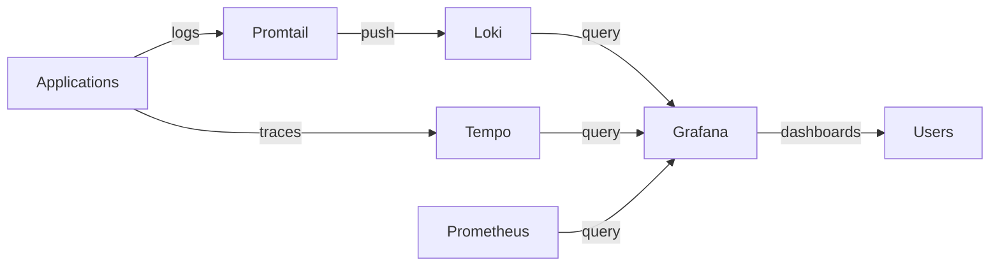

# How to Set Up HelmRepository for Grafana Charts in Flux

Author: [nawazdhandala](https://github.com/nawazdhandala)

Tags: Flux CD, GitOps, Kubernetes, Helm, HelmRepository, Grafana, Loki, Tempo, Monitoring

Description: Step-by-step guide to configuring a Flux CD HelmRepository for Grafana's official Helm charts and deploying Grafana, Loki, and Tempo.

---

Grafana Labs publishes Helm charts for its entire observability stack, including Grafana dashboards, Loki for log aggregation, Tempo for distributed tracing, and Mimir for metrics. All of these charts are available from the official Grafana Helm repository. This guide shows you how to configure Flux CD to use the Grafana Helm repository and deploy key components of the Grafana observability stack.

## Creating the Grafana HelmRepository

The Grafana Helm repository is a standard HTTPS repository. Create the HelmRepository resource:

```yaml
# HelmRepository for Grafana's official Helm charts
apiVersion: source.toolkit.fluxcd.io/v1
kind: HelmRepository
metadata:
  name: grafana
  namespace: flux-system
spec:
  interval: 60m
  url: https://grafana.github.io/helm-charts
```

Apply it to your cluster:

```bash
# Apply the Grafana HelmRepository
kubectl apply -f grafana-helmrepository.yaml

# Verify the repository is ready
flux get sources helm -n flux-system
```

You should see the `grafana` source with `Ready: True` and a stored artifact revision.

## Deploying Grafana

Deploy the Grafana dashboard application with a HelmRelease:

```yaml
# HelmRelease to deploy Grafana from the official Helm repository
apiVersion: helm.toolkit.fluxcd.io/v2
kind: HelmRelease
metadata:
  name: grafana
  namespace: monitoring
spec:
  interval: 30m
  chart:
    spec:
      chart: grafana
      version: "8.*"
      sourceRef:
        kind: HelmRepository
        name: grafana
        namespace: flux-system
      interval: 10m
  values:
    # Enable persistence for dashboard storage
    persistence:
      enabled: true
      size: 5Gi
    # Configure the admin credentials
    adminUser: admin
    adminPassword: admin-password
    # Add Prometheus as a default data source
    datasources:
      datasources.yaml:
        apiVersion: 1
        datasources:
          - name: Prometheus
            type: prometheus
            url: http://prometheus-server.monitoring.svc.cluster.local
            access: proxy
            isDefault: true
          - name: Loki
            type: loki
            url: http://loki-gateway.monitoring.svc.cluster.local
            access: proxy
    # Expose Grafana via Ingress
    ingress:
      enabled: true
      ingressClassName: nginx
      hosts:
        - grafana.example.com
```

## Deploying Loki for Log Aggregation

Loki is Grafana's log aggregation system. Deploy it using the `loki` chart:

```yaml
# HelmRelease to deploy Loki in single-binary mode
apiVersion: helm.toolkit.fluxcd.io/v2
kind: HelmRelease
metadata:
  name: loki
  namespace: monitoring
spec:
  interval: 30m
  chart:
    spec:
      chart: loki
      version: "6.*"
      sourceRef:
        kind: HelmRepository
        name: grafana
        namespace: flux-system
      interval: 10m
  values:
    # Deploy Loki in single-binary mode for simplicity
    deploymentMode: SingleBinary
    loki:
      auth_enabled: false
      commonConfig:
        replication_factor: 1
      storage:
        type: filesystem
      schemaConfig:
        configs:
          - from: "2024-01-01"
            store: tsdb
            object_store: filesystem
            schema: v13
            index:
              prefix: loki_index_
              period: 24h
    singleBinary:
      replicas: 1
      persistence:
        enabled: true
        size: 20Gi
    # Disable components not needed in single-binary mode
    backend:
      replicas: 0
    read:
      replicas: 0
    write:
      replicas: 0
```

## Deploying Promtail for Log Collection

Promtail ships logs from your cluster nodes to Loki:

```yaml
# HelmRelease to deploy Promtail for collecting logs and sending to Loki
apiVersion: helm.toolkit.fluxcd.io/v2
kind: HelmRelease
metadata:
  name: promtail
  namespace: monitoring
spec:
  interval: 30m
  chart:
    spec:
      chart: promtail
      version: "6.*"
      sourceRef:
        kind: HelmRepository
        name: grafana
        namespace: flux-system
      interval: 10m
  values:
    config:
      clients:
        # Point Promtail to the Loki gateway
        - url: http://loki-gateway.monitoring.svc.cluster.local/loki/api/v1/push
```

## Deploying Tempo for Distributed Tracing

Tempo provides distributed tracing capabilities:

```yaml
# HelmRelease to deploy Tempo for distributed tracing
apiVersion: helm.toolkit.fluxcd.io/v2
kind: HelmRelease
metadata:
  name: tempo
  namespace: monitoring
spec:
  interval: 30m
  chart:
    spec:
      chart: tempo
      version: "1.*"
      sourceRef:
        kind: HelmRepository
        name: grafana
        namespace: flux-system
      interval: 10m
  values:
    tempo:
      storage:
        trace:
          backend: local
          local:
            path: /var/tempo/traces
      retention: 48h
    persistence:
      enabled: true
      size: 10Gi
```

## Complete Observability Stack Architecture

Here is how the components connect together:



## Creating the Monitoring Namespace

Before deploying, ensure the monitoring namespace exists. You can manage it through Flux as well:

```yaml
# Namespace for the monitoring stack
apiVersion: v1
kind: Namespace
metadata:
  name: monitoring
```

## Dependency Management

Grafana depends on Loki and Prometheus being available. Use Flux dependencies to control the deployment order:

```yaml
# HelmRelease for Grafana with dependencies on Loki
apiVersion: helm.toolkit.fluxcd.io/v2
kind: HelmRelease
metadata:
  name: grafana
  namespace: monitoring
spec:
  dependsOn:
    # Wait for Loki to be ready before deploying Grafana
    - name: loki
      namespace: monitoring
  interval: 30m
  chart:
    spec:
      chart: grafana
      version: "8.*"
      sourceRef:
        kind: HelmRepository
        name: grafana
        namespace: flux-system
      interval: 10m
  values:
    persistence:
      enabled: true
      size: 5Gi
```

## Verifying the Stack

After deploying, verify all components are running:

```bash
# Check all HelmReleases in the monitoring namespace
flux get helmreleases -n monitoring

# Verify pods are running
kubectl get pods -n monitoring

# Check Grafana service endpoint
kubectl get svc -n monitoring grafana
```

Access Grafana at the configured ingress URL or via port-forward:

```bash
# Port-forward to access Grafana locally
kubectl port-forward -n monitoring svc/grafana 3000:80
```

The Grafana Helm repository provides a complete observability toolkit. By managing all these components through Flux CD, you get reproducible deployments, version-controlled configuration, and automated updates through your GitOps workflow.
