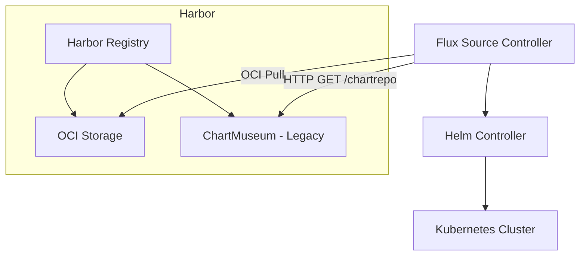

# How to Configure HelmRepository with Harbor Registry in Flux

Author: [nawazdhandala](https://github.com/nawazdhandala)

Tags: Flux CD, GitOps, Kubernetes, Helm, HelmRepository, Harbor, OCI, Container Registry

Description: Learn how to configure Flux HelmRepository resources to pull Helm charts from Harbor registry, supporting both ChartMuseum-based and OCI-based chart storage.

---

## Introduction

Harbor is a popular open-source container registry that supports storing Helm charts in two ways: through its built-in ChartMuseum integration (legacy) and as OCI artifacts (recommended). Flux CD works with both approaches. The ChartMuseum mode uses a standard HTTP HelmRepository, while the OCI mode uses an OCI-type HelmRepository.

This guide covers configuring Flux to pull Helm charts from Harbor using both methods, with a focus on the recommended OCI approach.

## Prerequisites

- A Kubernetes cluster with Flux CD v2.x installed
- A Harbor registry instance (v2.0+ for OCI support)
- The `flux` CLI, `kubectl`, and `helm` CLI installed
- A Harbor project with at least one Helm chart

## Harbor Chart Storage Modes

Harbor v2.0 and later supports two chart storage backends:

1. **OCI-based (recommended)**: Charts are stored as OCI artifacts alongside container images. This is the default in Harbor v2.6+.
2. **ChartMuseum-based (legacy)**: Charts are stored using the embedded ChartMuseum service. This must be explicitly enabled in Harbor v2.6+.

## Method 1: OCI-Based HelmRepository (Recommended)

### Push a Helm Chart to Harbor via OCI

```bash
# Log in to Harbor with Helm OCI
helm registry login harbor.example.com --username admin --password Harbor12345

# Package and push the chart
helm package ./my-app-chart/
helm push my-app-1.0.0.tgz oci://harbor.example.com/my-project
```

### Create Authentication Secret

Harbor requires credentials even for project members. Create a docker-registry secret for Flux.

```bash
# Create a docker-registry secret for Harbor OCI authentication
kubectl create secret docker-registry harbor-oci-creds \
  --namespace=flux-system \
  --docker-server=harbor.example.com \
  --docker-username=flux-bot \
  --docker-password=<harbor-password>
```

### Create the OCI HelmRepository

```yaml
# helmrepository-harbor-oci.yaml
# HelmRepository configured for Harbor with OCI protocol
apiVersion: source.toolkit.fluxcd.io/v1
kind: HelmRepository
metadata:
  name: harbor-charts
  namespace: flux-system
spec:
  type: oci                        # OCI mode for Harbor v2.0+
  interval: 5m
  url: oci://harbor.example.com/my-project
  secretRef:
    name: harbor-oci-creds         # Docker-registry secret for authentication
```

```bash
# Apply the HelmRepository
kubectl apply -f helmrepository-harbor-oci.yaml

# Verify the status
flux get sources helm -n flux-system
```

### Create a HelmRelease

```yaml
# helmrelease-my-app.yaml
# HelmRelease pulling from Harbor OCI HelmRepository
apiVersion: helm.toolkit.fluxcd.io/v2
kind: HelmRelease
metadata:
  name: my-app
  namespace: default
spec:
  interval: 10m
  chart:
    spec:
      chart: my-app                     # Chart name as stored in Harbor
      version: "1.0.x"                  # Semver constraint
      sourceRef:
        kind: HelmRepository
        name: harbor-charts             # References the Harbor OCI HelmRepository
        namespace: flux-system
      interval: 5m
  values:
    replicaCount: 2
```

```bash
# Apply the HelmRelease
kubectl apply -f helmrelease-my-app.yaml
```

## Method 2: ChartMuseum-Based HelmRepository (Legacy)

If your Harbor instance uses the ChartMuseum backend, configure a standard HTTP HelmRepository.

### Create Authentication Secret

```bash
# Create a basic-auth secret for ChartMuseum access
kubectl create secret generic harbor-chartmuseum-creds \
  --namespace=flux-system \
  --from-literal=username=flux-bot \
  --from-literal=password=<harbor-password>
```

### Create the HTTP HelmRepository

The ChartMuseum API in Harbor is available at `/chartrepo/<project-name>`.

```yaml
# helmrepository-harbor-chartmuseum.yaml
# HelmRepository configured for Harbor ChartMuseum backend
apiVersion: source.toolkit.fluxcd.io/v1
kind: HelmRepository
metadata:
  name: harbor-chartmuseum
  namespace: flux-system
spec:
  interval: 10m
  url: https://harbor.example.com/chartrepo/my-project    # ChartMuseum URL path
  secretRef:
    name: harbor-chartmuseum-creds    # Basic auth credentials
```

```bash
# Apply the HelmRepository
kubectl apply -f helmrepository-harbor-chartmuseum.yaml
```

## Handling Self-Signed Certificates

Harbor is often deployed with self-signed TLS certificates, especially in private environments. Flux needs to trust the CA certificate.

```bash
# Extract the CA certificate from Harbor (if self-signed)
openssl s_client -connect harbor.example.com:443 -showcerts </dev/null 2>/dev/null | \
  openssl x509 -outform PEM > harbor-ca.crt

# Create a secret with the CA certificate
kubectl create secret generic harbor-tls-ca \
  --namespace=flux-system \
  --from-file=ca.crt=harbor-ca.crt
```

```yaml
# HelmRepository with custom CA certificate for self-signed TLS
apiVersion: source.toolkit.fluxcd.io/v1
kind: HelmRepository
metadata:
  name: harbor-charts
  namespace: flux-system
spec:
  type: oci
  interval: 5m
  url: oci://harbor.example.com/my-project
  secretRef:
    name: harbor-oci-creds
  certSecretRef:
    name: harbor-tls-ca          # CA certificate for self-signed TLS
```

## Using a Harbor Robot Account

For production environments, use a Harbor robot account instead of user credentials. Robot accounts have scoped permissions and can be audited independently.

```bash
# Create a robot account via the Harbor API
curl -s -X POST "https://harbor.example.com/api/v2.0/robots" \
  -H "Content-Type: application/json" \
  -u "admin:Harbor12345" \
  -d '{
    "name": "flux-reader",
    "duration": -1,
    "level": "project",
    "permissions": [
      {
        "namespace": "my-project",
        "kind": "project",
        "access": [
          {"resource": "repository", "action": "pull"},
          {"resource": "artifact", "action": "read"}
        ]
      }
    ]
  }'
```

Use the robot account credentials in the Kubernetes secret.

```bash
# Create a secret with robot account credentials
# Robot account names are prefixed with "robot$" in Harbor
kubectl create secret docker-registry harbor-robot-creds \
  --namespace=flux-system \
  --docker-server=harbor.example.com \
  --docker-username='robot$flux-reader' \
  --docker-password=<robot-secret>
```

## Architecture Overview



## Troubleshooting

### Check HelmRepository Status

```bash
# Get the status and any error messages
flux get sources helm -n flux-system

# View detailed events
kubectl describe helmrepository harbor-charts -n flux-system
```

### Source Controller Logs

```bash
# Check for Harbor-related errors
kubectl logs -n flux-system deploy/source-controller --since=10m | grep -i "harbor\|error\|401\|403"
```

### Common Issues

1. **Certificate errors**: Self-signed certificates require a `certSecretRef`. Without it, pulls will fail with TLS verification errors.
2. **Robot account prefix**: Harbor robot account usernames must include the `robot$` prefix.
3. **Project visibility**: Even public projects may require authentication for OCI pulls in some Harbor configurations.
4. **ChartMuseum disabled**: Harbor v2.6+ disables ChartMuseum by default. Enable it in Harbor configuration or switch to OCI mode.

## Conclusion

Harbor is a versatile registry that works well with Flux CD for Helm chart delivery. The OCI-based approach is recommended for new deployments as it aligns with the Helm and OCI ecosystem standards. For existing installations that rely on ChartMuseum, Flux supports the legacy HTTP-based HelmRepository as well. Regardless of the method, always use robot accounts with minimal permissions, and configure TLS trust for self-signed certificates.
