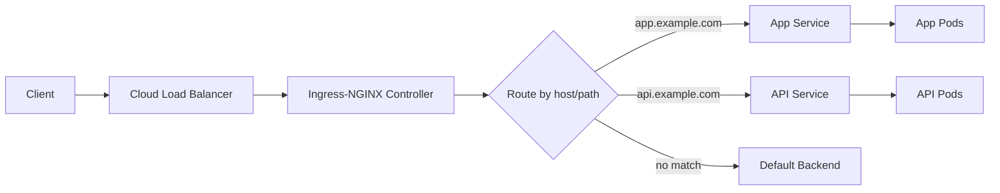

# How to Set Up HelmRepository for Ingress-NGINX Charts in Flux

Author: [nawazdhandala](https://github.com/nawazdhandala)

Tags: Flux CD, GitOps, Kubernetes, Helm, HelmRepository, Ingress-NGINX, Ingress Controller, Load Balancing

Description: Step-by-step guide to configuring a Flux CD HelmRepository for the Ingress-NGINX controller and deploying it with production-ready settings.

---

The Ingress-NGINX controller is the most widely used ingress controller in Kubernetes. It provides HTTP and HTTPS routing, TLS termination, load balancing, and request routing based on hostnames and paths. This guide covers how to set up the Ingress-NGINX Helm repository in Flux CD and deploy the controller with configurations suitable for production environments.

## Creating the Ingress-NGINX HelmRepository

The Ingress-NGINX Helm charts are published by the Kubernetes community. Create the HelmRepository resource:

```yaml
# HelmRepository for the Ingress-NGINX controller
apiVersion: source.toolkit.fluxcd.io/v1
kind: HelmRepository
metadata:
  name: ingress-nginx
  namespace: flux-system
spec:
  interval: 60m
  url: https://kubernetes.github.io/ingress-nginx
```

Apply and verify:

```bash
# Apply the Ingress-NGINX HelmRepository
kubectl apply -f ingress-nginx-helmrepository.yaml

# Verify the repository is ready
flux get sources helm -n flux-system
```

## Basic Deployment

Deploy the Ingress-NGINX controller with a basic configuration:

```yaml
# HelmRelease for the Ingress-NGINX controller
apiVersion: helm.toolkit.fluxcd.io/v2
kind: HelmRelease
metadata:
  name: ingress-nginx
  namespace: ingress-nginx
spec:
  interval: 30m
  chart:
    spec:
      chart: ingress-nginx
      version: "4.*"
      sourceRef:
        kind: HelmRepository
        name: ingress-nginx
        namespace: flux-system
      interval: 10m
  values:
    controller:
      # Use the IngressClass resource
      ingressClassResource:
        name: nginx
        enabled: true
        default: true
      # Set replica count for high availability
      replicaCount: 2
      # Resource limits
      resources:
        requests:
          cpu: 100m
          memory: 128Mi
        limits:
          cpu: 500m
          memory: 512Mi
      # Enable metrics for Prometheus scraping
      metrics:
        enabled: true
        serviceMonitor:
          enabled: true
```

Create the namespace:

```yaml
# Namespace for the ingress controller
apiVersion: v1
kind: Namespace
metadata:
  name: ingress-nginx
```

## Production Configuration

For production environments, you need additional settings for security, performance, and reliability:

```yaml
# Production-grade Ingress-NGINX HelmRelease
apiVersion: helm.toolkit.fluxcd.io/v2
kind: HelmRelease
metadata:
  name: ingress-nginx
  namespace: ingress-nginx
spec:
  interval: 30m
  chart:
    spec:
      chart: ingress-nginx
      version: "4.*"
      sourceRef:
        kind: HelmRepository
        name: ingress-nginx
        namespace: flux-system
      interval: 10m
  values:
    controller:
      replicaCount: 3
      # Use pod anti-affinity to spread replicas across nodes
      topologySpreadConstraints:
        - maxSkew: 1
          topologyKey: kubernetes.io/hostname
          whenUnsatisfiable: DoNotSchedule
          labelSelector:
            matchLabels:
              app.kubernetes.io/name: ingress-nginx
              app.kubernetes.io/component: controller

      # Enable PROXY protocol if behind a network load balancer
      config:
        use-proxy-protocol: "false"
        # Security headers
        hide-headers: "Server,X-Powered-By"
        # Enable real IP detection
        use-forwarded-headers: "true"
        compute-full-forwarded-for: "true"
        # Connection and request limits
        proxy-body-size: "50m"
        client-max-body-size: "50m"
        # Timeouts
        proxy-read-timeout: "120"
        proxy-send-timeout: "120"
        proxy-connect-timeout: "10"
        # Enable gzip compression
        use-gzip: "true"
        gzip-level: "5"
        gzip-min-length: "1000"

      # Service configuration
      service:
        type: LoadBalancer
        annotations:
          # AWS NLB annotation (adjust for your cloud provider)
          service.beta.kubernetes.io/aws-load-balancer-type: "nlb"
          service.beta.kubernetes.io/aws-load-balancer-scheme: "internet-facing"
        externalTrafficPolicy: Local

      # Pod disruption budget for zero-downtime upgrades
      minAvailable: 1

      # Autoscaling configuration
      autoscaling:
        enabled: true
        minReplicas: 3
        maxReplicas: 10
        targetCPUUtilizationPercentage: 70
        targetMemoryUtilizationPercentage: 80

      resources:
        requests:
          cpu: 250m
          memory: 256Mi
        limits:
          cpu: "1"
          memory: 1Gi

      # Enable Prometheus metrics
      metrics:
        enabled: true
        serviceMonitor:
          enabled: true
          namespace: monitoring

    # Default backend for unmatched requests
    defaultBackend:
      enabled: true
      replicaCount: 2
      resources:
        requests:
          cpu: 10m
          memory: 20Mi
```

## Cloud Provider Service Annotations

Different cloud providers require different annotations on the LoadBalancer service. Here are the most common ones:

```yaml
# AWS annotations for Network Load Balancer
controller:
  service:
    annotations:
      service.beta.kubernetes.io/aws-load-balancer-type: "nlb"
      service.beta.kubernetes.io/aws-load-balancer-scheme: "internet-facing"
      service.beta.kubernetes.io/aws-load-balancer-cross-zone-load-balancing-enabled: "true"
```

```yaml
# GCP annotations for external load balancer
controller:
  service:
    annotations:
      cloud.google.com/neg: '{"ingress": true}'
```

```yaml
# Azure annotations for standard load balancer
controller:
  service:
    annotations:
      service.beta.kubernetes.io/azure-load-balancer-health-probe-request-path: "/healthz"
```

## Internal Ingress Controller

You may want a separate ingress controller for internal-only services:

```yaml
# HelmRelease for an internal Ingress-NGINX controller
apiVersion: helm.toolkit.fluxcd.io/v2
kind: HelmRelease
metadata:
  name: ingress-nginx-internal
  namespace: ingress-nginx
spec:
  interval: 30m
  chart:
    spec:
      chart: ingress-nginx
      version: "4.*"
      sourceRef:
        kind: HelmRepository
        name: ingress-nginx
        namespace: flux-system
      interval: 10m
  values:
    controller:
      ingressClassResource:
        # Use a different IngressClass name to distinguish from the public controller
        name: nginx-internal
        enabled: true
        default: false
        controllerValue: k8s.io/ingress-nginx-internal
      # Use an internal-only load balancer
      service:
        annotations:
          service.beta.kubernetes.io/aws-load-balancer-scheme: "internal"
          service.beta.kubernetes.io/aws-load-balancer-type: "nlb"
      replicaCount: 2
```

## Request Flow Architecture

Here is how traffic flows through the Ingress-NGINX controller:



## Verifying the Deployment

After applying, verify the ingress controller is running:

```bash
# Check the HelmRelease status
flux get helmreleases -n ingress-nginx

# Verify pods are running and ready
kubectl get pods -n ingress-nginx

# Check the LoadBalancer service and get the external IP/hostname
kubectl get svc -n ingress-nginx

# Test the ingress controller health endpoint
kubectl port-forward -n ingress-nginx svc/ingress-nginx-controller 8080:80
# In another terminal:
curl -v http://localhost:8080/healthz
```

## Testing with a Sample Ingress

Create a test Ingress resource to verify routing works:

```yaml
# Sample Ingress resource to test the controller
apiVersion: networking.k8s.io/v1
kind: Ingress
metadata:
  name: test-ingress
  namespace: default
  annotations:
    nginx.ingress.kubernetes.io/rewrite-target: /
spec:
  ingressClassName: nginx
  rules:
    - host: test.example.com
      http:
        paths:
          - path: /
            pathType: Prefix
            backend:
              service:
                name: my-service
                port:
                  number: 80
```

Managing the Ingress-NGINX controller through Flux CD ensures consistent configuration across environments, version-controlled changes, and automated rollouts. Combined with cert-manager for TLS, this provides a complete ingress solution managed entirely through GitOps.
