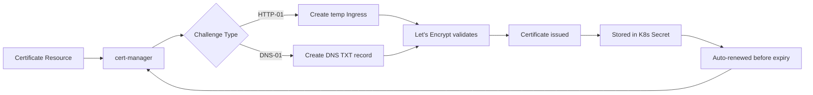

# How to Set Up HelmRepository for Jetstack (cert-manager) Charts in Flux

Author: [nawazdhandala](https://github.com/nawazdhandala)

Tags: Flux CD, GitOps, Kubernetes, Helm, HelmRepository, Jetstack, cert-manager, TLS, Certificates

Description: Step-by-step guide to configuring a Flux CD HelmRepository for Jetstack charts and deploying cert-manager for automated TLS certificate management.

---

cert-manager is the de facto standard for automated TLS certificate management in Kubernetes. Published by Jetstack (now part of Venafi), it automates the issuance and renewal of certificates from sources like Let's Encrypt, HashiCorp Vault, and private CAs. This guide shows you how to set up the Jetstack Helm repository in Flux CD and deploy cert-manager with proper configuration.

## Creating the Jetstack HelmRepository

The Jetstack Helm charts are hosted at `https://charts.jetstack.io`. Create the HelmRepository resource:

```yaml
# HelmRepository for Jetstack (cert-manager) Helm charts
apiVersion: source.toolkit.fluxcd.io/v1
kind: HelmRepository
metadata:
  name: jetstack
  namespace: flux-system
spec:
  interval: 60m
  url: https://charts.jetstack.io
```

Apply and verify:

```bash
# Apply the Jetstack HelmRepository
kubectl apply -f jetstack-helmrepository.yaml

# Verify the repository is ready
flux get sources helm -n flux-system
```

## Deploying cert-manager

cert-manager requires Custom Resource Definitions (CRDs) to be installed. You can let the Helm chart handle CRDs or install them separately. Here is the recommended approach using Flux:

```yaml
# HelmRelease to deploy cert-manager with CRD installation
apiVersion: helm.toolkit.fluxcd.io/v2
kind: HelmRelease
metadata:
  name: cert-manager
  namespace: cert-manager
spec:
  interval: 30m
  chart:
    spec:
      chart: cert-manager
      version: "1.*"
      sourceRef:
        kind: HelmRepository
        name: jetstack
        namespace: flux-system
      interval: 10m
  # Handle CRDs during install and upgrade
  install:
    crds: CreateReplace
  upgrade:
    crds: CreateReplace
  values:
    # Install CRDs as part of the Helm release
    crds:
      enabled: true
    # Enable Prometheus metrics
    prometheus:
      enabled: true
      servicemonitor:
        enabled: true
    # Resource configuration
    resources:
      requests:
        cpu: 50m
        memory: 128Mi
      limits:
        cpu: 200m
        memory: 256Mi
    # Enable the webhook for certificate validation
    webhook:
      resources:
        requests:
          cpu: 25m
          memory: 32Mi
    # Enable the cainjector for automatic CA injection
    cainjector:
      resources:
        requests:
          cpu: 25m
          memory: 128Mi
```

Create the namespace first:

```yaml
# Namespace for cert-manager
apiVersion: v1
kind: Namespace
metadata:
  name: cert-manager
```

## Setting Up a Let's Encrypt ClusterIssuer

After cert-manager is running, configure a ClusterIssuer for Let's Encrypt. This is typically managed through a separate Kustomization that depends on the cert-manager HelmRelease:

```yaml
# ClusterIssuer for Let's Encrypt staging (use for testing)
apiVersion: cert-manager.io/v1
kind: ClusterIssuer
metadata:
  name: letsencrypt-staging
spec:
  acme:
    server: https://acme-staging-v02.api.letsencrypt.org/directory
    email: your-email@example.com
    privateKeySecretRef:
      name: letsencrypt-staging-key
    solvers:
      - http01:
          ingress:
            ingressClassName: nginx
---
# ClusterIssuer for Let's Encrypt production
apiVersion: cert-manager.io/v1
kind: ClusterIssuer
metadata:
  name: letsencrypt-prod
spec:
  acme:
    server: https://acme-v02.api.letsencrypt.org/directory
    email: your-email@example.com
    privateKeySecretRef:
      name: letsencrypt-prod-key
    solvers:
      - http01:
          ingress:
            ingressClassName: nginx
```

## Managing ClusterIssuers with Flux Dependencies

To ensure the ClusterIssuers are only applied after cert-manager is fully running, use a Flux Kustomization with a dependency:

```yaml
# Kustomization for cert-manager HelmRelease
apiVersion: kustomize.toolkit.fluxcd.io/v1
kind: Kustomization
metadata:
  name: cert-manager
  namespace: flux-system
spec:
  interval: 10m
  path: ./infrastructure/cert-manager
  prune: true
  sourceRef:
    kind: GitRepository
    name: flux-system
---
# Kustomization for ClusterIssuers, depends on cert-manager
apiVersion: kustomize.toolkit.fluxcd.io/v1
kind: Kustomization
metadata:
  name: cert-manager-issuers
  namespace: flux-system
spec:
  dependsOn:
    # Wait for cert-manager CRDs and controllers to be ready
    - name: cert-manager
  interval: 10m
  path: ./infrastructure/cert-manager-issuers
  prune: true
  sourceRef:
    kind: GitRepository
    name: flux-system
```

## DNS-01 Challenge with Cloudflare

For wildcard certificates or environments without public HTTP access, use DNS-01 challenges. Here is an example with Cloudflare:

```yaml
# Secret containing the Cloudflare API token
apiVersion: v1
kind: Secret
metadata:
  name: cloudflare-api-token
  namespace: cert-manager
type: Opaque
stringData:
  api-token: "your-cloudflare-api-token"
---
# ClusterIssuer using DNS-01 challenge with Cloudflare
apiVersion: cert-manager.io/v1
kind: ClusterIssuer
metadata:
  name: letsencrypt-dns
spec:
  acme:
    server: https://acme-v02.api.letsencrypt.org/directory
    email: your-email@example.com
    privateKeySecretRef:
      name: letsencrypt-dns-key
    solvers:
      - dns01:
          cloudflare:
            apiTokenSecretRef:
              name: cloudflare-api-token
              key: api-token
        selector:
          dnsZones:
            - "example.com"
```

## Requesting a Certificate

Once the ClusterIssuer is configured, you can request certificates either directly or through Ingress annotations:

```yaml
# Directly request a TLS certificate
apiVersion: cert-manager.io/v1
kind: Certificate
metadata:
  name: example-com-tls
  namespace: default
spec:
  secretName: example-com-tls-secret
  issuerRef:
    name: letsencrypt-prod
    kind: ClusterIssuer
  dnsNames:
    - example.com
    - www.example.com
```

Or use Ingress annotations for automatic certificate provisioning:

```yaml
# Ingress with automatic cert-manager certificate provisioning
apiVersion: networking.k8s.io/v1
kind: Ingress
metadata:
  name: my-app
  annotations:
    # cert-manager will automatically create a Certificate resource
    cert-manager.io/cluster-issuer: letsencrypt-prod
spec:
  ingressClassName: nginx
  tls:
    - hosts:
        - app.example.com
      secretName: app-example-com-tls
  rules:
    - host: app.example.com
      http:
        paths:
          - path: /
            pathType: Prefix
            backend:
              service:
                name: my-app
                port:
                  number: 80
```

## Certificate Lifecycle Flow

Here is how cert-manager handles the certificate lifecycle:



## Verifying the Installation

Check that cert-manager is running and certificates are being issued:

```bash
# Verify cert-manager pods are running
kubectl get pods -n cert-manager

# Check ClusterIssuers are ready
kubectl get clusterissuers

# Check certificate status
kubectl get certificates -A

# View certificate details and events
kubectl describe certificate example-com-tls -n default

# Check cert-manager logs for issues
kubectl logs -n cert-manager deployment/cert-manager
```

By managing cert-manager through Flux CD with the Jetstack HelmRepository, you get a fully automated, GitOps-driven TLS certificate management pipeline. Certificates are automatically issued, stored as Kubernetes Secrets, and renewed before expiry without any manual intervention.
