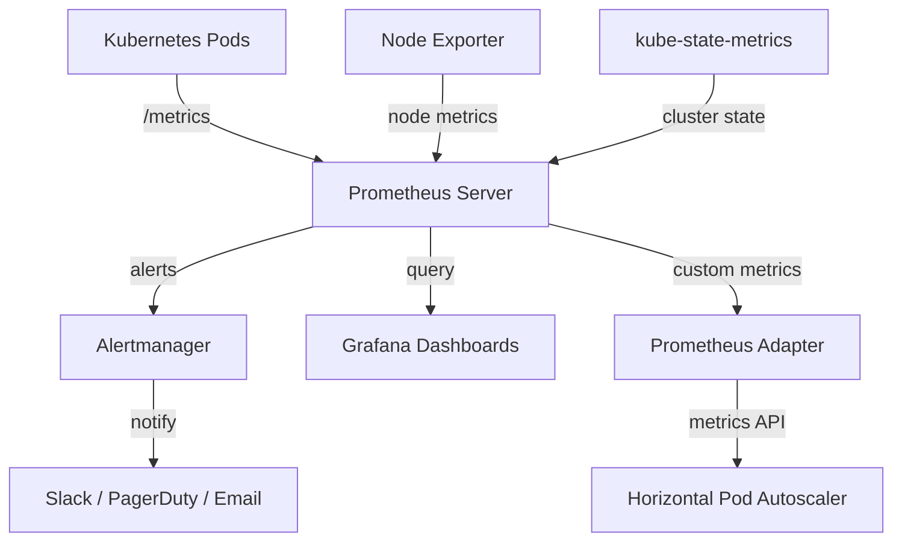

# How to Set Up HelmRepository for Prometheus Charts in Flux

Author: [nawazdhandala](https://github.com/nawazdhandala)

Tags: Flux CD, GitOps, Kubernetes, Helm, HelmRepository, Prometheus, Monitoring, Alertmanager

Description: Step-by-step guide to configuring a Flux CD HelmRepository for the Prometheus community Helm charts and deploying the kube-prometheus-stack.

---

Prometheus is the standard for metrics collection and alerting in Kubernetes. The Prometheus community maintains an extensive collection of Helm charts for deploying Prometheus, Alertmanager, node-exporter, and the full kube-prometheus-stack. This guide walks through configuring Flux CD to use the Prometheus community Helm repository and deploying a production-grade monitoring stack.

## Creating the Prometheus HelmRepository

The Prometheus community Helm charts are hosted at `https://prometheus-community.github.io/helm-charts`. Create the HelmRepository resource:

```yaml
# HelmRepository for the Prometheus community Helm charts
apiVersion: source.toolkit.fluxcd.io/v1
kind: HelmRepository
metadata:
  name: prometheus-community
  namespace: flux-system
spec:
  interval: 60m
  url: https://prometheus-community.github.io/helm-charts
```

Apply and verify:

```bash
# Apply the Prometheus HelmRepository
kubectl apply -f prometheus-helmrepository.yaml

# Verify the repository is ready and the index has been fetched
flux get sources helm -n flux-system
```

## Available Charts

The Prometheus community repository contains several charts. The most commonly used ones include:

- **kube-prometheus-stack** - Complete monitoring stack with Prometheus, Alertmanager, Grafana, and pre-configured dashboards
- **prometheus** - Standalone Prometheus server
- **alertmanager** - Standalone Alertmanager
- **prometheus-node-exporter** - Node-level metrics exporter
- **prometheus-adapter** - Custom metrics adapter for Kubernetes HPA

## Deploying the kube-prometheus-stack

The `kube-prometheus-stack` chart is the most popular choice as it bundles Prometheus, Alertmanager, Grafana, and a comprehensive set of recording and alerting rules for Kubernetes:

```yaml
# HelmRelease to deploy the complete kube-prometheus-stack
apiVersion: helm.toolkit.fluxcd.io/v2
kind: HelmRelease
metadata:
  name: kube-prometheus-stack
  namespace: monitoring
spec:
  interval: 30m
  chart:
    spec:
      chart: kube-prometheus-stack
      version: "67.*"
      sourceRef:
        kind: HelmRepository
        name: prometheus-community
        namespace: flux-system
      interval: 10m
  # Install CRDs separately for cleaner upgrades
  install:
    crds: CreateReplace
  upgrade:
    crds: CreateReplace
  values:
    # Prometheus configuration
    prometheus:
      prometheusSpec:
        retention: 30d
        retentionSize: 40GB
        storageSpec:
          volumeClaimTemplate:
            spec:
              accessModes: ["ReadWriteOnce"]
              resources:
                requests:
                  storage: 50Gi
        # Resource limits for Prometheus
        resources:
          requests:
            memory: 1Gi
            cpu: 500m
          limits:
            memory: 2Gi
            cpu: "1"
        # Enable service monitor auto-discovery
        serviceMonitorSelectorNilUsesHelmValues: false
        podMonitorSelectorNilUsesHelmValues: false

    # Alertmanager configuration
    alertmanager:
      alertmanagerSpec:
        storage:
          volumeClaimTemplate:
            spec:
              accessModes: ["ReadWriteOnce"]
              resources:
                requests:
                  storage: 5Gi

    # Grafana configuration (bundled with the stack)
    grafana:
      adminPassword: admin-password
      persistence:
        enabled: true
        size: 5Gi
      ingress:
        enabled: true
        ingressClassName: nginx
        hosts:
          - grafana.example.com
```

## Deploying Standalone Prometheus

If you already have Grafana and only need the Prometheus server, use the `prometheus` chart:

```yaml
# HelmRelease for standalone Prometheus server
apiVersion: helm.toolkit.fluxcd.io/v2
kind: HelmRelease
metadata:
  name: prometheus
  namespace: monitoring
spec:
  interval: 30m
  chart:
    spec:
      chart: prometheus
      version: "26.*"
      sourceRef:
        kind: HelmRepository
        name: prometheus-community
        namespace: flux-system
      interval: 10m
  values:
    server:
      retention: 15d
      persistentVolume:
        enabled: true
        size: 30Gi
      resources:
        requests:
          memory: 512Mi
          cpu: 250m
    # Disable components you do not need
    alertmanager:
      enabled: false
    kube-state-metrics:
      enabled: true
    prometheus-node-exporter:
      enabled: true
    prometheus-pushgateway:
      enabled: false
```

## Configuring Alertmanager Notifications

Set up Alertmanager to send alerts via Slack:

```yaml
# HelmRelease values section with Alertmanager Slack notifications
apiVersion: helm.toolkit.fluxcd.io/v2
kind: HelmRelease
metadata:
  name: kube-prometheus-stack
  namespace: monitoring
spec:
  interval: 30m
  chart:
    spec:
      chart: kube-prometheus-stack
      version: "67.*"
      sourceRef:
        kind: HelmRepository
        name: prometheus-community
        namespace: flux-system
      interval: 10m
  values:
    alertmanager:
      config:
        global:
          resolve_timeout: 5m
        route:
          receiver: slack-notifications
          group_by: ["alertname", "namespace"]
          group_wait: 30s
          group_interval: 5m
          repeat_interval: 4h
        receivers:
          - name: slack-notifications
            slack_configs:
              - api_url: "https://hooks.slack.com/services/YOUR/SLACK/WEBHOOK"
                channel: "#alerts"
                send_resolved: true
                title: '{{ .CommonAnnotations.summary }}'
                text: '{{ range .Alerts }}{{ .Annotations.description }}{{ end }}'
```

## Deploying prometheus-adapter for HPA

The Prometheus adapter allows Kubernetes Horizontal Pod Autoscaler to scale based on custom Prometheus metrics:

```yaml
# HelmRelease for the Prometheus adapter
apiVersion: helm.toolkit.fluxcd.io/v2
kind: HelmRelease
metadata:
  name: prometheus-adapter
  namespace: monitoring
spec:
  interval: 30m
  chart:
    spec:
      chart: prometheus-adapter
      version: "4.*"
      sourceRef:
        kind: HelmRepository
        name: prometheus-community
        namespace: flux-system
      interval: 10m
  values:
    prometheus:
      # Point the adapter to your Prometheus instance
      url: http://kube-prometheus-stack-prometheus.monitoring.svc.cluster.local
      port: 9090
    rules:
      default: true
      custom:
        - seriesQuery: 'http_requests_total{namespace!="",pod!=""}'
          resources:
            overrides:
              namespace: {resource: "namespace"}
              pod: {resource: "pod"}
          name:
            matches: "^(.*)_total$"
            as: "${1}_per_second"
          metricsQuery: 'rate(<<.Series>>{<<.LabelMatchers>>}[2m])'
```

## Monitoring Architecture

Here is the flow of data through the Prometheus monitoring stack:



## Verifying the Deployment

After applying all resources, verify the monitoring stack is healthy:

```bash
# Check HelmReleases in the monitoring namespace
flux get helmreleases -n monitoring

# Verify all pods are running
kubectl get pods -n monitoring

# Check that Prometheus targets are being scraped
kubectl port-forward -n monitoring svc/kube-prometheus-stack-prometheus 9090:9090
# Visit http://localhost:9090/targets in your browser

# Verify Prometheus is collecting metrics
kubectl exec -n monitoring -it prometheus-kube-prometheus-stack-prometheus-0 -- \
  promtool query instant http://localhost:9090 'up'
```

The Prometheus community Helm repository provides everything you need for comprehensive Kubernetes monitoring. By managing it through Flux CD, your entire monitoring stack becomes version-controlled, auditable, and automatically reconciled.
