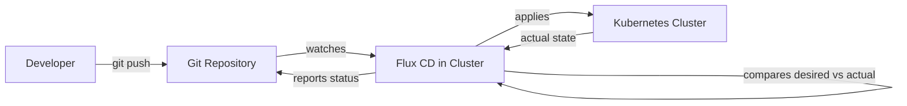
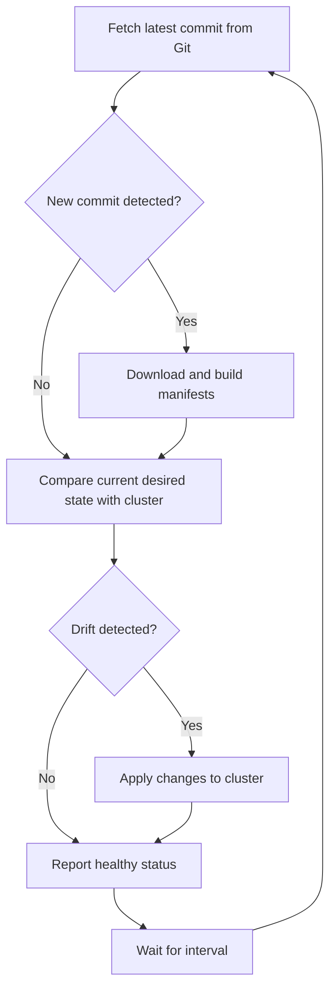
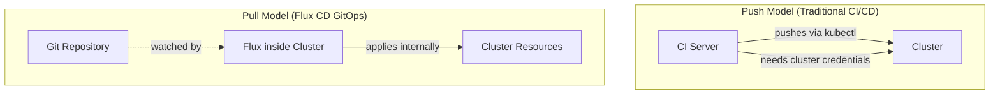

# How GitOps Works with Flux CD Explained Simply

Author: [nawazdhandala](https://github.com/nawazdhandala)

Tags: Flux CD, GitOps, Kubernetes, Continuous Delivery, Infrastructure as Code

Description: A straightforward explanation of how GitOps principles work in practice using Flux CD as the delivery mechanism for Kubernetes deployments.

---

## What Is GitOps?

GitOps is an operational framework that takes DevOps best practices used for application development — version control, collaboration, compliance — and applies them to infrastructure automation. The core idea is simple: Git is the single source of truth for your desired system state, and automated processes ensure your live environment matches that state.

There are four key principles behind GitOps:

1. **Declarative configuration** — The entire system is described declaratively.
2. **Version controlled** — The desired state is stored in Git, providing a full audit trail.
3. **Automated delivery** — Approved changes are automatically applied to the system.
4. **Continuous reconciliation** — Software agents continuously observe and correct drift.

## Where Flux CD Fits In

Flux CD is a set of continuous delivery tools that run inside your Kubernetes cluster. It implements the GitOps principles by watching Git repositories (and other sources like Helm repositories and OCI registries) and automatically synchronizing the desired state defined there with the actual state in the cluster.

The following diagram shows the high-level GitOps flow with Flux CD:



Unlike traditional CI/CD push-based models where an external system pushes changes into the cluster, Flux CD uses a **pull-based** model. The agent running inside the cluster pulls the desired state from Git and applies it. This is a fundamental distinction because:

- The cluster does not need to expose credentials to external CI systems.
- The cluster self-heals by continuously reconciling toward the desired state.
- There is no single pipeline that can become a bottleneck or point of failure.

## How Flux CD Implements GitOps Step by Step

### Step 1: Define Your Desired State in Git

You store Kubernetes manifests, Kustomize overlays, or Helm chart values in a Git repository. This repository becomes the source of truth.

Here is a simple example of a Git repository structure:

```bash
# A typical GitOps repository layout
fleet-infra/
├── clusters/
│   └── production/
│       ├── flux-system/        # Flux's own configuration
│       │   ├── gotk-components.yaml
│       │   ├── gotk-sync.yaml
│       │   └── kustomization.yaml
│       ├── apps.yaml           # Points Flux to the apps directory
│       └── infrastructure.yaml # Points Flux to infrastructure
├── apps/
│   └── production/
│       ├── podinfo/            # Application manifests
│       │   ├── namespace.yaml
│       │   ├── deployment.yaml
│       │   └── service.yaml
│       └── kustomization.yaml
└── infrastructure/
    └── production/
        ├── cert-manager/
        └── ingress-nginx/
```

### Step 2: Tell Flux Where to Look

You create a `GitRepository` source that tells Flux which repository to watch and how often to check for changes.

```yaml
# This GitRepository resource tells Flux where your desired state lives
apiVersion: source.toolkit.fluxcd.io/v1
kind: GitRepository
metadata:
  name: fleet-infra
  namespace: flux-system
spec:
  interval: 1m           # Check for new commits every minute
  url: https://github.com/my-org/fleet-infra
  ref:
    branch: main          # Watch the main branch
  secretRef:
    name: flux-system     # Credentials to access the repo
```

### Step 3: Tell Flux What to Apply

You create a `Kustomization` resource that tells Flux which path within the repository to apply to the cluster.

```yaml
# This Kustomization tells Flux what to deploy from the repository
apiVersion: kustomize.toolkit.fluxcd.io/v1
kind: Kustomization
metadata:
  name: apps
  namespace: flux-system
spec:
  interval: 10m           # Reconcile every 10 minutes
  sourceRef:
    kind: GitRepository
    name: fleet-infra      # References the GitRepository above
  path: ./apps/production  # Path within the repo to apply
  prune: true              # Delete resources removed from Git
  targetNamespace: default
```

### Step 4: Flux Reconciles Continuously

Once these resources are in place, Flux enters a continuous reconciliation loop:



This loop runs indefinitely. Even if no new commits are detected, Flux still checks the cluster state against the desired state and corrects any drift. If someone manually modifies a resource in the cluster, Flux will revert it to match the Git definition on the next reconciliation cycle.

### Step 5: Observe and React

Flux provides status conditions on every resource it manages. You can observe the state using standard Kubernetes tooling.

```bash
# Check the status of all Flux resources
flux get all

# Check a specific Kustomization
flux get kustomizations

# Watch for reconciliation events
flux events --watch
```

## Push vs. Pull: Why the Pull Model Matters

The following diagram contrasts traditional push-based CI/CD with the GitOps pull model used by Flux CD:



In the push model, the CI server needs direct access to the cluster API, which means storing cluster credentials outside the cluster. In the pull model, Flux runs inside the cluster and only needs read access to Git. This significantly reduces the attack surface.

## What Happens When Things Go Wrong

Flux CD handles failures gracefully:

- **Git is unavailable** — Flux retries on the next interval. The cluster continues running with the last known good state.
- **Manifests have errors** — Flux reports the error in the Kustomization status and sends alerts via the notification-controller. The cluster retains the previous working state.
- **Someone manually changes a resource** — Flux detects the drift and reverts it on the next reconciliation, enforcing the Git-defined state.

## Getting Started with Flux CD

Bootstrap Flux into your cluster with a single command:

```bash
# Bootstrap Flux CD into your cluster, connecting it to your Git repository
flux bootstrap github \
  --owner=my-org \
  --repository=fleet-infra \
  --branch=main \
  --path=clusters/production \
  --personal
```

This command installs Flux components into the cluster, creates the Git repository if it does not exist, and commits the Flux manifests so that Flux manages itself through GitOps. From this point forward, any change pushed to the repository is automatically applied to the cluster.

## Summary

GitOps with Flux CD works by storing your desired cluster state in Git and running an agent inside the cluster that continuously pulls and applies that state. The reconciliation loop ensures drift is corrected, the pull-based model improves security, and the Git history provides a complete audit trail of every change. The result is a deployment workflow that is automated, auditable, and self-healing.
