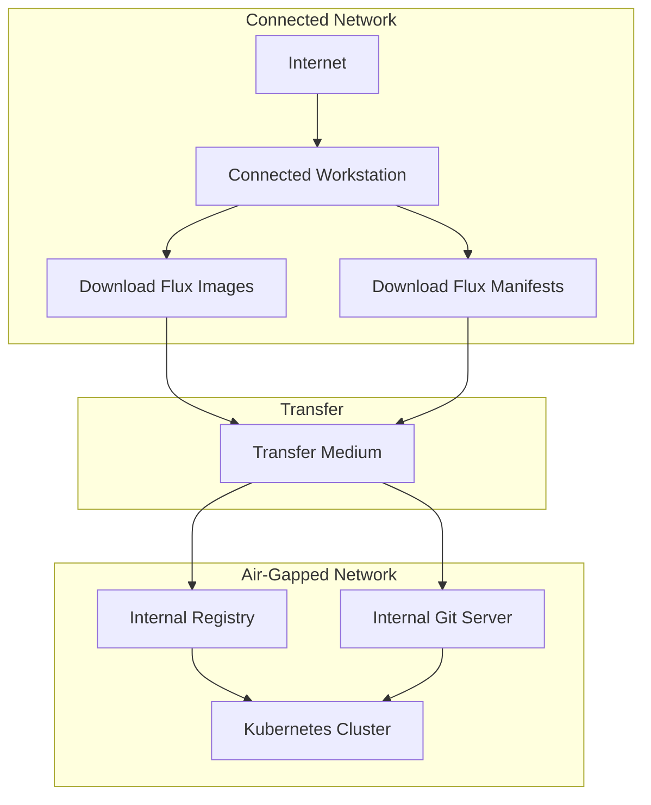

# How to Install Flux CD in an Air-Gapped Environment

Author: [nawazdhandala](https://github.com/nawazdhandala)

Tags: Flux CD, GitOps, Kubernetes, Air-Gapped, Offline Installation, Enterprise Security, DevOps

Description: A comprehensive guide to installing and operating Flux CD in air-gapped Kubernetes environments with no internet access.

---

Air-gapped environments are common in government, defense, financial services, and other regulated industries where Kubernetes clusters have no direct access to the internet. Installing Flux CD in these environments requires pre-staging all container images and manifests, and configuring Flux to use internal registries and Git servers. This guide walks through the complete process.

## Prerequisites

- A Kubernetes cluster in an air-gapped network
- A connected workstation with internet access for downloading artifacts
- An internal container registry (e.g., Harbor, Nexus, or a private Docker registry)
- An internal Git server (e.g., GitLab, Gitea, or Bitbucket Server)
- The `flux`, `kubectl`, and a container tool like `docker`, `crane`, or `skopeo` installed on the connected workstation
- A mechanism to transfer files into the air-gapped network (USB drive, file transfer appliance, etc.)

## Architecture Overview



## Step 1: Install the Flux CLI on the Connected Workstation

On your internet-connected workstation, install the Flux CLI.

```bash
# Install Flux CLI on the connected workstation
curl -s https://fluxcd.io/install.sh | sudo bash

# Verify the version
flux --version
```

## Step 2: Download Flux Component Manifests

Export the Flux component manifests so you can transfer them to the air-gapped environment.

```bash
# Generate the Flux installation manifests
flux install --export > gotk-components.yaml

# Verify the file was created
ls -la gotk-components.yaml
```

This file contains all the Kubernetes manifests needed to install Flux controllers, CRDs, RBAC, and services.

## Step 3: Identify Required Container Images

Extract the list of container images from the manifests.

```bash
# Extract all container image references from the manifests
grep -oP 'image:\s*\K\S+' gotk-components.yaml | sort -u
```

The output will look similar to this (versions will vary):

```text
ghcr.io/fluxcd/helm-controller:v2.x.x
ghcr.io/fluxcd/kustomize-controller:v1.x.x
ghcr.io/fluxcd/notification-controller:v1.x.x
ghcr.io/fluxcd/source-controller:v1.x.x
```

## Step 4: Mirror Images to Transferable Archives

Use `crane` or `docker` to pull the images and save them as tar archives for transfer.

Using crane (recommended for its simplicity):

```bash
# Install crane if not already available
go install github.com/google/go-containerregistry/cmd/crane@latest

# Pull and save each Flux image as a tar file
crane pull ghcr.io/fluxcd/source-controller:v1.4.1 source-controller.tar
crane pull ghcr.io/fluxcd/kustomize-controller:v1.4.0 kustomize-controller.tar
crane pull ghcr.io/fluxcd/helm-controller:v1.1.0 helm-controller.tar
crane pull ghcr.io/fluxcd/notification-controller:v1.4.0 notification-controller.tar
```

Alternatively, using docker:

```bash
# Pull images with docker
docker pull ghcr.io/fluxcd/source-controller:v1.4.1
docker pull ghcr.io/fluxcd/kustomize-controller:v1.4.0
docker pull ghcr.io/fluxcd/helm-controller:v1.1.0
docker pull ghcr.io/fluxcd/notification-controller:v1.4.0

# Save all images to a single tar archive
docker save \
  ghcr.io/fluxcd/source-controller:v1.4.1 \
  ghcr.io/fluxcd/kustomize-controller:v1.4.0 \
  ghcr.io/fluxcd/helm-controller:v1.1.0 \
  ghcr.io/fluxcd/notification-controller:v1.4.0 \
  -o flux-images.tar
```

## Step 5: Transfer Artifacts to the Air-Gapped Network

Transfer the following files to the air-gapped network using your approved transfer mechanism:

- `gotk-components.yaml` (Flux manifests)
- Image tar files (or the combined `flux-images.tar`)
- The `flux` CLI binary (download from https://github.com/fluxcd/flux2/releases)

```bash
# Download the Flux CLI binary for transfer
curl -sLO https://github.com/fluxcd/flux2/releases/latest/download/flux_2.4.0_linux_amd64.tar.gz
```

## Step 6: Push Images to the Internal Registry

On a machine in the air-gapped network that can access the internal registry, load and push the images.

Using crane:

```bash
# Push images to the internal registry
crane push source-controller.tar registry.internal.corp/fluxcd/source-controller:v1.4.1
crane push kustomize-controller.tar registry.internal.corp/fluxcd/kustomize-controller:v1.4.0
crane push helm-controller.tar registry.internal.corp/fluxcd/helm-controller:v1.1.0
crane push notification-controller.tar registry.internal.corp/fluxcd/notification-controller:v1.4.0
```

Using docker:

```bash
# Load images from the tar archive
docker load -i flux-images.tar

# Tag images for the internal registry
docker tag ghcr.io/fluxcd/source-controller:v1.4.1 registry.internal.corp/fluxcd/source-controller:v1.4.1
docker tag ghcr.io/fluxcd/kustomize-controller:v1.4.0 registry.internal.corp/fluxcd/kustomize-controller:v1.4.0
docker tag ghcr.io/fluxcd/helm-controller:v1.1.0 registry.internal.corp/fluxcd/helm-controller:v1.1.0
docker tag ghcr.io/fluxcd/notification-controller:v1.4.0 registry.internal.corp/fluxcd/notification-controller:v1.4.0

# Push to the internal registry
docker push registry.internal.corp/fluxcd/source-controller:v1.4.1
docker push registry.internal.corp/fluxcd/kustomize-controller:v1.4.0
docker push registry.internal.corp/fluxcd/helm-controller:v1.1.0
docker push registry.internal.corp/fluxcd/notification-controller:v1.4.0
```

## Step 7: Update Manifests to Use Internal Registry

Modify the `gotk-components.yaml` file to reference your internal registry instead of `ghcr.io`.

```bash
# Replace all ghcr.io/fluxcd references with your internal registry
sed -i 's|ghcr.io/fluxcd|registry.internal.corp/fluxcd|g' gotk-components.yaml
```

Verify the substitution was applied correctly.

```bash
# Confirm all image references point to the internal registry
grep 'image:' gotk-components.yaml
```

## Step 8: Install Flux Components

Apply the modified manifests to your air-gapped cluster.

```bash
# Install the Flux CLI on the air-gapped workstation
tar xzf flux_2.4.0_linux_amd64.tar.gz
sudo mv flux /usr/local/bin/

# Apply the Flux components to the cluster
kubectl apply -f gotk-components.yaml

# Wait for all controllers to become ready
kubectl -n flux-system wait --for=condition=available --timeout=300s deployment --all
```

## Step 9: Verify the Installation

Run the Flux health check to confirm all components are running.

```bash
# Run Flux health check
flux check

# List all Flux pods
kubectl get pods -n flux-system
```

## Step 10: Configure Flux to Use the Internal Git Server

Since there is no access to GitHub or GitLab SaaS, configure Flux to sync from your internal Git server.

Create a Secret with your Git credentials.

```bash
# Create a Secret for Git authentication
flux create secret git internal-git-auth \
  --url=https://git.internal.corp/team/fleet-infra \
  --username=flux \
  --password=<your-git-token>
```

Create a GitRepository source pointing to your internal server.

```yaml
# flux-system/gotk-sync.yaml
# Configure Flux to sync from the internal Git server
apiVersion: source.toolkit.fluxcd.io/v1
kind: GitRepository
metadata:
  name: flux-system
  namespace: flux-system
spec:
  interval: 5m
  url: https://git.internal.corp/team/fleet-infra
  ref:
    branch: main
  secretRef:
    name: internal-git-auth
---
apiVersion: kustomize.toolkit.fluxcd.io/v1
kind: Kustomization
metadata:
  name: flux-system
  namespace: flux-system
spec:
  interval: 10m
  path: ./clusters/air-gapped
  prune: true
  sourceRef:
    kind: GitRepository
    name: flux-system
```

Apply the sync configuration.

```bash
# Apply the sync configuration
kubectl apply -f flux-system/gotk-sync.yaml
```

## Step 11: Handle Internal TLS Certificates

If your internal Git server or registry uses certificates signed by an internal CA, create a Secret with the CA certificate.

```bash
# Create a Secret with the internal CA certificate for Git
kubectl create secret generic internal-ca \
  --from-file=ca.crt=/path/to/internal-ca.crt \
  -n flux-system
```

Reference the CA in your GitRepository resource.

```yaml
# GitRepository with custom CA certificate
apiVersion: source.toolkit.fluxcd.io/v1
kind: GitRepository
metadata:
  name: flux-system
  namespace: flux-system
spec:
  interval: 5m
  url: https://git.internal.corp/team/fleet-infra
  ref:
    branch: main
  secretRef:
    name: internal-git-auth
  certSecretRef:
    name: internal-ca
```

## Upgrading Flux in an Air-Gapped Environment

To upgrade Flux, repeat the process: download the new CLI and images on a connected workstation, transfer them to the air-gapped network, push the new images to the internal registry, regenerate the manifests, update the registry references, and apply.

```bash
# On the connected workstation: generate new manifests with the updated CLI
flux install --export > gotk-components-new.yaml

# Extract and mirror new images, then on the air-gapped side:
sed -i 's|ghcr.io/fluxcd|registry.internal.corp/fluxcd|g' gotk-components-new.yaml
kubectl apply -f gotk-components-new.yaml
```

## Conclusion

Running Flux CD in an air-gapped environment requires upfront effort to mirror container images and configure internal infrastructure, but the operational model remains the same. Flux controllers reconcile the cluster state against a Git repository, whether that repository is on GitHub or an internal Gitea server. The key steps are mirroring images to an internal registry, rewriting image references in the manifests, and configuring Git authentication for your internal server. Once set up, you get the full benefits of GitOps within the security boundaries of your air-gapped network.
