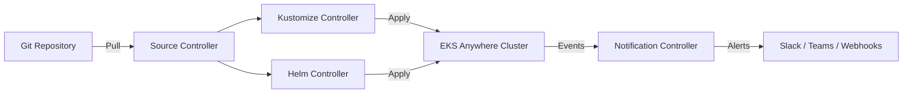

# How to Install Flux CD on Amazon EKS Anywhere

Author: [nawazdhandala](https://github.com/nawazdhandala)

Tags: Flux CD, GitOps, Kubernetes, Amazon EKS Anywhere, AWS, Infrastructure

Description: A step-by-step guide to installing and configuring Flux CD on Amazon EKS Anywhere clusters for GitOps-driven deployments.

---

Amazon EKS Anywhere lets you run Kubernetes clusters on your own infrastructure while maintaining compatibility with Amazon EKS. Combining EKS Anywhere with Flux CD gives you a powerful GitOps workflow where your Git repository becomes the single source of truth for your cluster state. This guide walks you through the complete installation process.

## Prerequisites

Before you begin, make sure you have the following in place:

- An Amazon EKS Anywhere cluster up and running
- `kubectl` configured to communicate with your EKS Anywhere cluster
- A GitHub or GitLab account with a repository for your GitOps configurations
- A personal access token (PAT) for your Git provider
- Administrative access to your cluster

Verify your cluster is accessible with the following command.

```bash
# Confirm kubectl can reach your EKS Anywhere cluster
kubectl cluster-info
```

You should see output showing the Kubernetes control plane address.

## Step 1: Install the Flux CD CLI

The first step is to install the Flux CLI on your local machine. On macOS, use Homebrew.

```bash
# Install Flux CLI via Homebrew
brew install fluxcd/tap/flux
```

On Linux, use the official install script.

```bash
# Install Flux CLI on Linux
curl -s https://fluxcd.io/install.sh | sudo bash
```

Verify the installation.

```bash
# Check the installed Flux CLI version
flux --version
```

## Step 2: Validate Your Cluster Compatibility

Before installing Flux CD components, run the pre-flight checks to confirm your EKS Anywhere cluster meets all requirements.

```bash
# Run Flux pre-flight checks against your cluster
flux check --pre
```

This command verifies that your cluster has the necessary Kubernetes version, RBAC permissions, and other dependencies. You should see all checks passing with green checkmarks.

## Step 3: Export Your Git Credentials

Set your Git provider credentials as environment variables. These are used by the bootstrap process to connect Flux to your repository.

```bash
# Export your GitHub personal access token
export GITHUB_TOKEN=<your-github-personal-access-token>

# Export your GitHub username
export GITHUB_USER=<your-github-username>
```

If you are using GitLab instead, export the corresponding variables.

```bash
# Export GitLab token and username
export GITLAB_TOKEN=<your-gitlab-personal-access-token>
export GITLAB_USER=<your-gitlab-username>
```

## Step 4: Bootstrap Flux CD on EKS Anywhere

The bootstrap command installs Flux components on your cluster and configures them to sync with your Git repository. It also creates the repository if it does not already exist.

```bash
# Bootstrap Flux CD with GitHub
flux bootstrap github \
  --owner=$GITHUB_USER \
  --repository=eks-anywhere-fleet \
  --branch=main \
  --path=./clusters/eks-anywhere \
  --personal
```

This command does the following:

1. Creates the `eks-anywhere-fleet` repository under your GitHub account if it does not exist
2. Installs the Flux controllers (source-controller, kustomize-controller, helm-controller, notification-controller) into the `flux-system` namespace
3. Configures Flux to watch the `./clusters/eks-anywhere` path in the `main` branch for manifests to apply

For GitLab users, replace `github` with `gitlab` in the command above and use the corresponding environment variables.

## Step 5: Verify the Installation

After bootstrap completes, verify that all Flux components are running.

```bash
# Check that all Flux components are healthy
flux check
```

You can also inspect the Flux system pods directly.

```bash
# List all pods in the flux-system namespace
kubectl get pods -n flux-system
```

You should see pods for the source-controller, kustomize-controller, helm-controller, and notification-controller, all in a Running state.

## Step 6: Examine the Repository Structure

After bootstrap, your Git repository will have a structure similar to this.

```text
eks-anywhere-fleet/
  clusters/
    eks-anywhere/
      flux-system/
        gotk-components.yaml    # Flux component manifests
        gotk-sync.yaml          # Sync configuration
        kustomization.yaml      # Kustomize entry point
```

The `gotk-components.yaml` file contains all the Flux custom resource definitions and controller deployments. The `gotk-sync.yaml` file defines the GitRepository and Kustomization resources that tell Flux where to sync from.

## Step 7: Deploy an Application Using Flux

Now that Flux is running, you can deploy applications by committing manifests to your repository. Create a simple namespace definition to test.

```yaml
# clusters/eks-anywhere/namespaces/demo-namespace.yaml
apiVersion: v1
kind: Namespace
metadata:
  name: demo
  labels:
    purpose: flux-demo
```

Create a Kustomization file to include this namespace.

```yaml
# clusters/eks-anywhere/namespaces/kustomization.yaml
apiVersion: kustomize.config.k8s.io/v1beta1
kind: Kustomization
resources:
  - demo-namespace.yaml
```

Commit and push these files to your repository. Flux will automatically detect the changes and apply them to your cluster.

```bash
# Trigger an immediate reconciliation instead of waiting for the interval
flux reconcile kustomization flux-system --with-source
```

Verify the namespace was created.

```bash
# Check that the demo namespace exists
kubectl get namespace demo
```

## Architecture Overview

Here is how Flux CD integrates with your EKS Anywhere cluster.



The source controller watches your Git repository for changes. When it detects new commits, it fetches the updated manifests and passes them to the kustomize and helm controllers, which apply the changes to your EKS Anywhere cluster. The notification controller sends alerts about the reconciliation status to your configured channels.

## Monitoring Flux Operations

Use the following commands to monitor Flux activity on your cluster.

```bash
# View all Flux resources and their status
flux get all

# Watch kustomization reconciliation events
flux get kustomizations --watch

# View Flux logs for debugging
flux logs --all-namespaces
```

## Uninstalling Flux CD

If you need to remove Flux from your EKS Anywhere cluster, run the uninstall command.

```bash
# Remove all Flux components from the cluster
flux uninstall --silent
```

This removes all Flux controllers, custom resource definitions, and namespace resources. Your deployed workloads remain unaffected, but they will no longer be managed by Flux.

## Conclusion

You now have Flux CD running on your Amazon EKS Anywhere cluster with a fully functional GitOps pipeline. Every change committed to your Git repository will be automatically reconciled to your cluster. This approach gives you version-controlled infrastructure, audit trails through Git history, and the ability to roll back changes by reverting commits. For production environments, consider adding multi-tenancy configurations, SOPS-based secret management, and webhook receivers for immediate reconciliation on push events.
