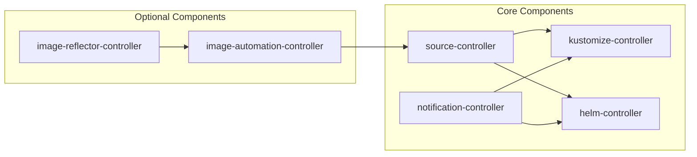

# How to Install Flux CD Optional Components

Author: [nawazdhandala](https://github.com/nawazdhandala)

Tags: Flux CD, GitOps, Kubernetes, Image Automation, Notification Controller, Optional Components

Description: Learn how to install and configure Flux CD optional components including image automation controllers, the image reflector controller, and additional notification providers.

---

A default Flux CD installation includes four core controllers: source-controller, kustomize-controller, helm-controller, and notification-controller. However, Flux CD also offers optional components that extend its capabilities. This guide covers how to install and configure these optional components, including the image automation controllers, additional notification integrations, and the S3-compatible bucket source.

## Flux CD Component Architecture

Flux CD is modular by design. The following diagram shows the relationship between core and optional components.



## Installing Optional Components with the Flux CLI

The `flux install` command accepts a `--components-extra` flag to install optional components alongside the core ones.

```bash
# Install Flux with image automation controllers included
flux install --components-extra=image-reflector-controller,image-automation-controller
```

If you are using `flux bootstrap`, pass the same flag:

```bash
# Bootstrap Flux with optional image automation components
flux bootstrap github \
  --owner=your-org \
  --repository=fleet-infra \
  --branch=main \
  --path=clusters/my-cluster \
  --components-extra=image-reflector-controller,image-automation-controller \
  --personal
```

## Image Reflector Controller

The image-reflector-controller scans container registries and reflects the discovered image metadata into Kubernetes resources. This is the foundation for automated image updates.

After installing the controller, create an ImageRepository resource to tell Flux which container image to watch.

```yaml
# image-repo.yaml - Tells Flux to scan a container registry for new image tags
apiVersion: image.toolkit.fluxcd.io/v1
kind: ImageRepository
metadata:
  name: my-app
  namespace: flux-system
spec:
  image: ghcr.io/your-org/my-app
  interval: 5m
  # Optional: specify which tags to consider
  exclusionList:
    - "^.*\\.sig$"
```

Next, create an ImagePolicy to define which tags should be considered for updates.

```yaml
# image-policy.yaml - Defines the policy for selecting the latest image tag
apiVersion: image.toolkit.fluxcd.io/v1
kind: ImagePolicy
metadata:
  name: my-app
  namespace: flux-system
spec:
  imageRepositoryRef:
    name: my-app
  policy:
    semver:
      # Select the latest stable semver tag
      range: ">=1.0.0"
```

Apply these resources and verify they are working:

```bash
# Apply the image repository and policy
kubectl apply -f image-repo.yaml
kubectl apply -f image-policy.yaml

# Check the image repository scan status
flux get image repository my-app

# Check the image policy status
flux get image policy my-app
```

## Image Automation Controller

The image-automation-controller updates Git repositories when new container images are detected. It works together with the image-reflector-controller to complete the automated image update pipeline.

Create an ImageUpdateAutomation resource to configure how Git should be updated.

```yaml
# image-update-automation.yaml - Configures automatic Git commits when new images are found
apiVersion: image.toolkit.fluxcd.io/v1
kind: ImageUpdateAutomation
metadata:
  name: flux-system
  namespace: flux-system
spec:
  interval: 30m
  sourceRef:
    kind: GitRepository
    name: flux-system
  git:
    checkout:
      ref:
        branch: main
    commit:
      author:
        name: fluxcdbot
        email: fluxcdbot@users.noreply.github.com
      messageTemplate: "Automated image update: {{ range .Changed.Changes }}{{ .OldValue }} -> {{ .NewValue }} {{ end }}"
    push:
      branch: main
  update:
    path: ./clusters/my-cluster
    strategy: Setters
```

In your deployment manifests, add marker comments to indicate which image fields should be updated automatically.

```yaml
# deployment.yaml - Image tag marked for automatic updates via setter comment
apiVersion: apps/v1
kind: Deployment
metadata:
  name: my-app
  namespace: default
spec:
  template:
    spec:
      containers:
        - name: my-app
          image: ghcr.io/your-org/my-app:1.0.0 # {"$imagepolicy": "flux-system:my-app"}
```

The `# {"$imagepolicy": "flux-system:my-app"}` comment tells the image-automation-controller which ImagePolicy to use for updating that image tag.

## Configuring Notification Providers

While the notification-controller is a core component, configuring specific notification providers is optional. Here are examples for common providers.

Slack notification provider:

```yaml
# slack-provider.yaml - Sends Flux alerts to a Slack channel
apiVersion: notification.toolkit.fluxcd.io/v1
kind: Provider
metadata:
  name: slack
  namespace: flux-system
spec:
  type: slack
  channel: flux-notifications
  secretRef:
    name: slack-webhook-url
---
# Create the secret containing the Slack webhook URL
apiVersion: v1
kind: Secret
metadata:
  name: slack-webhook-url
  namespace: flux-system
stringData:
  address: "https://hooks.slack.com/services/YOUR/SLACK/WEBHOOK"
```

Create an Alert resource to define which events trigger notifications:

```yaml
# alert.yaml - Defines which Flux events should trigger Slack notifications
apiVersion: notification.toolkit.fluxcd.io/v1
kind: Alert
metadata:
  name: on-call-alerts
  namespace: flux-system
spec:
  providerRef:
    name: slack
  eventSeverity: error
  eventSources:
    - kind: Kustomization
      name: "*"
    - kind: HelmRelease
      name: "*"
```

## Configuring Webhook Receivers

Webhook receivers allow external systems to trigger Flux reconciliation. This is useful for triggering immediate deployments from CI/CD pipelines.

```yaml
# receiver.yaml - Configures a webhook endpoint for GitHub to trigger reconciliation
apiVersion: notification.toolkit.fluxcd.io/v1
kind: Receiver
metadata:
  name: github-receiver
  namespace: flux-system
spec:
  type: github
  events:
    - "ping"
    - "push"
  secretRef:
    name: webhook-token
  resources:
    - apiVersion: source.toolkit.fluxcd.io/v1
      kind: GitRepository
      name: flux-system
```

Create the webhook token secret:

```bash
# Generate a random webhook token
TOKEN=$(head -c 12 /dev/urandom | shasum | cut -d ' ' -f1)

# Create the secret in the cluster
kubectl create secret generic webhook-token \
  --from-literal=token=$TOKEN \
  -n flux-system
```

After applying the Receiver, get the webhook URL:

```bash
# Get the webhook URL to configure in GitHub
flux get receivers
```

## Listing Installed Components

You can check which components are currently installed in your cluster.

```bash
# List all Flux controllers and their versions
flux check

# List all deployments in the flux-system namespace
kubectl get deployments -n flux-system
```

## Adding Components to an Existing Installation

If Flux is already installed and you want to add optional components, simply re-run the install or bootstrap command with the extra components flag.

```bash
# Add image automation controllers to an existing installation
flux install --components-extra=image-reflector-controller,image-automation-controller
```

This is safe to run on an existing installation. It will add the new controllers without disrupting the existing ones.

## Summary

Flux CD's modular architecture lets you install only the components you need. The core installation covers GitOps workflows with Git, Helm, and Kustomize sources. When you need automated image updates, add the image-reflector-controller and image-automation-controller using the `--components-extra` flag. Notification providers and webhook receivers extend Flux's ability to integrate with external systems like Slack, Microsoft Teams, and CI/CD pipelines. All optional components can be added to an existing installation without disruption.
