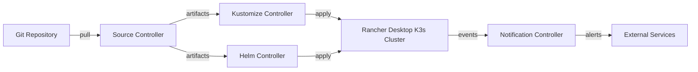

# How to Install Flux CD on Rancher Desktop

Author: [nawazdhandala](https://github.com/nawazdhandala)

Tags: Flux CD, GitOps, Kubernetes, Rancher Desktop, Local Development, DevOps

Description: A complete guide to installing Flux CD on Rancher Desktop for local GitOps development and testing on macOS, Windows, and Linux.

---

Rancher Desktop is a free, open-source application that provides Kubernetes and container management on your desktop. It lets you choose between containerd and dockerd as your container runtime and between K3s versions for the Kubernetes engine. This makes it an excellent local development environment for testing Flux CD and GitOps workflows before deploying to production clusters.

## Prerequisites

- Rancher Desktop installed (available from https://rancherdesktop.io for macOS, Windows, and Linux)
- A GitHub personal access token with `repo` permissions
- At least 4 GB of RAM allocated to Rancher Desktop
- Basic familiarity with Kubernetes and Git

## Step 1: Configure Rancher Desktop

Open Rancher Desktop and configure it for Flux CD compatibility.

1. Launch Rancher Desktop
2. Navigate to **Preferences** (or **Settings** on Windows)
3. Under **Kubernetes**, select a stable K3s version (1.27 or later recommended)
4. Under **Container Engine**, choose either containerd or dockerd (both work with Flux)
5. Under **Resources**, allocate at least 4 GB of memory and 2 CPUs
6. Click **Apply** and wait for the cluster to restart

Verify that Rancher Desktop has set up your kubeconfig correctly.

```bash
# Verify kubectl connectivity to the Rancher Desktop cluster
kubectl get nodes
```

You should see a single node with a name like `lima-rancher-desktop` in `Ready` status.

## Step 2: Verify the Kubernetes Context

Rancher Desktop automatically configures a kubectl context. Make sure you are using the correct one.

```bash
# List available kubectl contexts
kubectl config get-contexts

# Switch to the Rancher Desktop context if not already active
kubectl config use-context rancher-desktop
```

## Step 3: Install the Flux CLI

Install the Flux CLI on your local machine.

```bash
# Install Flux CLI on macOS using Homebrew
brew install fluxcd/tap/flux
```

For Linux or if you prefer not to use Homebrew, use the install script.

```bash
# Install Flux CLI using the official script
curl -s https://fluxcd.io/install.sh | sudo bash
```

On Windows, you can use Chocolatey.

```bash
# Install Flux CLI on Windows using Chocolatey
choco install flux
```

Verify the installation.

```bash
# Check the Flux CLI version
flux --version
```

## Step 4: Run Pre-Flight Checks

Confirm your Rancher Desktop cluster is ready for Flux CD.

```bash
# Run Flux pre-flight checks
flux check --pre
```

All checks should pass. The K3s engine in Rancher Desktop includes all the components that Flux CD needs, including CoreDNS and the necessary RBAC configurations.

## Step 5: Set GitHub Credentials

Export your GitHub credentials for the bootstrap process.

```bash
# Export GitHub credentials
export GITHUB_TOKEN=<your-github-personal-access-token>
export GITHUB_USER=<your-github-username>
```

## Step 6: Bootstrap Flux CD

Run the bootstrap command to install Flux CD and connect it to your Git repository.

```bash
# Bootstrap Flux CD on Rancher Desktop
flux bootstrap github \
  --owner=$GITHUB_USER \
  --repository=fleet-infra \
  --branch=main \
  --path=./clusters/rancher-desktop \
  --personal
```

The bootstrap process creates the repository (if needed), installs Flux controllers, and sets up the continuous reconciliation loop.

## Step 7: Verify the Installation

Confirm all Flux components are running.

```bash
# Check Flux controller pods
kubectl get pods -n flux-system

# Run the comprehensive health check
flux check
```

You should see four controllers running: source-controller, kustomize-controller, helm-controller, and notification-controller.

## Step 8: Explore the GitOps Workflow

With Flux running on Rancher Desktop, you can now test GitOps workflows locally. Here is an example that deploys a simple application.

Create a namespace and deployment manifest in your `fleet-infra` repository.

```yaml
# clusters/rancher-desktop/podinfo-namespace.yaml
# Create a dedicated namespace for the sample app
apiVersion: v1
kind: Namespace
metadata:
  name: podinfo
```

```yaml
# clusters/rancher-desktop/podinfo-source.yaml
# Point Flux at the podinfo Git repository
apiVersion: source.toolkit.fluxcd.io/v1
kind: GitRepository
metadata:
  name: podinfo
  namespace: flux-system
spec:
  interval: 5m
  url: https://github.com/stefanprodan/podinfo
  ref:
    branch: master
```

```yaml
# clusters/rancher-desktop/podinfo-kustomization.yaml
# Apply the podinfo kustomize overlay
apiVersion: kustomize.toolkit.fluxcd.io/v1
kind: Kustomization
metadata:
  name: podinfo
  namespace: flux-system
spec:
  interval: 10m
  targetNamespace: podinfo
  sourceRef:
    kind: GitRepository
    name: podinfo
  path: ./kustomize
  prune: true
  timeout: 2m
```

Commit and push these files, then monitor the reconciliation.

```bash
# Force an immediate reconciliation
flux reconcile kustomization flux-system --with-source

# Check the status of all Flux kustomizations
flux get kustomizations
```

Once reconciled, verify the application is running.

```bash
# Check pods in the podinfo namespace
kubectl get pods -n podinfo

# Port-forward to access the application locally
kubectl port-forward -n podinfo svc/podinfo 9898:9898
```

Open http://localhost:9898 in your browser to see the podinfo application.

## Architecture Overview

The following diagram shows how Flux CD operates within a Rancher Desktop environment.



## Rancher Desktop-Specific Tips

- **Cluster resets**: When you reset the Kubernetes cluster in Rancher Desktop (Preferences > Kubernetes > Reset), Flux CD and all deployed workloads are removed. You will need to re-run `flux bootstrap` after a reset.
- **Resource allocation**: Flux controllers consume approximately 400-600 MB of RAM. If Rancher Desktop feels sluggish, increase the memory allocation in preferences.
- **Container runtime**: Flux CD works identically with both containerd and dockerd. Choose whichever runtime suits your other development needs.
- **Path mapping**: On macOS and Windows, Rancher Desktop uses a VM. If you need to mount local volumes for testing, configure the path sharing in Rancher Desktop preferences.
- **Nerdctl and docker CLI**: Rancher Desktop provides both `nerdctl` (for containerd) and `docker` (for dockerd). You can use either to build images locally and test them with Flux image automation policies.

## Switching Between Environments

One advantage of using Flux CD with Rancher Desktop is the ability to mirror your production setup locally. Structure your `fleet-infra` repository with separate paths for each environment.

```bash
# Recommended repository structure
fleet-infra/
  clusters/
    rancher-desktop/    # Local development manifests
    staging/            # Staging cluster manifests
    production/         # Production cluster manifests
  infrastructure/       # Shared infrastructure components
  apps/                 # Shared application definitions
```

This structure lets you test changes locally on Rancher Desktop before promoting them to staging and production.

## Conclusion

Rancher Desktop provides a convenient, cross-platform Kubernetes environment that is well-suited for developing and testing Flux CD workflows. By running Flux locally, you can iterate quickly on your GitOps configurations, validate Kustomization and HelmRelease resources, and build confidence before deploying changes to production clusters.
