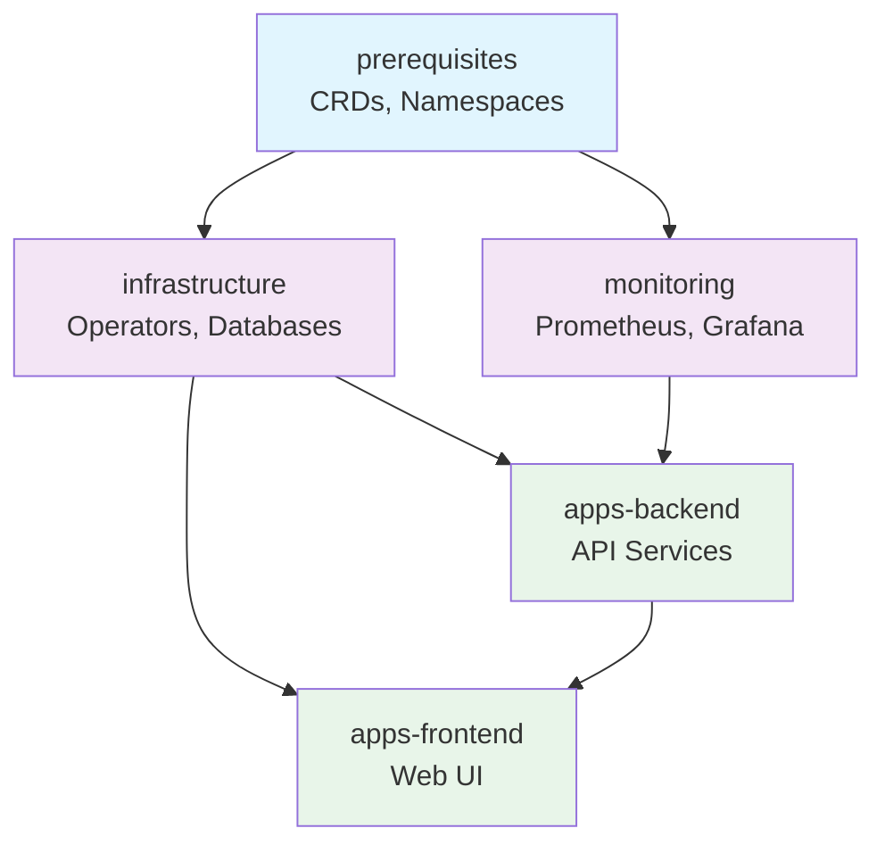

# How to Configure Kustomization Apply Order in Flux

Author: [nawazdhandala](https://github.com/nawazdhandala)

Tags: Flux CD, GitOps, Kubernetes, Kustomize, Apply Order, Dependencies, Orchestration

Description: Learn how to control the order in which Flux applies Kustomization resources using dependsOn, health checks, and resource ordering strategies.

---

In Kubernetes, resource ordering matters. Namespaces must exist before the resources they contain, CRDs must be registered before custom resources are created, and databases must be running before the applications that connect to them. Flux CD provides several mechanisms to control apply order across and within Kustomizations. This guide covers all the approaches available for ensuring your resources are applied in the correct sequence.

## The Default Apply Order

By default, Flux applies resources within a single Kustomization in a specific order based on resource kind. Flux follows the same ordering logic as `kubectl apply`, which sorts resources by kind priority. For example, Namespaces are applied before Deployments, and CRDs are applied before custom resources.

The built-in kind ordering (simplified) is:

1. Namespaces
2. CustomResourceDefinitions
3. ServiceAccounts, Roles, RoleBindings, ClusterRoles, ClusterRoleBindings
4. ConfigMaps, Secrets
5. Services
6. Deployments, StatefulSets, DaemonSets
7. Custom Resources

This ordering is automatic and requires no configuration.

## Controlling Order Between Kustomizations with dependsOn

The primary mechanism for controlling apply order in Flux is the `spec.dependsOn` field, which creates explicit ordering between Kustomization resources.

```yaml
# Layer 1: Cluster-wide prerequisites (CRDs, namespaces)
apiVersion: kustomize.toolkit.fluxcd.io/v1
kind: Kustomization
metadata:
  name: prerequisites
  namespace: flux-system
spec:
  interval: 10m
  sourceRef:
    kind: GitRepository
    name: flux-system
  path: ./clusters/production/prerequisites
  prune: true
  wait: true
  # No dependencies -- this is the first layer
---
# Layer 2: Infrastructure (operators, databases, message queues)
apiVersion: kustomize.toolkit.fluxcd.io/v1
kind: Kustomization
metadata:
  name: infrastructure
  namespace: flux-system
spec:
  interval: 10m
  sourceRef:
    kind: GitRepository
    name: flux-system
  path: ./infrastructure
  prune: true
  wait: true
  # Wait for prerequisites before applying infrastructure
  dependsOn:
    - name: prerequisites
---
# Layer 3: Applications (depend on infrastructure being ready)
apiVersion: kustomize.toolkit.fluxcd.io/v1
kind: Kustomization
metadata:
  name: apps
  namespace: flux-system
spec:
  interval: 10m
  sourceRef:
    kind: GitRepository
    name: flux-system
  path: ./apps
  prune: true
  # Wait for infrastructure before deploying apps
  dependsOn:
    - name: infrastructure
```

The `dependsOn` field ensures that a Kustomization will not begin reconciliation until all of its dependencies are in a `Ready` state.

## The Importance of wait: true

The `wait: true` field is critical for `dependsOn` to work correctly. Without it, a Kustomization is marked as ready immediately after the resources are applied, even if the resources are not yet running.

```yaml
# Without wait: true -- dependency may start too early
apiVersion: kustomize.toolkit.fluxcd.io/v1
kind: Kustomization
metadata:
  name: database
  namespace: flux-system
spec:
  interval: 10m
  sourceRef:
    kind: GitRepository
    name: flux-system
  path: ./infrastructure/database
  prune: true
  # IMPORTANT: wait: true ensures dependents start only when
  # all resources in this Kustomization are actually ready
  wait: true
  timeout: 10m
```

Without `wait: true`, Flux marks the Kustomization as ready as soon as the apply succeeds. With `wait: true`, Flux waits for Deployments to have all replicas available, StatefulSets to have all pods running, and Jobs to complete before marking the Kustomization as ready.

## Visualizing the Apply Order

Here is a typical multi-layer dependency graph for a production cluster.



## Multiple Dependencies

A Kustomization can depend on multiple other Kustomizations. It will wait for all of them to be ready.

```yaml
# Application that requires both database and cache infrastructure
apiVersion: kustomize.toolkit.fluxcd.io/v1
kind: Kustomization
metadata:
  name: api-server
  namespace: flux-system
spec:
  interval: 10m
  sourceRef:
    kind: GitRepository
    name: flux-system
  path: ./apps/api-server
  prune: true
  # Both dependencies must be ready before this Kustomization reconciles
  dependsOn:
    - name: database
    - name: redis-cache
    - name: message-queue
```

## Ordering Resources Within a Single Kustomization

Sometimes you need to control ordering within a single Kustomization. While Flux handles kind-based ordering automatically, you may need finer control. The recommended approach is to split resources into separate Kustomizations with dependencies, but you can also use Kustomize's built-in ordering.

In your Kustomize overlay, the order of resources in the `kustomization.yaml` file determines apply order.

```yaml
# kustomization.yaml -- resources are applied in the order listed
apiVersion: kustomize.config.k8s.io/v1beta1
kind: Kustomization
resources:
  # Applied first: namespace
  - namespace.yaml
  # Applied second: RBAC
  - service-account.yaml
  - role.yaml
  - role-binding.yaml
  # Applied third: configuration
  - configmap.yaml
  - secret.yaml
  # Applied fourth: workloads
  - deployment.yaml
  - service.yaml
  # Applied last: ingress
  - ingress.yaml
```

## Handling CRD and Custom Resource Ordering

A common ordering problem is deploying CRDs and the custom resources that use them. If both are in the same Kustomization, the CRD may not be registered before the custom resource is applied. The solution is to separate them.

```yaml
# Kustomization 1: Install the operator and its CRDs
apiVersion: kustomize.toolkit.fluxcd.io/v1
kind: Kustomization
metadata:
  name: cert-manager-operator
  namespace: flux-system
spec:
  interval: 10m
  sourceRef:
    kind: GitRepository
    name: flux-system
  path: ./infrastructure/cert-manager/operator
  prune: true
  wait: true
  timeout: 5m
  healthChecks:
    - apiVersion: apps/v1
      kind: Deployment
      name: cert-manager
      namespace: cert-manager
---
# Kustomization 2: Create certificates (requires CRDs from operator)
apiVersion: kustomize.toolkit.fluxcd.io/v1
kind: Kustomization
metadata:
  name: cert-manager-certificates
  namespace: flux-system
spec:
  interval: 10m
  sourceRef:
    kind: GitRepository
    name: flux-system
  path: ./infrastructure/cert-manager/certificates
  prune: true
  # Only apply certificates after operator is fully ready
  dependsOn:
    - name: cert-manager-operator
```

## Retry and Timeout Considerations for Ordering

When configuring apply order, set appropriate timeouts and retry intervals on each layer. Parent Kustomizations should have timeouts large enough to accommodate their resources becoming ready, and retry intervals should be short enough to minimize wait time for dependent Kustomizations.

```yaml
# Fast-retrying infrastructure layer
apiVersion: kustomize.toolkit.fluxcd.io/v1
kind: Kustomization
metadata:
  name: infrastructure
  namespace: flux-system
spec:
  interval: 10m
  retryInterval: 1m       # Retry quickly -- apps are waiting
  timeout: 10m             # Allow enough time for complex infrastructure
  sourceRef:
    kind: GitRepository
    name: flux-system
  path: ./infrastructure
  prune: true
  wait: true
```

## Debugging Apply Order Issues

When things are not applying in the expected order, use these commands to investigate.

```bash
# View the dependency tree to verify ordering
flux tree ks apps --namespace flux-system

# Check which Kustomizations are ready and which are waiting
flux get ks --all-namespaces

# View events for a Kustomization stuck waiting on dependencies
flux events --for Kustomization/apps --namespace flux-system

# Force reconciliation of a dependency to unblock the chain
flux reconcile ks infrastructure --namespace flux-system --with-source
```

## Summary

Controlling apply order in Flux is primarily achieved through `dependsOn` relationships between Kustomizations, combined with `wait: true` to ensure resources are truly ready before dependents proceed. Structure your deployments in layers -- prerequisites, infrastructure, and applications -- with each layer depending on the one before it. For ordering within a single Kustomization, rely on Flux's built-in kind ordering or the resource listing order in your `kustomization.yaml`. When CRDs are involved, always separate operator deployment from custom resource creation using the dependency chain.
