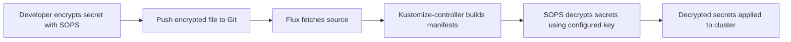

# How to Configure Kustomization Decryption with SOPS in Flux

Author: [nawazdhandala](https://github.com/nawazdhandala)

Tags: Flux CD, GitOps, Kubernetes, Kustomize, SOPS, Encryption, Secrets Management, Decryption

Description: Learn how to configure Flux CD Kustomizations to decrypt SOPS-encrypted secrets during reconciliation for secure GitOps secret management.

---

## Introduction

Storing secrets in Git repositories is a fundamental challenge in GitOps. SOPS (Secrets OPerationS) solves this by encrypting secret values while keeping the keys and structure in plaintext, making encrypted files diffable and reviewable. Flux CD has built-in support for SOPS decryption, allowing the kustomize-controller to decrypt secrets on the fly during Kustomization reconciliation.

This guide walks you through configuring SOPS encryption with Flux, covering key setup, secret encryption, and Kustomization decryption configuration.

## Prerequisites

- A Kubernetes cluster with Flux CD installed
- The `flux` CLI and `sops` CLI installed
- A GPG key, age key, or cloud KMS key for encryption

## Architecture Overview



The decryption key never leaves the cluster, and encrypted secrets in Git remain safe even if the repository is compromised.

## Step 1: Generate an Encryption Key

This guide uses age keys, which are the recommended approach for SOPS with Flux. Age is simpler than GPG and does not require a keyring.

```bash
# Install age if not already installed
# macOS: brew install age
# Linux: apt install age or download from https://github.com/FiloSottile/age

# Generate an age key pair
age-keygen -o age.agekey

# Note the public key from the output (starts with "age1...")
# Example: age1ql3z7hjy54pw3hyww5ayyfg7zqgvc7w3j2elw8zmrj2kg5sfn9aqmcac8p
```

The output file `age.agekey` contains your private key. Keep it safe.

## Step 2: Create the Decryption Secret in Kubernetes

The kustomize-controller needs access to the private key to decrypt secrets. Create a Kubernetes Secret containing the age key:

```bash
# Create a secret with the age private key for Flux decryption
cat age.agekey | kubectl create secret generic sops-age \
  --namespace=flux-system \
  --from-file=age.agekey=/dev/stdin
```

Verify the secret was created:

```bash
# Verify the decryption secret exists
kubectl get secret sops-age -n flux-system
```

## Step 3: Configure SOPS

Create a `.sops.yaml` configuration file in the root of your Git repository to define encryption rules:

```yaml
# .sops.yaml - SOPS configuration for encrypting Kubernetes secrets
creation_rules:
  # Encrypt all files matching **/secrets/*.yaml with the age public key
  - path_regex: .*/secrets/.*\.yaml$
    encrypted_regex: "^(data|stringData)$"
    age: "age1ql3z7hjy54pw3hyww5ayyfg7zqgvc7w3j2elw8zmrj2kg5sfn9aqmcac8p"
  # Default rule for any YAML file explicitly encrypted
  - encrypted_regex: "^(data|stringData)$"
    age: "age1ql3z7hjy54pw3hyww5ayyfg7zqgvc7w3j2elw8zmrj2kg5sfn9aqmcac8p"
```

The `encrypted_regex` field ensures that only the `data` and `stringData` fields of Kubernetes Secrets are encrypted, while metadata (name, namespace, labels) remains in plaintext.

## Step 4: Encrypt a Secret with SOPS

Create a Kubernetes Secret manifest and encrypt it:

```yaml
# secrets/database-credentials.yaml (before encryption)
apiVersion: v1
kind: Secret
metadata:
  name: database-credentials
  namespace: production
type: Opaque
stringData:
  username: admin
  password: super-secret-password
  connection-string: "postgresql://admin:super-secret-password@db:5432/mydb"
```

Encrypt the file with SOPS:

```bash
# Encrypt the secret file in place using SOPS
sops --encrypt --in-place secrets/database-credentials.yaml
```

After encryption, the file looks like this (values are encrypted, structure is preserved):

```yaml
# secrets/database-credentials.yaml (after encryption)
apiVersion: v1
kind: Secret
metadata:
  name: database-credentials
  namespace: production
type: Opaque
stringData:
  username: ENC[AES256_GCM,data:abcdef,iv:...,tag:...,type:str]
  password: ENC[AES256_GCM,data:ghijkl,iv:...,tag:...,type:str]
  connection-string: ENC[AES256_GCM,data:mnopqr,iv:...,tag:...,type:str]
sops:
  age:
    - recipient: age1ql3z7hjy54pw3hyww5ayyfg7zqgvc7w3j2elw8zmrj2kg5sfn9aqmcac8p
      enc: |
        -----BEGIN AGE ENCRYPTED FILE-----
        ...
        -----END AGE ENCRYPTED FILE-----
  lastmodified: "2026-03-05T10:00:00Z"
  version: 3.7.3
```

This encrypted file is safe to commit to Git.

## Step 5: Configure the Kustomization for SOPS Decryption

Update your Kustomization resource to enable SOPS decryption using the `spec.decryption` field:

```yaml
# kustomization-with-sops.yaml - Kustomization configured for SOPS decryption
apiVersion: kustomize.toolkit.fluxcd.io/v1
kind: Kustomization
metadata:
  name: my-app
  namespace: flux-system
spec:
  interval: 10m
  sourceRef:
    kind: GitRepository
    name: my-repo
  path: ./apps/my-app
  prune: true
  # Configure SOPS decryption
  decryption:
    # Use the sops provider for decryption
    provider: sops
    secretRef:
      # Reference the Kubernetes secret containing the age private key
      name: sops-age
```

The key fields are:

- `spec.decryption.provider`: Set to `sops` to enable SOPS decryption
- `spec.decryption.secretRef.name`: References the Kubernetes Secret containing the decryption key

## Step 6: Commit and Reconcile

Push the encrypted secret and updated Kustomization to Git, then reconcile:

```bash
# Add the encrypted secret and SOPS configuration
git add .sops.yaml secrets/database-credentials.yaml
git commit -m "Add SOPS-encrypted database credentials"
git push

# Force reconcile to apply the changes
flux reconcile ks my-app --with-source
```

Verify the secret was decrypted and created:

```bash
# Check that the secret exists in the target namespace
kubectl get secret database-credentials -n production

# Verify the decrypted values (base64 encoded in data field)
kubectl get secret database-credentials -n production -o jsonpath='{.data.username}' | base64 -d
```

## Using Cloud KMS Instead of Age

If you prefer to use a cloud KMS provider (AWS KMS, GCP KMS, or Azure Key Vault), the configuration differs slightly. The kustomize-controller uses IAM roles or service account credentials to access the KMS.

For AWS KMS, configure the `.sops.yaml`:

```yaml
# .sops.yaml - SOPS configuration with AWS KMS
creation_rules:
  - path_regex: .*/secrets/.*\.yaml$
    encrypted_regex: "^(data|stringData)$"
    kms: "arn:aws:kms:us-east-1:123456789:key/your-key-id"
```

For cloud KMS, you typically do not need a `secretRef` in the Kustomization, but you do need the kustomize-controller to have the appropriate IAM permissions. The Kustomization configuration is simpler:

```yaml
# Kustomization with cloud KMS SOPS decryption (no secretRef needed)
apiVersion: kustomize.toolkit.fluxcd.io/v1
kind: Kustomization
metadata:
  name: my-app
  namespace: flux-system
spec:
  interval: 10m
  sourceRef:
    kind: GitRepository
    name: my-repo
  path: ./apps/my-app
  prune: true
  decryption:
    provider: sops
```

## Editing Encrypted Secrets

To edit an encrypted secret, decrypt it first, make changes, and re-encrypt:

```bash
# Decrypt, edit, and re-encrypt in one step
sops secrets/database-credentials.yaml
# This opens the file in your editor with decrypted values
# After saving, SOPS automatically re-encrypts
```

Or decrypt and encrypt manually:

```bash
# Decrypt to plaintext
sops --decrypt secrets/database-credentials.yaml > secrets/database-credentials.dec.yaml

# Edit the decrypted file
vim secrets/database-credentials.dec.yaml

# Re-encrypt
sops --encrypt secrets/database-credentials.dec.yaml > secrets/database-credentials.yaml

# Remove the plaintext file
rm secrets/database-credentials.dec.yaml
```

## Troubleshooting

### Decryption Failed Error

If the Kustomization shows a decryption error:

```bash
# Check the kustomize-controller logs for decryption errors
kubectl logs -n flux-system deploy/kustomize-controller --tail=100 | grep -i "decrypt\|sops"
```

Common causes:

- The decryption secret (`sops-age`) does not exist or is in the wrong namespace
- The age key in the secret does not match the key used for encryption
- The secret key filename must be `age.agekey` (matching what the controller expects)

### Secret Not Created After Reconciliation

Verify that the encrypted file is included in the kustomization.yaml resources:

```bash
# Check the kustomize build output
flux build ks my-app --path ./apps/my-app/
```

## Conclusion

SOPS integration in Flux CD provides a secure, Git-native approach to managing Kubernetes secrets. By configuring `spec.decryption` with `provider: sops` on your Kustomization resources, the kustomize-controller handles decryption transparently during reconciliation. Use age keys for simplicity or cloud KMS for enterprise environments. The key principle is that encrypted secrets live in Git alongside your other manifests, while decryption keys stay safely within the cluster.
