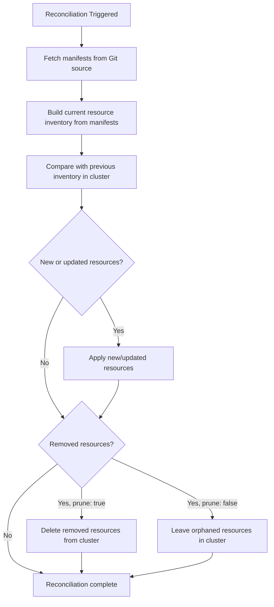

# How to Configure Kustomization Garbage Collection in Flux

Author: [nawazdhandala](https://github.com/nawazdhandala)

Tags: Flux CD, GitOps, Kubernetes, Kustomize, Garbage Collection, Pruning, Resource Management

Description: Learn how to configure garbage collection in Flux Kustomizations using spec.prune to automatically remove resources that are no longer defined in your Git repository.

---

One of the core principles of GitOps is that your Git repository is the single source of truth. When you remove a resource from Git, it should be removed from the cluster as well. Flux CD handles this through garbage collection, controlled by the `spec.prune` field on Kustomization resources. This guide explains how pruning works, how to configure it safely, and how to handle edge cases.

## What Is Garbage Collection in Flux?

Garbage collection (also called pruning) is the process by which Flux deletes Kubernetes resources from the cluster when they are no longer present in the source (Git repository). Without pruning, removing a manifest from Git would leave orphaned resources running in your cluster indefinitely.

Flux tracks which resources it manages by applying labels and annotations to every resource it creates. When a reconciliation occurs, Flux compares the set of resources it previously applied against the current set from Git. Any resources that exist in the cluster but are no longer in Git are candidates for deletion.

## Enabling Garbage Collection

Garbage collection is controlled by the `spec.prune` field. It is not enabled by default -- you must explicitly set it to `true`.

```yaml
# Kustomization with garbage collection enabled
apiVersion: kustomize.toolkit.fluxcd.io/v1
kind: Kustomization
metadata:
  name: app-frontend
  namespace: flux-system
spec:
  interval: 10m
  sourceRef:
    kind: GitRepository
    name: flux-system
  path: ./apps/frontend
  # Enable garbage collection -- resources removed from Git will be deleted
  prune: true
```

With `prune: true`, if you delete a Deployment manifest from the `./apps/frontend` directory in your Git repository, Flux will delete that Deployment from the cluster on the next reconciliation.

## How Flux Tracks Managed Resources

Flux uses a specific label to track ownership of resources. Every resource applied by a Kustomization receives the following metadata.

```yaml
# Labels and annotations Flux adds to managed resources
metadata:
  labels:
    # Identifies this resource as managed by Flux
    kustomize.toolkit.fluxcd.io/name: app-frontend
    kustomize.toolkit.fluxcd.io/namespace: flux-system
```

These labels allow Flux to build an inventory of all resources it manages for each Kustomization. During reconciliation, Flux compares this inventory against the current set of manifests from Git.

## The Reconciliation and Pruning Process

Here is how the pruning process works during each reconciliation cycle.



## What Happens When prune Is false

If `spec.prune` is set to `false` (or omitted, since `false` is the default), Flux will never delete resources from the cluster, even if they are removed from Git.

```yaml
# Kustomization without garbage collection -- orphaned resources will remain
apiVersion: kustomize.toolkit.fluxcd.io/v1
kind: Kustomization
metadata:
  name: shared-config
  namespace: flux-system
spec:
  interval: 10m
  sourceRef:
    kind: GitRepository
    name: flux-system
  path: ./config/shared
  # Garbage collection disabled -- removed resources will be orphaned
  prune: false
```

This can be useful for shared configuration (ConfigMaps, Secrets) where you want manual control over deletion, or during migration periods where you are moving resources between Kustomizations.

## Safely Testing Pruning Behavior

Before enabling pruning on production workloads, you can verify what Flux would delete by checking the Kustomization's inventory.

```bash
# View the current inventory of resources managed by a Kustomization
kubectl get kustomization app-frontend -n flux-system -o jsonpath='{.status.inventory.entries[*].id}' | tr ' ' '\n'

# Check Kustomization status for any pending changes
flux get ks app-frontend --namespace flux-system

# View recent events to see what Flux has applied or deleted
flux events --for Kustomization/app-frontend --namespace flux-system
```

## Preventing Accidental Deletion of Critical Resources

Sometimes you want garbage collection enabled in general, but need to protect specific resources from being pruned. You can do this by adding an annotation to the resource.

```yaml
# Resource protected from garbage collection
apiVersion: v1
kind: PersistentVolumeClaim
metadata:
  name: database-storage
  namespace: production
  annotations:
    # Prevent Flux from deleting this resource even if removed from Git
    kustomize.toolkit.fluxcd.io/prune: disabled
spec:
  accessModes:
    - ReadWriteOnce
  resources:
    requests:
      storage: 100Gi
```

With the `kustomize.toolkit.fluxcd.io/prune: disabled` annotation, Flux will skip this resource during garbage collection even if it is removed from the Git source. This is essential for stateful resources like PersistentVolumeClaims, where accidental deletion could cause data loss.

## Garbage Collection and Kustomization Deletion

When you delete a Kustomization resource itself (not just the manifests it manages), Flux's behavior depends on the `prune` setting.

```bash
# If prune: true, deleting the Kustomization deletes all managed resources
kubectl delete kustomization app-frontend -n flux-system
# This will delete ALL resources that app-frontend was managing

# To delete the Kustomization without deleting managed resources,
# first set prune to false, then delete
kubectl patch kustomization app-frontend -n flux-system \
  --type=merge -p '{"spec":{"prune":false}}'
# Wait for reconciliation
kubectl delete kustomization app-frontend -n flux-system
# Managed resources are now orphaned but still running
```

This is a critical distinction. If you are decommissioning a Kustomization but want to keep the workloads running (for example, during a migration to a new Kustomization structure), disable pruning first.

## Garbage Collection with dependsOn

When Kustomizations have dependencies, the order of garbage collection matters.

```yaml
# Parent Kustomization
apiVersion: kustomize.toolkit.fluxcd.io/v1
kind: Kustomization
metadata:
  name: infrastructure
  namespace: flux-system
spec:
  interval: 10m
  sourceRef:
    kind: GitRepository
    name: flux-system
  path: ./infrastructure
  prune: true
---
# Child Kustomization that depends on infrastructure
apiVersion: kustomize.toolkit.fluxcd.io/v1
kind: Kustomization
metadata:
  name: apps
  namespace: flux-system
spec:
  interval: 10m
  sourceRef:
    kind: GitRepository
    name: flux-system
  path: ./apps
  prune: true
  dependsOn:
    - name: infrastructure
```

If you remove a resource from the `infrastructure` path that `apps` depends on, Flux will prune it during the `infrastructure` reconciliation. The `apps` Kustomization may then fail because its dependency is gone. Plan your dependency chains carefully and test resource removal in staging environments first.

## Best Practices

**Enable pruning for application workloads**: Applications should be fully managed by GitOps, and pruning ensures clean removal when they are decommissioned.

**Protect stateful resources**: Always add the `kustomize.toolkit.fluxcd.io/prune: disabled` annotation to PersistentVolumeClaims, databases, and other stateful resources where deletion could cause data loss.

**Disable pruning during migrations**: When reorganizing your Git repository structure or moving resources between Kustomizations, temporarily disable pruning to avoid accidental deletion.

**Monitor pruning events**: Use `flux events --for Kustomization/<name>` to verify that garbage collection is behaving as expected after making changes.

## Summary

Garbage collection via `spec.prune` is what makes Flux a true GitOps tool -- ensuring your cluster state matches your Git repository by automatically removing resources that no longer exist in the source. Enable it with `prune: true`, protect critical stateful resources with the prune-disabled annotation, and always verify behavior with `flux events` before and after making structural changes to your Git repository.
