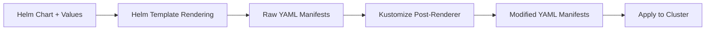

# How to Use Kustomization with Helm Post-Renderers in Flux

Author: [nawazdhandala](https://github.com/nawazdhandala)

Tags: Flux CD, GitOps, Kubernetes, Kustomize, Helm, Post-Renderer, HelmRelease

Description: Learn how to combine Flux Kustomization overlays with Helm post-renderers to customize Helm chart output without forking charts.

---

Helm charts provide a great way to package Kubernetes applications, but they cannot anticipate every customization need. Flux CD solves this with Helm post-renderers, which let you apply Kustomize patches to the rendered output of a Helm chart before it is applied to the cluster. This powerful combination gives you the flexibility of Kustomize overlays on top of any Helm chart. This guide shows you how to set up and use post-renderers effectively.

## What Are Helm Post-Renderers?

A post-renderer is a process that receives the rendered Helm chart output (the final YAML manifests after template evaluation and values substitution) and transforms it before it is applied to the cluster. Flux's HelmRelease resource supports Kustomize as a built-in post-renderer, letting you apply patches, add labels, change images, and more -- all without modifying the chart itself.



## Basic Post-Renderer Configuration

The post-renderer is configured directly on the HelmRelease resource using `spec.postRenderers`. Here is a basic example that adds labels to all resources produced by a Helm chart.

```yaml
# HelmRelease with a Kustomize post-renderer that adds labels
apiVersion: helm.toolkit.fluxcd.io/v2
kind: HelmRelease
metadata:
  name: nginx-ingress
  namespace: ingress-system
spec:
  interval: 10m
  chart:
    spec:
      chart: ingress-nginx
      version: "4.x"
      sourceRef:
        kind: HelmRepository
        name: ingress-nginx
        namespace: flux-system
  # Post-renderers modify the rendered chart output
  postRenderers:
    - kustomize:
        # Add labels to all resources in the rendered output
        patches: []
        patchesStrategicMerge: []
        # commonLabels are added to all resources
        images: []
```

## Adding Labels and Annotations

One of the most common use cases is adding organization-specific labels or annotations to every resource in a chart.

```yaml
# HelmRelease with post-renderer adding common labels and annotations
apiVersion: helm.toolkit.fluxcd.io/v2
kind: HelmRelease
metadata:
  name: prometheus
  namespace: monitoring
spec:
  interval: 10m
  chart:
    spec:
      chart: kube-prometheus-stack
      version: "55.x"
      sourceRef:
        kind: HelmRepository
        name: prometheus-community
        namespace: flux-system
  values:
    grafana:
      enabled: true
  postRenderers:
    - kustomize:
        patches:
          # Add cost-center annotation to all Deployments
          - target:
              kind: Deployment
            patch: |
              apiVersion: apps/v1
              kind: Deployment
              metadata:
                name: placeholder
                annotations:
                  company.io/cost-center: "platform-team"
                  company.io/managed-by: "flux-gitops"
```

## Patching Specific Resources

You can target specific resources by kind, name, or labels to apply focused patches.

```yaml
# HelmRelease with targeted patches via post-renderer
apiVersion: helm.toolkit.fluxcd.io/v2
kind: HelmRelease
metadata:
  name: my-app
  namespace: production
spec:
  interval: 10m
  chart:
    spec:
      chart: my-app
      version: "1.5.0"
      sourceRef:
        kind: HelmRepository
        name: internal-charts
        namespace: flux-system
  values:
    replicas: 3
  postRenderers:
    - kustomize:
        patches:
          # Add resource limits to the main deployment
          - target:
              kind: Deployment
              name: my-app
            patch: |
              apiVersion: apps/v1
              kind: Deployment
              metadata:
                name: my-app
              spec:
                template:
                  spec:
                    containers:
                      - name: my-app
                        resources:
                          limits:
                            memory: "512Mi"
                            cpu: "500m"
                          requests:
                            memory: "256Mi"
                            cpu: "250m"
          # Add a sidecar to the deployment
          - target:
              kind: Deployment
              name: my-app
            patch: |
              apiVersion: apps/v1
              kind: Deployment
              metadata:
                name: my-app
              spec:
                template:
                  spec:
                    containers:
                      - name: log-shipper
                        image: fluent/fluent-bit:latest
                        volumeMounts:
                          - name: logs
                            mountPath: /var/log/app
```

## Overriding Container Images

Post-renderers are useful for replacing container images, which is common in air-gapped environments where you mirror images to an internal registry.

```yaml
# HelmRelease with image overrides via post-renderer
apiVersion: helm.toolkit.fluxcd.io/v2
kind: HelmRelease
metadata:
  name: cert-manager
  namespace: cert-manager
spec:
  interval: 10m
  chart:
    spec:
      chart: cert-manager
      version: "1.14.x"
      sourceRef:
        kind: HelmRepository
        name: jetstack
        namespace: flux-system
  values:
    installCRDs: true
  postRenderers:
    - kustomize:
        # Replace images with internal registry mirrors
        images:
          - name: quay.io/jetstack/cert-manager-controller
            newName: registry.internal.company.io/jetstack/cert-manager-controller
            newTag: v1.14.0
          - name: quay.io/jetstack/cert-manager-webhook
            newName: registry.internal.company.io/jetstack/cert-manager-webhook
            newTag: v1.14.0
          - name: quay.io/jetstack/cert-manager-cainjector
            newName: registry.internal.company.io/jetstack/cert-manager-cainjector
            newTag: v1.14.0
```

## Combining HelmRelease with a Kustomization Wrapper

Another pattern is to deploy HelmRelease resources via a Kustomization, giving you two layers of customization: the post-renderer on the HelmRelease, and the Kustomize overlays in the Kustomization.

```yaml
# Kustomization that deploys HelmRelease resources
apiVersion: kustomize.toolkit.fluxcd.io/v1
kind: Kustomization
metadata:
  name: helm-apps
  namespace: flux-system
spec:
  interval: 10m
  sourceRef:
    kind: GitRepository
    name: flux-system
  path: ./helm-apps/production
  prune: true
  # Patches applied to the HelmRelease resource itself (not the chart output)
  patches:
    - target:
        kind: HelmRelease
      patch: |
        apiVersion: helm.toolkit.fluxcd.io/v2
        kind: HelmRelease
        metadata:
          name: placeholder
        spec:
          # Override values for production environment
          values:
            replicas: 5
            resources:
              limits:
                memory: "1Gi"
```

In this setup, the Kustomization patches the HelmRelease resource definition (changing values, adding post-renderers), and the post-renderer on the HelmRelease patches the rendered chart output. This two-layer approach is powerful for managing environment-specific overrides.

## Multiple Post-Renderers

You can chain multiple post-renderers. They are applied in order.

```yaml
# HelmRelease with multiple post-renderers applied in sequence
apiVersion: helm.toolkit.fluxcd.io/v2
kind: HelmRelease
metadata:
  name: grafana
  namespace: monitoring
spec:
  interval: 10m
  chart:
    spec:
      chart: grafana
      version: "7.x"
      sourceRef:
        kind: HelmRepository
        name: grafana
        namespace: flux-system
  postRenderers:
    # First post-renderer: add security context
    - kustomize:
        patches:
          - target:
              kind: Deployment
            patch: |
              apiVersion: apps/v1
              kind: Deployment
              metadata:
                name: placeholder
              spec:
                template:
                  spec:
                    securityContext:
                      runAsNonRoot: true
                      fsGroup: 472
    # Second post-renderer: add network policy labels
    - kustomize:
        patches:
          - target:
              kind: Deployment
            patch: |
              apiVersion: apps/v1
              kind: Deployment
              metadata:
                name: placeholder
                labels:
                  network-policy: restricted
```

## Debugging Post-Renderer Issues

When a post-renderer fails, the HelmRelease will show an error in its status. Use these commands to diagnose issues.

```bash
# Check HelmRelease status for post-renderer errors
flux get hr my-app --namespace production

# View detailed events
flux events --for HelmRelease/my-app --namespace production

# Render the chart locally to see what the post-renderer receives
helm template my-app ./charts/my-app --values values.yaml > rendered.yaml

# Verify your kustomize patches work against the rendered output
kubectl kustomize ./overlay/
```

## Summary

Helm post-renderers in Flux give you the ability to customize any Helm chart's output using Kustomize patches, image overrides, and label injection -- without forking or modifying the upstream chart. Configure them via `spec.postRenderers` on your HelmRelease resources. For complex environments, combine post-renderers with Kustomization overlays to create a flexible, layered customization pipeline that keeps your Helm charts clean and your environment-specific changes managed in Git.
