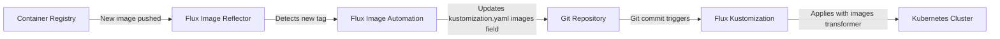

# How to Configure Kustomization Images Transformer in Flux

Author: [nawazdhandala](https://github.com/nawazdhandala)

Tags: Flux CD, GitOps, Kubernetes, Kustomize, Kustomization, Images, Container Registry

Description: Learn how to use the images field in kustomization.yaml to override container image names, tags, and digests across all resources managed by Flux CD.

---

## Introduction

Managing container image references across multiple Kubernetes manifests is a common source of errors. When you need to change an image tag for a new release, switch to a different container registry, or pin images to a specific digest, manually editing every Deployment and StatefulSet is tedious and error-prone.

The `images` field in `kustomization.yaml` provides a declarative way to override image names, tags, and digests without modifying the base manifests. Flux CD applies these transformations when reconciling the Kustomization resource, making it a natural fit for GitOps workflows.

## How the Images Transformer Works

The `images` field in `kustomization.yaml` searches all resources for container image references matching a given `name` and transforms them according to the specified overrides. You can:

- **Change the image name** (e.g., switch registries): using `newName`
- **Change the tag**: using `newTag`
- **Pin to a digest**: using `digest`
- **Combine** any of the above

Kustomize scans all container image fields in pods, Deployments, StatefulSets, DaemonSets, Jobs, CronJobs, and any other resource with a standard container spec.

## Repository Structure

```text
apps/
  ecommerce/
    base/
      deployment.yaml
      cronjob.yaml
      kustomization.yaml
    overlays/
      staging/
        kustomization.yaml
      production/
        kustomization.yaml
```

## Step 1: Create the Base Manifests

Define a Deployment and a CronJob that use container images.

```yaml
# apps/ecommerce/base/deployment.yaml
apiVersion: apps/v1
kind: Deployment
metadata:
  name: ecommerce-web
spec:
  replicas: 2
  selector:
    matchLabels:
      app: ecommerce-web
  template:
    metadata:
      labels:
        app: ecommerce-web
    spec:
      containers:
        - name: web
          # This image reference will be overridden by the images transformer
          image: docker.io/myorg/ecommerce-web:latest
          ports:
            - containerPort: 8080
        - name: nginx-proxy
          image: nginx:1.25
          ports:
            - containerPort: 80
```

```yaml
# apps/ecommerce/base/cronjob.yaml
apiVersion: batch/v1
kind: CronJob
metadata:
  name: ecommerce-report
spec:
  schedule: "0 2 * * *"
  jobTemplate:
    spec:
      template:
        spec:
          containers:
            - name: report-generator
              # Same base image, used in a CronJob
              image: docker.io/myorg/ecommerce-web:latest
              command: ["./generate-report"]
          restartPolicy: OnFailure
```

```yaml
# apps/ecommerce/base/kustomization.yaml
apiVersion: kustomize.config.k8s.io/v1beta1
kind: Kustomization
resources:
  - deployment.yaml
  - cronjob.yaml
```

## Step 2: Override Images in Staging

In the staging overlay, change the ecommerce image tag and switch the nginx image to a custom registry.

```yaml
# apps/ecommerce/overlays/staging/kustomization.yaml
apiVersion: kustomize.config.k8s.io/v1beta1
kind: Kustomization

resources:
  - ../../base

images:
  # Override the ecommerce-web image tag for staging
  - name: docker.io/myorg/ecommerce-web
    newTag: "v2.3.0-rc1"

  # Switch nginx to a private registry mirror
  - name: nginx
    newName: registry.internal.example.com/mirrors/nginx
    newTag: "1.25-alpine"
```

## Step 3: Pin Images by Digest in Production

For production, pin the ecommerce image to a specific digest for reproducibility.

```yaml
# apps/ecommerce/overlays/production/kustomization.yaml
apiVersion: kustomize.config.k8s.io/v1beta1
kind: Kustomization

resources:
  - ../../base

images:
  # Pin ecommerce-web to an exact digest in production
  - name: docker.io/myorg/ecommerce-web
    newName: registry.internal.example.com/myorg/ecommerce-web
    digest: sha256:a1b2c3d4e5f6a1b2c3d4e5f6a1b2c3d4e5f6a1b2c3d4e5f6a1b2c3d4e5f6a1b2

  # Pin nginx to a specific tag
  - name: nginx
    newName: registry.internal.example.com/mirrors/nginx
    newTag: "1.25.3"
```

## Step 4: Verify the Output

Build the staging overlay to see the transformed image references.

```bash
# Build staging overlay
kustomize build apps/ecommerce/overlays/staging
```

Expected output for the Deployment (abbreviated):

```yaml
# Both the Deployment and CronJob will have updated images
apiVersion: apps/v1
kind: Deployment
metadata:
  name: ecommerce-web
spec:
  template:
    spec:
      containers:
        - name: web
          # Image tag changed from "latest" to "v2.3.0-rc1"
          image: docker.io/myorg/ecommerce-web:v2.3.0-rc1
        - name: nginx-proxy
          # Registry and tag both changed
          image: registry.internal.example.com/mirrors/nginx:1.25-alpine
```

The CronJob will also show the updated ecommerce-web image reference.

```bash
# Build production overlay
kustomize build apps/ecommerce/overlays/production
```

```yaml
# Production uses digest pinning
apiVersion: apps/v1
kind: Deployment
metadata:
  name: ecommerce-web
spec:
  template:
    spec:
      containers:
        - name: web
          # Registry changed and pinned to digest
          image: registry.internal.example.com/myorg/ecommerce-web@sha256:a1b2c3d4e5f6a1b2c3d4e5f6a1b2c3d4e5f6a1b2c3d4e5f6a1b2c3d4e5f6a1b2
```

## Step 5: Configure Flux Kustomization

Point Flux at the overlay directories.

```yaml
# clusters/my-cluster/ecommerce-staging.yaml
apiVersion: kustomize.toolkit.fluxcd.io/v1
kind: Kustomization
metadata:
  name: ecommerce-staging
  namespace: flux-system
spec:
  interval: 5m
  path: ./apps/ecommerce/overlays/staging
  prune: true
  sourceRef:
    kind: GitRepository
    name: flux-system
  targetNamespace: staging
```

```yaml
# clusters/my-cluster/ecommerce-production.yaml
apiVersion: kustomize.toolkit.fluxcd.io/v1
kind: Kustomization
metadata:
  name: ecommerce-production
  namespace: flux-system
spec:
  interval: 5m
  path: ./apps/ecommerce/overlays/production
  prune: true
  sourceRef:
    kind: GitRepository
    name: flux-system
  targetNamespace: production
```

## Step 6: Reconcile and Verify

```bash
# Reconcile staging
flux reconcile kustomization ecommerce-staging --with-source

# Check the image used by the deployment
kubectl get deployment ecommerce-web -n staging -o jsonpath='{.spec.template.spec.containers[*].image}'
# Output: docker.io/myorg/ecommerce-web:v2.3.0-rc1 registry.internal.example.com/mirrors/nginx:1.25-alpine

# Check the CronJob image
kubectl get cronjob ecommerce-report -n staging -o jsonpath='{.spec.jobTemplate.spec.template.spec.containers[0].image}'
# Output: docker.io/myorg/ecommerce-web:v2.3.0-rc1
```

## Using Images Transformer with Flux Image Automation

The images transformer in `kustomization.yaml` works well as a manual approach. For fully automated image updates, Flux provides Image Automation controllers that can update the `images` field in your Git repository when new container images are pushed to a registry.

Here is a brief overview of how the two approaches complement each other.



The Image Automation controller writes the new tag directly into the `images` field of your `kustomization.yaml`, which the Kustomize images transformer then applies during reconciliation.

## Images Transformer Reference

Here is a summary of all available fields in the `images` transformer.

| Field | Description | Example |
|-------|-------------|---------|
| `name` | The image name to match (required) | `nginx` |
| `newName` | Replace the image name | `registry.example.com/nginx` |
| `newTag` | Replace the image tag | `1.25-alpine` |
| `digest` | Pin to a specific digest (overrides tag) | `sha256:abc123...` |

Rules:
- `name` is always required and must match the image name in the base manifest
- `newName` alone changes the registry/name but keeps the original tag
- `newTag` alone changes only the tag
- `digest` alone pins to that digest (tag is ignored)
- `newName` + `newTag` changes both registry and tag
- `newName` + `digest` changes registry and pins to digest

## Conclusion

The `images` field in `kustomization.yaml` is a powerful tool for managing container image references in Flux-managed deployments. It lets you override image names, tags, and digests per environment without modifying base manifests. For production, pinning to digests provides reproducibility and security. For staging, switching tags for release candidates enables testing before promotion.
