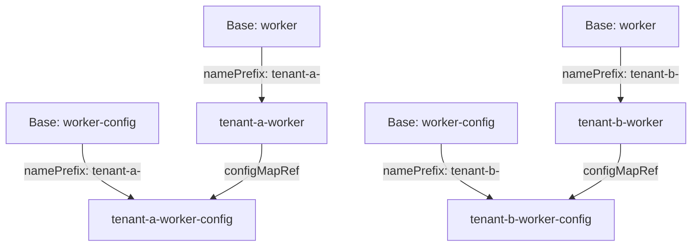

# How to Configure Kustomization NamePrefix and NameSuffix in Flux

Author: [nawazdhandala](https://github.com/nawazdhandala)

Tags: Flux CD, GitOps, Kubernetes, Kustomize, Kustomization, NamePrefix, NameSuffix

Description: Learn how to use namePrefix and nameSuffix in kustomization.yaml to add prefixes or suffixes to all resource names in Flux-managed Kubernetes deployments.

---

## Introduction

When deploying the same application to multiple environments or tenants within a single cluster, resource name collisions are a real problem. Kustomize provides `namePrefix` and `nameSuffix` fields that automatically prepend or append strings to the names of all resources. This includes updating internal references so that Services still point to the correct Deployments, and ConfigMap references in volumes still resolve correctly.

This guide demonstrates how to use `namePrefix` and `nameSuffix` in `kustomization.yaml` files that Flux CD manages through its Kustomization custom resource.

## How NamePrefix and NameSuffix Work

When you set `namePrefix` or `nameSuffix` in a `kustomization.yaml`, Kustomize modifies:

- The `metadata.name` of every resource
- All references to those resources, including:
  - Service selectors do **not** change (they match on labels, not names)
  - ConfigMap and Secret references in volume mounts
  - ServiceAccount references in pod specs
  - Role and ClusterRole binding subjects

This automatic reference updating is what makes `namePrefix` and `nameSuffix` safe to use without manually fixing cross-references.

## Repository Structure

```
apps/
  worker/
    base/
      deployment.yaml
      configmap.yaml
      service.yaml
      kustomization.yaml
    overlays/
      tenant-a/
        kustomization.yaml
      tenant-b/
        kustomization.yaml
      dev/
        kustomization.yaml
```

## Step 1: Create the Base Manifests

Define a base deployment that references a ConfigMap.

```yaml
# apps/worker/base/deployment.yaml
apiVersion: apps/v1
kind: Deployment
metadata:
  name: worker
spec:
  replicas: 1
  selector:
    matchLabels:
      app: worker
  template:
    metadata:
      labels:
        app: worker
    spec:
      containers:
        - name: worker
          image: worker:1.0.0
          envFrom:
            # This reference will be updated by namePrefix/nameSuffix
            - configMapRef:
                name: worker-config
```

```yaml
# apps/worker/base/configmap.yaml
apiVersion: v1
kind: ConfigMap
metadata:
  name: worker-config
data:
  LOG_LEVEL: "info"
  WORKER_CONCURRENCY: "5"
```

```yaml
# apps/worker/base/service.yaml
apiVersion: v1
kind: Service
metadata:
  name: worker
spec:
  selector:
    app: worker
  ports:
    - port: 80
      targetPort: 8080
```

```yaml
# apps/worker/base/kustomization.yaml
apiVersion: kustomize.config.k8s.io/v1beta1
kind: Kustomization
resources:
  - deployment.yaml
  - configmap.yaml
  - service.yaml
```

## Step 2: Use NamePrefix for Multi-Tenant Deployments

When deploying the same application for different tenants in a shared namespace, use `namePrefix` to avoid name collisions.

```yaml
# apps/worker/overlays/tenant-a/kustomization.yaml
apiVersion: kustomize.config.k8s.io/v1beta1
kind: Kustomization

resources:
  - ../../base

# Prefix all resource names with "tenant-a-"
namePrefix: tenant-a-

# Also add tenant-specific labels so selectors are unique
commonLabels:
  tenant: tenant-a
```

```yaml
# apps/worker/overlays/tenant-b/kustomization.yaml
apiVersion: kustomize.config.k8s.io/v1beta1
kind: Kustomization

resources:
  - ../../base

# Prefix all resource names with "tenant-b-"
namePrefix: tenant-b-

commonLabels:
  tenant: tenant-b
```

## Step 3: Use NameSuffix for Environment Variants

You can use `nameSuffix` to append environment identifiers to resource names.

```yaml
# apps/worker/overlays/dev/kustomization.yaml
apiVersion: kustomize.config.k8s.io/v1beta1
kind: Kustomization

resources:
  - ../../base

# Append "-dev" to all resource names
nameSuffix: -dev
```

## Step 4: Verify Reference Updates

Build the tenant-a overlay to confirm that both names and references are updated.

```bash
# Build the overlay
kustomize build apps/worker/overlays/tenant-a
```

The output shows that the ConfigMap name is prefixed, and the Deployment's configMapRef is automatically updated to match.

```yaml
# Expected output for Deployment (abbreviated)
apiVersion: apps/v1
kind: Deployment
metadata:
  name: tenant-a-worker    # name is prefixed
spec:
  template:
    spec:
      containers:
        - name: worker
          envFrom:
            - configMapRef:
                name: tenant-a-worker-config   # reference is updated
```

```yaml
# Expected output for ConfigMap
apiVersion: v1
kind: ConfigMap
metadata:
  name: tenant-a-worker-config   # name is prefixed
data:
  LOG_LEVEL: "info"
  WORKER_CONCURRENCY: "5"
```

## Step 5: Combine NamePrefix and NameSuffix

You can use both `namePrefix` and `nameSuffix` together.

```yaml
# Example: both prefix and suffix
apiVersion: kustomize.config.k8s.io/v1beta1
kind: Kustomization

resources:
  - ../../base

namePrefix: acme-
nameSuffix: -v2

# Result: "worker" becomes "acme-worker-v2"
# Result: "worker-config" becomes "acme-worker-config-v2"
```

## Step 6: Configure Flux Kustomization Resources

Create Flux Kustomization resources for each tenant.

```yaml
# clusters/my-cluster/worker-tenant-a.yaml
apiVersion: kustomize.toolkit.fluxcd.io/v1
kind: Kustomization
metadata:
  name: worker-tenant-a
  namespace: flux-system
spec:
  interval: 10m
  path: ./apps/worker/overlays/tenant-a
  prune: true
  sourceRef:
    kind: GitRepository
    name: flux-system
  targetNamespace: shared-workers
```

```yaml
# clusters/my-cluster/worker-tenant-b.yaml
apiVersion: kustomize.toolkit.fluxcd.io/v1
kind: Kustomization
metadata:
  name: worker-tenant-b
  namespace: flux-system
spec:
  interval: 10m
  path: ./apps/worker/overlays/tenant-b
  prune: true
  sourceRef:
    kind: GitRepository
    name: flux-system
  targetNamespace: shared-workers
```

## Step 7: Reconcile and Verify

```bash
# Reconcile both tenant deployments
flux reconcile kustomization worker-tenant-a --with-source
flux reconcile kustomization worker-tenant-b --with-source

# List deployments in the shared namespace to see prefixed names
kubectl get deployments -n shared-workers

# Expected output:
# NAME               READY   UP-TO-DATE   AVAILABLE
# tenant-a-worker    1/1     1            1
# tenant-b-worker    1/1     1            1

# List configmaps to verify prefixed names
kubectl get configmaps -n shared-workers

# Expected output:
# NAME                     DATA   AGE
# tenant-a-worker-config   2      1m
# tenant-b-worker-config   2      1m
```

## Visualizing the Name Transformation

The following diagram shows how `namePrefix` transforms resource names and their internal references.



## Important Considerations

1. **Label selectors are not changed.** `namePrefix` and `nameSuffix` do not modify label selectors. If you deploy multiple instances of the same app in one namespace, you also need `commonLabels` to differentiate selector matching.

2. **Name length limits.** Kubernetes resource names must be 253 characters or fewer. If your prefix or suffix combined with the base name exceeds this limit, the resource will fail to create.

3. **CRDs and custom references.** Kustomize only updates references it knows about (built-in Kubernetes types). If you use custom resources with name references, you may need to configure the Kustomize `nameReference` transformer.

4. **Consistency.** Use either `namePrefix` or `nameSuffix` consistently across your organization. Mixing approaches can make it harder to trace resources back to their source.

## Conclusion

The `namePrefix` and `nameSuffix` fields in `kustomization.yaml` are effective tools for deploying multiple instances of the same application in a Flux-managed cluster. They automatically update resource names and internal references, making multi-tenant and multi-environment deployments straightforward. Combine them with `commonLabels` to ensure selector uniqueness when sharing namespaces.
