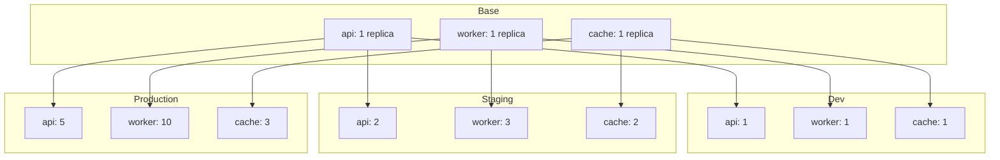

# How to Configure Kustomization Replicas Transformer in Flux

Author: [nawazdhandala](https://github.com/nawazdhandala)

Tags: Flux CD, GitOps, Kubernetes, Kustomize, Kustomization, Replica, Scaling

Description: Learn how to use the replicas field in kustomization.yaml to override replica counts for Deployments and StatefulSets across different environments managed by Flux CD.

---

## Introduction

Different environments require different scaling configurations. A development environment might run a single replica of each service, while production needs multiple replicas for high availability. Manually maintaining separate manifests for each environment creates duplication and drift.

The `replicas` field in `kustomization.yaml` lets you override the replica count for any Deployment, StatefulSet, or ReplicaSet by name, without modifying the base manifests. Combined with Flux CD, this gives you environment-specific scaling through simple, declarative configuration.

## How the Replicas Transformer Works

The `replicas` transformer matches resources by `name` and `kind` (defaulting to Deployment if kind is not specified), then overrides their `spec.replicas` field. This is cleaner than writing strategic merge patches for simple replica changes.

The field was introduced in Kustomize v5.0 and is supported by Flux's built-in Kustomize engine.

## Repository Structure

```text
apps/
  platform/
    base/
      api-deployment.yaml
      worker-deployment.yaml
      cache-statefulset.yaml
      kustomization.yaml
    overlays/
      dev/
        kustomization.yaml
      staging/
        kustomization.yaml
      production/
        kustomization.yaml
```

## Step 1: Create the Base Manifests

Define multiple workloads with default replica counts.

```yaml
# apps/platform/base/api-deployment.yaml
apiVersion: apps/v1
kind: Deployment
metadata:
  name: api
spec:
  replicas: 1
  selector:
    matchLabels:
      app: api
  template:
    metadata:
      labels:
        app: api
    spec:
      containers:
        - name: api
          image: myorg/api:1.0.0
          ports:
            - containerPort: 8080
```

```yaml
# apps/platform/base/worker-deployment.yaml
apiVersion: apps/v1
kind: Deployment
metadata:
  name: worker
spec:
  replicas: 1
  selector:
    matchLabels:
      app: worker
  template:
    metadata:
      labels:
        app: worker
    spec:
      containers:
        - name: worker
          image: myorg/worker:1.0.0
```

```yaml
# apps/platform/base/cache-statefulset.yaml
apiVersion: apps/v1
kind: StatefulSet
metadata:
  name: cache
spec:
  replicas: 1
  serviceName: cache
  selector:
    matchLabels:
      app: cache
  template:
    metadata:
      labels:
        app: cache
    spec:
      containers:
        - name: redis
          image: redis:7.2
          ports:
            - containerPort: 6379
```

```yaml
# apps/platform/base/kustomization.yaml
apiVersion: kustomize.config.k8s.io/v1beta1
kind: Kustomization
resources:
  - api-deployment.yaml
  - worker-deployment.yaml
  - cache-statefulset.yaml
```

## Step 2: Override Replicas per Environment

In the dev overlay, keep everything at one replica.

```yaml
# apps/platform/overlays/dev/kustomization.yaml
apiVersion: kustomize.config.k8s.io/v1beta1
kind: Kustomization

resources:
  - ../../base

# Dev environment: minimal replicas
replicas:
  - name: api
    count: 1
  - name: worker
    count: 1
  - name: cache
    count: 1
```

In the staging overlay, scale up slightly to test with more realistic conditions.

```yaml
# apps/platform/overlays/staging/kustomization.yaml
apiVersion: kustomize.config.k8s.io/v1beta1
kind: Kustomization

resources:
  - ../../base

# Staging: moderate replica counts
replicas:
  - name: api
    count: 2
  - name: worker
    count: 3
  - name: cache
    count: 2
```

In production, scale for high availability.

```yaml
# apps/platform/overlays/production/kustomization.yaml
apiVersion: kustomize.config.k8s.io/v1beta1
kind: Kustomization

resources:
  - ../../base

# Production: high availability replica counts
replicas:
  - name: api
    count: 5
  - name: worker
    count: 10
  - name: cache
    count: 3
```

## Step 3: Verify the Output

Build each overlay to verify the replica counts.

```bash
# Build dev overlay
kustomize build apps/platform/overlays/dev | grep -A2 "replicas:"

# Build staging overlay
kustomize build apps/platform/overlays/staging | grep -A2 "replicas:"

# Build production overlay
kustomize build apps/platform/overlays/production | grep -A2 "replicas:"
```

For the production overlay, the API Deployment output will look like this:

```yaml
# Expected output (abbreviated)
apiVersion: apps/v1
kind: Deployment
metadata:
  name: api
spec:
  replicas: 5    # overridden from 1 to 5
  selector:
    matchLabels:
      app: api
```

## Step 4: Configure Flux Kustomization Resources

Create a Flux Kustomization for each environment.

```yaml
# clusters/my-cluster/platform-dev.yaml
apiVersion: kustomize.toolkit.fluxcd.io/v1
kind: Kustomization
metadata:
  name: platform-dev
  namespace: flux-system
spec:
  interval: 10m
  path: ./apps/platform/overlays/dev
  prune: true
  sourceRef:
    kind: GitRepository
    name: flux-system
  targetNamespace: dev
```

```yaml
# clusters/my-cluster/platform-staging.yaml
apiVersion: kustomize.toolkit.fluxcd.io/v1
kind: Kustomization
metadata:
  name: platform-staging
  namespace: flux-system
spec:
  interval: 10m
  path: ./apps/platform/overlays/staging
  prune: true
  sourceRef:
    kind: GitRepository
    name: flux-system
  targetNamespace: staging
```

```yaml
# clusters/my-cluster/platform-production.yaml
apiVersion: kustomize.toolkit.fluxcd.io/v1
kind: Kustomization
metadata:
  name: platform-production
  namespace: flux-system
spec:
  interval: 10m
  path: ./apps/platform/overlays/production
  prune: true
  sourceRef:
    kind: GitRepository
    name: flux-system
  targetNamespace: production
```

## Step 5: Reconcile and Verify

```bash
# Reconcile production
flux reconcile kustomization platform-production --with-source

# Check replica counts in production
kubectl get deployments -n production
# NAME     READY   UP-TO-DATE   AVAILABLE   AGE
# api      5/5     5            5           2m
# worker   10/10   10           10          2m

kubectl get statefulsets -n production
# NAME    READY   AGE
# cache   3/3     2m
```

## Scaling Visualization

The following diagram shows how replica counts differ across environments for the same base workloads.



## Replicas Transformer vs Strategic Merge Patch

Before the `replicas` field was available, you had to use patches to override replica counts. Here is a comparison.

Using the `replicas` field (recommended):

```yaml
# Clean and concise
replicas:
  - name: api
    count: 5
```

Using a strategic merge patch (older approach):

```yaml
# More verbose, requires a separate patch file or inline patch
patches:
  - patch: |
      apiVersion: apps/v1
      kind: Deployment
      metadata:
        name: api
      spec:
        replicas: 5
```

The `replicas` field is more readable and less error-prone for this specific use case.

## Interaction with Horizontal Pod Autoscaler

If you use a Horizontal Pod Autoscaler (HPA), the HPA will manage the actual replica count at runtime. However, setting a `replicas` value in the manifest is still useful because:

- It defines the initial replica count when the Deployment is first created
- It serves as the fallback if the HPA is removed or misconfigured
- Flux will reset it on each reconciliation unless you suspend the Kustomization or exclude the replicas field

If you want Flux to not overwrite HPA-managed replica counts, you can remove the `replicas` field from your base manifests entirely and not set it in the `replicas` transformer.

## Conclusion

The `replicas` transformer in `kustomization.yaml` provides a clean, declarative way to manage per-environment scaling in Flux-managed deployments. It eliminates the need for patch files and keeps your overlay configurations readable. Use it to define scaling requirements for dev, staging, and production environments alongside the rest of your Kustomize configuration.
