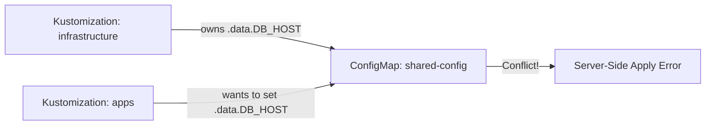

# How to Handle Kustomization Resource Conflicts in Flux

Author: [nawazdhandala](https://github.com/nawazdhandala)

Tags: Flux CD, GitOps, Kubernetes, Kustomize, Conflicts, Resource Management, Troubleshooting

Description: Learn how to identify, prevent, and resolve resource conflicts between multiple Kustomizations in Flux CD.

---

In complex Flux CD deployments, multiple Kustomizations can end up managing the same Kubernetes resource. This leads to resource conflicts where two or more controllers compete to set the desired state of a single object, causing reconciliation failures and unpredictable behavior. This guide explains why conflicts happen, how to detect them, and the strategies available to resolve them.

## What Are Resource Conflicts?

A resource conflict occurs when two or more Flux Kustomizations attempt to manage the same Kubernetes resource. For example, if both an `infrastructure` Kustomization and an `apps` Kustomization include a ConfigMap with the same name and namespace, they will fight over the resource's contents on each reconciliation.

Flux uses server-side apply (SSA) by default, which tracks field ownership at the field level. When a second Kustomization tries to set a field that is already owned by another manager, Kubernetes reports a conflict.

## Detecting Conflicts

Conflicts surface as errors in the Kustomization status. You can detect them using the Flux CLI.

```bash
# Check Kustomization status for conflict errors
flux get ks --all-namespaces

# View detailed events for a specific Kustomization
flux events --for Kustomization/apps --namespace flux-system

# Inspect the Kustomization status conditions directly
kubectl get kustomization apps -n flux-system -o yaml
```

A typical conflict error looks like this in the events output.

```text
Apply failed: conflict with "flux-system/infrastructure" for resource
ConfigMap/production/shared-config: field manager conflict for field
.data.DATABASE_URL
```

## Understanding Server-Side Apply and Field Ownership

Flux uses Kubernetes server-side apply (SSA), where each field in a resource is tracked by its "field manager." When a Kustomization applies a resource, it becomes the field manager for every field it sets.



If two Kustomizations try to set the same field, the second one will fail with a conflict error. This is a safety mechanism -- it prevents unintentional overwrites.

## Strategy 1: Force Apply to Take Ownership

If you intentionally want one Kustomization to take ownership of a resource from another, you can use the `spec.force` field.

```yaml
# Kustomization that forcefully takes ownership of conflicting resources
apiVersion: kustomize.toolkit.fluxcd.io/v1
kind: Kustomization
metadata:
  name: apps
  namespace: flux-system
spec:
  interval: 10m
  sourceRef:
    kind: GitRepository
    name: flux-system
  path: ./apps
  prune: true
  # Force apply -- takes over field ownership from other managers
  force: true
```

**Warning**: Using `force: true` means this Kustomization will override fields set by any other manager, including other Kustomizations, Helm, or manual kubectl edits. Use this only when you are certain this Kustomization should be the sole owner of the resources it manages.

## Strategy 2: Eliminate Overlapping Resources

The cleanest solution is to ensure each resource is managed by exactly one Kustomization. Restructure your Git repository so there is no overlap.

```bash
# Before: both directories contain shared-config.yaml
# infrastructure/
#   shared-config.yaml    <-- managed by infrastructure Kustomization
# apps/
#   shared-config.yaml    <-- managed by apps Kustomization (CONFLICT!)

# After: move shared resources to a dedicated Kustomization
# shared/
#   shared-config.yaml    <-- managed by shared Kustomization (no conflict)
# infrastructure/
#   infra-specific.yaml
# apps/
#   app-specific.yaml
```

Create a dedicated Kustomization for shared resources.

```yaml
# Dedicated Kustomization for shared resources
apiVersion: kustomize.toolkit.fluxcd.io/v1
kind: Kustomization
metadata:
  name: shared-resources
  namespace: flux-system
spec:
  interval: 10m
  sourceRef:
    kind: GitRepository
    name: flux-system
  path: ./shared
  prune: true
---
# Infrastructure Kustomization depends on shared resources
apiVersion: kustomize.toolkit.fluxcd.io/v1
kind: Kustomization
metadata:
  name: infrastructure
  namespace: flux-system
spec:
  interval: 10m
  sourceRef:
    kind: GitRepository
    name: flux-system
  path: ./infrastructure
  prune: true
  dependsOn:
    - name: shared-resources
---
# Apps Kustomization depends on shared resources
apiVersion: kustomize.toolkit.fluxcd.io/v1
kind: Kustomization
metadata:
  name: apps
  namespace: flux-system
spec:
  interval: 10m
  sourceRef:
    kind: GitRepository
    name: flux-system
  path: ./apps
  prune: true
  dependsOn:
    - name: shared-resources
```

## Strategy 3: Use Patches Instead of Full Resources

If two Kustomizations need to contribute different fields to the same resource, you can have one Kustomization create the base resource and the other apply a strategic merge patch. However, this still requires careful field-level ownership planning.

```yaml
# Base ConfigMap in the shared Kustomization
apiVersion: v1
kind: ConfigMap
metadata:
  name: app-config
  namespace: production
data:
  DATABASE_URL: "postgres://db:5432/app"
  CACHE_URL: "redis://cache:6379"
```

```yaml
# In the apps Kustomization, use a Kustomize patch to add app-specific fields
# apps/kustomization.yaml
apiVersion: kustomize.config.k8s.io/v1beta1
kind: Kustomization
resources: []
patches:
  - target:
      kind: ConfigMap
      name: app-config
      namespace: production
    patch: |
      apiVersion: v1
      kind: ConfigMap
      metadata:
        name: app-config
        namespace: production
      data:
        # Only set fields that the shared Kustomization does not manage
        APP_VERSION: "2.1.0"
        FEATURE_FLAGS: "dark-mode,notifications"
```

Note that this approach can still cause conflicts if both Kustomizations try to set the same fields. It works only when the fields are clearly partitioned.

## Strategy 4: Use fieldManagers Configuration

Flux allows you to configure how server-side apply handles field conflicts through `spec.commonMetadata` and related options. You can also set the field manager name explicitly if needed.

```yaml
# Kustomization with explicit field manager configuration
apiVersion: kustomize.toolkit.fluxcd.io/v1
kind: Kustomization
metadata:
  name: apps-override
  namespace: flux-system
spec:
  interval: 10m
  sourceRef:
    kind: GitRepository
    name: flux-system
  path: ./apps
  prune: true
  # Force resolves conflicts by taking ownership
  force: true
```

## Diagnosing Conflicts Step by Step

When you encounter a conflict, follow this debugging workflow.

```bash
# Step 1: Identify which Kustomization is failing
flux get ks --all-namespaces | grep -i false

# Step 2: Get the detailed error message
flux events --for Kustomization/apps --namespace flux-system

# Step 3: Inspect field managers on the conflicting resource
kubectl get configmap shared-config -n production -o yaml --show-managed-fields

# Step 4: Identify which field manager owns the conflicting fields
# Look for the "manager" field in the managedFields section
# to see which controller currently owns each field

# Step 5: Decide on resolution strategy
# - Remove duplicate from one Kustomization
# - Use force: true on the intended owner
# - Restructure into a shared Kustomization
```

The `--show-managed-fields` flag on kubectl is particularly useful. It shows exactly which manager owns each field, making it clear which Kustomization (or other controller) is causing the conflict.

## Preventing Conflicts Proactively

**Establish clear ownership boundaries**: Define which Kustomization owns which namespaces or resource types. Document this in your repository.

**Use namespace isolation**: When possible, have each Kustomization manage resources in distinct namespaces to avoid overlap.

**Review changes carefully**: Before merging Git changes that add resources to a Kustomization, verify no other Kustomization already manages those resources.

**Use flux tree to visualize ownership**: The `flux tree ks` command shows which resources each Kustomization owns, helping you spot potential overlaps before they become conflicts.

```bash
# Check what each Kustomization manages
flux tree ks infrastructure --namespace flux-system
flux tree ks apps --namespace flux-system
```

## Summary

Resource conflicts in Flux arise when multiple Kustomizations manage the same resource or fields. The best approach is to prevent conflicts by ensuring clear ownership boundaries -- one Kustomization per resource. When conflicts do occur, use `flux events` and `kubectl --show-managed-fields` to diagnose them, then resolve by restructuring your repository, using `force: true` intentionally, or creating a dedicated shared Kustomization for common resources.
