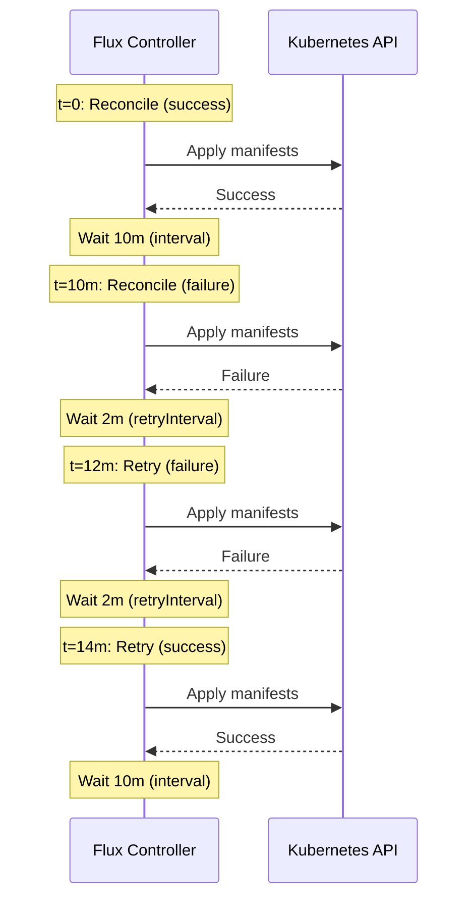

# How to Configure Kustomization Retry on Failure in Flux

Author: [nawazdhandala](https://github.com/nawazdhandala)

Tags: Flux CD, GitOps, Kubernetes, Kustomize, Retry, Error Handling, Resilience

Description: Learn how to configure retry behavior for Kustomization resources in Flux CD to handle transient failures and improve deployment resilience.

---

Flux CD continuously reconciles your desired state from Git to your Kubernetes cluster. However, transient failures can occur -- network issues, temporary API server unavailability, or timing problems with dependencies. Configuring retry behavior on your Kustomization resources helps your deployments recover gracefully from these situations. This guide walks through the retry mechanisms available in Flux and how to use them effectively.

## How Flux Kustomization Reconciliation Works

A Flux Kustomization reconciles on a defined interval. When it encounters a failure during apply, Flux will attempt to reconcile again on the next interval tick. The key fields that control this behavior are `spec.interval`, `spec.retryInterval`, and `spec.timeout`.

## Configuring retryInterval

The `spec.retryInterval` field tells Flux how quickly to retry after a failed reconciliation, rather than waiting for the full `spec.interval` to elapse. This is the primary mechanism for retry on failure.

```yaml
# Kustomization with retry configuration
apiVersion: kustomize.toolkit.fluxcd.io/v1
kind: Kustomization
metadata:
  name: app-backend
  namespace: flux-system
spec:
  interval: 10m          # Normal reconciliation interval
  retryInterval: 2m      # Retry interval after failure (shorter than interval)
  timeout: 5m            # Maximum time for a single reconciliation attempt
  sourceRef:
    kind: GitRepository
    name: flux-system
  path: ./apps/backend
  prune: true
```

In this configuration, Flux will reconcile every 10 minutes under normal conditions. If a reconciliation fails, Flux will retry after just 2 minutes instead of waiting the full 10 minutes. The `timeout` field sets the maximum duration Flux will wait for a single apply operation to complete before marking it as failed.

## How retryInterval Interacts with interval

Understanding the relationship between `interval` and `retryInterval` is important for tuning your deployments.



When reconciliation succeeds, Flux waits for the full `interval` before the next reconciliation. When it fails, Flux switches to the shorter `retryInterval` until a reconciliation succeeds again.

## Setting Appropriate Timeout Values

The `spec.timeout` is critical for preventing reconciliations from hanging indefinitely. Set it based on how long your resources typically take to become ready.

```yaml
# Kustomization with a generous timeout for large deployments
apiVersion: kustomize.toolkit.fluxcd.io/v1
kind: Kustomization
metadata:
  name: platform-services
  namespace: flux-system
spec:
  interval: 15m
  retryInterval: 3m
  timeout: 10m           # Large deployments may need more time
  sourceRef:
    kind: GitRepository
    name: flux-system
  path: ./platform
  prune: true
  # Wait for all resources to become healthy before marking as ready
  wait: true
```

When `wait: true` is set, Flux waits for all applied resources to become ready (Deployments fully rolled out, Services with endpoints, etc.) before marking the Kustomization as ready. The `timeout` applies to this entire process -- both the apply and the health checking.

## Handling Dependencies with Retry

When Kustomizations depend on each other via `dependsOn`, retry behavior becomes especially important. A child Kustomization will not reconcile until its dependencies are ready.

```yaml
# Parent Kustomization: database infrastructure
apiVersion: kustomize.toolkit.fluxcd.io/v1
kind: Kustomization
metadata:
  name: database
  namespace: flux-system
spec:
  interval: 10m
  retryInterval: 1m      # Fast retry -- apps depend on this
  timeout: 5m
  sourceRef:
    kind: GitRepository
    name: flux-system
  path: ./infrastructure/database
  prune: true
  wait: true
---
# Child Kustomization: application that depends on database
apiVersion: kustomize.toolkit.fluxcd.io/v1
kind: Kustomization
metadata:
  name: api-server
  namespace: flux-system
spec:
  interval: 10m
  retryInterval: 2m
  timeout: 5m
  sourceRef:
    kind: GitRepository
    name: flux-system
  path: ./apps/api-server
  prune: true
  # Will not reconcile until database Kustomization is ready
  dependsOn:
    - name: database
```

In this setup, the `database` Kustomization has a shorter `retryInterval` of 1 minute because the `api-server` Kustomization is blocked until `database` succeeds. A fast retry on the parent reduces total recovery time for the entire chain.

## Monitoring Retry Behavior

You can observe retry behavior using the Flux CLI.

```bash
# Check the current status and last reconciliation attempt
flux get ks app-backend --namespace flux-system

# Watch for reconciliation events, including retries
flux events --for Kustomization/app-backend --namespace flux-system

# Stream live events to see retries as they happen
flux events --for Kustomization/app-backend --namespace flux-system --watch
```

You can also inspect the Kustomization status conditions directly with kubectl.

```bash
# View detailed status conditions including retry information
kubectl get kustomization app-backend -n flux-system -o yaml | grep -A 20 "status:"
```

## Recommended Retry Configurations

Here are some common patterns for different types of workloads.

```yaml
# Fast retry for critical infrastructure (e.g., networking, DNS)
apiVersion: kustomize.toolkit.fluxcd.io/v1
kind: Kustomization
metadata:
  name: critical-infra
  namespace: flux-system
spec:
  interval: 5m
  retryInterval: 30s     # Retry every 30 seconds on failure
  timeout: 3m
  sourceRef:
    kind: GitRepository
    name: flux-system
  path: ./infrastructure/critical
  prune: true
  wait: true
---
# Standard retry for applications
apiVersion: kustomize.toolkit.fluxcd.io/v1
kind: Kustomization
metadata:
  name: web-app
  namespace: flux-system
spec:
  interval: 10m
  retryInterval: 2m      # Retry every 2 minutes on failure
  timeout: 5m
  sourceRef:
    kind: GitRepository
    name: flux-system
  path: ./apps/web
  prune: true
  wait: true
---
# Relaxed retry for non-critical batch jobs
apiVersion: kustomize.toolkit.fluxcd.io/v1
kind: Kustomization
metadata:
  name: batch-jobs
  namespace: flux-system
spec:
  interval: 30m
  retryInterval: 5m      # Retry every 5 minutes on failure
  timeout: 10m
  sourceRef:
    kind: GitRepository
    name: flux-system
  path: ./jobs
  prune: true
```

## Tips for Effective Retry Configuration

**Keep retryInterval shorter than interval**: The whole point of `retryInterval` is to recover faster than the normal reconciliation cycle. If your `retryInterval` equals your `interval`, it has no effect.

**Set timeout appropriately**: If your timeout is too short, reconciliations will fail even when resources just need more time to become ready. If it is too long, you will wait unnecessarily before Flux marks a reconciliation as failed and triggers a retry.

**Use wait: true for dependency chains**: Without `wait: true`, Flux marks a Kustomization as ready as soon as the apply succeeds, without waiting for the resources to actually become healthy. Dependent Kustomizations will then start reconciling before their prerequisites are truly ready.

**Monitor with flux events**: The `flux events --for Kustomization/<name>` command is the best way to observe retry behavior in real time and diagnose persistent failures.

## Summary

Configuring `retryInterval` and `timeout` on your Flux Kustomizations is essential for building resilient GitOps pipelines. Use shorter retry intervals for critical infrastructure that blocks other deployments, and longer intervals for non-critical workloads. Combined with `dependsOn` and `wait: true`, these settings ensure your deployments recover quickly from transient failures while maintaining proper ordering.
