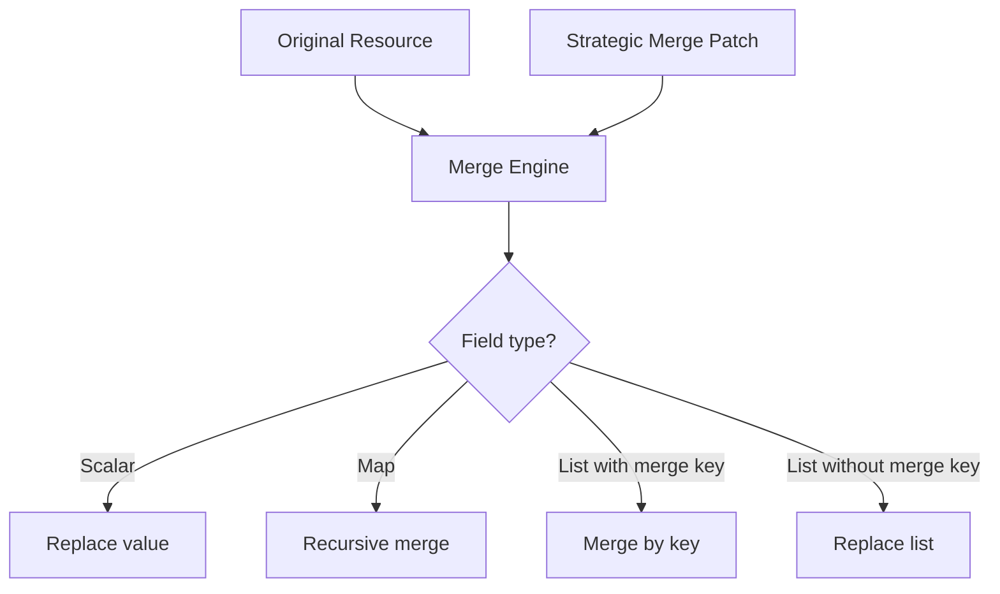

# How to Configure Kustomization Strategic Merge Patches in Flux

Author: [nawazdhandala](https://github.com/nawazdhandala)

Tags: Flux CD, GitOps, Kubernetes, Kustomize, Strategic Merge Patch, Patches

Description: Learn how to use strategic merge patches in Flux Kustomization resources to modify Kubernetes manifests by merging fields intelligently based on patch merge keys.

---

## Introduction

Strategic merge patches are the default patch type used in Kubernetes and Flux Kustomizations. Unlike JSON patches that use explicit operations (add, remove, replace), strategic merge patches work by merging a partial resource definition with the existing resource. Kubernetes uses merge keys (like container `name` in a pod spec) to determine how lists should be merged rather than replaced. This guide explains how strategic merge patches work in Flux, how to use them in `spec.patches`, and how they differ from other patch types.

## How Strategic Merge Patches Work

A strategic merge patch is a partial YAML document that looks like the resource it modifies. You only include the fields you want to change. Kubernetes merges the patch with the existing resource using these rules:

- **Scalar fields** (strings, numbers, booleans): The patch value replaces the existing value
- **Maps** (objects): The patch is merged recursively
- **Lists with merge keys**: Items are merged by their merge key (e.g., container `name`)
- **Lists without merge keys**: The patch list replaces the existing list entirely



## Basic Strategic Merge Patch in Flux

The patches in `spec.patches` use strategic merge patch format by default. Here is an example that modifies a Deployment.

```yaml
# kustomization-smp.yaml - Strategic merge patch to modify a Deployment
apiVersion: kustomize.toolkit.fluxcd.io/v1
kind: Kustomization
metadata:
  name: my-app
  namespace: flux-system
spec:
  interval: 10m
  sourceRef:
    kind: GitRepository
    name: my-repo
  path: ./deploy
  prune: true
  patches:
    # Strategic merge patch - only specify fields to change
    - patch: |
        apiVersion: apps/v1
        kind: Deployment
        metadata:
          name: web-app
        spec:
          replicas: 5
          template:
            spec:
              containers:
                - name: web
                  resources:
                    limits:
                      memory: 512Mi
      target:
        kind: Deployment
        name: web-app
```

This patch does two things:
1. Sets `replicas` to 5
2. Merges the `resources.limits.memory` field into the container named `web`

All other fields on the Deployment remain unchanged.

## Merging Container Lists

The `containers` list in a pod spec uses `name` as its merge key. This means strategic merge patches can target specific containers by name without affecting other containers.

Suppose your source Deployment has two containers:

```yaml
# deploy/deployment.yaml - Original Deployment with two containers
apiVersion: apps/v1
kind: Deployment
metadata:
  name: web-app
spec:
  replicas: 2
  selector:
    matchLabels:
      app: web-app
  template:
    metadata:
      labels:
        app: web-app
    spec:
      containers:
        - name: web
          image: nginx:1.25
          ports:
            - containerPort: 80
        - name: sidecar
          image: fluentd:latest
```

You can patch just the `web` container without affecting the `sidecar`:

```yaml
# Patch only the web container
patches:
  - patch: |
      apiVersion: apps/v1
      kind: Deployment
      metadata:
        name: web-app
      spec:
        template:
          spec:
            containers:
              # Merge key is "name" - only the web container is modified
              - name: web
                image: nginx:1.26
                resources:
                  requests:
                    cpu: 200m
                    memory: 128Mi
    target:
      kind: Deployment
      name: web-app
```

After this patch, the Deployment will have:
- `web` container with image `nginx:1.26` and resource requests added
- `sidecar` container completely unchanged

## Adding New Containers

You can add a new container to an existing pod spec using a strategic merge patch. Since the merge key is `name`, a container with a new name is appended to the list.

```yaml
# kustomization-add-container.yaml - Add a sidecar container
apiVersion: kustomize.toolkit.fluxcd.io/v1
kind: Kustomization
metadata:
  name: my-app
  namespace: flux-system
spec:
  interval: 10m
  sourceRef:
    kind: GitRepository
    name: my-repo
  path: ./deploy
  prune: true
  patches:
    - patch: |
        apiVersion: apps/v1
        kind: Deployment
        metadata:
          name: web-app
        spec:
          template:
            spec:
              containers:
                # New container name - will be added to existing list
                - name: metrics-exporter
                  image: prom/node-exporter:latest
                  ports:
                    - containerPort: 9100
      target:
        kind: Deployment
        name: web-app
```

## Merging Labels and Annotations

Labels and annotations are maps, so strategic merge patches merge them recursively. Existing labels are preserved, and new labels are added.

```yaml
# kustomization-labels.yaml - Add labels without removing existing ones
apiVersion: kustomize.toolkit.fluxcd.io/v1
kind: Kustomization
metadata:
  name: my-app
  namespace: flux-system
spec:
  interval: 10m
  sourceRef:
    kind: GitRepository
    name: my-repo
  path: ./deploy
  prune: true
  patches:
    - patch: |
        apiVersion: apps/v1
        kind: Deployment
        metadata:
          name: web-app
          labels:
            # These labels are ADDED to existing labels, not replacing them
            environment: production
            team: platform
          annotations:
            prometheus.io/scrape: "true"
            prometheus.io/port: "9090"
      target:
        kind: Deployment
        name: web-app
```

## Deleting Fields with Strategic Merge Patches

To remove a field using a strategic merge patch, set it to `null`.

```yaml
# kustomization-remove-field.yaml - Remove a field
apiVersion: kustomize.toolkit.fluxcd.io/v1
kind: Kustomization
metadata:
  name: my-app
  namespace: flux-system
spec:
  interval: 10m
  sourceRef:
    kind: GitRepository
    name: my-repo
  path: ./deploy
  prune: true
  patches:
    - patch: |
        apiVersion: apps/v1
        kind: Deployment
        metadata:
          name: web-app
          annotations:
            # Setting to null removes this annotation
            deprecated-annotation: null
      target:
        kind: Deployment
        name: web-app
```

## Removing Items from Lists

To remove an item from a list with a merge key, use the `$patch: delete` directive.

```yaml
# kustomization-remove-container.yaml - Remove a container from a Deployment
apiVersion: kustomize.toolkit.fluxcd.io/v1
kind: Kustomization
metadata:
  name: my-app
  namespace: flux-system
spec:
  interval: 10m
  sourceRef:
    kind: GitRepository
    name: my-repo
  path: ./deploy
  prune: true
  patches:
    - patch: |
        apiVersion: apps/v1
        kind: Deployment
        metadata:
          name: web-app
        spec:
          template:
            spec:
              containers:
                # Remove the sidecar container
                - name: sidecar
                  $patch: delete
      target:
        kind: Deployment
        name: web-app
```

## Patching Multiple Resources

Use the `target` selector to apply the same strategic merge patch to multiple resources at once.

```yaml
# kustomization-patch-multiple.yaml - Patch all Deployments
apiVersion: kustomize.toolkit.fluxcd.io/v1
kind: Kustomization
metadata:
  name: my-app
  namespace: flux-system
spec:
  interval: 10m
  sourceRef:
    kind: GitRepository
    name: my-repo
  path: ./deploy
  prune: true
  patches:
    # Apply security context to all Deployments
    - patch: |
        apiVersion: apps/v1
        kind: Deployment
        metadata:
          name: not-used
        spec:
          template:
            spec:
              securityContext:
                runAsNonRoot: true
                fsGroup: 1000
      target:
        kind: Deployment
```

## Verifying Strategic Merge Patches

```bash
# Preview the patched output
flux build kustomization my-app

# Check for patch errors
kubectl describe kustomization my-app -n flux-system
```

## Best Practices

1. **Use strategic merge patches as the default** since they are the most intuitive and align with how Kubernetes handles updates.
2. **Leverage merge keys** (like container `name`) to target specific items in lists without replacing the entire list.
3. **Be aware of lists without merge keys**: environment variables in a container spec (`env`) use `name` as a merge key, but `args` does not have a merge key and will be replaced entirely.
4. **Use `$patch: delete`** to remove specific items from lists rather than reconstructing the entire list without them.
5. **Test with `flux build`** to verify the merge result matches your expectations.

## Conclusion

Strategic merge patches are the natural way to modify Kubernetes resources in Flux Kustomizations. They provide intelligent merging that understands the structure of Kubernetes resources, allowing you to target specific containers, add labels without removing existing ones, and make surgical modifications to complex resources. Understanding how merge keys work for lists is essential for using strategic merge patches effectively.
