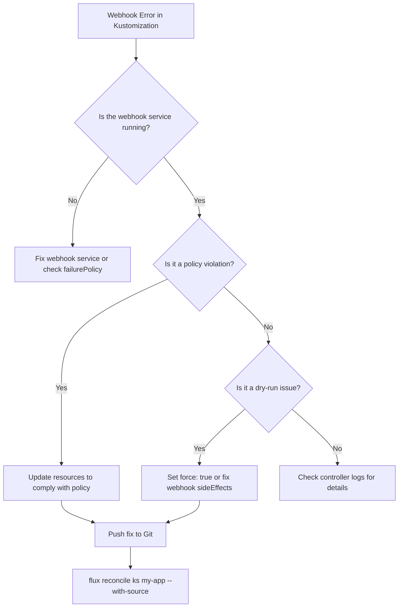

# How to Handle Kustomization Validation Webhook Errors in Flux

Author: [nawazdhandala](https://github.com/nawazdhandala)

Tags: Flux CD, GitOps, Kubernetes, Kustomize, Validation Webhook, Admission Controller, Troubleshooting

Description: Learn how to diagnose and resolve validation webhook errors that occur during Kustomization reconciliation in Flux CD.

---

## Introduction

Kubernetes admission webhooks intercept API requests and can accept, reject, or modify them before they are persisted. When Flux CD applies resources through a Kustomization, those resources pass through any configured validating or mutating admission webhooks. If a webhook rejects a resource, the Kustomization reconciliation fails with a webhook error.

This guide covers how to identify webhook errors, understand their causes, and implement solutions that work within a GitOps workflow.

## Prerequisites

- A Kubernetes cluster with Flux CD installed
- The `flux` CLI installed and configured
- kubectl access to the cluster

## Identifying Webhook Errors

Webhook errors appear in the Kustomization status with messages that reference admission webhooks.

```bash
# Check Kustomization status for webhook errors
flux get ks my-app
```

Typical webhook error output:

```
NAME    REVISION        SUSPENDED  READY  MESSAGE
my-app  main@sha1:abc   False      False  apply failed: Deployment/my-app dry-run failed: admission webhook "validate.example.com" denied the request: ...
```

Get the full error message:

```bash
# View the complete error in the Kustomization conditions
kubectl get kustomization my-app -n flux-system -o jsonpath='{.status.conditions[?(@.type=="Ready")].message}'
```

## Common Webhook Error Scenarios

### Scenario 1: Policy Engine Violations

Policy engines like Kyverno, OPA Gatekeeper, or Kubewarden enforce cluster policies. Violations result in rejected resources.

Example error:

```
admission webhook "validate.kyverno.svc-fail" denied the request:
resource Deployment/production/my-app was blocked due to the following policies:
  require-labels:
    check-labels: 'validation error: label "app.kubernetes.io/name" is required'
```

Resolution -- add the required labels in your kustomization overlays:

```yaml
# patches/add-labels.yaml - Patch to add required labels
apiVersion: apps/v1
kind: Deployment
metadata:
  name: my-app
  labels:
    # Add labels required by the Kyverno policy
    app.kubernetes.io/name: my-app
    app.kubernetes.io/part-of: my-system
spec:
  template:
    metadata:
      labels:
        app.kubernetes.io/name: my-app
        app.kubernetes.io/part-of: my-system
```

Reference the patch in your kustomization.yaml:

```yaml
# kustomization.yaml - Include the label patch
apiVersion: kustomize.config.k8s.io/v1beta1
kind: Kustomization
resources:
  - deployment.yaml
patches:
  - path: patches/add-labels.yaml
```

### Scenario 2: Resource Quota or Limit Validation

A webhook validates that resources have appropriate limits and requests set.

Example error:

```
admission webhook "validation.gatekeeper.sh" denied the request:
[container-must-have-limits] container "app" has no resource limits
```

Resolution -- add resource limits to your deployment:

```yaml
# deployment.yaml - Add resource limits to satisfy the policy
apiVersion: apps/v1
kind: Deployment
metadata:
  name: my-app
spec:
  template:
    spec:
      containers:
        - name: app
          image: my-app:latest
          resources:
            # Set resource limits as required by the policy
            limits:
              cpu: "500m"
              memory: "256Mi"
            requests:
              cpu: "100m"
              memory: "128Mi"
```

### Scenario 3: Webhook Service Unavailable

The webhook service itself is down or unreachable, causing all requests to fail.

Example error:

```
Internal error occurred: failed calling webhook "validate.example.com":
Post "https://webhook-service.namespace.svc:443/validate": dial tcp: connection refused
```

This is not a policy violation -- it is an infrastructure issue. Diagnose it:

```bash
# Check if the webhook service and pods are running
kubectl get pods -n <webhook-namespace>
kubectl get svc -n <webhook-namespace>

# Check webhook endpoint health
kubectl get endpoints <webhook-service> -n <webhook-namespace>
```

If the webhook is intentionally removed or temporarily unavailable, you can check the failure policy:

```bash
# View the webhook configuration and its failure policy
kubectl get validatingwebhookconfiguration <webhook-name> -o yaml
```

The `failurePolicy` field determines behavior when the webhook is unreachable:

- `Fail` (default): Reject the request -- this causes Flux apply errors
- `Ignore`: Allow the request -- Flux applies succeed even if the webhook is down

### Scenario 4: Dry-Run Incompatibility

Flux uses server-side dry-run before applying resources. Some webhooks do not support dry-run requests.

Example error:

```
Deployment/my-app dry-run failed: admission webhook "mutate.example.com" does not support dry run
```

Resolution -- configure the Kustomization to skip dry-run validation:

```yaml
# Kustomization that skips server-side apply dry-run for specific webhooks
apiVersion: kustomize.toolkit.fluxcd.io/v1
kind: Kustomization
metadata:
  name: my-app
  namespace: flux-system
spec:
  interval: 10m
  sourceRef:
    kind: GitRepository
    name: my-repo
  path: ./apps/my-app
  prune: true
  # Force apply without dry-run validation
  force: true
```

Alternatively, update the webhook to support dry-run by setting `sideEffects: None` or `sideEffects: NoneOnDryRun` in the webhook configuration.

## Debugging Workflow

Follow this workflow to systematically resolve webhook errors:



## Listing Active Webhooks

To understand which webhooks may affect your Kustomization, list all admission webhooks in the cluster:

```bash
# List all validating webhooks and their rules
kubectl get validatingwebhookconfigurations -o custom-columns=\
NAME:.metadata.name,\
WEBHOOKS:.webhooks[*].name,\
FAILURE-POLICY:.webhooks[*].failurePolicy
```

```bash
# List all mutating webhooks and their rules
kubectl get mutatingwebhookconfigurations -o custom-columns=\
NAME:.metadata.name,\
WEBHOOKS:.webhooks[*].name,\
FAILURE-POLICY:.webhooks[*].failurePolicy
```

## Excluding Flux Resources from Webhooks

If a webhook should not validate Flux-managed resources, you can configure namespace or label selectors on the webhook configuration to exclude them:

```yaml
# ValidatingWebhookConfiguration with namespace selector to exclude flux-system
apiVersion: admissionregistration.k8s.io/v1
kind: ValidatingWebhookConfiguration
metadata:
  name: my-policy-webhook
webhooks:
  - name: validate.example.com
    namespaceSelector:
      matchExpressions:
        # Exclude the flux-system namespace from this webhook
        - key: kubernetes.io/metadata.name
          operator: NotIn
          values:
            - flux-system
    failurePolicy: Fail
    sideEffects: None
    admissionReviewVersions: ["v1"]
    clientConfig:
      service:
        name: webhook-service
        namespace: webhook-system
        path: /validate
```

## Testing Webhook Compatibility Locally

Before pushing changes to Git, test whether your resources pass webhook validation:

```bash
# Build the Kustomization and apply with dry-run to test webhook validation
flux build ks my-app --path ./apps/my-app/ | kubectl apply --dry-run=server -f -
```

If this command succeeds, the resources will pass webhook validation during Flux reconciliation.

## Conclusion

Validation webhook errors in Flux Kustomizations are typically caused by policy violations, unavailable webhook services, or dry-run incompatibilities. The key to resolving them is identifying which webhook rejected the request and why. Update your manifests to comply with policies, ensure webhook services are healthy, and use `force: true` as a last resort for webhooks that do not support dry-run. Always test changes with `kubectl apply --dry-run=server` before committing to your GitOps repository.
