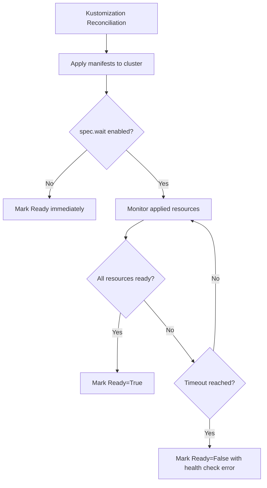

# How to Configure Kustomization Wait for Ready in Flux

Author: [nawazdhandala](https://github.com/nawazdhandala)

Tags: Flux CD, GitOps, Kubernetes, Kustomize, Health Checks, Wait, Readiness

Description: Learn how to configure Flux CD Kustomizations to wait for deployed resources to become ready before marking reconciliation as successful.

---

## Introduction

When Flux CD applies resources from a Kustomization, it can optionally wait for those resources to become ready before considering the reconciliation successful. This health checking mechanism ensures that your deployments are actually running and healthy, not just submitted to the Kubernetes API. Without it, Flux reports success as soon as manifests are applied, even if pods are crashing or services are unreachable.

This guide explains how to configure the wait-for-ready behavior, customize timeouts, and handle health check failures.

## Prerequisites

- A Kubernetes cluster with Flux CD installed
- The `flux` CLI installed and configured
- At least one Kustomization resource deployed in your cluster

## How Health Checking Works

When `spec.wait` is enabled on a Kustomization, the kustomize-controller monitors all applied resources until they reach a ready state or the timeout expires.



Flux knows how to check readiness for standard Kubernetes resource types:

- **Deployments**: All replicas available
- **StatefulSets**: All replicas ready
- **DaemonSets**: All desired pods scheduled and ready
- **Services**: Endpoints available
- **Pods**: Running and passing readiness probes
- **Jobs**: Completed successfully
- **Custom Resources**: Conditions with `type: Ready` and `status: "True"`

## Enabling Wait for Ready

To enable health checking, set `spec.wait` to `true` in your Kustomization:

```yaml
# Kustomization with wait-for-ready enabled
apiVersion: kustomize.toolkit.fluxcd.io/v1
kind: Kustomization
metadata:
  name: my-app
  namespace: flux-system
spec:
  interval: 10m
  sourceRef:
    kind: GitRepository
    name: my-repo
  path: ./apps/my-app
  prune: true
  # Enable waiting for all applied resources to become ready
  wait: true
  # Set the maximum time to wait for resources to become ready
  timeout: 5m
```

With this configuration, after applying manifests, Flux will monitor all Deployments, StatefulSets, and other resources until they are fully ready or the 5-minute timeout expires.

## Configuring the Timeout

The `spec.timeout` field controls how long Flux waits for resources to become ready. Choose a timeout that accounts for your application's startup time, including image pulls and initialization.

```yaml
# Kustomization with a longer timeout for slow-starting applications
apiVersion: kustomize.toolkit.fluxcd.io/v1
kind: Kustomization
metadata:
  name: heavy-app
  namespace: flux-system
spec:
  interval: 10m
  sourceRef:
    kind: GitRepository
    name: my-repo
  path: ./apps/heavy-app
  prune: true
  wait: true
  # Allow 10 minutes for large applications to start
  timeout: 10m
```

If no timeout is specified, the default is 5 minutes (`5m`). The timeout applies to the entire reconciliation process, including the apply phase and the health check phase.

## Using healthChecks for Selective Monitoring

Instead of waiting for all resources (using `spec.wait`), you can specify individual resources to monitor using `spec.healthChecks`. This is useful when you only care about specific resources being healthy.

```yaml
# Kustomization with selective health checks
apiVersion: kustomize.toolkit.fluxcd.io/v1
kind: Kustomization
metadata:
  name: my-app
  namespace: flux-system
spec:
  interval: 10m
  sourceRef:
    kind: GitRepository
    name: my-repo
  path: ./apps/my-app
  prune: true
  timeout: 5m
  # Monitor specific resources instead of all applied resources
  healthChecks:
    - apiVersion: apps/v1
      kind: Deployment
      name: my-app-web
      namespace: production
    - apiVersion: apps/v1
      kind: Deployment
      name: my-app-worker
      namespace: production
    - apiVersion: apps/v1
      kind: StatefulSet
      name: my-app-cache
      namespace: production
```

When `spec.healthChecks` is used, only the listed resources are monitored. Other resources are applied but not checked for readiness.

## Combining wait and healthChecks

Note that `spec.wait` and `spec.healthChecks` serve different purposes:

- **`spec.wait: true`**: Waits for ALL applied resources to become ready
- **`spec.healthChecks`**: Waits for only the listed resources to become ready

If both are specified, `spec.wait` takes precedence and all resources are monitored.

## Practical Example: Multi-Tier Application

Here is a complete example for a multi-tier application with dependencies:

```yaml
# Database tier - deployed first with health check
apiVersion: kustomize.toolkit.fluxcd.io/v1
kind: Kustomization
metadata:
  name: my-app-database
  namespace: flux-system
spec:
  interval: 10m
  sourceRef:
    kind: GitRepository
    name: my-repo
  path: ./apps/my-app/database
  prune: true
  # Wait for the database to be fully ready before downstream apps start
  wait: true
  timeout: 5m
---
# Application tier - depends on database being ready
apiVersion: kustomize.toolkit.fluxcd.io/v1
kind: Kustomization
metadata:
  name: my-app-backend
  namespace: flux-system
spec:
  interval: 10m
  # Only reconcile after database is ready
  dependsOn:
    - name: my-app-database
  sourceRef:
    kind: GitRepository
    name: my-repo
  path: ./apps/my-app/backend
  prune: true
  wait: true
  timeout: 5m
---
# Frontend tier - depends on backend being ready
apiVersion: kustomize.toolkit.fluxcd.io/v1
kind: Kustomization
metadata:
  name: my-app-frontend
  namespace: flux-system
spec:
  interval: 10m
  dependsOn:
    - name: my-app-backend
  sourceRef:
    kind: GitRepository
    name: my-repo
  path: ./apps/my-app/frontend
  prune: true
  wait: true
  timeout: 3m
```

In this setup, Flux ensures each tier is healthy before deploying the next one. If the database fails its health check, the backend and frontend Kustomizations will not be reconciled.

## Monitoring Health Check Status

Check the health status of a Kustomization:

```bash
# View the Kustomization status including health check results
flux get ks my-app
```

When a health check is in progress:

```text
NAME    REVISION        SUSPENDED  READY    MESSAGE
my-app  main@sha1:abc   False      Unknown  Running health checks for revision main@sha1:abc with a timeout of 5m0s
```

When a health check fails:

```text
NAME    REVISION        SUSPENDED  READY  MESSAGE
my-app  main@sha1:abc   False      False  Health check failed after 5m0s timeout: Deployment/production/my-app: 1/3 ready replicas
```

For more detail on what is failing:

```bash
# View events related to health check failures
flux events --for Kustomization/my-app

# Check the actual pod status for the failing deployment
kubectl get pods -l app=my-app -n production
kubectl describe deployment my-app -n production
```

## Troubleshooting Health Check Failures

### Timeout Too Short

If your application legitimately needs more time to start:

```bash
# Check how long the application actually takes to become ready
kubectl get events -n production --sort-by='.lastTimestamp' | grep my-app
```

Increase the timeout accordingly in the Kustomization spec.

### Image Pull Issues

Images that take too long to pull can cause health check timeouts:

```bash
# Check for image pull errors
kubectl get events -n production --field-selector reason=Failed | grep -i "pull"
```

### Readiness Probe Misconfiguration

If the application is running but not passing readiness probes:

```bash
# Check the readiness probe configuration
kubectl get deployment my-app -n production -o jsonpath='{.spec.template.spec.containers[0].readinessProbe}' | jq .

# Check pod conditions for readiness details
kubectl get pods -l app=my-app -n production -o jsonpath='{.items[0].status.conditions}' | jq .
```

### Disabling Wait Temporarily

If health checks are blocking a critical fix, you can temporarily disable waiting:

```bash
# Suspend the Kustomization
flux suspend ks my-app

# Apply the fix manually
kubectl apply -f fix.yaml

# Resume with the fix in place
flux resume ks my-app
```

## Conclusion

Configuring wait-for-ready on Flux Kustomizations is essential for reliable GitOps deployments. Use `spec.wait: true` to monitor all applied resources, or `spec.healthChecks` to selectively monitor critical components. Set appropriate timeouts based on your application's startup characteristics, and combine health checks with `dependsOn` to create ordered deployment pipelines that ensure each tier is healthy before proceeding to the next.
