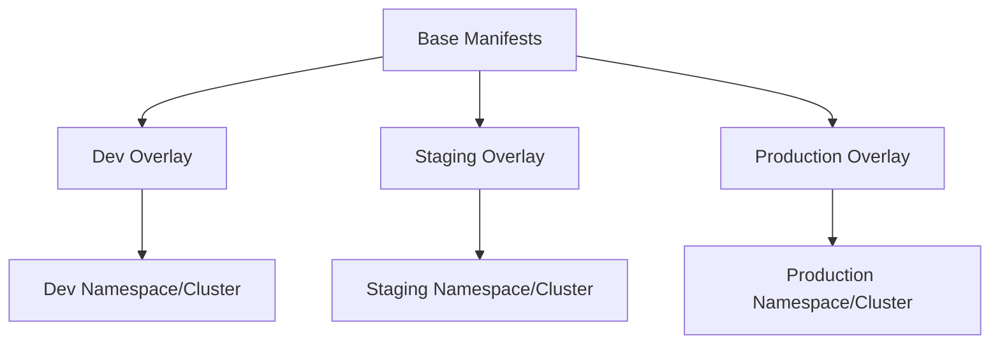

# How to Use Kustomize Overlays with Flux for Multi-Environment Deployments

Author: [nawazdhandala](https://github.com/nawazdhandala)

Tags: Flux CD, GitOps, Kubernetes, Kustomize, Overlay, Multi-Environment

Description: Learn how to use Kustomize overlays with Flux CD to deploy the same application across development, staging, and production environments with environment-specific configuration.

---

## Introduction

Most organizations deploy applications to multiple environments -- development, staging, and production -- each with different configurations, scaling requirements, and access controls. Kustomize overlays let you define a shared base configuration and then layer environment-specific customizations on top.

When combined with Flux CD, overlays enable a GitOps workflow where each environment has its own directory in the repository, its own Flux Kustomization resource, and its own reconciliation lifecycle. This guide walks through setting up a complete multi-environment deployment using Kustomize overlays and Flux.

## Architecture Overview

The core idea is straightforward: one base, multiple overlays.



The base contains the Kubernetes manifests that are common to all environments. Each overlay adds, modifies, or removes configuration specific to its environment.

## Repository Structure

```text
apps/
  webapp/
    base/
      deployment.yaml
      service.yaml
      configmap.yaml
      hpa.yaml
      kustomization.yaml
    overlays/
      dev/
        kustomization.yaml
        config-patch.yaml
      staging/
        kustomization.yaml
        config-patch.yaml
      production/
        kustomization.yaml
        config-patch.yaml
        pdb.yaml
clusters/
  my-cluster/
    webapp-dev.yaml
    webapp-staging.yaml
    webapp-production.yaml
```

## Step 1: Define the Base

The base includes all resources shared across environments.

```yaml
# apps/webapp/base/deployment.yaml
apiVersion: apps/v1
kind: Deployment
metadata:
  name: webapp
spec:
  replicas: 1
  selector:
    matchLabels:
      app: webapp
  template:
    metadata:
      labels:
        app: webapp
    spec:
      containers:
        - name: webapp
          image: myorg/webapp:1.0.0
          ports:
            - containerPort: 8080
          envFrom:
            - configMapRef:
                name: webapp-config
          resources:
            requests:
              cpu: 100m
              memory: 128Mi
            limits:
              cpu: 500m
              memory: 512Mi
```

```yaml
# apps/webapp/base/service.yaml
apiVersion: v1
kind: Service
metadata:
  name: webapp
spec:
  selector:
    app: webapp
  ports:
    - port: 80
      targetPort: 8080
```

```yaml
# apps/webapp/base/configmap.yaml
apiVersion: v1
kind: ConfigMap
metadata:
  name: webapp-config
data:
  LOG_LEVEL: "info"
  DB_POOL_SIZE: "5"
  CACHE_TTL: "300"
```

```yaml
# apps/webapp/base/hpa.yaml
apiVersion: autoscaling/v2
kind: HorizontalPodAutoscaler
metadata:
  name: webapp
spec:
  scaleTargetRef:
    apiVersion: apps/v1
    kind: Deployment
    name: webapp
  minReplicas: 1
  maxReplicas: 5
  metrics:
    - type: Resource
      resource:
        name: cpu
        target:
          type: Utilization
          averageUtilization: 70
```

```yaml
# apps/webapp/base/kustomization.yaml
apiVersion: kustomize.config.k8s.io/v1beta1
kind: Kustomization
resources:
  - deployment.yaml
  - service.yaml
  - configmap.yaml
  - hpa.yaml
```

## Step 2: Create the Dev Overlay

The dev overlay uses minimal resources, enables debug logging, and skips the HPA.

```yaml
# apps/webapp/overlays/dev/kustomization.yaml
apiVersion: kustomize.config.k8s.io/v1beta1
kind: Kustomization

resources:
  - ../../base

# Identify this as the dev environment
commonLabels:
  environment: dev

# Override replica count
replicas:
  - name: webapp
    count: 1

# Use a dev image tag
images:
  - name: myorg/webapp
    newTag: "dev-latest"

# Apply configuration patches
patches:
  - path: config-patch.yaml

# Remove the HPA in dev (not needed with 1 replica)
patches:
  - target:
      kind: HorizontalPodAutoscaler
      name: webapp
    patch: |
      $patch: delete
      apiVersion: autoscaling/v2
      kind: HorizontalPodAutoscaler
      metadata:
        name: webapp
```

```yaml
# apps/webapp/overlays/dev/config-patch.yaml
apiVersion: v1
kind: ConfigMap
metadata:
  name: webapp-config
data:
  # Override config values for dev
  LOG_LEVEL: "debug"
  DB_POOL_SIZE: "2"
  CACHE_TTL: "60"
```

## Step 3: Create the Staging Overlay

Staging mirrors production more closely but with fewer resources.

```yaml
# apps/webapp/overlays/staging/kustomization.yaml
apiVersion: kustomize.config.k8s.io/v1beta1
kind: Kustomization

resources:
  - ../../base

commonLabels:
  environment: staging

replicas:
  - name: webapp
    count: 2

images:
  - name: myorg/webapp
    newTag: "v1.2.0-rc1"

# Patch the HPA for staging scale limits
patches:
  - path: config-patch.yaml
  - patch: |
      apiVersion: autoscaling/v2
      kind: HorizontalPodAutoscaler
      metadata:
        name: webapp
      spec:
        minReplicas: 2
        maxReplicas: 5
```

```yaml
# apps/webapp/overlays/staging/config-patch.yaml
apiVersion: v1
kind: ConfigMap
metadata:
  name: webapp-config
data:
  LOG_LEVEL: "info"
  DB_POOL_SIZE: "5"
  CACHE_TTL: "300"
```

## Step 4: Create the Production Overlay

Production adds a PodDisruptionBudget, scales resources up, and pins the image to a specific version.

```yaml
# apps/webapp/overlays/production/kustomization.yaml
apiVersion: kustomize.config.k8s.io/v1beta1
kind: Kustomization

resources:
  - ../../base
  # Add production-only resources
  - pdb.yaml

commonLabels:
  environment: production

replicas:
  - name: webapp
    count: 5

images:
  - name: myorg/webapp
    newTag: "v1.1.0"

patches:
  - path: config-patch.yaml
  - patch: |
      apiVersion: autoscaling/v2
      kind: HorizontalPodAutoscaler
      metadata:
        name: webapp
      spec:
        minReplicas: 5
        maxReplicas: 20
  # Increase resource limits for production
  - patch: |
      apiVersion: apps/v1
      kind: Deployment
      metadata:
        name: webapp
      spec:
        template:
          spec:
            containers:
              - name: webapp
                resources:
                  requests:
                    cpu: 500m
                    memory: 512Mi
                  limits:
                    cpu: "2"
                    memory: 2Gi
```

```yaml
# apps/webapp/overlays/production/config-patch.yaml
apiVersion: v1
kind: ConfigMap
metadata:
  name: webapp-config
data:
  LOG_LEVEL: "warn"
  DB_POOL_SIZE: "20"
  CACHE_TTL: "600"
```

```yaml
# apps/webapp/overlays/production/pdb.yaml
apiVersion: policy/v1
kind: PodDisruptionBudget
metadata:
  name: webapp
spec:
  minAvailable: "50%"
  selector:
    matchLabels:
      app: webapp
```

## Step 5: Configure Flux Kustomization Resources

Create one Flux Kustomization per environment.

```yaml
# clusters/my-cluster/webapp-dev.yaml
apiVersion: kustomize.toolkit.fluxcd.io/v1
kind: Kustomization
metadata:
  name: webapp-dev
  namespace: flux-system
spec:
  interval: 5m
  path: ./apps/webapp/overlays/dev
  prune: true
  sourceRef:
    kind: GitRepository
    name: flux-system
  targetNamespace: dev
```

```yaml
# clusters/my-cluster/webapp-staging.yaml
apiVersion: kustomize.toolkit.fluxcd.io/v1
kind: Kustomization
metadata:
  name: webapp-staging
  namespace: flux-system
spec:
  interval: 10m
  path: ./apps/webapp/overlays/staging
  prune: true
  sourceRef:
    kind: GitRepository
    name: flux-system
  targetNamespace: staging
```

```yaml
# clusters/my-cluster/webapp-production.yaml
apiVersion: kustomize.toolkit.fluxcd.io/v1
kind: Kustomization
metadata:
  name: webapp-production
  namespace: flux-system
spec:
  interval: 10m
  path: ./apps/webapp/overlays/production
  prune: true
  sourceRef:
    kind: GitRepository
    name: flux-system
  targetNamespace: production
  # Require manual approval for production changes
  healthChecks:
    - apiVersion: apps/v1
      kind: Deployment
      name: webapp
      namespace: production
```

## Step 6: Verify and Reconcile

```bash
# Build each overlay locally to verify
kustomize build apps/webapp/overlays/dev
kustomize build apps/webapp/overlays/staging
kustomize build apps/webapp/overlays/production

# After pushing to Git, reconcile all environments
flux reconcile kustomization webapp-dev --with-source
flux reconcile kustomization webapp-staging --with-source
flux reconcile kustomization webapp-production --with-source

# Check status across environments
flux get kustomizations | grep webapp
```

## Promotion Workflow

A typical promotion workflow with overlays looks like this:

1. Merge a new feature to the main branch
2. Update the dev overlay image tag (or let image automation do it)
3. Test in dev
4. Update the staging overlay image tag to the release candidate
5. Test in staging
6. Update the production overlay image tag to the verified release

Each step is a Git commit, providing a full audit trail.

## Conclusion

Kustomize overlays combined with Flux CD provide a clean, maintainable approach to multi-environment deployments. The base directory holds shared configuration, while overlays customize each environment's replicas, images, resource limits, and additional resources. Flux Kustomization resources point each environment to its overlay directory, giving you independent reconciliation cycles and a clear Git-based promotion path.
