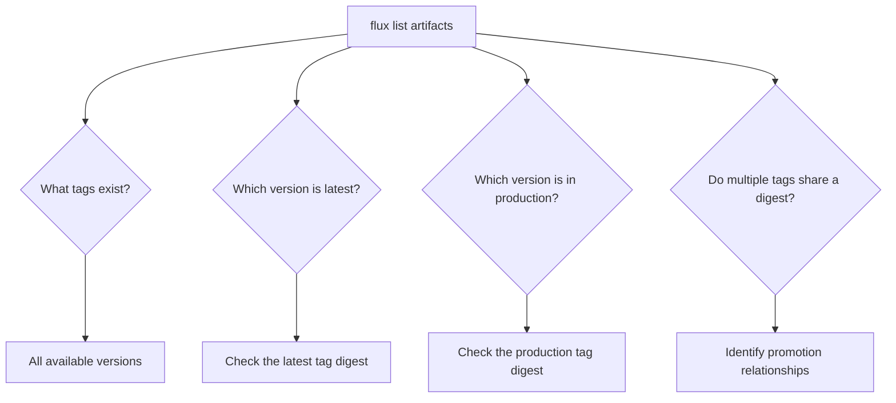

# How to List OCI Artifacts with Flux CLI

Author: [nawazdhandala](https://github.com/nawazdhandala)

Tags: Flux CD, GitOps, Kubernetes, OCI, Flux CLI, Container Registry, Artifact Management

Description: Learn how to use the Flux CLI to list OCI artifacts in container registries to inspect tags, digests, and manage artifact versions.

---

## Introduction

The Flux CLI provides the `flux list artifacts` command to query OCI-compliant container registries and display all tags and digests for a given artifact repository. This command is essential for verifying pushes, auditing artifact versions, debugging deployment issues, and planning promotions.

This guide covers how to list artifacts across different registries, interpret the output, and integrate listing into your operational workflows.

## Prerequisites

Before you begin, ensure you have:

- The `flux` CLI installed (v0.35 or later)
- Access to an OCI-compliant container registry containing artifacts
- Registry credentials configured via `docker login`

Verify your Flux CLI version.

```bash
# Check the installed Flux CLI version
flux version --client
```

## Authenticating with the Registry

The `flux list artifacts` command requires read access to the registry. Authenticate before listing.

```bash
# Log in to GitHub Container Registry
echo $GITHUB_TOKEN | docker login ghcr.io -u $GITHUB_USER --password-stdin

# Log in to Docker Hub
echo $DOCKER_TOKEN | docker login -u $DOCKER_USER --password-stdin

# Log in to AWS ECR
aws ecr get-login-password --region us-east-1 | docker login --username AWS --password-stdin 123456789.dkr.ecr.us-east-1.amazonaws.com
```

## Listing Artifacts in a Repository

Use `flux list artifacts` with the OCI URL of your repository to see all available tags and digests.

```bash
# List all artifacts in the repository
flux list artifacts oci://ghcr.io/my-org/my-app-manifests
```

The output displays a table with the artifact tag and its corresponding digest.

```bash
# Example output
# ARTIFACT                                          DIGEST
# ghcr.io/my-org/my-app-manifests:1.0.0             sha256:abc123...
# ghcr.io/my-org/my-app-manifests:1.1.0             sha256:def456...
# ghcr.io/my-org/my-app-manifests:1.2.0             sha256:ghi789...
# ghcr.io/my-org/my-app-manifests:latest            sha256:ghi789...
# ghcr.io/my-org/my-app-manifests:staging           sha256:ghi789...
# ghcr.io/my-org/my-app-manifests:production        sha256:def456...
```

Notice how `latest` and `staging` share the same digest as `1.2.0`, confirming they point to the same artifact content. Meanwhile, `production` points to `1.1.0`.

## Understanding the Output

The listing output helps you answer several important questions.



Key observations from the output:

- **Same digest across tags**: Multiple tags pointing to the same digest means those tags reference identical content. This confirms successful promotions.
- **Tag ordering**: Tags are listed alphabetically, not chronologically. Use semantic versioning to determine the newest version.
- **Digest prefix**: The SHA256 digest is truncated in the output. Use the full digest when referencing artifacts in scripts.

## Listing Artifacts Across Different Registries

The command works with any OCI-compliant registry. Here are examples for common registries.

```bash
# List artifacts in GitHub Container Registry
flux list artifacts oci://ghcr.io/my-org/my-app-manifests

# List artifacts in Docker Hub
flux list artifacts oci://docker.io/my-org/my-app-manifests

# List artifacts in AWS ECR
flux list artifacts oci://123456789.dkr.ecr.us-east-1.amazonaws.com/my-app-manifests

# List artifacts in Azure ACR
flux list artifacts oci://myregistry.azurecr.io/my-app-manifests

# List artifacts in Google Artifact Registry
flux list artifacts oci://us-central1-docker.pkg.dev/my-project/my-repo/my-app-manifests
```

## Verifying a Push

After pushing an artifact, use `flux list artifacts` to confirm it was stored correctly.

```bash
# Push the artifact
flux push artifact oci://ghcr.io/my-org/my-app-manifests:2.0.0 \
  --path=./deploy \
  --source="$(git config --get remote.origin.url)" \
  --revision="main/$(git rev-parse HEAD)"

# Verify the push by listing artifacts
flux list artifacts oci://ghcr.io/my-org/my-app-manifests
```

Check that the new tag `2.0.0` appears in the output with its digest.

## Verifying a Tag Operation

Similarly, after tagging an artifact, verify that the new tag points to the expected digest.

```bash
# Tag the artifact
flux tag artifact oci://ghcr.io/my-org/my-app-manifests:2.0.0 \
  --tag=staging

# Verify the tag by listing artifacts
flux list artifacts oci://ghcr.io/my-org/my-app-manifests
```

Confirm that the `staging` tag now has the same digest as `2.0.0`.

## Using List in Scripts

You can parse the output of `flux list artifacts` in shell scripts for automation.

```bash
# Count the number of artifact versions in the repository
flux list artifacts oci://ghcr.io/my-org/my-app-manifests | tail -n +2 | wc -l

# Get the digest for a specific tag
flux list artifacts oci://ghcr.io/my-org/my-app-manifests | grep ":1.0.0" | awk '{print $2}'

# Check if a specific tag exists in the repository
if flux list artifacts oci://ghcr.io/my-org/my-app-manifests | grep -q ":production"; then
  echo "Production tag exists"
else
  echo "No production tag found"
fi
```

## Using List in CI/CD Pipelines

Integrate artifact listing into CI/CD pipelines for validation and reporting.

```yaml
# .github/workflows/audit-artifacts.yaml
name: Audit OCI Artifacts
on:
  schedule:
    # Run daily at midnight
    - cron: '0 0 * * *'

jobs:
  audit:
    runs-on: ubuntu-latest
    permissions:
      packages: read
    steps:
      # Install Flux CLI
      - name: Setup Flux CLI
        uses: fluxcd/flux2/action@main

      # Authenticate with GHCR
      - name: Login to GHCR
        uses: docker/login-action@v3
        with:
          registry: ghcr.io
          username: ${{ github.actor }}
          password: ${{ secrets.GITHUB_TOKEN }}

      # List and save the artifact inventory
      - name: List artifacts
        run: |
          echo "## Artifact Inventory" >> $GITHUB_STEP_SUMMARY
          echo '```' >> $GITHUB_STEP_SUMMARY
          flux list artifacts oci://ghcr.io/${{ github.repository }}/manifests >> $GITHUB_STEP_SUMMARY
          echo '```' >> $GITHUB_STEP_SUMMARY
```

## Troubleshooting

**No artifacts found**: Verify the repository URL is correct and that artifacts have been pushed. The URL must match the exact path used during `flux push artifact`.

**Authentication errors**: Ensure your Docker credentials are valid and have read access to the repository.

```bash
# Test registry connectivity
docker pull ghcr.io/my-org/my-app-manifests:latest
```

**Timeout errors**: Large repositories with many tags may take longer to list. Check your network connectivity and registry health.

**Empty output**: If the command returns headers but no rows, the repository exists but contains no tagged artifacts. Push an artifact first.

```bash
# Push an initial artifact if the repository is empty
flux push artifact oci://ghcr.io/my-org/my-app-manifests:0.1.0 \
  --path=./deploy \
  --source="local" \
  --revision="initial"
```

## Summary

The `flux list artifacts` command is your primary tool for inspecting OCI artifact repositories used with Flux CD. Key takeaways:

- Use `flux list artifacts` to view all tags and digests in a repository
- Identify promotion relationships by comparing digests across environment tags
- Verify push and tag operations by checking the listing output
- Parse the output in scripts for automation and auditing
- Works with any OCI-compliant registry including GHCR, Docker Hub, ECR, ACR, and Google Artifact Registry

Regular use of `flux list artifacts` gives you visibility into your artifact inventory and helps maintain confidence in your GitOps deployment pipeline.
