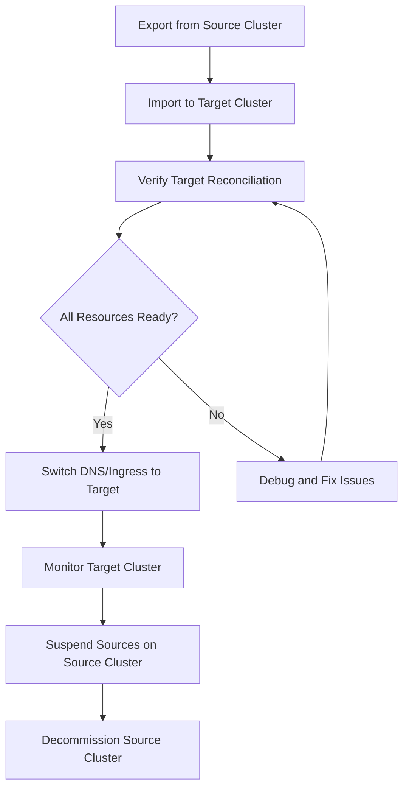

# How to Migrate GitRepository Between Flux Installations

Author: [nawazdhandala](https://github.com/nawazdhandala)

Tags: Flux CD, GitOps, Kubernetes, Migration, Cluster Migration, Disaster Recovery

Description: Learn how to migrate Flux CD GitRepository resources and their dependencies between different Flux installations or Kubernetes clusters.

---

Migrating Flux CD GitRepository resources between clusters or Flux installations is a common task during cluster upgrades, infrastructure moves, or consolidation of multiple environments. This guide provides a structured approach to exporting resources from a source cluster, preparing them for the target environment, and restoring them with minimal downtime.

## When Migration Is Needed

Common scenarios that require migrating GitRepository resources:

- Moving workloads from one Kubernetes cluster to another
- Upgrading from Flux v1 to Flux v2 (different CRD versions)
- Consolidating multiple clusters into a single management cluster
- Recreating a cluster after a disaster
- Splitting a single cluster into multiple clusters

## Step 1: Inventory Your Source Cluster

Before migrating, document all GitRepository resources and their dependencies on the source cluster.

List all GitRepository resources and their referenced secrets:

```bash
# List all GitRepository resources with their status
flux get sources git --all-namespaces

# Get detailed information including secret references
kubectl get gitrepository -A -o jsonpath='{range .items[*]}{"Name: "}{.metadata.name}{" Namespace: "}{.metadata.namespace}{" Secret: "}{.spec.secretRef.name}{" URL: "}{.spec.url}{"\n"}{end}'

# List Kustomizations that depend on GitRepository sources
kubectl get kustomization -A -o jsonpath='{range .items[*]}{"Kustomization: "}{.metadata.name}{" Source: "}{.spec.sourceRef.name}{"\n"}{end}'
```

## Step 2: Export GitRepository Resources

Use the Flux CLI to export clean, reapplicable manifests from the source cluster.

Export all GitRepository resources:

```bash
# Export all Git sources
flux export source git --all > migration/git-sources.yaml

# Export related Kustomizations
flux export kustomization --all > migration/kustomizations.yaml

# Export HelmReleases that may reference these sources
flux export helmrelease --all > migration/helmreleases.yaml

# Export notification resources
flux export alert --all > migration/alerts.yaml
flux export alert-provider --all > migration/alert-providers.yaml
flux export receiver --all > migration/receivers.yaml
```

Verify the exported files contain valid YAML:

```bash
# Check each file
for f in migration/*.yaml; do
  echo "Validating $f..."
  kubectl apply --dry-run=client -f "$f" 2>&1 | head -5
done
```

## Step 3: Export Authentication Secrets

Secrets are not included in `flux export` output. Export them separately.

Export all secrets referenced by GitRepository resources:

```bash
#!/bin/bash
# export-flux-secrets.sh

NAMESPACE="flux-system"
OUTPUT_DIR="migration/secrets"
mkdir -p "$OUTPUT_DIR"

# Get unique secret names from GitRepository resources
SECRETS=$(kubectl get gitrepository -n "$NAMESPACE" \
  -o jsonpath='{range .items[*]}{.spec.secretRef.name}{"\n"}{end}' \
  | sort -u | grep -v '^$')

for SECRET_NAME in $SECRETS; do
  echo "Exporting secret: $SECRET_NAME"
  # Export the secret, removing cluster-specific metadata
  kubectl get secret "$SECRET_NAME" -n "$NAMESPACE" -o yaml \
    | kubectl neat \
    > "$OUTPUT_DIR/$SECRET_NAME.yaml"
done

echo "Exported $(echo "$SECRETS" | wc -l) secrets to $OUTPUT_DIR/"
```

If you do not have `kubectl neat` installed, manually strip the metadata:

```bash
# Export and clean up metadata manually
kubectl get secret my-secret -n flux-system -o yaml \
  | grep -v "resourceVersion\|uid\|creationTimestamp\|selfLink\|managedFields" \
  > migration/secrets/my-secret.yaml
```

## Step 4: Prepare the Target Cluster

Install Flux on the target cluster and verify the CRDs are in place before applying migrated resources.

Set up Flux on the target cluster:

```bash
# Switch to the target cluster context
kubectl config use-context target-cluster

# Install Flux with the same version as the source cluster
flux install

# Verify Flux components are running
flux check

# Verify GitRepository CRD is available
kubectl get crd gitrepositories.source.toolkit.fluxcd.io
```

## Step 5: Modify Resources for the Target Environment

Some resources may need adjustments for the target cluster, such as namespace changes, URL updates, or different secret names.

Example modifications you might need:

```yaml
# If the target cluster uses a different namespace
apiVersion: source.toolkit.fluxcd.io/v1
kind: GitRepository
metadata:
  name: my-app
  # Change namespace if needed
  namespace: flux-system
spec:
  interval: 5m
  url: https://github.com/your-org/my-app.git
  ref:
    # Possibly point to a different branch for the new environment
    branch: main
  secretRef:
    name: my-app-credentials
```

Use sed or a script to batch-modify if needed:

```bash
# Example: Change all branch references from 'production' to 'staging'
sed -i 's/branch: production/branch: staging/g' migration/git-sources.yaml

# Example: Update URLs if the Git server has changed
sed -i 's|old-git-server.com|new-git-server.com|g' migration/git-sources.yaml
```

## Step 6: Apply Resources to the Target Cluster

Apply the resources in the correct order: secrets first, then sources, then consumers.

Restore resources in dependency order:

```bash
# Step 1: Apply secrets (must exist before GitRepository references them)
for f in migration/secrets/*.yaml; do
  echo "Applying secret: $f"
  kubectl apply -f "$f"
done

# Step 2: Apply GitRepository resources
kubectl apply -f migration/git-sources.yaml

# Step 3: Wait for sources to reconcile
echo "Waiting for Git sources to reconcile..."
sleep 10
flux get sources git

# Step 4: Apply Kustomizations (depend on GitRepository being ready)
kubectl apply -f migration/kustomizations.yaml

# Step 5: Apply HelmReleases
kubectl apply -f migration/helmreleases.yaml

# Step 6: Apply notification resources
kubectl apply -f migration/alerts.yaml
kubectl apply -f migration/alert-providers.yaml
kubectl apply -f migration/receivers.yaml
```

## Step 7: Verify the Migration

After applying all resources, verify that everything is reconciling correctly on the target cluster.

Run verification checks:

```bash
# Check all Git sources are ready
flux get sources git

# Check all Kustomizations are applied
flux get kustomizations

# Check for any failed reconciliations
flux get all | grep -i false

# Compare resource counts between source and target
echo "Source cluster Git sources: $(kubectl --context=source-cluster get gitrepository -A --no-headers | wc -l)"
echo "Target cluster Git sources: $(kubectl --context=target-cluster get gitrepository -A --no-headers | wc -l)"
```

Check for specific errors on any failing resources:

```bash
# Get events for troubleshooting
kubectl get events -n flux-system --sort-by='.lastTimestamp' | tail -20

# Check source-controller logs
kubectl logs -n flux-system deployment/source-controller --tail=50
```

## Step 8: Handle the Cutover

If both clusters will run simultaneously during migration, coordinate the cutover to avoid conflicts.

A safe cutover process:



Suspend reconciliation on the source cluster once the target is verified:

```bash
# Switch to source cluster
kubectl config use-context source-cluster

# Suspend all GitRepository reconciliation on the source
flux suspend source git --all

# Suspend all Kustomizations
flux suspend kustomization --all
```

## Handling Version Differences

If migrating between different Flux versions, check for API version changes.

Check API version compatibility:

```bash
# On source cluster: check the API version in use
kubectl get gitrepository -n flux-system -o jsonpath='{.items[0].apiVersion}'

# Compare with target cluster CRD
kubectl get crd gitrepositories.source.toolkit.fluxcd.io -o jsonpath='{.spec.versions[*].name}'
```

If the source uses `source.toolkit.fluxcd.io/v1beta2` and the target expects `v1`, update the apiVersion in your exported manifests:

```bash
sed -i 's|source.toolkit.fluxcd.io/v1beta2|source.toolkit.fluxcd.io/v1|g' migration/git-sources.yaml
```

## Troubleshooting

**Secrets not found:** Ensure all referenced secrets are applied before the GitRepository resources. Check with `kubectl get secret -n flux-system`.

**CRD version mismatch:** If you see `no matches for kind "GitRepository"`, the Flux CRDs may not be installed. Run `flux install` or check the CRD versions.

**Source reconciliation fails:** Check network connectivity from the target cluster to the Git server. The target cluster may have different firewall rules or DNS configuration.

**Webhook receivers broken:** Webhook URLs change between clusters. Update your Git provider webhook configuration to point to the new cluster's receiver URL.

## Summary

Migrating GitRepository resources between Flux installations follows a structured process: inventory and export from the source using `flux export source git --all`, separately back up authentication secrets, prepare the target cluster with a fresh Flux installation, apply resources in dependency order (secrets then sources then consumers), and verify reconciliation. The Flux CLI's export command produces clean manifests ready for reapplication, making the migration process predictable and repeatable.
