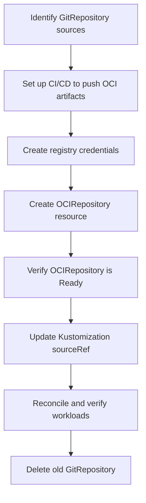

# How to Migrate from GitRepository to OCIRepository in Flux

Author: [nawazdhandala](https://github.com/nawazdhandala)

Tags: Flux CD, GitOps, Kubernetes, OCI, Migration, GitRepository

Description: Learn how to migrate your Flux CD sources from GitRepository to OCIRepository for faster reconciliation and better artifact management.

---

## Introduction

Flux CD originally relied on GitRepository as the primary source for Kubernetes manifests. With the introduction of OCIRepository, you can now store and distribute manifests as OCI artifacts in container registries. Migrating from GitRepository to OCIRepository offers several benefits: faster reconciliation (no Git clone overhead), decoupled CI/CD pipelines, and better artifact immutability.

This guide provides a step-by-step migration path from GitRepository to OCIRepository with minimal disruption to your running workloads.

## Prerequisites

- Flux CD v2.1.0 or later installed on your cluster
- Flux CLI installed locally
- An OCI-compatible container registry
- Existing GitRepository-based Flux setup
- A CI/CD pipeline to build and push OCI artifacts

## Understanding the Differences

Before migrating, understand the key differences between the two source types.

| Feature | GitRepository | OCIRepository |
|---------|--------------|---------------|
| Source | Git repository | OCI container registry |
| Authentication | SSH keys, HTTPS tokens | Registry credentials |
| Reconciliation speed | Slower (full/partial clone) | Faster (artifact pull) |
| Versioning | Branches, tags, commits | Tags, digests |
| CI/CD coupling | Direct (reads from Git) | Decoupled (reads from registry) |
| API version | source.toolkit.fluxcd.io/v1 | source.toolkit.fluxcd.io/v1beta2 |

## Step 1: Identify Your Current GitRepository Sources

Start by listing all GitRepository sources and the Kustomizations that reference them.

```bash
# List all GitRepository sources
flux get sources git -A

# List all Kustomizations and their source references
flux get kustomizations -A
```

## Step 2: Set Up Your CI/CD Pipeline to Push OCI Artifacts

Before switching the source, you need a pipeline that pushes your manifests as OCI artifacts. Here is a GitHub Actions example.

```yaml
# .github/workflows/push-manifests.yaml
name: Push Manifests as OCI Artifact
on:
  push:
    branches: [main]
    paths: ['manifests/**']

permissions:
  packages: write

jobs:
  push:
    runs-on: ubuntu-latest
    steps:
      - uses: actions/checkout@v4
      - uses: fluxcd/flux2/action@main

      - name: Login to registry
        run: |
          echo "${{ secrets.GITHUB_TOKEN }}" | flux oci login ghcr.io \
            --username flux --password-stdin

      - name: Push artifact
        run: |
          flux push artifact \
            oci://ghcr.io/${{ github.repository }}/manifests:$(git rev-parse --short HEAD) \
            --path ./manifests \
            --source="$(git config --get remote.origin.url)" \
            --revision="main/$(git rev-parse HEAD)"
          flux tag artifact \
            oci://ghcr.io/${{ github.repository }}/manifests:$(git rev-parse --short HEAD) \
            --tag latest
```

Run this pipeline at least once so an artifact exists in the registry before proceeding.

## Step 3: Create Registry Credentials

Create a secret for Flux to authenticate with the OCI registry.

```bash
# Create registry credentials for Flux
kubectl create secret docker-registry oci-registry-creds \
  --namespace flux-system \
  --docker-server=ghcr.io \
  --docker-username=flux \
  --docker-password="${GITHUB_TOKEN}"
```

## Step 4: Create the OCIRepository Resource

Create a new OCIRepository that mirrors what your GitRepository was providing.

Here is the original GitRepository for reference.

```yaml
# Before: GitRepository source
apiVersion: source.toolkit.fluxcd.io/v1
kind: GitRepository
metadata:
  name: my-app
  namespace: flux-system
spec:
  interval: 5m
  url: https://github.com/my-org/my-app
  ref:
    branch: main
  secretRef:
    name: git-credentials
```

And here is the equivalent OCIRepository.

```yaml
# After: OCIRepository source
apiVersion: source.toolkit.fluxcd.io/v1beta2
kind: OCIRepository
metadata:
  name: my-app
  namespace: flux-system
spec:
  interval: 5m
  url: oci://ghcr.io/my-org/my-app/manifests
  ref:
    tag: latest
  secretRef:
    name: oci-registry-creds
```

Apply the new OCIRepository.

```bash
# Apply the OCIRepository and verify it becomes ready
kubectl apply -f oci-source.yaml
flux get sources oci -n flux-system
```

## Step 5: Update Kustomizations to Reference OCIRepository

Update each Kustomization that currently references the GitRepository to point to the new OCIRepository instead.

Here is the original Kustomization.

```yaml
# Before: References GitRepository
apiVersion: kustomize.toolkit.fluxcd.io/v1
kind: Kustomization
metadata:
  name: my-app
  namespace: flux-system
spec:
  interval: 10m
  sourceRef:
    kind: GitRepository
    name: my-app
  path: ./manifests
  prune: true
```

And here is the updated version. Note that the `path` changes to `./` because the OCI artifact already contains only the manifests directory contents.

```yaml
# After: References OCIRepository
apiVersion: kustomize.toolkit.fluxcd.io/v1
kind: Kustomization
metadata:
  name: my-app
  namespace: flux-system
spec:
  interval: 10m
  sourceRef:
    kind: OCIRepository
    name: my-app
  # Path is relative to the artifact root, not the Git repo root
  path: ./
  prune: true
```

Apply the updated Kustomization.

```bash
# Apply the updated Kustomization
kubectl apply -f kustomization.yaml

# Trigger a reconciliation to verify
flux reconcile kustomization my-app --with-source
```

## Step 6: Verify the Migration

Confirm that the workloads are running correctly after the switch.

```bash
# Check all sources are healthy
flux get sources oci -n flux-system

# Check all Kustomizations are reconciled
flux get kustomizations -n flux-system

# Verify the workloads are unchanged
kubectl get pods -n my-app
```

## Step 7: Clean Up the Old GitRepository

Once you have confirmed that everything works with the OCIRepository, remove the old GitRepository resource and its credentials.

```bash
# Delete the old GitRepository source
kubectl delete gitrepository my-app -n flux-system

# Delete the old Git credentials if no longer needed
kubectl delete secret git-credentials -n flux-system
```

## Migration Workflow Diagram



## Handling Multiple Paths

If your GitRepository served multiple Kustomizations with different paths, you have two options.

**Option A: Single artifact, multiple paths.** Push the entire repo content as one artifact and use different `path` values in each Kustomization.

```bash
# Push the entire manifests tree
flux push artifact oci://ghcr.io/my-org/all-manifests:latest \
  --path ./manifests \
  --source="https://github.com/my-org/my-app" \
  --revision="main/abc123"
```

**Option B: Multiple artifacts, one per component.** Push separate artifacts for each component. This is generally preferred as it allows independent versioning.

```bash
# Push separate artifacts for each component
flux push artifact oci://ghcr.io/my-org/frontend-manifests:latest \
  --path ./manifests/frontend \
  --source="https://github.com/my-org/my-app" \
  --revision="main/abc123"

flux push artifact oci://ghcr.io/my-org/backend-manifests:latest \
  --path ./manifests/backend \
  --source="https://github.com/my-org/my-app" \
  --revision="main/abc123"
```

## Best Practices

1. **Migrate one source at a time.** Do not switch all GitRepository sources at once. Migrate one, verify, then proceed.

2. **Keep the GitRepository as a fallback.** During the transition, keep the old GitRepository resource until you are fully confident in the OCI workflow.

3. **Match the reconciliation interval.** Use the same interval on the OCIRepository as you had on the GitRepository to maintain the same update frequency.

4. **Update path references carefully.** The `path` in Kustomization is relative to the artifact root, which may differ from the Git repo root.

5. **Run the CI/CD pipeline before switching.** Ensure the OCI artifact exists and is up to date before updating the Kustomization source reference.

## Conclusion

Migrating from GitRepository to OCIRepository in Flux CD is a straightforward process that yields meaningful improvements in reconciliation speed and pipeline architecture. By setting up a CI/CD pipeline to push artifacts, creating the OCIRepository resource, updating your Kustomization references, and cleaning up the old Git sources, you can complete the migration with minimal disruption. Take it one source at a time and verify each step before proceeding.
