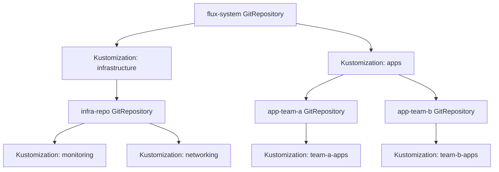

# How to Use Multiple GitRepositories in a Single Flux Installation

Author: [nawazdhandala](https://github.com/nawazdhandala)

Tags: Flux CD, GitOps, Kubernetes, Multi-Repo, Architecture, Multi-Team

Description: Learn how to configure and manage multiple GitRepository resources in a single Flux CD installation for multi-team, multi-environment, and multi-repo workflows.

---

While some organizations use a single monorepo for all Kubernetes configurations, many prefer splitting configurations across multiple repositories. Flux CD fully supports this pattern, allowing you to define multiple GitRepository resources in a single installation. This guide covers common multi-repo architectures, how to set them up, and best practices for managing dependencies between repositories.

## Why Use Multiple GitRepositories

There are several reasons to use multiple Git repositories with Flux:

- **Team autonomy:** Different teams own different repositories and control their own deployment pace
- **Access control:** Separate repos allow fine-grained permissions (infra team vs. app teams)
- **Separation of concerns:** Platform configuration, application manifests, and shared libraries live in different repos
- **Mixed sources:** Some configs come from GitHub, others from internal GitLab or Bitbucket

## Architecture Overview

A typical multi-repo Flux architecture looks like this:



The root GitRepository bootstraps the cluster, which then references additional GitRepository resources for infrastructure and application teams.

## Step 1: Set Up the Root GitRepository

The root repository is typically created during Flux bootstrap. It contains the definitions for all other GitRepository resources.

The root GitRepository (created by flux bootstrap):

```yaml
apiVersion: source.toolkit.fluxcd.io/v1
kind: GitRepository
metadata:
  name: flux-system
  namespace: flux-system
spec:
  interval: 5m
  url: ssh://git@github.com/your-org/fleet-config.git
  ref:
    branch: main
  secretRef:
    name: flux-system
```

Inside this repository, define additional GitRepository resources and their Kustomizations.

## Step 2: Define Additional GitRepository Resources

Create GitRepository resources for each additional repository. These definitions live in the root repository so Flux manages them.

Infrastructure repository:

```yaml
apiVersion: source.toolkit.fluxcd.io/v1
kind: GitRepository
metadata:
  name: infrastructure
  namespace: flux-system
spec:
  interval: 10m
  url: https://github.com/your-org/infrastructure.git
  ref:
    branch: main
  secretRef:
    name: github-credentials
  timeout: 60s
```

Application team repositories:

```yaml
apiVersion: source.toolkit.fluxcd.io/v1
kind: GitRepository
metadata:
  name: team-alpha-apps
  namespace: flux-system
spec:
  interval: 5m
  url: https://github.com/your-org/team-alpha-apps.git
  ref:
    branch: main
  secretRef:
    name: github-credentials
---
apiVersion: source.toolkit.fluxcd.io/v1
kind: GitRepository
metadata:
  name: team-beta-apps
  namespace: flux-system
spec:
  interval: 5m
  url: https://github.com/your-org/team-beta-apps.git
  ref:
    branch: main
  secretRef:
    name: github-credentials
```

## Step 3: Create Kustomizations for Each Repository

Each GitRepository needs at least one Kustomization to apply its contents to the cluster.

Kustomizations referencing different GitRepository sources:

```yaml
apiVersion: kustomize.toolkit.fluxcd.io/v1
kind: Kustomization
metadata:
  name: infrastructure
  namespace: flux-system
spec:
  interval: 10m
  sourceRef:
    kind: GitRepository
    name: infrastructure
  path: ./clusters/production
  prune: true
  # Infrastructure must be applied before applications
  healthChecks:
    - apiVersion: apps/v1
      kind: Deployment
      name: ingress-nginx-controller
      namespace: ingress-nginx
---
apiVersion: kustomize.toolkit.fluxcd.io/v1
kind: Kustomization
metadata:
  name: team-alpha
  namespace: flux-system
spec:
  interval: 5m
  sourceRef:
    kind: GitRepository
    name: team-alpha-apps
  path: ./deploy/production
  prune: true
  targetNamespace: team-alpha
  # Wait for infrastructure to be ready
  dependsOn:
    - name: infrastructure
---
apiVersion: kustomize.toolkit.fluxcd.io/v1
kind: Kustomization
metadata:
  name: team-beta
  namespace: flux-system
spec:
  interval: 5m
  sourceRef:
    kind: GitRepository
    name: team-beta-apps
  path: ./deploy/production
  prune: true
  targetNamespace: team-beta
  dependsOn:
    - name: infrastructure
```

## Step 4: Manage Dependencies Between Repositories

The `dependsOn` field in Kustomization resources ensures resources are applied in the correct order across repositories.

A dependency chain across repositories:

```yaml
# 1. CRDs must be installed first
apiVersion: kustomize.toolkit.fluxcd.io/v1
kind: Kustomization
metadata:
  name: crds
  namespace: flux-system
spec:
  interval: 15m
  sourceRef:
    kind: GitRepository
    name: infrastructure
  path: ./crds
  prune: false  # Never prune CRDs
---
# 2. Core infrastructure depends on CRDs
apiVersion: kustomize.toolkit.fluxcd.io/v1
kind: Kustomization
metadata:
  name: core-infra
  namespace: flux-system
spec:
  interval: 10m
  sourceRef:
    kind: GitRepository
    name: infrastructure
  path: ./core
  prune: true
  dependsOn:
    - name: crds
---
# 3. Applications depend on core infrastructure
apiVersion: kustomize.toolkit.fluxcd.io/v1
kind: Kustomization
metadata:
  name: team-alpha
  namespace: flux-system
spec:
  interval: 5m
  sourceRef:
    kind: GitRepository
    name: team-alpha-apps
  path: ./deploy
  prune: true
  dependsOn:
    - name: core-infra
```

## Step 5: Use Different Authentication Per Repository

Each GitRepository can reference a different authentication secret, which is essential when repositories are hosted on different platforms or require different access tokens.

Secrets for different Git providers:

```yaml
# GitHub credentials
apiVersion: v1
kind: Secret
metadata:
  name: github-credentials
  namespace: flux-system
type: Opaque
stringData:
  username: flux-bot
  password: ghp_github_token_here
---
# Internal GitLab credentials
apiVersion: v1
kind: Secret
metadata:
  name: gitlab-credentials
  namespace: flux-system
type: Opaque
stringData:
  username: flux-bot
  password: glpat_gitlab_token_here
```

GitRepositories using different credentials:

```yaml
apiVersion: source.toolkit.fluxcd.io/v1
kind: GitRepository
metadata:
  name: public-charts
  namespace: flux-system
spec:
  interval: 30m
  url: https://github.com/your-org/helm-charts.git
  ref:
    branch: main
  secretRef:
    name: github-credentials
---
apiVersion: source.toolkit.fluxcd.io/v1
kind: GitRepository
metadata:
  name: internal-config
  namespace: flux-system
spec:
  interval: 5m
  url: https://gitlab.internal.company.com/platform/config.git
  ref:
    branch: main
  secretRef:
    name: gitlab-credentials
```

## Step 6: Organize the Repository Structure

A well-organized root repository makes multi-repo management easier. Here is a recommended directory structure for the root fleet config repository.

Recommended root repository structure:

```bash
fleet-config/
  clusters/
    production/
      # GitRepository definitions
      sources/
        infrastructure.yaml
        team-alpha.yaml
        team-beta.yaml
      # Kustomization definitions
      infrastructure.yaml
      team-alpha.yaml
      team-beta.yaml
    staging/
      sources/
        infrastructure.yaml
        team-alpha.yaml
        team-beta.yaml
      infrastructure.yaml
      team-alpha.yaml
      team-beta.yaml
  # Shared secrets (encrypted with SOPS)
  secrets/
    github-credentials.yaml
    gitlab-credentials.yaml
```

## Step 7: Monitor All GitRepositories

With multiple GitRepository resources, monitoring becomes important to catch sync failures quickly.

Check the status of all GitRepository resources:

```bash
# Overview of all Git sources
flux get sources git

# Watch for changes in real time
flux get sources git --watch

# Find sources that are not ready
flux get sources git | grep -v True

# Export all sources for auditing
flux export source git --all
```

Set up alerts for failed reconciliations:

```yaml
apiVersion: notification.toolkit.fluxcd.io/v1
kind: Alert
metadata:
  name: git-source-alerts
  namespace: flux-system
spec:
  providerRef:
    name: slack-provider
  eventSeverity: error
  eventSources:
    # Alert on failures from all GitRepository resources
    - kind: GitRepository
      name: "*"
      namespace: flux-system
```

## Step 8: Handle Cross-Repository References with Include

The `include` field allows one GitRepository to pull content from another, enabling composition patterns.

A GitRepository that includes shared configuration from another repo:

```yaml
apiVersion: source.toolkit.fluxcd.io/v1
kind: GitRepository
metadata:
  name: team-alpha-apps
  namespace: flux-system
spec:
  interval: 5m
  url: https://github.com/your-org/team-alpha-apps.git
  ref:
    branch: main
  secretRef:
    name: github-credentials
  include:
    # Pull shared Kubernetes policies into the artifact
    - repository:
        name: shared-policies
      fromPath: policies/
      toPath: shared-policies/
```

The `shared-policies` GitRepository must exist in the same namespace:

```yaml
apiVersion: source.toolkit.fluxcd.io/v1
kind: GitRepository
metadata:
  name: shared-policies
  namespace: flux-system
spec:
  interval: 30m
  url: https://github.com/your-org/k8s-policies.git
  ref:
    branch: main
  secretRef:
    name: github-credentials
```

## Performance Considerations

Running many GitRepository resources has performance implications:

- **Reconciliation load:** Each GitRepository polls on its interval. With 50 repositories at 1-minute intervals, that is 50 Git operations per minute.
- **Memory usage:** The source-controller stores artifacts for each repository. Monitor its memory consumption.
- **Rate limits:** If all repositories are on GitHub, you share a single rate limit. See authentication best practices.

Recommendations for scaling:

```yaml
# Stable repos: long intervals
apiVersion: source.toolkit.fluxcd.io/v1
kind: GitRepository
metadata:
  name: stable-infra
  namespace: flux-system
spec:
  # Infrastructure that rarely changes
  interval: 30m
  url: https://github.com/your-org/stable-infra.git
  ref:
    branch: main
  secretRef:
    name: github-credentials
---
# Active repos: shorter intervals
apiVersion: source.toolkit.fluxcd.io/v1
kind: GitRepository
metadata:
  name: active-development
  namespace: flux-system
spec:
  # Apps under active development
  interval: 2m
  url: https://github.com/your-org/active-app.git
  ref:
    branch: main
  secretRef:
    name: github-credentials
```

## Summary

Using multiple GitRepositories in a single Flux installation is a well-supported pattern that enables team autonomy, access control separation, and multi-platform Git hosting. The key elements are defining each repository as a GitRepository resource, creating corresponding Kustomizations with proper `dependsOn` ordering, using separate authentication secrets where needed, and monitoring all sources for reconciliation failures. Organize your root repository to clearly separate source definitions from Kustomization definitions, and adjust polling intervals based on how frequently each repository changes to optimize performance.
