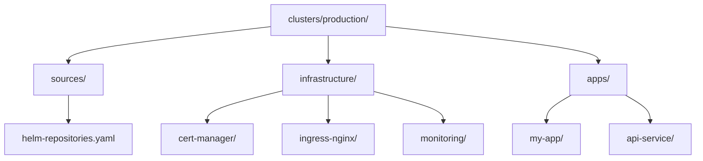

# How to Configure Multiple HelmRepositories in Flux

Author: [nawazdhandala](https://github.com/nawazdhandala)

Tags: Flux CD, GitOps, Kubernetes, Helm, HelmRepository, Multi-Source, Infrastructure

Description: Learn how to configure and manage multiple HelmRepositories in Flux CD, organizing sources for a complete Kubernetes infrastructure stack.

---

Most Kubernetes clusters rely on Helm charts from multiple publishers. You might deploy Prometheus from the prometheus-community repository, cert-manager from Jetstack, your application from a private registry, and databases from Bitnami. Flux CD handles multiple HelmRepositories seamlessly, and this guide shows you how to organize, configure, and manage them effectively.

## Defining Multiple HelmRepositories

Each Helm chart publisher has its own repository. Here is a complete set of HelmRepository resources for a typical production cluster:

```yaml
# Prometheus community charts for monitoring
apiVersion: source.toolkit.fluxcd.io/v1
kind: HelmRepository
metadata:
  name: prometheus-community
  namespace: flux-system
spec:
  interval: 60m
  url: https://prometheus-community.github.io/helm-charts
---
# Grafana charts for dashboards and observability
apiVersion: source.toolkit.fluxcd.io/v1
kind: HelmRepository
metadata:
  name: grafana
  namespace: flux-system
spec:
  interval: 60m
  url: https://grafana.github.io/helm-charts
---
# Jetstack charts for cert-manager
apiVersion: source.toolkit.fluxcd.io/v1
kind: HelmRepository
metadata:
  name: jetstack
  namespace: flux-system
spec:
  interval: 60m
  url: https://charts.jetstack.io
---
# Ingress-NGINX controller
apiVersion: source.toolkit.fluxcd.io/v1
kind: HelmRepository
metadata:
  name: ingress-nginx
  namespace: flux-system
spec:
  interval: 60m
  url: https://kubernetes.github.io/ingress-nginx
---
# Bitnami charts (OCI-based registry)
apiVersion: source.toolkit.fluxcd.io/v1
kind: HelmRepository
metadata:
  name: bitnami
  namespace: flux-system
spec:
  type: oci
  interval: 60m
  url: oci://registry-1.docker.io/bitnamicharts
```

Apply all repositories at once:

```bash
# Apply all HelmRepository definitions
kubectl apply -f helm-repositories/

# Verify all repositories are ready
flux get sources helm -A
```

## Organizing Your Git Repository

A well-structured GitOps repository makes it easy to manage multiple sources and their associated releases. Here is a recommended layout:



The directory structure in your Git repository:

```bash
# Recommended Git repository structure for multi-source Flux setup
clusters/production/
  sources/
    helm-repositories.yaml     # All HelmRepository definitions in one file
  infrastructure/
    kustomization.yaml         # Flux Kustomization for infrastructure
    cert-manager.yaml          # HelmRelease for cert-manager
    ingress-nginx.yaml         # HelmRelease for ingress-nginx
    monitoring/
      kustomization.yaml
      prometheus.yaml          # HelmRelease for Prometheus
      grafana.yaml             # HelmRelease for Grafana
  apps/
    kustomization.yaml         # Flux Kustomization for applications
    my-app.yaml                # HelmRelease for your application
```

## Using Flux Kustomizations for Layered Deployment

Organize your deployments into layers with dependencies. Infrastructure components should deploy before applications:

```yaml
# Kustomization for HelmRepository sources (deployed first)
apiVersion: kustomize.toolkit.fluxcd.io/v1
kind: Kustomization
metadata:
  name: sources
  namespace: flux-system
spec:
  interval: 10m
  path: ./clusters/production/sources
  prune: true
  sourceRef:
    kind: GitRepository
    name: flux-system
---
# Kustomization for infrastructure components (depends on sources)
apiVersion: kustomize.toolkit.fluxcd.io/v1
kind: Kustomization
metadata:
  name: infrastructure
  namespace: flux-system
spec:
  dependsOn:
    - name: sources
  interval: 10m
  path: ./clusters/production/infrastructure
  prune: true
  sourceRef:
    kind: GitRepository
    name: flux-system
---
# Kustomization for applications (depends on infrastructure)
apiVersion: kustomize.toolkit.fluxcd.io/v1
kind: Kustomization
metadata:
  name: apps
  namespace: flux-system
spec:
  dependsOn:
    - name: infrastructure
  interval: 10m
  path: ./clusters/production/apps
  prune: true
  sourceRef:
    kind: GitRepository
    name: flux-system
```

## Referencing HelmRepositories from HelmReleases

Each HelmRelease references its source HelmRepository by name. Since all HelmRepositories are in the `flux-system` namespace, HelmReleases in other namespaces use a cross-namespace reference:

```yaml
# HelmRelease in the monitoring namespace referencing a source in flux-system
apiVersion: helm.toolkit.fluxcd.io/v2
kind: HelmRelease
metadata:
  name: prometheus
  namespace: monitoring
spec:
  interval: 30m
  chart:
    spec:
      chart: kube-prometheus-stack
      version: "67.*"
      sourceRef:
        kind: HelmRepository
        name: prometheus-community
        # Cross-namespace reference to the source in flux-system
        namespace: flux-system
      interval: 10m
  values:
    prometheus:
      prometheusSpec:
        retention: 15d
---
# HelmRelease in cert-manager namespace referencing Jetstack source
apiVersion: helm.toolkit.fluxcd.io/v2
kind: HelmRelease
metadata:
  name: cert-manager
  namespace: cert-manager
spec:
  interval: 30m
  chart:
    spec:
      chart: cert-manager
      version: "1.*"
      sourceRef:
        kind: HelmRepository
        name: jetstack
        namespace: flux-system
      interval: 10m
  values:
    crds:
      enabled: true
---
# HelmRelease in ingress-nginx namespace referencing ingress-nginx source
apiVersion: helm.toolkit.fluxcd.io/v2
kind: HelmRelease
metadata:
  name: ingress-nginx
  namespace: ingress-nginx
spec:
  interval: 30m
  chart:
    spec:
      chart: ingress-nginx
      version: "4.*"
      sourceRef:
        kind: HelmRepository
        name: ingress-nginx
        namespace: flux-system
      interval: 10m
  values:
    controller:
      replicaCount: 2
```

## Mixing OCI and HTTPS Repositories

Flux supports both OCI and traditional HTTPS Helm repositories side by side. The key difference is the `type: oci` field. HTTPS repositories do not need a `type` field (it defaults to `default`):

```yaml
# HTTPS repository - traditional index-based
apiVersion: source.toolkit.fluxcd.io/v1
kind: HelmRepository
metadata:
  name: grafana
  namespace: flux-system
spec:
  interval: 60m
  url: https://grafana.github.io/helm-charts
---
# OCI repository - registry-based
apiVersion: source.toolkit.fluxcd.io/v1
kind: HelmRepository
metadata:
  name: bitnami
  namespace: flux-system
spec:
  type: oci
  interval: 60m
  url: oci://registry-1.docker.io/bitnamicharts
```

## Tuning Reconciliation Intervals

Not all repositories need the same reconciliation frequency. Stable infrastructure repositories can use longer intervals, while application repositories may need shorter ones:

```yaml
# Stable infrastructure charts - check hourly
apiVersion: source.toolkit.fluxcd.io/v1
kind: HelmRepository
metadata:
  name: jetstack
  namespace: flux-system
spec:
  interval: 60m
  url: https://charts.jetstack.io
---
# Frequently updated application charts - check every 5 minutes
apiVersion: source.toolkit.fluxcd.io/v1
kind: HelmRepository
metadata:
  name: my-company-charts
  namespace: flux-system
spec:
  interval: 5m
  url: https://charts.my-company.com
```

## Monitoring Repository Health

Check the status of all your HelmRepositories at a glance:

```bash
# List all HelmRepositories and their status
flux get sources helm -A

# Get detailed status for a specific repository
kubectl describe helmrepository grafana -n flux-system

# Watch for repository reconciliation events
kubectl get events -n flux-system --field-selector reason=ArtifactUpToDate --watch
```

## Handling Repository Failures

If one HelmRepository fails, it does not affect others. Each source is reconciled independently. You can set up Flux notifications to alert you when a repository becomes unhealthy:

```yaml
# Alert provider for Slack notifications on source failures
apiVersion: notification.toolkit.fluxcd.io/v1
kind: Provider
metadata:
  name: slack
  namespace: flux-system
spec:
  type: slack
  channel: flux-alerts
  secretRef:
    name: slack-webhook-url
---
# Alert on HelmRepository failures
apiVersion: notification.toolkit.fluxcd.io/v1
kind: Alert
metadata:
  name: helm-source-alerts
  namespace: flux-system
spec:
  providerRef:
    name: slack
  eventSeverity: error
  eventSources:
    - kind: HelmRepository
      name: "*"
```

Managing multiple HelmRepositories in Flux CD is straightforward. Keep all source definitions in one place, organize deployments with layered Kustomizations, and use appropriate reconciliation intervals for each source. This approach scales cleanly from a handful of charts to dozens across multiple environments.
