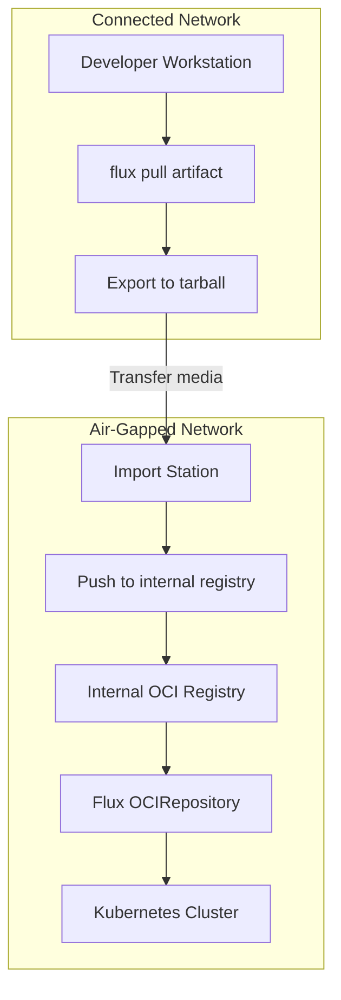

# How to Use OCI Artifacts for Air-Gapped Flux Deployments

Author: [nawazdhandala](https://github.com/nawazdhandala)

Tags: Flux CD, GitOps, Kubernetes, OCI, Air-Gapped, Security

Description: Learn how to deploy Kubernetes applications with Flux CD in air-gapped environments using OCI artifacts and private registries.

---

## Introduction

Air-gapped environments -- clusters with no direct internet access -- present a unique challenge for GitOps workflows. Flux CD cannot pull from public Git repositories or container registries in these environments. OCI artifacts solve this problem by allowing you to package Kubernetes manifests, push them to an internal registry, and have Flux reconcile from that local source.

This guide covers the end-to-end process of setting up OCI-based Flux deployments in air-gapped environments.

## Prerequisites

- Flux CLI v2.1.0 or later installed on a workstation with internet access
- An internal OCI-compatible registry accessible from the air-gapped cluster (e.g., Harbor, Artifactory, Zot)
- A mechanism to transfer data into the air-gapped environment (USB, data diode, sneakernet)
- `kubectl` access to the air-gapped cluster

## Architecture Overview

In an air-gapped setup, you prepare artifacts on a connected workstation, transfer them to the isolated network, push them to an internal registry, and let Flux reconcile from there.



## Step 1: Pull Artifacts on the Connected Side

On a workstation with internet access, pull the OCI artifacts you need.

```bash
# Pull the artifact from the public registry to a local directory
flux pull artifact oci://ghcr.io/my-org/my-app-manifests:v1.2.0 \
  --output ./artifacts/my-app-manifests

# Verify the contents
ls -la ./artifacts/my-app-manifests/
```

## Step 2: Export Artifacts for Transfer

Package the pulled artifacts into a tarball for transfer to the air-gapped network.

```bash
# Create a tarball of the artifact contents
tar czf my-app-manifests-v1.2.0.tar.gz -C ./artifacts/my-app-manifests .

# Also export any container images needed by the manifests
# This is separate from the manifest artifact
docker save my-app:v1.2.0 -o my-app-image-v1.2.0.tar
```

## Step 3: Transfer to the Air-Gapped Network

Transfer the tarballs using your approved data transfer mechanism. This could be a USB drive, a write-once optical disc, or a one-way data diode, depending on your security requirements.

## Step 4: Import and Push to the Internal Registry

On the import station inside the air-gapped network, push the artifacts to your internal registry.

```bash
# Extract the manifests
mkdir -p ./import/my-app-manifests
tar xzf my-app-manifests-v1.2.0.tar.gz -C ./import/my-app-manifests

# Login to the internal registry
flux oci login registry.internal.example.com \
  --username admin \
  --password "${REGISTRY_PASSWORD}"

# Push the artifact to the internal registry
flux push artifact \
  oci://registry.internal.example.com/flux-artifacts/my-app-manifests:v1.2.0 \
  --path ./import/my-app-manifests \
  --source="https://github.com/my-org/my-app" \
  --revision="v1.2.0"

# Tag as latest for convenience
flux tag artifact \
  oci://registry.internal.example.com/flux-artifacts/my-app-manifests:v1.2.0 \
  --tag latest
```

## Step 5: Configure Flux OCIRepository

On the air-gapped cluster, create an OCIRepository resource pointing to the internal registry.

```yaml
# flux-system/my-app-source.yaml
apiVersion: source.toolkit.fluxcd.io/v1beta2
kind: OCIRepository
metadata:
  name: my-app
  namespace: flux-system
spec:
  interval: 10m
  url: oci://registry.internal.example.com/flux-artifacts/my-app-manifests
  ref:
    tag: v1.2.0
  # If using a self-signed certificate
  certSecretRef:
    name: registry-tls
```

## Step 6: Create Registry Credentials Secret

If your internal registry requires authentication, create a secret for Flux to use.

```bash
# Create a docker-registry secret for Flux to authenticate
kubectl create secret docker-registry oci-registry-creds \
  --namespace flux-system \
  --docker-server=registry.internal.example.com \
  --docker-username=flux-reader \
  --docker-password="${FLUX_REGISTRY_PASSWORD}"
```

Then reference it in the OCIRepository.

```yaml
# flux-system/my-app-source.yaml
apiVersion: source.toolkit.fluxcd.io/v1beta2
kind: OCIRepository
metadata:
  name: my-app
  namespace: flux-system
spec:
  interval: 10m
  url: oci://registry.internal.example.com/flux-artifacts/my-app-manifests
  ref:
    tag: v1.2.0
  secretRef:
    name: oci-registry-creds
  certSecretRef:
    name: registry-tls
```

## Step 7: Handle Self-Signed Certificates

Air-gapped registries commonly use self-signed or internal CA certificates. Create a TLS secret for Flux to trust.

```bash
# Create a secret with the internal CA certificate
kubectl create secret generic registry-tls \
  --namespace flux-system \
  --from-file=ca.crt=/path/to/internal-ca.crt
```

## Step 8: Create the Kustomization

Define a Kustomization resource that references the OCIRepository to deploy the manifests.

```yaml
# flux-system/my-app-kustomization.yaml
apiVersion: kustomize.toolkit.fluxcd.io/v1
kind: Kustomization
metadata:
  name: my-app
  namespace: flux-system
spec:
  interval: 10m
  targetNamespace: my-app
  sourceRef:
    kind: OCIRepository
    name: my-app
  path: ./
  prune: true
  wait: true
  timeout: 5m
```

## Automating the Transfer Process

For environments that require regular updates, automate the export and import process with a script.

```bash
#!/bin/bash
# export-artifacts.sh -- Run on the connected workstation
set -euo pipefail

ARTIFACTS=("ghcr.io/my-org/my-app-manifests:v1.2.0"
           "ghcr.io/my-org/infra-manifests:v3.0.1")
EXPORT_DIR="./export-$(date +%Y%m%d)"

mkdir -p "${EXPORT_DIR}"

for artifact in "${ARTIFACTS[@]}"; do
  # Extract a safe directory name from the artifact reference
  name=$(echo "${artifact}" | sed 's|.*/||; s|:|-|')
  mkdir -p "${EXPORT_DIR}/${name}"

  # Pull each artifact
  flux pull artifact "oci://${artifact}" --output "${EXPORT_DIR}/${name}"
done

# Create a single tarball for transfer
tar czf "${EXPORT_DIR}.tar.gz" -C "${EXPORT_DIR}" .
echo "Export ready: ${EXPORT_DIR}.tar.gz"
```

```bash
#!/bin/bash
# import-artifacts.sh -- Run inside the air-gapped network
set -euo pipefail

INTERNAL_REGISTRY="registry.internal.example.com/flux-artifacts"
IMPORT_DIR="./import-$(date +%Y%m%d)"

mkdir -p "${IMPORT_DIR}"
tar xzf "$1" -C "${IMPORT_DIR}"

flux oci login registry.internal.example.com \
  --username admin --password "${REGISTRY_PASSWORD}"

# Push each artifact directory to the internal registry
for dir in "${IMPORT_DIR}"/*/; do
  name=$(basename "${dir}")
  flux push artifact "oci://${INTERNAL_REGISTRY}/${name}" \
    --path "${dir}" \
    --source="air-gapped-import" \
    --revision="$(date +%Y%m%d)"
done

echo "Import complete."
```

## Verifying the Deployment

After pushing artifacts and configuring Flux, verify everything is working.

```bash
# Check the OCIRepository status
kubectl get ocirepository -n flux-system

# Check the Kustomization status
kubectl get kustomization -n flux-system

# View detailed status for troubleshooting
flux get sources oci -n flux-system
```

## Best Practices

1. **Version everything.** Use explicit version tags rather than `latest` to maintain traceability in air-gapped environments where debugging is harder.

2. **Maintain a manifest of transferred artifacts.** Keep a log of what was transferred and when for audit purposes.

3. **Validate artifact integrity.** Use checksums or signatures to verify that artifacts were not tampered with during transfer.

4. **Pre-stage Flux components.** Ensure Flux controller images are also available in your internal registry before bootstrapping.

5. **Test imports in a staging environment.** Validate artifacts in a non-production air-gapped cluster before promoting to production.

## Conclusion

OCI artifacts provide a practical path for running Flux CD in air-gapped environments. By pulling artifacts on a connected workstation, transferring them through your approved data transfer mechanism, and pushing them to an internal registry, you maintain the GitOps workflow while meeting strict network isolation requirements. The combination of OCIRepository resources, TLS certificate handling, and automated transfer scripts makes this approach both secure and maintainable.
