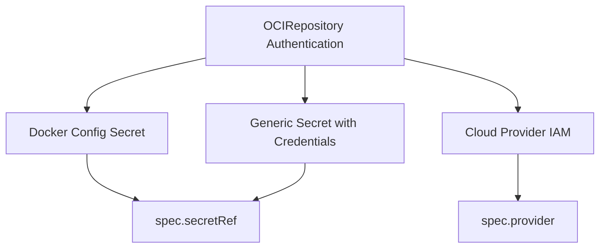

# How to Configure OCIRepository with Authentication in Flux

Author: [nawazdhandala](https://github.com/nawazdhandala)

Tags: Flux CD, GitOps, Kubernetes, OCI, OCIRepository, Authentication, Secret, Container Registry

Description: Learn how to configure OCIRepository authentication in Flux CD using Kubernetes secrets, service accounts, and provider-specific credentials to pull OCI artifacts from private registries.

---

## Introduction

When your OCI artifacts are stored in private container registries, the Flux source-controller needs credentials to pull them. Flux supports several authentication methods for OCIRepository resources, including Kubernetes secrets with Docker registry credentials, static credentials, and cloud provider-specific mechanisms.

This guide covers all the authentication methods available for OCIRepository, from basic username/password to automated cloud provider authentication.

## Prerequisites

Before you begin, ensure you have:

- A Kubernetes cluster with Flux CD installed (v0.35 or later)
- The `flux` CLI and `kubectl` installed
- Access to a private OCI-compliant container registry
- Registry credentials (username, password, or token)

## Authentication Methods Overview

Flux supports the following authentication methods for OCIRepository resources.



## Method 1: Docker Config Secret

The most common method uses a Kubernetes secret of type `kubernetes.io/dockerconfigjson`. This works with any registry that accepts username/password authentication.

Create the secret using `kubectl`.

```bash
# Create a Docker registry secret with your credentials
kubectl create secret docker-registry oci-registry-creds \
  --namespace=flux-system \
  --docker-server=ghcr.io \
  --docker-username=$GITHUB_USER \
  --docker-password=$GITHUB_TOKEN
```

Alternatively, create the secret using the Flux CLI.

```bash
# Create a secret from an existing Docker config file
flux create secret oci oci-registry-creds \
  --namespace=flux-system \
  --url=ghcr.io \
  --username=$GITHUB_USER \
  --password=$GITHUB_TOKEN
```

Reference the secret in your OCIRepository resource.

```yaml
# ocirepository-with-secret.yaml
# OCIRepository that authenticates using a Docker config secret
apiVersion: source.toolkit.fluxcd.io/v1
kind: OCIRepository
metadata:
  name: my-app
  namespace: flux-system
spec:
  interval: 5m
  url: oci://ghcr.io/my-org/my-app-manifests
  ref:
    tag: latest
  # Reference the secret containing registry credentials
  secretRef:
    name: oci-registry-creds
```

Apply both resources.

```bash
# Apply the OCIRepository manifest
kubectl apply -f ocirepository-with-secret.yaml

# Verify the source is ready
flux get sources oci
```

## Method 2: Creating Secrets from Existing Docker Config

If you have already authenticated with `docker login`, you can create a secret from your existing Docker configuration file.

```bash
# Create a secret from your existing Docker config
kubectl create secret generic oci-registry-creds \
  --namespace=flux-system \
  --from-file=.dockerconfigjson=$HOME/.docker/config.json \
  --type=kubernetes.io/dockerconfigjson
```

This approach is useful for registries that require complex authentication flows (like those using credential helpers).

## Method 3: Using a Service Account

You can configure a Kubernetes service account with image pull secrets and reference it in the OCIRepository.

```yaml
# service-account.yaml
# Service account with attached pull secrets
apiVersion: v1
kind: ServiceAccount
metadata:
  name: flux-oci-sa
  namespace: flux-system
imagePullSecrets:
  - name: oci-registry-creds
```

```yaml
# ocirepository-with-sa.yaml
# OCIRepository using a service account for authentication
apiVersion: source.toolkit.fluxcd.io/v1
kind: OCIRepository
metadata:
  name: my-app
  namespace: flux-system
spec:
  interval: 5m
  url: oci://ghcr.io/my-org/my-app-manifests
  ref:
    tag: latest
  serviceAccountName: flux-oci-sa
```

## Method 4: Cloud Provider Authentication

For cloud-hosted registries, Flux can use the provider's native authentication mechanism. Set the `spec.provider` field to enable automatic credential refresh.

```yaml
# ocirepository-provider-auth.yaml
# OCIRepository using cloud provider authentication
apiVersion: source.toolkit.fluxcd.io/v1
kind: OCIRepository
metadata:
  name: my-app
  namespace: flux-system
spec:
  interval: 5m
  url: oci://123456789.dkr.ecr.us-east-1.amazonaws.com/my-app-manifests
  ref:
    tag: latest
  # Use the cloud provider's native auth mechanism
  # Supported values: aws, azure, gcp, generic
  provider: aws
```

Supported provider values:

- `aws` -- Uses AWS IAM roles (IRSA) or EC2 instance profiles for ECR authentication
- `azure` -- Uses Azure Workload Identity or managed identity for ACR authentication
- `gcp` -- Uses GCP Workload Identity for Artifact Registry authentication
- `generic` -- Default; uses `secretRef` or `serviceAccountName` for authentication

## Rotating Credentials

When credentials expire or need rotation, update the Kubernetes secret and Flux will pick up the new credentials on the next reconciliation.

```bash
# Update the secret with new credentials
kubectl create secret docker-registry oci-registry-creds \
  --namespace=flux-system \
  --docker-server=ghcr.io \
  --docker-username=$GITHUB_USER \
  --docker-password=$NEW_GITHUB_TOKEN \
  --dry-run=client -o yaml | kubectl apply -f -

# Force Flux to reconcile with the updated credentials
flux reconcile source oci my-app
```

## Encrypting Secrets with SOPS

For GitOps, you should encrypt secrets before storing them in Git. Use Mozilla SOPS with Flux to manage encrypted credentials.

```yaml
# oci-secret.sops.yaml
# This file is encrypted with SOPS and decrypted by Flux at runtime
apiVersion: v1
kind: Secret
metadata:
  name: oci-registry-creds
  namespace: flux-system
type: kubernetes.io/dockerconfigjson
stringData:
  .dockerconfigjson: ENC[AES256_GCM,data:...,type:str]
sops:
  # SOPS metadata (added automatically by sops encrypt)
  kms: []
  age:
    - recipient: age1...
      enc: |
        -----BEGIN AGE ENCRYPTED FILE-----
        ...
        -----END AGE ENCRYPTED FILE-----
  lastmodified: "2026-03-05T00:00:00Z"
  version: 3.7.3
```

## Debugging Authentication Issues

When authentication fails, Flux logs errors in the source-controller. Use these commands to diagnose problems.

```bash
# Check the OCIRepository status for error messages
kubectl describe ocirepository my-app -n flux-system

# View source-controller logs for authentication errors
kubectl logs -n flux-system deploy/source-controller | grep -i "auth\|401\|403\|denied"

# Verify the secret exists and has the correct type
kubectl get secret oci-registry-creds -n flux-system -o yaml
```

Common error messages and their solutions:

- **401 Unauthorized**: The credentials are invalid or expired. Regenerate the token and update the secret.
- **403 Forbidden**: The credentials are valid but lack permission to access the repository. Check registry access policies.
- **Secret not found**: The secret referenced in `secretRef` does not exist in the same namespace as the OCIRepository. Verify the name and namespace.

## Testing Credentials Locally

Before configuring the in-cluster OCIRepository, test your credentials locally with the Flux CLI.

```bash
# Test authentication by listing artifacts
flux list artifacts oci://ghcr.io/my-org/my-app-manifests

# Test by pulling an artifact
mkdir -p /tmp/test-pull
flux pull artifact oci://ghcr.io/my-org/my-app-manifests:latest \
  --output=/tmp/test-pull
```

If these commands succeed locally, the same credentials should work in-cluster.

## Summary

Configuring authentication for OCIRepository in Flux CD involves choosing the right method for your registry and security requirements. Key takeaways:

- Use `secretRef` with a `kubernetes.io/dockerconfigjson` secret for most registries
- Use `spec.provider` for cloud-native authentication with AWS ECR, Azure ACR, or Google Artifact Registry
- Encrypt secrets with SOPS before committing them to Git
- Rotate credentials by updating the Kubernetes secret and forcing reconciliation
- Debug authentication issues using `kubectl describe` and source-controller logs
- Test credentials locally with `flux list artifacts` before configuring in-cluster resources
