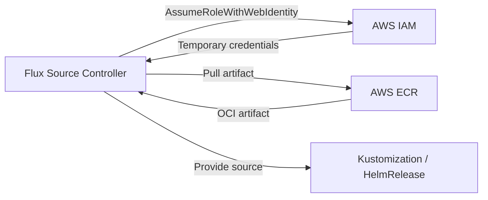

# How to Configure OCIRepository with AWS ECR in Flux

Author: [nawazdhandala](https://github.com/nawazdhandala)

Tags: Flux CD, GitOps, Kubernetes, OCI, OCIRepository, AWS, ECR, IRSA, EKS

Description: Learn how to configure Flux CD OCIRepository to pull OCI artifacts from AWS Elastic Container Registry (ECR) using IAM Roles for Service Accounts (IRSA) and static credentials.

---

## Introduction

AWS Elastic Container Registry (ECR) is a fully managed container registry that supports OCI artifacts. Flux CD can pull Kubernetes manifests, Helm charts, and Kustomize overlays stored as OCI artifacts in ECR. However, ECR uses short-lived authentication tokens that expire after 12 hours, which requires special configuration.

This guide covers two authentication methods: IAM Roles for Service Accounts (IRSA) for EKS clusters, and static credentials with token refresh for non-EKS environments.

## Prerequisites

Before you begin, ensure you have:

- An EKS cluster (or any Kubernetes cluster with AWS access) running Flux CD v0.35 or later
- The `flux` CLI, `kubectl`, and `aws` CLI installed
- An ECR repository with OCI artifacts pushed
- IAM permissions to create roles and policies

## Architecture Overview

Here is how Flux pulls OCI artifacts from ECR using IRSA.



## Method 1: IRSA (Recommended for EKS)

IAM Roles for Service Accounts is the recommended method for EKS clusters. It provides automatic credential rotation without managing secrets.

### Step 1: Create an IAM Policy

Create an IAM policy that grants ECR pull permissions.

```bash
# Create the IAM policy for ECR read access
aws iam create-policy \
  --policy-name FluxECRReadOnly \
  --policy-document '{
    "Version": "2012-10-17",
    "Statement": [
      {
        "Effect": "Allow",
        "Action": [
          "ecr:GetDownloadUrlForLayer",
          "ecr:BatchGetImage",
          "ecr:BatchCheckLayerAvailability",
          "ecr:GetAuthorizationToken"
        ],
        "Resource": "*"
      }
    ]
  }'
```

### Step 2: Create an IAM Role with IRSA

Associate the IAM role with the Flux source-controller service account.

```bash
# Create the IRSA role for the source-controller
# Replace ACCOUNT_ID, OIDC_ID, and REGION with your values
eksctl create iamserviceaccount \
  --name=source-controller \
  --namespace=flux-system \
  --cluster=my-cluster \
  --attach-policy-arn=arn:aws:iam::ACCOUNT_ID:policy/FluxECRReadOnly \
  --override-existing-serviceaccounts \
  --approve
```

Alternatively, if you prefer to create the role manually, annotate the service account.

```bash
# Annotate the source-controller service account with the IAM role ARN
kubectl annotate serviceaccount source-controller \
  -n flux-system \
  eks.amazonaws.com/role-arn=arn:aws:iam::ACCOUNT_ID:role/FluxECRReadOnly \
  --overwrite
```

### Step 3: Restart the Source Controller

After updating the service account, restart the source-controller to pick up the IRSA annotation.

```bash
# Restart the source-controller deployment
kubectl rollout restart deployment/source-controller -n flux-system

# Wait for the rollout to complete
kubectl rollout status deployment/source-controller -n flux-system
```

### Step 4: Create the OCIRepository with AWS Provider

Configure the OCIRepository to use the `aws` provider for automatic ECR authentication.

```yaml
# ocirepository-ecr-irsa.yaml
# OCIRepository configured to pull from ECR using IRSA
apiVersion: source.toolkit.fluxcd.io/v1
kind: OCIRepository
metadata:
  name: my-app
  namespace: flux-system
spec:
  interval: 5m
  url: oci://123456789.dkr.ecr.us-east-1.amazonaws.com/my-app-manifests
  ref:
    tag: latest
  # Use the AWS provider for automatic ECR token refresh
  provider: aws
```

Apply the resource.

```bash
# Apply the OCIRepository manifest
kubectl apply -f ocirepository-ecr-irsa.yaml

# Verify the source is ready
flux get sources oci
```

## Method 2: Static Credentials with CronJob Token Refresh

For non-EKS clusters or environments where IRSA is not available, you can use a CronJob to refresh ECR credentials.

### Step 1: Create a Secret with ECR Credentials

Generate an ECR authentication token and store it in a Kubernetes secret.

```bash
# Get an ECR login token and create a Docker config secret
kubectl create secret docker-registry ecr-credentials \
  --namespace=flux-system \
  --docker-server=123456789.dkr.ecr.us-east-1.amazonaws.com \
  --docker-username=AWS \
  --docker-password="$(aws ecr get-login-password --region us-east-1)"
```

### Step 2: Create a CronJob to Refresh the Token

ECR tokens expire after 12 hours. Set up a CronJob to refresh the secret automatically.

```yaml
# ecr-token-refresh.yaml
# CronJob that refreshes ECR credentials every 6 hours
apiVersion: batch/v1
kind: CronJob
metadata:
  name: ecr-token-refresh
  namespace: flux-system
spec:
  # Run every 6 hours (well before the 12-hour expiry)
  schedule: "0 */6 * * *"
  successfulJobsHistoryLimit: 1
  failedJobsHistoryLimit: 1
  jobTemplate:
    spec:
      template:
        spec:
          serviceAccountName: ecr-token-refresh
          containers:
            - name: refresh
              image: amazon/aws-cli:latest
              command:
                - /bin/sh
                - -c
                - |
                  # Get a fresh ECR token
                  TOKEN=$(aws ecr get-login-password --region us-east-1)
                  # Update the Kubernetes secret
                  kubectl create secret docker-registry ecr-credentials \
                    --namespace=flux-system \
                    --docker-server=123456789.dkr.ecr.us-east-1.amazonaws.com \
                    --docker-username=AWS \
                    --docker-password="$TOKEN" \
                    --dry-run=client -o yaml | kubectl apply -f -
          restartPolicy: OnFailure
```

### Step 3: Create the OCIRepository with secretRef

```yaml
# ocirepository-ecr-secret.yaml
# OCIRepository using a refreshable secret for ECR authentication
apiVersion: source.toolkit.fluxcd.io/v1
kind: OCIRepository
metadata:
  name: my-app
  namespace: flux-system
spec:
  interval: 5m
  url: oci://123456789.dkr.ecr.us-east-1.amazonaws.com/my-app-manifests
  ref:
    tag: latest
  # Reference the secret managed by the CronJob
  secretRef:
    name: ecr-credentials
```

## Pushing Artifacts to ECR

Before Flux can pull artifacts, you need to push them to ECR.

```bash
# Authenticate the Flux CLI with ECR
aws ecr get-login-password --region us-east-1 | docker login --username AWS --password-stdin 123456789.dkr.ecr.us-east-1.amazonaws.com

# Create the ECR repository if it doesn't exist
aws ecr create-repository \
  --repository-name my-app-manifests \
  --region us-east-1

# Push the artifact
flux push artifact oci://123456789.dkr.ecr.us-east-1.amazonaws.com/my-app-manifests:1.0.0 \
  --path=./deploy \
  --source="$(git config --get remote.origin.url)" \
  --revision="main/$(git rev-parse HEAD)"
```

## Verifying the Setup

After configuring the OCIRepository, verify that Flux can pull artifacts from ECR.

```bash
# Check the OCIRepository status
flux get sources oci

# Get detailed status including the last fetched revision
kubectl describe ocirepository my-app -n flux-system

# Check source-controller logs for ECR-related messages
kubectl logs -n flux-system deploy/source-controller | grep "my-app"
```

## Using ECR Across Multiple AWS Accounts

If your ECR repository is in a different AWS account, you need to configure cross-account access.

```bash
# In the ECR account, add a repository policy granting cross-account access
aws ecr set-repository-policy \
  --repository-name my-app-manifests \
  --region us-east-1 \
  --policy-text '{
    "Version": "2012-10-17",
    "Statement": [
      {
        "Sid": "AllowCrossAccountPull",
        "Effect": "Allow",
        "Principal": {
          "AWS": "arn:aws:iam::TARGET_ACCOUNT_ID:root"
        },
        "Action": [
          "ecr:GetDownloadUrlForLayer",
          "ecr:BatchGetImage",
          "ecr:BatchCheckLayerAvailability"
        ]
      }
    ]
  }'
```

## Troubleshooting

**Token expired errors**: If using static credentials, verify the CronJob is running and the secret is being refreshed.

```bash
# Check CronJob status
kubectl get cronjobs -n flux-system

# Check the most recent job
kubectl get jobs -n flux-system --sort-by=.metadata.creationTimestamp
```

**IRSA not working**: Verify the service account annotation and OIDC provider configuration.

```bash
# Check the service account annotations
kubectl get sa source-controller -n flux-system -o yaml

# Verify the OIDC provider is configured
aws eks describe-cluster --name my-cluster --query "cluster.identity.oidc"
```

**Repository not found**: Ensure the ECR repository exists and the URL matches exactly.

```bash
# List ECR repositories
aws ecr describe-repositories --region us-east-1
```

## Summary

Configuring OCIRepository with AWS ECR in Flux CD requires handling ECR's short-lived authentication tokens. Key takeaways:

- Use IRSA with `provider: aws` on EKS clusters for automatic credential management
- Use a CronJob to refresh static credentials for non-EKS environments
- Create ECR repositories before pushing artifacts
- Configure cross-account ECR policies for multi-account setups
- Monitor the source-controller logs and CronJob status for authentication issues
