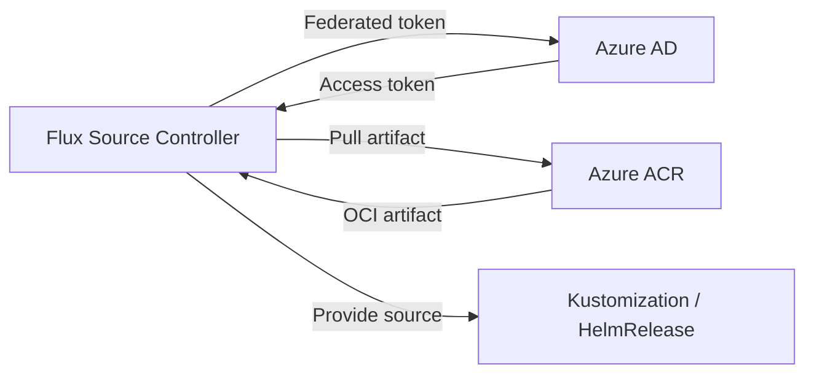

# How to Configure OCIRepository with Azure ACR in Flux

Author: [nawazdhandala](https://github.com/nawazdhandala)

Tags: Flux CD, GitOps, Kubernetes, OCI, OCIRepository, Azure, ACR, AKS, Workload Identity

Description: Learn how to configure Flux CD OCIRepository to pull OCI artifacts from Azure Container Registry (ACR) using Workload Identity, managed identity, and static credentials.

---

## Introduction

Azure Container Registry (ACR) is a managed container registry service that supports OCI artifacts. Flux CD can pull Kubernetes manifests stored as OCI artifacts in ACR using several authentication methods, including Azure Workload Identity (recommended for AKS), managed identity, and static credentials with service principal or admin tokens.

This guide walks through configuring OCIRepository with ACR, covering the recommended Workload Identity approach and alternative methods.

## Prerequisites

Before you begin, ensure you have:

- An AKS cluster (or any Kubernetes cluster with Azure access) running Flux CD v0.35 or later
- The `flux` CLI, `kubectl`, and `az` CLI installed
- An ACR instance with OCI artifacts pushed
- Permissions to manage Azure AD applications and role assignments

## Architecture Overview

Here is how Flux pulls OCI artifacts from ACR using Azure Workload Identity.



## Method 1: Azure Workload Identity (Recommended for AKS)

Azure Workload Identity is the recommended authentication method for AKS clusters. It replaces pod-managed identity and provides secure, automatic credential management.

### Step 1: Enable Workload Identity on AKS

Ensure your AKS cluster has Workload Identity enabled.

```bash
# Enable OIDC issuer and Workload Identity on an existing AKS cluster
az aks update \
  --resource-group my-resource-group \
  --name my-aks-cluster \
  --enable-oidc-issuer \
  --enable-workload-identity
```

### Step 2: Create a Managed Identity

Create a user-assigned managed identity for the Flux source-controller.

```bash
# Create a managed identity
az identity create \
  --resource-group my-resource-group \
  --name flux-source-controller-identity

# Get the identity client ID and principal ID
IDENTITY_CLIENT_ID=$(az identity show \
  --resource-group my-resource-group \
  --name flux-source-controller-identity \
  --query clientId -o tsv)

IDENTITY_PRINCIPAL_ID=$(az identity show \
  --resource-group my-resource-group \
  --name flux-source-controller-identity \
  --query principalId -o tsv)
```

### Step 3: Grant ACR Pull Permissions

Assign the AcrPull role to the managed identity on your ACR instance.

```bash
# Get the ACR resource ID
ACR_ID=$(az acr show \
  --name myregistry \
  --resource-group my-resource-group \
  --query id -o tsv)

# Assign AcrPull role to the managed identity
az role assignment create \
  --assignee-object-id $IDENTITY_PRINCIPAL_ID \
  --assignee-principal-type ServicePrincipal \
  --role AcrPull \
  --scope $ACR_ID
```

### Step 4: Create a Federated Credential

Create a federated identity credential that links the Kubernetes service account to the Azure managed identity.

```bash
# Get the OIDC issuer URL
OIDC_ISSUER=$(az aks show \
  --resource-group my-resource-group \
  --name my-aks-cluster \
  --query "oidcIssuerProfile.issuerUrl" -o tsv)

# Create the federated credential
az identity federated-credential create \
  --name flux-source-controller-fed \
  --identity-name flux-source-controller-identity \
  --resource-group my-resource-group \
  --issuer $OIDC_ISSUER \
  --subject system:serviceaccount:flux-system:source-controller \
  --audiences api://AzureADTokenExchange
```

### Step 5: Annotate the Source Controller Service Account

Add the Workload Identity annotation to the source-controller service account.

```bash
# Annotate the service account with the managed identity client ID
kubectl annotate serviceaccount source-controller \
  -n flux-system \
  azure.workload.identity/client-id=$IDENTITY_CLIENT_ID \
  --overwrite

# Label the service account to enable Workload Identity injection
kubectl label serviceaccount source-controller \
  -n flux-system \
  azure.workload.identity/use=true \
  --overwrite
```

### Step 6: Restart the Source Controller

```bash
# Restart the source-controller to pick up Workload Identity configuration
kubectl rollout restart deployment/source-controller -n flux-system
kubectl rollout status deployment/source-controller -n flux-system
```

### Step 7: Create the OCIRepository with Azure Provider

```yaml
# ocirepository-acr-workload-identity.yaml
# OCIRepository configured to pull from ACR using Azure Workload Identity
apiVersion: source.toolkit.fluxcd.io/v1
kind: OCIRepository
metadata:
  name: my-app
  namespace: flux-system
spec:
  interval: 5m
  url: oci://myregistry.azurecr.io/my-app-manifests
  ref:
    tag: latest
  # Use the Azure provider for automatic ACR authentication
  provider: azure
```

Apply and verify.

```bash
# Apply the OCIRepository manifest
kubectl apply -f ocirepository-acr-workload-identity.yaml

# Verify the source is ready
flux get sources oci
```

## Method 2: Static Credentials with Service Principal

For non-AKS clusters, use a service principal with a client secret.

### Step 1: Create a Service Principal

```bash
# Create a service principal with AcrPull role on the ACR
ACR_ID=$(az acr show --name myregistry --resource-group my-resource-group --query id -o tsv)

SP_CREDENTIALS=$(az ad sp create-for-rbac \
  --name flux-acr-reader \
  --role AcrPull \
  --scopes $ACR_ID \
  --query "{appId: appId, password: password}" -o json)

SP_APP_ID=$(echo $SP_CREDENTIALS | jq -r '.appId')
SP_PASSWORD=$(echo $SP_CREDENTIALS | jq -r '.password')
```

### Step 2: Create a Kubernetes Secret

```bash
# Create a Docker registry secret with the service principal credentials
kubectl create secret docker-registry acr-credentials \
  --namespace=flux-system \
  --docker-server=myregistry.azurecr.io \
  --docker-username=$SP_APP_ID \
  --docker-password=$SP_PASSWORD
```

### Step 3: Create the OCIRepository with secretRef

```yaml
# ocirepository-acr-secret.yaml
# OCIRepository using a service principal secret for ACR authentication
apiVersion: source.toolkit.fluxcd.io/v1
kind: OCIRepository
metadata:
  name: my-app
  namespace: flux-system
spec:
  interval: 5m
  url: oci://myregistry.azurecr.io/my-app-manifests
  ref:
    tag: latest
  # Reference the secret containing service principal credentials
  secretRef:
    name: acr-credentials
```

## Method 3: ACR Admin Account (Development Only)

For development environments, you can use the ACR admin account. This is not recommended for production.

```bash
# Enable the admin account on ACR
az acr update --name myregistry --admin-enabled true

# Get the admin credentials
ACR_USERNAME=$(az acr credential show --name myregistry --query "username" -o tsv)
ACR_PASSWORD=$(az acr credential show --name myregistry --query "passwords[0].value" -o tsv)

# Create the Kubernetes secret
kubectl create secret docker-registry acr-admin-credentials \
  --namespace=flux-system \
  --docker-server=myregistry.azurecr.io \
  --docker-username=$ACR_USERNAME \
  --docker-password=$ACR_PASSWORD
```

## Pushing Artifacts to ACR

Push OCI artifacts to ACR using the Flux CLI.

```bash
# Log in to ACR
az acr login --name myregistry

# Push the artifact
flux push artifact oci://myregistry.azurecr.io/my-app-manifests:1.0.0 \
  --path=./deploy \
  --source="$(git config --get remote.origin.url)" \
  --revision="main/$(git rev-parse HEAD)"

# Verify the push
flux list artifacts oci://myregistry.azurecr.io/my-app-manifests
```

## Verifying the Setup

Check that Flux can pull artifacts from ACR.

```bash
# Check OCIRepository status
flux get sources oci

# Get detailed status
kubectl describe ocirepository my-app -n flux-system

# Check source-controller logs
kubectl logs -n flux-system deploy/source-controller | grep "my-app"
```

## Troubleshooting

**Workload Identity not working**: Verify the annotation, label, and federated credential are correct.

```bash
# Check the service account configuration
kubectl get sa source-controller -n flux-system -o yaml

# Verify the federated credential
az identity federated-credential list \
  --identity-name flux-source-controller-identity \
  --resource-group my-resource-group
```

**401 Unauthorized with service principal**: The client secret may have expired. Regenerate it.

```bash
# Reset the service principal credentials
az ad sp credential reset --id $SP_APP_ID
```

**ACR geo-replication**: If using geo-replicated ACR, use the login server URL for the closest region to reduce latency.

**Network restrictions**: If ACR has network rules enabled, ensure the AKS cluster's outbound IP is allowed.

```bash
# Add the AKS outbound IP to ACR network rules
az acr network-rule add \
  --name myregistry \
  --ip-address <AKS_OUTBOUND_IP>
```

## Summary

Configuring OCIRepository with Azure ACR in Flux CD supports multiple authentication methods. Key takeaways:

- Use Azure Workload Identity with `provider: azure` for AKS clusters (recommended)
- Use service principal credentials with `secretRef` for non-AKS environments
- Avoid ACR admin accounts in production
- Grant the AcrPull role to the identity used by Flux
- Restart the source-controller after updating service account annotations
- Check network rules if ACR has restricted access
