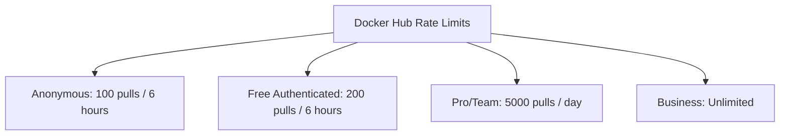

# How to Configure OCIRepository with Docker Hub in Flux

Author: [nawazdhandala](https://github.com/nawazdhandala)

Tags: Flux CD, GitOps, Kubernetes, OCI, OCIRepository, Docker Hub, Container Registry

Description: Learn how to configure Flux CD OCIRepository to pull OCI artifacts from Docker Hub using personal access tokens and robot accounts for authentication.

---

## Introduction

Docker Hub is the most widely used container registry and fully supports OCI artifacts. Flux CD can pull Kubernetes manifests, Helm charts, and Kustomize overlays stored as OCI artifacts in Docker Hub. Authentication uses Docker Hub personal access tokens (PATs) or robot account credentials stored in Kubernetes secrets.

This guide covers pushing OCI artifacts to Docker Hub, configuring OCIRepository with authentication, and managing access for team environments.

## Prerequisites

Before you begin, ensure you have:

- A Kubernetes cluster with Flux CD installed (v0.35 or later)
- The `flux` CLI and `kubectl` installed
- A Docker Hub account (free or paid)
- A Docker Hub personal access token (PAT) with read/write permissions

## Creating a Docker Hub Access Token

Before configuring Flux, create a personal access token in Docker Hub.

1. Log in to Docker Hub at https://hub.docker.com
2. Go to Account Settings, then Security
3. Click "New Access Token"
4. Set a description (e.g., "Flux CD Source Controller") and the appropriate permissions
5. Copy the generated token

For read-only access (pulling artifacts), select the "Read-only" scope. For pushing and pulling, select "Read, Write, Delete".

## Pushing Artifacts to Docker Hub

First, authenticate with Docker Hub and push your Kubernetes manifests as OCI artifacts.

```bash
# Log in to Docker Hub with your access token
echo $DOCKER_HUB_TOKEN | docker login -u $DOCKER_HUB_USERNAME --password-stdin

# Push the artifact to Docker Hub
# Format: oci://docker.io/NAMESPACE/REPOSITORY:TAG
flux push artifact oci://docker.io/my-org/my-app-manifests:1.0.0 \
  --path=./deploy \
  --source="$(git config --get remote.origin.url)" \
  --revision="main/$(git rev-parse HEAD)"

# Verify the push
flux list artifacts oci://docker.io/my-org/my-app-manifests
```

For personal accounts, the namespace is your Docker Hub username. For organizations, use the organization name.

## Configuring Authentication

### Step 1: Create a Kubernetes Secret

Create a Docker registry secret with your Docker Hub credentials.

```bash
# Create a Docker registry secret for Docker Hub authentication
kubectl create secret docker-registry dockerhub-credentials \
  --namespace=flux-system \
  --docker-server=docker.io \
  --docker-username=$DOCKER_HUB_USERNAME \
  --docker-password=$DOCKER_HUB_TOKEN
```

Alternatively, use the Flux CLI to create the secret.

```bash
# Create the secret using Flux CLI
flux create secret oci dockerhub-credentials \
  --namespace=flux-system \
  --url=docker.io \
  --username=$DOCKER_HUB_USERNAME \
  --password=$DOCKER_HUB_TOKEN
```

### Step 2: Create the OCIRepository

Configure the OCIRepository to pull artifacts from Docker Hub using the secret.

```yaml
# ocirepository-dockerhub.yaml
# OCIRepository configured to pull from Docker Hub with authentication
apiVersion: source.toolkit.fluxcd.io/v1
kind: OCIRepository
metadata:
  name: my-app
  namespace: flux-system
spec:
  interval: 5m
  # Docker Hub URL format: oci://docker.io/NAMESPACE/REPOSITORY
  url: oci://docker.io/my-org/my-app-manifests
  ref:
    tag: latest
  # Reference the secret containing Docker Hub credentials
  secretRef:
    name: dockerhub-credentials
```

Apply and verify.

```bash
# Apply the OCIRepository manifest
kubectl apply -f ocirepository-dockerhub.yaml

# Verify the source is ready
flux get sources oci
```

## Pulling from Public Repositories

For public Docker Hub repositories, you do not need authentication. However, Docker Hub applies rate limits to anonymous pulls (100 pulls per 6 hours per IP). Using authentication increases this limit (200 pulls per 6 hours for free accounts, higher for paid).

```yaml
# ocirepository-dockerhub-public.yaml
# OCIRepository for a public Docker Hub repository (no auth required)
apiVersion: source.toolkit.fluxcd.io/v1
kind: OCIRepository
metadata:
  name: public-manifests
  namespace: flux-system
spec:
  interval: 10m
  url: oci://docker.io/my-org/public-manifests
  ref:
    tag: latest
  # No secretRef needed for public repositories
  # But adding one avoids rate limiting
```

To avoid rate limits even on public repos, add authentication.

```yaml
# ocirepository-dockerhub-public-auth.yaml
# Public repository with authentication to avoid rate limits
apiVersion: source.toolkit.fluxcd.io/v1
kind: OCIRepository
metadata:
  name: public-manifests
  namespace: flux-system
spec:
  interval: 10m
  url: oci://docker.io/my-org/public-manifests
  ref:
    tag: latest
  # Authenticate even for public repos to get higher rate limits
  secretRef:
    name: dockerhub-credentials
```

## Using Semver for Version Tracking

Configure the OCIRepository to automatically track semantic versions.

```yaml
# ocirepository-dockerhub-semver.yaml
# OCIRepository tracking semver releases from Docker Hub
apiVersion: source.toolkit.fluxcd.io/v1
kind: OCIRepository
metadata:
  name: my-app-semver
  namespace: flux-system
spec:
  interval: 5m
  url: oci://docker.io/my-org/my-app-manifests
  ref:
    # Track all 1.x releases automatically
    semver: ">=1.0.0 <2.0.0"
  secretRef:
    name: dockerhub-credentials
```

## Environment-Based Promotion with Docker Hub

Use tags to promote artifacts through environments.

```bash
# Push the initial version
flux push artifact oci://docker.io/my-org/my-app-manifests:1.2.3 \
  --path=./deploy \
  --source="$(git config --get remote.origin.url)" \
  --revision="main/$(git rev-parse HEAD)"

# Promote to staging
flux tag artifact oci://docker.io/my-org/my-app-manifests:1.2.3 \
  --tag=staging

# After validation, promote to production
flux tag artifact oci://docker.io/my-org/my-app-manifests:1.2.3 \
  --tag=production
```

Configure separate OCIRepository resources for each environment.

```yaml
# ocirepository-dockerhub-staging.yaml
# Staging OCIRepository tracking the "staging" tag
apiVersion: source.toolkit.fluxcd.io/v1
kind: OCIRepository
metadata:
  name: my-app
  namespace: flux-system
spec:
  interval: 1m
  url: oci://docker.io/my-org/my-app-manifests
  ref:
    tag: staging
  secretRef:
    name: dockerhub-credentials
```

## CI/CD Integration with GitHub Actions

Automate pushing artifacts to Docker Hub from a CI/CD pipeline.

```yaml
# .github/workflows/push-to-dockerhub.yaml
name: Push OCI Artifact to Docker Hub
on:
  push:
    branches:
      - main
    paths:
      - 'deploy/**'

jobs:
  push:
    runs-on: ubuntu-latest
    steps:
      # Check out the repository
      - name: Checkout
        uses: actions/checkout@v4

      # Install the Flux CLI
      - name: Setup Flux CLI
        uses: fluxcd/flux2/action@main

      # Authenticate with Docker Hub
      - name: Login to Docker Hub
        uses: docker/login-action@v3
        with:
          username: ${{ secrets.DOCKER_HUB_USERNAME }}
          password: ${{ secrets.DOCKER_HUB_TOKEN }}

      # Push the artifact
      - name: Push manifests
        run: |
          flux push artifact \
            oci://docker.io/${{ secrets.DOCKER_HUB_USERNAME }}/my-app-manifests:${{ github.sha }} \
            --path=./deploy \
            --source="${{ github.repositoryUrl }}" \
            --revision="${{ github.ref_name }}/${{ github.sha }}"

      # Tag as latest
      - name: Tag latest
        run: |
          flux tag artifact \
            oci://docker.io/${{ secrets.DOCKER_HUB_USERNAME }}/my-app-manifests:${{ github.sha }} \
            --tag=latest
```

## Managing Docker Hub Rate Limits

Docker Hub enforces pull rate limits. Here is how to manage them in a Flux environment.



To minimize pull requests:

- Set a longer `spec.interval` (e.g., `10m` or `30m`) to reduce polling frequency
- Use `spec.ref.digest` to pin to a specific version and avoid unnecessary checks
- Authenticate all OCIRepository resources, even for public repos

## Troubleshooting

**Rate limit exceeded (429 Too Many Requests)**: Authenticate to get higher limits or increase the reconciliation interval.

```bash
# Check if rate limiting is the issue
kubectl describe ocirepository my-app -n flux-system | grep -i "rate\|429\|error"
```

**Authentication failed**: Verify your access token is valid and has the correct scope.

```bash
# Test Docker Hub authentication locally
echo $DOCKER_HUB_TOKEN | docker login -u $DOCKER_HUB_USERNAME --password-stdin

# Verify the secret exists
kubectl get secret dockerhub-credentials -n flux-system
```

**Repository not found**: Ensure the repository exists on Docker Hub and the URL format is correct. Docker Hub URLs use `docker.io` as the server.

```bash
# Verify by listing artifacts
flux list artifacts oci://docker.io/my-org/my-app-manifests
```

**Secret in wrong namespace**: The secret must be in the same namespace as the OCIRepository resource. By default, this is `flux-system`.

## Summary

Configuring OCIRepository with Docker Hub in Flux CD is straightforward and works with Docker Hub's standard authentication. Key takeaways:

- Use `oci://docker.io/NAMESPACE/REPOSITORY` as the URL format
- Create a Docker registry secret with a personal access token for authentication
- Authenticate even for public repositories to avoid rate limits
- Use semver references for automatic version tracking
- Set appropriate reconciliation intervals to stay within rate limits
- Integrate artifact pushing into CI/CD pipelines for automated delivery
- Docker Hub Pro/Team/Business plans offer significantly higher rate limits for production use
