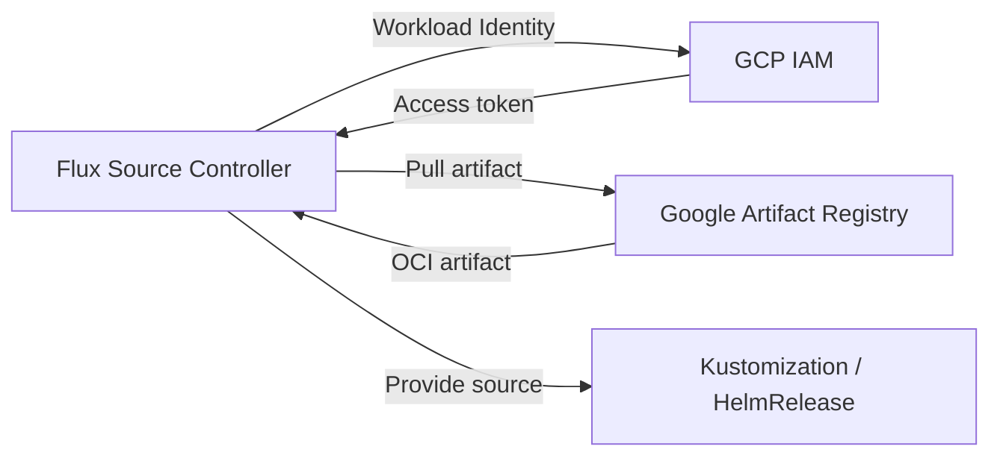

# How to Configure OCIRepository with Google Artifact Registry in Flux

Author: [nawazdhandala](https://github.com/nawazdhandala)

Tags: Flux CD, GitOps, Kubernetes, OCI, OCIRepository, GCP, Google Artifact Registry, GKE, Workload Identity

Description: Learn how to configure Flux CD OCIRepository to pull OCI artifacts from Google Artifact Registry using GKE Workload Identity and service account key authentication.

---

## Introduction

Google Artifact Registry is Google Cloud's managed service for storing container images and other artifacts, including OCI artifacts. Flux CD can pull Kubernetes manifests stored as OCI artifacts in Artifact Registry using GKE Workload Identity (recommended) or static service account key credentials.

This guide covers configuring OCIRepository with Google Artifact Registry, including both authentication methods, pushing artifacts, and troubleshooting common issues.

## Prerequisites

Before you begin, ensure you have:

- A GKE cluster (or any Kubernetes cluster with GCP access) running Flux CD v0.35 or later
- The `flux` CLI, `kubectl`, and `gcloud` CLI installed
- A Google Artifact Registry repository created in Docker format
- Permissions to manage IAM bindings and service accounts

## Architecture Overview

Here is how Flux pulls OCI artifacts from Google Artifact Registry using GKE Workload Identity.



## Setting Up Google Artifact Registry

If you do not already have an Artifact Registry repository, create one.

```bash
# Create a Docker-format Artifact Registry repository
gcloud artifacts repositories create my-flux-repo \
  --repository-format=docker \
  --location=us-central1 \
  --description="Flux OCI artifacts"
```

The repository URL follows this format: `LOCATION-docker.pkg.dev/PROJECT_ID/REPOSITORY_NAME`.

## Method 1: GKE Workload Identity (Recommended)

GKE Workload Identity is the recommended authentication method for GKE clusters. It allows Kubernetes service accounts to act as Google Cloud service accounts without managing keys.

### Step 1: Enable Workload Identity on GKE

Ensure Workload Identity is enabled on your GKE cluster.

```bash
# Enable Workload Identity on an existing GKE cluster
gcloud container clusters update my-gke-cluster \
  --zone=us-central1-a \
  --workload-pool=my-project.svc.id.goog
```

### Step 2: Create a Google Cloud Service Account

Create a service account that Flux will use to access Artifact Registry.

```bash
# Create the service account
gcloud iam service-accounts create flux-source-controller \
  --display-name="Flux Source Controller"
```

### Step 3: Grant Artifact Registry Reader Permissions

Assign the Artifact Registry Reader role to the service account.

```bash
# Grant the Artifact Registry Reader role
gcloud projects add-iam-policy-binding my-project \
  --member="serviceAccount:flux-source-controller@my-project.iam.gserviceaccount.com" \
  --role="roles/artifactregistry.reader"
```

### Step 4: Bind the Kubernetes Service Account to the GCP Service Account

Create an IAM policy binding that allows the Kubernetes service account to impersonate the GCP service account.

```bash
# Allow the Kubernetes service account to use the GCP service account
gcloud iam service-accounts add-iam-policy-binding \
  flux-source-controller@my-project.iam.gserviceaccount.com \
  --role="roles/iam.workloadIdentityUser" \
  --member="serviceAccount:my-project.svc.id.goog[flux-system/source-controller]"
```

### Step 5: Annotate the Source Controller Service Account

Add the Workload Identity annotation to the Flux source-controller service account.

```bash
# Annotate the Kubernetes service account with the GCP service account email
kubectl annotate serviceaccount source-controller \
  -n flux-system \
  iam.gke.io/gcp-service-account=flux-source-controller@my-project.iam.gserviceaccount.com \
  --overwrite
```

### Step 6: Restart the Source Controller

```bash
# Restart the source-controller to pick up Workload Identity configuration
kubectl rollout restart deployment/source-controller -n flux-system
kubectl rollout status deployment/source-controller -n flux-system
```

### Step 7: Create the OCIRepository with GCP Provider

```yaml
# ocirepository-gar-workload-identity.yaml
# OCIRepository configured to pull from Google Artifact Registry using Workload Identity
apiVersion: source.toolkit.fluxcd.io/v1beta2
kind: OCIRepository
metadata:
  name: my-app
  namespace: flux-system
spec:
  interval: 5m
  # URL format: oci://LOCATION-docker.pkg.dev/PROJECT/REPOSITORY/ARTIFACT
  url: oci://us-central1-docker.pkg.dev/my-project/my-flux-repo/my-app-manifests
  ref:
    tag: latest
  # Use the GCP provider for automatic Artifact Registry authentication
  provider: gcp
```

Apply and verify.

```bash
# Apply the OCIRepository manifest
kubectl apply -f ocirepository-gar-workload-identity.yaml

# Verify the source is ready
flux get sources oci
```

## Method 2: Service Account Key (Static Credentials)

For non-GKE clusters or environments where Workload Identity is not available, use a service account key.

### Step 1: Create a Service Account Key

```bash
# Create a key for the service account
gcloud iam service-accounts keys create key.json \
  --iam-account=flux-source-controller@my-project.iam.gserviceaccount.com
```

### Step 2: Create a Kubernetes Secret

```bash
# Create a Docker registry secret using the service account key
kubectl create secret docker-registry gar-credentials \
  --namespace=flux-system \
  --docker-server=us-central1-docker.pkg.dev \
  --docker-username=_json_key \
  --docker-password="$(cat key.json)"

# Remove the key file from disk for security
rm key.json
```

### Step 3: Create the OCIRepository with secretRef

```yaml
# ocirepository-gar-secret.yaml
# OCIRepository using a service account key for Artifact Registry authentication
apiVersion: source.toolkit.fluxcd.io/v1beta2
kind: OCIRepository
metadata:
  name: my-app
  namespace: flux-system
spec:
  interval: 5m
  url: oci://us-central1-docker.pkg.dev/my-project/my-flux-repo/my-app-manifests
  ref:
    tag: latest
  # Reference the secret containing service account key credentials
  secretRef:
    name: gar-credentials
```

## Pushing Artifacts to Google Artifact Registry

Push OCI artifacts to Artifact Registry using the Flux CLI.

```bash
# Authenticate with Artifact Registry
gcloud auth configure-docker us-central1-docker.pkg.dev

# Push the artifact
flux push artifact \
  oci://us-central1-docker.pkg.dev/my-project/my-flux-repo/my-app-manifests:1.0.0 \
  --path=./deploy \
  --source="$(git config --get remote.origin.url)" \
  --revision="main/$(git rev-parse HEAD)"

# Verify the push
flux list artifacts \
  oci://us-central1-docker.pkg.dev/my-project/my-flux-repo/my-app-manifests
```

## Using Semver with Artifact Registry

Configure the OCIRepository to track semantic versions for automatic updates.

```yaml
# ocirepository-gar-semver.yaml
# OCIRepository tracking a semver range from Artifact Registry
apiVersion: source.toolkit.fluxcd.io/v1beta2
kind: OCIRepository
metadata:
  name: my-app-semver
  namespace: flux-system
spec:
  interval: 5m
  url: oci://us-central1-docker.pkg.dev/my-project/my-flux-repo/my-app-manifests
  ref:
    # Automatically pick up patch updates within the 1.x range
    semver: ">=1.0.0 <2.0.0"
  provider: gcp
```

## Multi-Region Setup

Google Artifact Registry supports multiple locations. If you use artifacts across regions, create repositories in each region and configure OCIRepository resources with the appropriate regional URL.

```yaml
# ocirepository-gar-us.yaml
# OCIRepository pulling from the US-Central1 region
apiVersion: source.toolkit.fluxcd.io/v1beta2
kind: OCIRepository
metadata:
  name: my-app-us
  namespace: flux-system
spec:
  interval: 5m
  url: oci://us-central1-docker.pkg.dev/my-project/my-flux-repo/my-app-manifests
  ref:
    tag: latest
  provider: gcp
```

```yaml
# ocirepository-gar-eu.yaml
# OCIRepository pulling from the Europe-West1 region
apiVersion: source.toolkit.fluxcd.io/v1beta2
kind: OCIRepository
metadata:
  name: my-app-eu
  namespace: flux-system
spec:
  interval: 5m
  url: oci://europe-west1-docker.pkg.dev/my-project/my-flux-repo-eu/my-app-manifests
  ref:
    tag: latest
  provider: gcp
```

## Verifying the Setup

Check that Flux can pull artifacts from Artifact Registry.

```bash
# Check OCIRepository status
flux get sources oci

# Get detailed status including revision and digest
kubectl describe ocirepository my-app -n flux-system

# Check source-controller logs for authentication or pull issues
kubectl logs -n flux-system deploy/source-controller | grep "my-app"
```

## Troubleshooting

**Workload Identity not working**: Verify the annotation and IAM bindings.

```bash
# Check the service account annotation
kubectl get sa source-controller -n flux-system -o yaml

# Verify the IAM binding
gcloud iam service-accounts get-iam-policy \
  flux-source-controller@my-project.iam.gserviceaccount.com
```

**403 Forbidden**: The service account may lack the `artifactregistry.reader` role. Verify the IAM policy.

```bash
# Check IAM bindings for the project
gcloud projects get-iam-policy my-project \
  --filter="bindings.members:flux-source-controller" \
  --flatten="bindings[].members"
```

**Repository not found**: Verify the URL format. Artifact Registry URLs include the location, project, repository, and artifact name.

```bash
# List repositories in Artifact Registry
gcloud artifacts repositories list --location=us-central1
```

**Service account key expired**: Service account keys do not expire by default, but organizational policies may enforce key rotation. Regenerate the key and update the Kubernetes secret if needed.

## Summary

Configuring OCIRepository with Google Artifact Registry in Flux CD provides a secure, scalable way to distribute Kubernetes manifests. Key takeaways:

- Use GKE Workload Identity with `provider: gcp` for GKE clusters (recommended)
- Use service account key credentials with `secretRef` for non-GKE environments
- The Artifact Registry URL format is `oci://LOCATION-docker.pkg.dev/PROJECT/REPOSITORY/ARTIFACT`
- Grant the `roles/artifactregistry.reader` role to the service account used by Flux
- Use regional repositories to minimize latency in multi-region deployments
- Always clean up service account key files from disk after creating Kubernetes secrets
