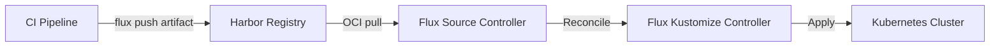

# How to Configure OCIRepository with Harbor in Flux

Author: [nawazdhandala](https://github.com/nawazdhandala)

Tags: Flux CD, GitOps, Kubernetes, OCI, Harbor, Container Registry

Description: Learn how to configure Flux CD's OCIRepository to pull OCI artifacts from a self-hosted Harbor registry for enterprise GitOps workflows.

---

## Introduction

Harbor is a popular open-source container registry that provides features like vulnerability scanning, content signing, and role-based access control. When combined with Flux CD's OCIRepository source, Harbor becomes a powerful distribution hub for Kubernetes manifests packaged as OCI artifacts. This setup is especially appealing for enterprises that need to keep their deployment artifacts within a private, self-managed infrastructure.

This guide covers pushing OCI artifacts to Harbor, configuring Flux to authenticate and pull from Harbor, and handling TLS certificates for private Harbor installations.

## Prerequisites

- A Kubernetes cluster with Flux CD installed (v0.35 or later)
- The `flux` CLI installed
- A Harbor instance (v2.6 or later, which supports OCI artifacts natively)
- A Harbor project and robot account or user credentials
- `kubectl` configured to access your cluster

## Step 1: Create a Harbor Project

Log into the Harbor UI and create a new project for your Flux artifacts. For example, create a project named `flux-artifacts`. Set it to private unless you want public access.

Under the project, navigate to Robot Accounts and create a robot account with the following permissions:

- Pull repository
- Push repository (for pushing artifacts)

Save the robot account name and secret.

## Step 2: Push OCI Artifacts to Harbor

Use the Flux CLI to package and push manifests to Harbor.

```bash
# Push Kubernetes manifests as an OCI artifact to Harbor
flux push artifact oci://harbor.example.com/flux-artifacts/app:v1.0.0 \
  --path=./deploy \
  --source="$(git config --get remote.origin.url)" \
  --revision="$(git branch --show-current)@sha1:$(git rev-parse HEAD)" \
  --creds=robot\$flux-reader:$HARBOR_SECRET
```

Note the backslash before `$` in the robot account name -- Harbor robot accounts use the `robot$` prefix, which must be escaped in shell commands.

Verify the artifact is available.

```bash
# List tags for the pushed artifact
flux list artifacts oci://harbor.example.com/flux-artifacts/app \
  --creds=robot\$flux-reader:$HARBOR_SECRET
```

## Step 3: Create Authentication Secret

Create a Kubernetes secret so Flux can authenticate with your Harbor instance.

```bash
# Create a docker-registry secret for Harbor authentication
kubectl create secret docker-registry harbor-auth \
  --namespace=flux-system \
  --docker-server=harbor.example.com \
  --docker-username='robot$flux-reader' \
  --docker-password=$HARBOR_SECRET
```

## Step 4: Handle Custom TLS Certificates

If your Harbor instance uses a self-signed or internal CA certificate, Flux needs to trust that certificate. Create a secret containing the CA certificate.

```bash
# Create a secret containing Harbor's CA certificate
kubectl create secret generic harbor-ca-cert \
  --namespace=flux-system \
  --from-file=ca.crt=/path/to/harbor-ca.crt
```

You will reference this in the OCIRepository spec using `spec.certSecretRef`.

## Step 5: Configure the OCIRepository Resource

Create the OCIRepository resource pointing to your Harbor registry.

```yaml
# ocirepository-harbor.yaml -- Flux OCIRepository pointing to Harbor
apiVersion: source.toolkit.fluxcd.io/v1
kind: OCIRepository
metadata:
  name: app-manifests
  namespace: flux-system
spec:
  interval: 5m
  url: oci://harbor.example.com/flux-artifacts/app
  ref:
    # Use semver to track versioned releases
    semver: ">=1.0.0"
  secretRef:
    # Harbor authentication credentials
    name: harbor-auth
  certSecretRef:
    # CA certificate for self-signed Harbor TLS (omit for public CAs)
    name: harbor-ca-cert
```

Apply the resource.

```bash
# Apply the OCIRepository resource
kubectl apply -f ocirepository-harbor.yaml
```

## Step 6: Create a Kustomization for Deployment

Wire up a Kustomization to deploy the manifests pulled from Harbor.

```yaml
# kustomization-app.yaml -- Deploy manifests from Harbor OCI artifact
apiVersion: kustomize.toolkit.fluxcd.io/v1
kind: Kustomization
metadata:
  name: app
  namespace: flux-system
spec:
  interval: 10m
  targetNamespace: default
  sourceRef:
    kind: OCIRepository
    name: app-manifests
  path: ./
  prune: true
  wait: true
  timeout: 2m
```

```bash
# Apply the Kustomization
kubectl apply -f kustomization-app.yaml
```

## Step 7: Verify the Configuration

Check both the source and the deployment status.

```bash
# Check OCIRepository status
flux get sources oci

# Check Kustomization reconciliation status
flux get kustomizations

# Get detailed information about the OCIRepository
kubectl describe ocirepository app-manifests -n flux-system
```

The OCIRepository should show the resolved artifact digest, and the Kustomization should show a successful apply.

## Architecture Overview

The following diagram shows the flow from CI to cluster.



## Harbor-Specific Considerations

### Proxy Cache Projects

Harbor supports proxy cache projects that mirror remote registries. If you use a proxy cache project to cache upstream OCI artifacts, configure the OCIRepository URL to point to the Harbor proxy endpoint.

```yaml
# Using Harbor's proxy cache for upstream artifacts
apiVersion: source.toolkit.fluxcd.io/v1
kind: OCIRepository
metadata:
  name: upstream-manifests
  namespace: flux-system
spec:
  interval: 10m
  url: oci://harbor.example.com/proxy-cache/upstream-org/app
  ref:
    tag: latest
  secretRef:
    name: harbor-auth
```

### Vulnerability Scanning

Harbor can scan OCI artifacts for vulnerabilities. You can configure Harbor's project policies to prevent pulling artifacts with critical vulnerabilities. This adds a security gate before Flux deploys anything to your cluster.

### Replication

For multi-cluster setups, use Harbor's replication feature to replicate OCI artifacts across multiple Harbor instances. Each cluster's Flux installation can then pull from its local Harbor instance, reducing latency and improving reliability.

## Troubleshooting

Common issues when using Harbor with Flux:

- **401 Unauthorized**: Verify that the robot account credentials are correct and the account has pull permissions on the project
- **x509 certificate signed by unknown authority**: Ensure the `certSecretRef` contains the correct CA certificate and the key in the secret is named `ca.crt`
- **artifact not found**: Check that the project name, repository path, and tag all match what was pushed
- **rate limiting**: If Harbor has rate limits configured, increase the OCIRepository `interval` to reduce pull frequency

## Conclusion

Harbor and Flux CD together provide an enterprise-grade GitOps pipeline with OCI artifacts as the delivery mechanism. Harbor's features like vulnerability scanning, replication, and RBAC add governance layers on top of the Flux deployment workflow. By configuring OCIRepository with proper authentication and TLS settings, you get a secure, self-hosted artifact distribution system that integrates seamlessly with Flux's reconciliation loop.
