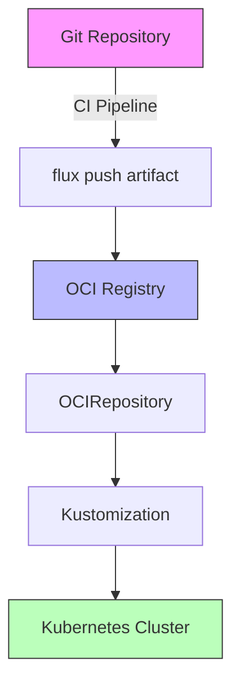

# How to Use OCIRepository Instead of GitRepository in Flux

Author: [nawazdhandala](https://github.com/nawazdhandala)

Tags: Flux CD, GitOps, Kubernetes, OCI, GitRepository, Migration

Description: Learn why and how to migrate from GitRepository to OCIRepository in Flux CD for faster, more scalable artifact delivery.

---

## Introduction

Flux CD traditionally uses GitRepository as its primary source for Kubernetes manifests. While this approach works well, it has limitations: Git repositories can be large and slow to clone, Git hosting services impose rate limits, and Git authentication adds complexity. OCIRepository provides an alternative that packages manifests as OCI artifacts in container registries, offering faster pulls, better caching, and a decoupled delivery pipeline.

This guide explains the differences between GitRepository and OCIRepository, when to choose one over the other, and how to migrate an existing GitRepository-based setup to OCIRepository.

## GitRepository vs. OCIRepository

Here is a comparison of the two approaches.

| Feature | GitRepository | OCIRepository |
|---------|--------------|---------------|
| Source | Git repository (full or shallow clone) | OCI artifact in a container registry |
| Authentication | SSH keys, HTTPS tokens, deploy keys | Docker registry credentials |
| Artifact size | Entire repo or sparse checkout | Only the packaged manifests |
| Pull speed | Depends on repo size | Fast (compressed layers) |
| Rate limits | Git hosting API limits | Registry pull limits |
| Versioning | Git branches, tags, commits | OCI tags, semver, digests |
| Signature verification | Git commit signing (GPG) | Cosign OCI signatures |

OCIRepository is particularly advantageous when:

- Your Git repository is large and cloning is slow
- You want to decouple manifest delivery from Git hosting availability
- You need to distribute manifests across many clusters efficiently
- You want to leverage existing container registry infrastructure

## Step 1: Understand the Current GitRepository Setup

Here is a typical GitRepository configuration.

```yaml
# Current GitRepository configuration
apiVersion: source.toolkit.fluxcd.io/v1
kind: GitRepository
metadata:
  name: app-manifests
  namespace: flux-system
spec:
  interval: 5m
  url: https://github.com/your-org/app-deployment
  ref:
    branch: main
  secretRef:
    name: git-credentials
```

And the Kustomization that references it.

```yaml
# Current Kustomization referencing GitRepository
apiVersion: kustomize.toolkit.fluxcd.io/v1
kind: Kustomization
metadata:
  name: app
  namespace: flux-system
spec:
  interval: 10m
  sourceRef:
    kind: GitRepository
    name: app-manifests
  path: ./deploy/production
  prune: true
```

## Step 2: Set Up an OCI Artifact Push Pipeline

Create a CI pipeline that pushes your manifests as an OCI artifact whenever the deployment directory changes.

```bash
# Push the deploy directory as an OCI artifact
flux push artifact oci://registry.example.com/deployments/app:v1.0.0 \
  --path=./deploy/production \
  --source="https://github.com/your-org/app-deployment" \
  --revision="main@sha1:$(git rev-parse HEAD)"
```

Note that the `--path` flag specifies the exact directory to package. Unlike GitRepository, only the contents of this directory are included in the artifact, making it smaller and faster to pull.

For tagging, you can use semantic versioning, Git commit SHAs, or any tagging scheme that fits your workflow.

```bash
# Push with multiple tags for flexibility
flux push artifact oci://registry.example.com/deployments/app:v1.0.0 \
  --path=./deploy/production \
  --source="https://github.com/your-org/app-deployment" \
  --revision="main@sha1:$(git rev-parse HEAD)"

# Also tag with the commit SHA for precise pinning
flux tag artifact oci://registry.example.com/deployments/app:v1.0.0 \
  --tag=$(git rev-parse --short HEAD)
```

## Step 3: Create Registry Credentials

Create a Kubernetes secret for registry authentication.

```bash
# Create a docker-registry secret for the OCI registry
kubectl create secret docker-registry oci-registry-auth \
  --namespace=flux-system \
  --docker-server=registry.example.com \
  --docker-username=flux-reader \
  --docker-password=$REGISTRY_PASSWORD
```

## Step 4: Create the OCIRepository Resource

Replace the GitRepository with an OCIRepository.

```yaml
# New OCIRepository configuration (replaces GitRepository)
apiVersion: source.toolkit.fluxcd.io/v1beta2
kind: OCIRepository
metadata:
  name: app-manifests
  namespace: flux-system
spec:
  interval: 5m
  url: oci://registry.example.com/deployments/app
  ref:
    # Use semver to automatically pick the latest version
    semver: ">=1.0.0"
  secretRef:
    name: oci-registry-auth
```

## Step 5: Update the Kustomization

Update the Kustomization to reference the OCIRepository. Since the OCI artifact contains only the deployment directory contents, the path changes to the root.

```yaml
# Updated Kustomization referencing OCIRepository
apiVersion: kustomize.toolkit.fluxcd.io/v1
kind: Kustomization
metadata:
  name: app
  namespace: flux-system
spec:
  interval: 10m
  sourceRef:
    # Changed from GitRepository to OCIRepository
    kind: OCIRepository
    name: app-manifests
  # Path is now root since the artifact only contains the deploy contents
  path: ./
  prune: true
```

## Step 6: Apply and Migrate

Apply the new resources and remove the old GitRepository.

```bash
# Apply the new OCIRepository
kubectl apply -f ocirepository-app.yaml

# Wait for it to become ready
flux get sources oci --watch

# Update the Kustomization
kubectl apply -f kustomization-app.yaml

# Verify the Kustomization reconciles successfully
flux get kustomizations

# Once confirmed working, remove the old GitRepository
kubectl delete gitrepository app-manifests -n flux-system
```

## Migration Flow



## Running Both Sources During Migration

For a zero-downtime migration, you can run both sources simultaneously with different names, then switch the Kustomization once the OCIRepository is confirmed working.

```yaml
# Temporary OCIRepository with a different name for testing
apiVersion: source.toolkit.fluxcd.io/v1beta2
kind: OCIRepository
metadata:
  name: app-manifests-oci
  namespace: flux-system
spec:
  interval: 5m
  url: oci://registry.example.com/deployments/app
  ref:
    semver: ">=1.0.0"
  secretRef:
    name: oci-registry-auth
```

Once the OCIRepository shows a ready status and the artifact digest is available, update the Kustomization's `sourceRef` to point to `app-manifests-oci`, then clean up the old resources.

## Key Differences to Watch For

When migrating, keep these differences in mind:

1. **Path handling**: With GitRepository, `path` in the Kustomization points to a subdirectory of the repo. With OCIRepository, the artifact already contains only the relevant files, so `path` is typically `./`.

2. **Update detection**: GitRepository detects changes via Git commits. OCIRepository detects changes via new tags or digest changes. Your CI pipeline must push a new artifact for Flux to detect updates.

3. **Authentication**: Git SSH keys and HTTPS tokens are replaced by Docker registry credentials. Ensure your registry credentials are correctly configured.

4. **Suspend behavior**: Both sources support `spec.suspend: true` to pause reconciliation. This works the same way for OCIRepository as it does for GitRepository.

## Conclusion

Migrating from GitRepository to OCIRepository in Flux CD gives you faster artifact delivery, smaller payloads, and better scalability across multiple clusters. The migration is straightforward: set up a CI pipeline to push OCI artifacts, create an OCIRepository resource, and update your Kustomization's sourceRef. By running both sources in parallel during migration, you can validate the new setup before removing the old one, ensuring zero downtime in your deployment pipeline.
