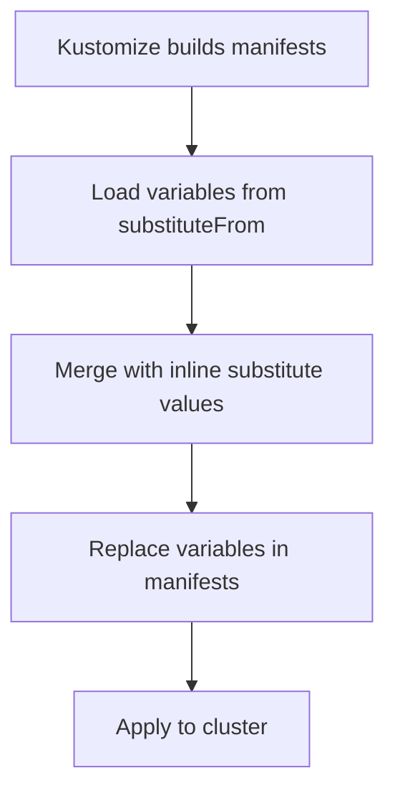

# How to Use Post-Build Variable Substitution in Flux Kustomization

Author: [nawazdhandala](https://github.com/nawazdhandala)

Tags: Flux CD, GitOps, Kubernetes, Kustomize, Post-Build, Variable Substitution, SubstituteFrom

Description: Learn how to use spec.postBuild.substituteFrom in Flux Kustomizations to load substitution variables from ConfigMaps and Secrets for flexible multi-environment deployments.

---

## Introduction

While inline variable substitution with `spec.postBuild.substitute` works well for a small number of variables, managing dozens of variables across multiple environments can become cumbersome. Flux provides `spec.postBuild.substituteFrom` to load variables from Kubernetes ConfigMaps and Secrets. This approach lets you manage variables externally, keep sensitive values in Secrets, and share variable sets across multiple Kustomizations. This guide covers the full post-build substitution pipeline.

## The Post-Build Pipeline

Post-build substitution occurs after Kustomize renders the manifests and before Flux applies them to the cluster. Variables can come from two sources, and they are merged in a specific order.



The merge order is:

1. Variables from `substituteFrom` entries (ConfigMaps and Secrets) are loaded in order
2. Inline `substitute` values override any values from `substituteFrom`

## Loading Variables from ConfigMaps

Create a ConfigMap with your variables as key-value pairs, then reference it in `substituteFrom`.

```yaml
# env-vars-configmap.yaml - Variables stored in a ConfigMap
apiVersion: v1
kind: ConfigMap
metadata:
  name: cluster-vars
  namespace: flux-system
data:
  CLUSTER_NAME: production-east
  ENVIRONMENT: production
  REGION: us-east-1
  DOMAIN: app.example.com
  REPLICAS: "3"
  LOG_LEVEL: warn
```

Apply the ConfigMap to your cluster:

```bash
# Create the ConfigMap in the flux-system namespace
kubectl apply -f env-vars-configmap.yaml
```

Now reference the ConfigMap in your Kustomization:

```yaml
# kustomization-substitute-from.yaml - Load variables from ConfigMap
apiVersion: kustomize.toolkit.fluxcd.io/v1
kind: Kustomization
metadata:
  name: my-app
  namespace: flux-system
spec:
  interval: 10m
  sourceRef:
    kind: GitRepository
    name: my-repo
  path: ./deploy
  prune: true
  postBuild:
    substituteFrom:
      # Load variables from a ConfigMap
      - kind: ConfigMap
        name: cluster-vars
```

Every key in the ConfigMap becomes a variable that Flux substitutes in the rendered manifests.

## Loading Variables from Secrets

For sensitive values like database passwords or API keys, use Kubernetes Secrets instead of ConfigMaps.

```yaml
# secret-vars.yaml - Sensitive variables in a Secret
apiVersion: v1
kind: Secret
metadata:
  name: app-secrets
  namespace: flux-system
type: Opaque
stringData:
  DATABASE_PASSWORD: supersecretpassword
  API_KEY: sk-abc123def456
  REDIS_URL: redis://:password@redis.internal:6379
```

```bash
# Create the Secret in the flux-system namespace
kubectl apply -f secret-vars.yaml
```

Reference the Secret in your Kustomization:

```yaml
# kustomization-secret-vars.yaml - Load variables from a Secret
apiVersion: kustomize.toolkit.fluxcd.io/v1
kind: Kustomization
metadata:
  name: my-app
  namespace: flux-system
spec:
  interval: 10m
  sourceRef:
    kind: GitRepository
    name: my-repo
  path: ./deploy
  prune: true
  postBuild:
    substituteFrom:
      - kind: Secret
        name: app-secrets
```

## Combining Multiple Sources

You can load variables from multiple ConfigMaps, multiple Secrets, and combine them with inline values. Later entries override earlier ones, and inline `substitute` values override everything.

```yaml
# kustomization-combined.yaml - Multiple variable sources
apiVersion: kustomize.toolkit.fluxcd.io/v1
kind: Kustomization
metadata:
  name: my-app
  namespace: flux-system
spec:
  interval: 10m
  sourceRef:
    kind: GitRepository
    name: my-repo
  path: ./deploy
  prune: true
  postBuild:
    substituteFrom:
      # 1. Load cluster-wide variables first
      - kind: ConfigMap
        name: cluster-vars
      # 2. Load app-specific variables (overrides cluster-vars if keys overlap)
      - kind: ConfigMap
        name: app-vars
      # 3. Load secrets (overrides above if keys overlap)
      - kind: Secret
        name: app-secrets
    substitute:
      # 4. Inline values override everything above
      APP_VERSION: "2.6.0"
```

The resolution order for a variable that appears in multiple sources:

1. `cluster-vars` ConfigMap (lowest priority in `substituteFrom`)
2. `app-vars` ConfigMap (overrides `cluster-vars`)
3. `app-secrets` Secret (overrides `app-vars`)
4. Inline `substitute` (highest priority, overrides everything)

## Using Variables in Manifests

Your manifests use the `${VAR_NAME}` syntax regardless of whether the variable comes from `substitute` or `substituteFrom`.

```yaml
# deploy/deployment.yaml - Manifest using substituted variables
apiVersion: apps/v1
kind: Deployment
metadata:
  name: my-app
  namespace: default
  labels:
    cluster: ${CLUSTER_NAME}
    environment: ${ENVIRONMENT}
spec:
  replicas: ${REPLICAS}
  selector:
    matchLabels:
      app: my-app
  template:
    metadata:
      labels:
        app: my-app
    spec:
      containers:
        - name: app
          image: myregistry.io/my-app:${APP_VERSION}
          env:
            - name: DATABASE_PASSWORD
              value: ${DATABASE_PASSWORD}
            - name: API_KEY
              value: ${API_KEY}
            - name: LOG_LEVEL
              value: ${LOG_LEVEL:=info}
```

## Optional substituteFrom References

By default, if a ConfigMap or Secret referenced in `substituteFrom` does not exist, the Kustomization will fail. You can make a reference optional so that missing sources are silently ignored.

```yaml
# kustomization-optional.yaml - Optional substituteFrom reference
apiVersion: kustomize.toolkit.fluxcd.io/v1
kind: Kustomization
metadata:
  name: my-app
  namespace: flux-system
spec:
  interval: 10m
  sourceRef:
    kind: GitRepository
    name: my-repo
  path: ./deploy
  prune: true
  postBuild:
    substituteFrom:
      # Required - will fail if missing
      - kind: ConfigMap
        name: cluster-vars
      # Optional - silently ignored if missing
      - kind: ConfigMap
        name: extra-vars
        optional: true
      # Optional - useful for secrets that may not exist in all environments
      - kind: Secret
        name: optional-secrets
        optional: true
```

## Multi-Environment Pattern

A powerful pattern is to have per-environment ConfigMaps with the same keys but different values. Each cluster has its own ConfigMap, and the same Kustomization definition works everywhere.

```yaml
# On the staging cluster, create:
# kubectl apply -f - <<EOF
apiVersion: v1
kind: ConfigMap
metadata:
  name: env-config
  namespace: flux-system
data:
  ENVIRONMENT: staging
  REPLICAS: "2"
  LOG_LEVEL: debug
# EOF

# On the production cluster, create:
# kubectl apply -f - <<EOF
apiVersion: v1
kind: ConfigMap
metadata:
  name: env-config
  namespace: flux-system
data:
  ENVIRONMENT: production
  REPLICAS: "5"
  LOG_LEVEL: warn
# EOF
```

The Kustomization definition is identical on both clusters:

```yaml
# kustomization-multi-env.yaml - Same definition, different ConfigMap content per cluster
apiVersion: kustomize.toolkit.fluxcd.io/v1
kind: Kustomization
metadata:
  name: my-app
  namespace: flux-system
spec:
  interval: 10m
  sourceRef:
    kind: GitRepository
    name: my-repo
  path: ./deploy
  prune: true
  postBuild:
    substituteFrom:
      - kind: ConfigMap
        name: env-config
```

## Debugging Substitution Issues

```bash
# Preview the rendered manifests with substitutions applied
flux build kustomization my-app

# Check if the ConfigMap or Secret exists
kubectl get configmap cluster-vars -n flux-system
kubectl get secret app-secrets -n flux-system

# Check the Kustomization status for substitution errors
kubectl describe kustomization my-app -n flux-system
```

## Best Practices

1. **Separate concerns**: Use ConfigMaps for non-sensitive variables and Secrets for sensitive ones.
2. **Use the optional flag** for variable sources that may not exist in all environments.
3. **Leverage the merge order**: Put common defaults in the first `substituteFrom` entry and environment-specific overrides in later entries.
4. **Keep inline substitute minimal**: Use it only for values that change frequently (like version numbers) and load everything else from ConfigMaps.
5. **Manage ConfigMaps and Secrets with Flux**: Store the variable ConfigMaps and Secrets in a separate Kustomization that deploys before the application Kustomization.

## Conclusion

Post-build variable substitution with `substituteFrom` gives you a flexible and scalable way to manage environment-specific configuration in Flux CD. By loading variables from ConfigMaps and Secrets, you avoid embedding values directly in Kustomization resources and can easily share variable sets across multiple applications. Combined with inline `substitute` overrides and the optional flag, this feature provides the building blocks for managing complex multi-environment deployments through GitOps.
