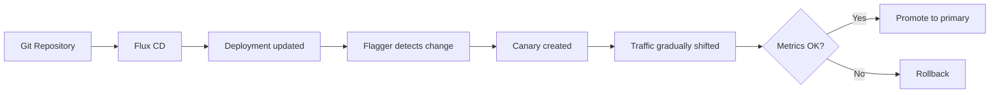

# How Progressive Delivery Works with Flux CD and Flagger

Author: [nawazdhandala](https://github.com/nawazdhandala)

Tags: Flux CD, GitOps, Kubernetes, Flagger, Progressive Delivery, Canary, Blue-Green

Description: An in-depth guide to progressive delivery with Flux CD and Flagger, covering canary releases, blue-green deployments, and automated rollback based on metrics.

---

Progressive delivery extends continuous delivery by gradually shifting traffic to a new version while monitoring key metrics. If something goes wrong, the rollout is automatically halted and rolled back. Flagger is the progressive delivery operator that integrates natively with Flux CD to provide canary releases, blue-green deployments, and A/B testing on Kubernetes.

## How Flagger Fits into the Flux CD Ecosystem

Flagger is a CNCF project that works alongside Flux CD. While Flux ensures the desired state from Git is applied to the cluster, Flagger takes over the deployment rollout process. Instead of Kubernetes performing a standard rolling update, Flagger intercepts the deployment, creates a copy (the canary), and gradually shifts traffic to it.

Flagger supports multiple service meshes and ingress controllers for traffic shifting, including Istio, Linkerd, NGINX, Contour, and Gateway API.



## Installing Flagger with Flux CD

Flagger can be installed as a Flux HelmRelease. This keeps Flagger itself managed via GitOps.

```yaml
# HelmRepository source for Flagger's Helm chart
apiVersion: source.toolkit.fluxcd.io/v1
kind: HelmRepository
metadata:
  name: flagger
  namespace: flux-system
spec:
  interval: 1h
  url: https://flagger.app
---
# HelmRelease to install Flagger with Prometheus metrics
apiVersion: helm.toolkit.fluxcd.io/v2
kind: HelmRelease
metadata:
  name: flagger
  namespace: flux-system
spec:
  interval: 1h
  chart:
    spec:
      chart: flagger
      version: "1.x"
      sourceRef:
        kind: HelmRepository
        name: flagger
  values:
    metricsServer: http://prometheus.monitoring:9090
    meshProvider: istio
```

## Canary Deployment Pattern

The canary pattern gradually shifts a percentage of traffic to the new version. Flagger monitors success rate and latency metrics at each step. If metrics degrade, the canary is rolled back.

Here is a Canary resource definition for a typical web application.

```yaml
# Canary resource that defines the progressive delivery strategy
apiVersion: flagger.app/v1beta1
kind: Canary
metadata:
  name: my-app
  namespace: production
spec:
  # Reference to the deployment that Flagger manages
  targetRef:
    apiVersion: apps/v1
    kind: Deployment
    name: my-app
  # Service configuration for traffic routing
  service:
    port: 80
    targetPort: 8080
    # Istio-specific traffic policy
    trafficPolicy:
      tls:
        mode: ISTIO_MUTUAL
  analysis:
    # Schedule a new analysis every 30 seconds
    interval: 30s
    # Maximum number of analysis iterations before promotion
    iterations: 10
    # Percentage threshold for failed checks to trigger rollback
    threshold: 5
    # Traffic weight increment per successful iteration
    stepWeight: 10
    # Maximum percentage of traffic routed to the canary
    maxWeight: 50
    metrics:
      # Require 99% request success rate
      - name: request-success-rate
        thresholdRange:
          min: 99
        interval: 1m
      # Require p99 latency under 500ms
      - name: request-duration
        thresholdRange:
          max: 500
        interval: 1m
```

In this configuration, Flagger starts by sending 10% of traffic to the canary. Every 30 seconds, if the success rate stays above 99% and p99 latency stays below 500ms, Flagger increases traffic by another 10%. This continues up to 50%, after which the canary is promoted to primary. If at any step the metrics fail 5 times, Flagger rolls back.

## Blue-Green Deployment Pattern

The blue-green pattern does not gradually shift traffic. Instead, it runs the new version alongside the old one, validates it using metrics and optional webhooks, and then switches all traffic at once.

```yaml
# Blue-green Canary resource - note the absence of stepWeight/maxWeight
apiVersion: flagger.app/v1beta1
kind: Canary
metadata:
  name: my-app
  namespace: production
spec:
  targetRef:
    apiVersion: apps/v1
    kind: Deployment
    name: my-app
  service:
    port: 80
    targetPort: 8080
  analysis:
    # Analysis runs every minute
    interval: 1m
    # Number of successful checks required before promotion
    iterations: 5
    # Number of failed checks to trigger rollback
    threshold: 2
    metrics:
      - name: request-success-rate
        thresholdRange:
          min: 99
        interval: 1m
```

The key difference from the canary pattern is the absence of `stepWeight` and `maxWeight`. Without these, Flagger uses blue-green mode: it mirrors or routes test traffic to the new version, validates it, and then cuts over all traffic at once after the required number of successful iterations.

## A/B Testing Pattern

A/B testing routes traffic based on HTTP headers, cookies, or query parameters. Only matching requests go to the canary, making it useful for testing features with specific user segments.

```yaml
# A/B testing Canary resource using header-based routing
apiVersion: flagger.app/v1beta1
kind: Canary
metadata:
  name: my-app
  namespace: production
spec:
  targetRef:
    apiVersion: apps/v1
    kind: Deployment
    name: my-app
  service:
    port: 80
    targetPort: 8080
  analysis:
    interval: 1m
    iterations: 10
    threshold: 2
    # Route canary traffic based on HTTP headers
    match:
      - headers:
          x-canary:
            exact: "true"
    metrics:
      - name: request-success-rate
        thresholdRange:
          min: 99
        interval: 1m
```

With this configuration, only requests containing the header `x-canary: true` are routed to the canary. All other requests continue hitting the primary version.

## Custom Metrics with Prometheus

Flagger supports custom metric checks using Prometheus queries. This lets you validate business-specific metrics during rollouts.

```yaml
# MetricTemplate for custom Prometheus queries
apiVersion: flagger.app/v1beta1
kind: MetricTemplate
metadata:
  name: error-rate
  namespace: production
spec:
  provider:
    type: prometheus
    address: http://prometheus.monitoring:9090
  query: |
    100 - sum(
      rate(http_requests_total{
        app="{{ target }}",
        status!~"5.*"
      }[{{ interval }}])
    ) / sum(
      rate(http_requests_total{
        app="{{ target }}"
      }[{{ interval }}])
    ) * 100
```

Reference this metric template in your Canary analysis.

```yaml
# Using a custom metric template in the Canary analysis
metrics:
  - name: error-rate
    templateRef:
      name: error-rate
    thresholdRange:
      max: 1
    interval: 1m
```

## Webhooks for Manual Gates and Integration Testing

Flagger supports webhooks that run at various stages of the rollout. These can trigger integration tests, notify stakeholders, or enforce manual approval.

```yaml
# Webhook configuration for pre-rollout testing and Slack notifications
analysis:
  webhooks:
    # Run integration tests before traffic shifting begins
    - name: integration-tests
      type: pre-rollout
      url: http://test-runner.testing/run
      timeout: 5m
      metadata:
        type: bash
        cmd: "curl -s http://my-app-canary.production/health"
    # Send a Slack notification when rollout completes
    - name: notify-slack
      type: event
      url: http://slack-notifier.flux-system/notify
```

## How Flux CD and Flagger Work Together

The workflow is straightforward:

1. A developer pushes a new container image tag to the registry.
2. Flux image automation (or a direct Git commit) updates the Deployment manifest in Git.
3. Flux reconciles the cluster state, updating the Deployment spec.
4. Flagger detects the Deployment change (specifically, a change in the pod template spec).
5. Flagger creates a canary replica set and begins the progressive rollout.
6. Based on metrics, Flagger either promotes or rolls back.
7. The Git repository remains the source of truth. If Flagger rolls back, the Deployment in the cluster reverts, but the Git state still shows the new version. The next reconciliation will trigger Flagger again unless the Git commit is reverted.

## Monitoring Rollout Status

You can check the status of a Flagger rollout using kubectl.

```bash
# Check the current status of a canary rollout
kubectl get canary my-app -n production

# Watch the canary events in real time
kubectl describe canary my-app -n production

# Check Flagger logs for detailed analysis information
kubectl logs -n flux-system deploy/flagger -f
```

## Conclusion

Progressive delivery with Flux CD and Flagger gives you automated, metrics-driven rollouts that reduce the risk of deploying bad releases. Canary deployments work best for gradual traffic shifting with continuous validation. Blue-green deployments suit scenarios where you want full validation before an all-at-once cutover. A/B testing lets you target specific user segments. Combined with Flux CD's GitOps model, every deployment is traceable back to a Git commit, and every rollback is automatic and observable.
