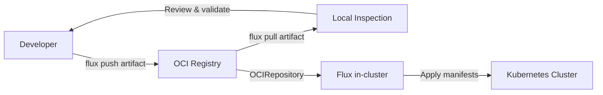

# How to Pull OCI Artifacts from a Registry with Flux CLI

Author: [nawazdhandala](https://github.com/nawazdhandala)

Tags: Flux CD, GitOps, Kubernetes, OCI, Flux CLI, Container Registry, Artifacts

Description: Learn how to use the Flux CLI to pull OCI artifacts from container registries to inspect, verify, and use Kubernetes manifests locally.

---

## Introduction

The Flux CLI provides the `flux pull artifact` command to download OCI artifacts from container registries to your local filesystem. This is useful for inspecting artifact contents before deployment, debugging issues with manifests, creating local backups, and verifying that pushed artifacts contain the expected files.

This guide covers how to pull OCI artifacts, inspect their contents, and integrate pulling into your workflows.

## Prerequisites

Before you begin, ensure you have:

- The `flux` CLI installed (v0.35 or later)
- Access to an OCI-compliant container registry with existing artifacts
- Registry credentials configured for authentication
- A local directory to store the pulled artifacts

Verify your Flux CLI installation.

```bash
# Verify Flux CLI is installed and check the version
flux version --client
```

## Authenticating with the Registry

The `flux pull artifact` command uses the Docker credential chain for authentication. Log in to your registry before pulling.

```bash
# Log in to GitHub Container Registry
echo $GITHUB_TOKEN | docker login ghcr.io -u $GITHUB_USER --password-stdin

# Log in to Docker Hub
echo $DOCKER_TOKEN | docker login -u $DOCKER_USER --password-stdin

# Log in to AWS ECR
aws ecr get-login-password --region us-east-1 | docker login --username AWS --password-stdin 123456789.dkr.ecr.us-east-1.amazonaws.com
```

## Pulling an Artifact by Tag

Use `flux pull artifact` to download an OCI artifact to a local directory. Specify the OCI URL with a tag and the output path.

```bash
# Create a directory to store the pulled artifact
mkdir -p ./pulled-manifests

# Pull the artifact tagged "1.0.0" to the local directory
flux pull artifact oci://ghcr.io/my-org/my-app-manifests:1.0.0 \
  --output=./pulled-manifests
```

On success, the command extracts the artifact contents to the specified output directory.

```bash
# Expected output
# ► pulling artifact from ghcr.io/my-org/my-app-manifests:1.0.0
# ✔ artifact successfully pulled to ./pulled-manifests
```

After pulling, you can inspect the contents.

```bash
# List the files that were extracted from the artifact
ls -la ./pulled-manifests/
```

## Pulling an Artifact by Digest

For reproducible workflows, you can pull an artifact by its exact digest instead of a mutable tag.

```bash
# Pull a specific artifact by its SHA256 digest
flux pull artifact oci://ghcr.io/my-org/my-app-manifests@sha256:a1b2c3d4e5f6a1b2c3d4e5f6a1b2c3d4e5f6a1b2c3d4e5f6a1b2c3d4e5f6a1b2 \
  --output=./pulled-manifests
```

Pulling by digest guarantees you get the exact same content every time, regardless of whether the tag has been updated.

## Pulling the Latest Artifact

If your workflow uses a `latest` tag, you can pull the most recent version.

```bash
# Pull the artifact tagged "latest"
flux pull artifact oci://ghcr.io/my-org/my-app-manifests:latest \
  --output=./latest-manifests
```

Keep in mind that `latest` is a mutable tag, so the content may differ between pulls.

## Inspecting Pulled Artifacts

Once you have pulled an artifact, you can inspect its contents to verify correctness before deployment.

```bash
# View the structure of the pulled manifests
find ./pulled-manifests -type f -name "*.yaml" | sort

# Validate the Kubernetes manifests using kubectl
kubectl apply --dry-run=client -f ./pulled-manifests/

# Check for syntax errors using kubeval or kubeconform (if installed)
kubeconform -summary ./pulled-manifests/
```

## Comparing Artifact Versions

A common workflow is pulling two different versions of an artifact and comparing them to understand what changed between releases.

```bash
# Pull version 1.0.0
mkdir -p ./v1
flux pull artifact oci://ghcr.io/my-org/my-app-manifests:1.0.0 \
  --output=./v1

# Pull version 2.0.0
mkdir -p ./v2
flux pull artifact oci://ghcr.io/my-org/my-app-manifests:2.0.0 \
  --output=./v2

# Compare the two versions
diff -r ./v1 ./v2
```

This helps you review changes before approving a deployment or rolling back to a previous version.

## Using Pull in a CI/CD Pipeline

You can integrate `flux pull artifact` into your CI/CD pipeline for validation and testing.

```yaml
# .github/workflows/validate-manifests.yaml
name: Validate OCI Artifact
on:
  workflow_dispatch:
    inputs:
      artifact_tag:
        description: 'Tag of the artifact to validate'
        required: true

jobs:
  validate:
    runs-on: ubuntu-latest
    permissions:
      packages: read
    steps:
      # Install Flux CLI
      - name: Setup Flux CLI
        uses: fluxcd/flux2/action@main

      # Authenticate with the registry
      - name: Login to GHCR
        uses: docker/login-action@v3
        with:
          registry: ghcr.io
          username: ${{ github.actor }}
          password: ${{ secrets.GITHUB_TOKEN }}

      # Pull the artifact
      - name: Pull artifact
        run: |
          mkdir -p ./manifests
          flux pull artifact \
            oci://ghcr.io/${{ github.repository }}/manifests:${{ inputs.artifact_tag }} \
            --output=./manifests

      # Validate the manifests
      - name: Dry-run apply
        run: |
          kubectl apply --dry-run=client -f ./manifests/
```

## Pull Workflow Diagram

Here is how `flux pull artifact` fits into a typical development workflow.



## Pulling to Standard Output

If you want to pipe the artifact contents to another command without writing to disk, you can use a temporary directory.

```bash
# Pull to a temp directory, process, and clean up
TMPDIR=$(mktemp -d)
flux pull artifact oci://ghcr.io/my-org/my-app-manifests:1.0.0 \
  --output="$TMPDIR"

# Process the manifests (e.g., count resources)
grep -r "kind:" "$TMPDIR" | sort | uniq -c

# Clean up
rm -rf "$TMPDIR"
```

## Troubleshooting

Common issues and solutions when pulling OCI artifacts.

**Artifact not found**: Verify the tag or digest exists in the registry.

```bash
# List available artifacts and tags in the repository
flux list artifacts oci://ghcr.io/my-org/my-app-manifests
```

**Authentication failed**: Ensure your Docker credentials are current. Tokens may have expired, especially with short-lived credentials from cloud providers.

**Empty output directory**: The artifact may have been pushed without any files. Verify by checking the artifact size in `flux list artifacts` output.

**Permission denied on output directory**: Ensure the output directory exists and is writable.

```bash
# Create the output directory with proper permissions
mkdir -p ./pulled-manifests && chmod 755 ./pulled-manifests
```

## Summary

The `flux pull artifact` command is essential for inspecting, validating, and debugging OCI artifacts used in your Flux CD GitOps workflows. Key takeaways:

- Use `--output` to specify where the artifact contents are extracted
- Pull by digest for reproducible results, or by tag for convenience
- Compare different artifact versions using `diff` to review changes
- Integrate pulling into CI/CD pipelines for automated validation
- Always verify pulled contents with `kubectl apply --dry-run=client` before deploying

Pulling artifacts locally complements the in-cluster OCIRepository resource by giving you a way to inspect and validate content before it reaches your production clusters.
