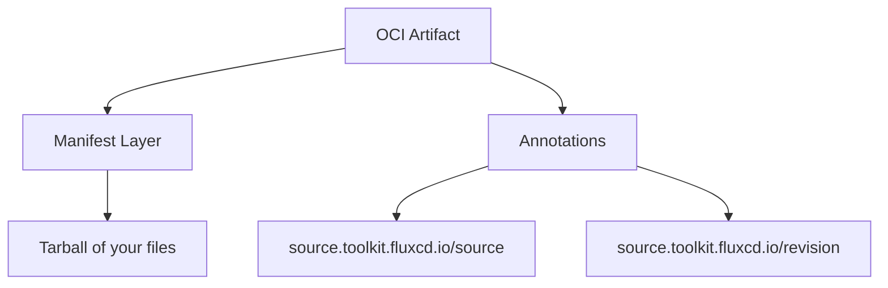

# How to Push OCI Artifacts to a Registry with Flux CLI

Author: [nawazdhandala](https://github.com/nawazdhandala)

Tags: Flux CD, GitOps, Kubernetes, OCI, Flux CLI, Container Registry, CI/CD

Description: Learn how to use the Flux CLI to push Kubernetes manifests and configurations as OCI artifacts to container registries for GitOps deployments.

---

## Introduction

The Flux CLI provides the `flux push artifact` command to package local files (Kubernetes manifests, Kustomize overlays, Helm values) into OCI artifacts and push them to any OCI-compliant container registry. This enables a workflow where your CI/CD pipeline builds and pushes deployment artifacts, and Flux running in-cluster pulls them automatically.

This guide covers the full process of pushing OCI artifacts, including authentication, tagging strategies, and CI/CD integration.

## Prerequisites

Before you begin, ensure you have:

- The `flux` CLI installed (v0.35 or later)
- Access to an OCI-compliant container registry (Docker Hub, GHCR, ECR, ACR, or GAR)
- A directory containing Kubernetes manifests or configurations to push
- Container registry credentials configured

Verify your Flux CLI version.

```bash
# Check the installed Flux CLI version
flux version --client
```

## Authenticating with a Registry

Before pushing artifacts, you need to authenticate with your target registry. The Flux CLI uses the Docker credential chain, so you can log in with standard tools.

```bash
# Log in to GitHub Container Registry
echo $GITHUB_TOKEN | docker login ghcr.io -u $GITHUB_USER --password-stdin

# Log in to Docker Hub
echo $DOCKER_TOKEN | docker login -u $DOCKER_USER --password-stdin

# Log in to AWS ECR (requires AWS CLI)
aws ecr get-login-password --region us-east-1 | docker login --username AWS --password-stdin 123456789.dkr.ecr.us-east-1.amazonaws.com
```

## Preparing Your Manifests

Create a directory structure with the Kubernetes manifests you want to package.

```bash
# Create a sample directory with Kubernetes manifests
mkdir -p ./deploy

# Example: create a simple deployment manifest
cat > ./deploy/deployment.yaml << 'MANIFEST'
apiVersion: apps/v1
kind: Deployment
metadata:
  name: my-app
  namespace: default
spec:
  replicas: 3
  selector:
    matchLabels:
      app: my-app
  template:
    metadata:
      labels:
        app: my-app
    spec:
      containers:
        - name: my-app
          image: my-app:1.0.0
          ports:
            - containerPort: 8080
MANIFEST
```

## Pushing an Artifact with a Tag

Use `flux push artifact` to package and push your manifests to the registry. The command takes the OCI URL (with tag) and the local path to your manifests.

```bash
# Push the contents of ./deploy as an OCI artifact tagged "1.0.0"
flux push artifact oci://ghcr.io/my-org/my-app-manifests:1.0.0 \
  --path=./deploy \
  --source="$(git config --get remote.origin.url)" \
  --revision="$(git branch --show-current)/$(git rev-parse HEAD)"
```

Here is what each flag does:

- `oci://ghcr.io/my-org/my-app-manifests:1.0.0` -- The full OCI URL including the registry, repository, and tag
- `--path` -- The local directory containing the files to package
- `--source` -- Metadata field recording the source repository URL
- `--revision` -- Metadata field recording the Git branch and commit SHA

On success, the command outputs the artifact digest.

```bash
# Expected output
# ► pushing artifact to ghcr.io/my-org/my-app-manifests:1.0.0
# ✔ artifact successfully pushed to ghcr.io/my-org/my-app-manifests@sha256:abc123...
```

## Pushing with Multiple Tags

You can push the same artifact with multiple tags in a single command by repeating the tag in the URL or by using `flux tag artifact` afterward.

```bash
# Push with the version tag
flux push artifact oci://ghcr.io/my-org/my-app-manifests:1.0.0 \
  --path=./deploy \
  --source="$(git config --get remote.origin.url)" \
  --revision="$(git branch --show-current)/$(git rev-parse HEAD)"

# Also tag it as "latest"
flux tag artifact oci://ghcr.io/my-org/my-app-manifests:1.0.0 \
  --tag=latest
```

## Pushing from a CI/CD Pipeline

Here is an example GitHub Actions workflow that pushes OCI artifacts on every push to the main branch.

```yaml
# .github/workflows/push-manifests.yaml
name: Push OCI Artifact
on:
  push:
    branches:
      - main
    paths:
      - 'deploy/**'

jobs:
  push:
    runs-on: ubuntu-latest
    permissions:
      packages: write
    steps:
      # Check out the repository
      - name: Checkout
        uses: actions/checkout@v4

      # Install the Flux CLI
      - name: Setup Flux CLI
        uses: fluxcd/flux2/action@main

      # Authenticate with GHCR
      - name: Login to GHCR
        uses: docker/login-action@v3
        with:
          registry: ghcr.io
          username: ${{ github.actor }}
          password: ${{ secrets.GITHUB_TOKEN }}

      # Push the manifests as an OCI artifact
      - name: Push manifests
        run: |
          flux push artifact \
            oci://ghcr.io/${{ github.repository }}/manifests:${{ github.sha }} \
            --path=./deploy \
            --source="${{ github.repositoryUrl }}" \
            --revision="${{ github.ref_name }}/${{ github.sha }}"

      # Tag with "latest" for convenience
      - name: Tag latest
        run: |
          flux tag artifact \
            oci://ghcr.io/${{ github.repository }}/manifests:${{ github.sha }} \
            --tag=latest
```

## Understanding the Artifact Structure

When you push an artifact, Flux creates an OCI manifest with the following structure.



The `--source` and `--revision` flags are stored as OCI annotations, which Flux uses to track provenance. These annotations appear in the OCIRepository status when Flux pulls the artifact.

## Pushing with a Specific Media Type

By default, Flux pushes artifacts with the media type `application/vnd.oci.image.layer.v1.tar+gzip`. The source-controller in your cluster recognizes this media type when pulling.

## Verifying the Push

After pushing, verify that the artifact exists in the registry.

```bash
# List artifacts in the repository to confirm the push
flux list artifacts oci://ghcr.io/my-org/my-app-manifests
```

This command shows all tags and digests for the artifact, confirming that your push was successful.

## Troubleshooting

Common issues when pushing OCI artifacts and how to resolve them.

**Authentication errors**: Ensure you are logged in to the registry. Run `docker login` or configure credentials for your specific registry.

```bash
# Test authentication by pulling a known image
docker pull ghcr.io/my-org/my-app-manifests:latest
```

**Permission denied**: Verify that your registry credentials have write access to the target repository.

**Path does not exist**: Ensure the `--path` flag points to a valid directory containing at least one file.

```bash
# Verify the path exists and has files
ls -la ./deploy/
```

## Summary

The `flux push artifact` command is the foundation for OCI-based GitOps workflows with Flux CD. Key points to remember:

- Always authenticate with the registry before pushing
- Use `--source` and `--revision` flags to record provenance metadata
- Combine `flux push artifact` with `flux tag artifact` for multi-tag strategies
- Integrate pushing into your CI/CD pipeline to automate artifact delivery
- Use `flux list artifacts` to verify successful pushes

By storing Kubernetes manifests as OCI artifacts, you leverage the same infrastructure used for container images, gaining benefits like content-addressable storage, replication, and access control.
