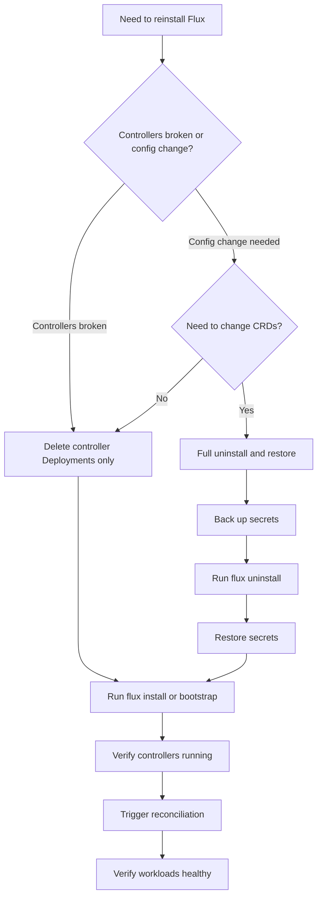

# How to Reinstall Flux CD Without Losing State

Author: [nawazdhandala](https://github.com/nawazdhandala)

Tags: Flux CD, GitOps, Kubernetes, Reinstall, State Management, Disaster Recovery

Description: Learn how to safely reinstall Flux CD controllers without losing your existing GitOps configuration, secrets, or managed workloads.

---

There are situations where you need to reinstall Flux CD -- perhaps controllers are in a broken state, you need to change the installation configuration, or you are recovering from a cluster issue. The good news is that Flux CD is designed with GitOps principles at its core, meaning your desired state lives in Git, not in the cluster. This guide walks you through reinstalling Flux CD while preserving your existing state and workloads.

## Why Reinstall Instead of Upgrade?

A reinstall differs from an upgrade in that you are removing and recreating the Flux controllers rather than updating them in place. Common reasons include:

- Flux controllers are stuck in a CrashLoopBackOff and cannot self-heal
- You need to change controller arguments or feature flags
- Cluster migration or restore scenario
- Corrupted controller state that cannot be resolved with a restart

## Understanding Flux CD State

Flux CD stores state in several places:

1. **Git repository** -- Your source of truth containing manifests, Kustomizations, and HelmRelease definitions
2. **Kubernetes custom resources** -- GitRepositories, Kustomizations, HelmReleases, and their status
3. **Secrets** -- Deploy keys, webhook tokens, and other credentials in the `flux-system` namespace
4. **Helm storage** -- Helm release secrets in the target namespaces (for HelmReleases)

The key insight is that Flux custom resources and secrets are stored in etcd as part of the Kubernetes API. Removing only the Flux controller Deployments (not the namespace or CRDs) preserves all of this state.

## Step 1: Export Current Configuration

Before making any changes, export your existing Flux configuration as a backup.

```bash
# Export all Flux custom resources across all namespaces
flux export source git --all -A > git-sources.yaml
flux export source helm --all -A > helm-sources.yaml
flux export source oci --all -A > oci-sources.yaml
flux export kustomization --all -A > kustomizations.yaml
flux export helmrelease --all -A > helmreleases.yaml
flux export alert --all -A > alerts.yaml
flux export alert-provider --all -A > providers.yaml
```

This gives you a complete backup of your Flux resource definitions that can be reapplied if needed.

## Step 2: Back Up Secrets

Deploy keys and other secrets are critical to preserve. Export them separately.

```bash
# Back up all secrets in the flux-system namespace
kubectl get secrets -n flux-system -o yaml > flux-secrets-backup.yaml

# Specifically back up the deploy key secret used for Git access
kubectl get secret flux-system -n flux-system -o yaml > deploy-key-backup.yaml
```

Store these backups securely since they contain sensitive credentials.

## Step 3: Remove Only Flux Controllers

The safest approach is to delete only the Flux controller Deployments while keeping the namespace, CRDs, custom resources, and secrets intact.

```bash
# Delete only the Flux controller deployments
kubectl delete deployment source-controller -n flux-system
kubectl delete deployment kustomize-controller -n flux-system
kubectl delete deployment helm-controller -n flux-system
kubectl delete deployment notification-controller -n flux-system

# If you have image automation controllers, delete those too
kubectl delete deployment image-reflector-controller -n flux-system --ignore-not-found
kubectl delete deployment image-automation-controller -n flux-system --ignore-not-found
```

At this point, your Flux custom resources, secrets, CRDs, and the flux-system namespace all remain in the cluster. Only the controller pods are gone.

## Step 4: Verify Resources Are Preserved

Confirm that your Flux resources are still present.

```bash
# Check that custom resources still exist
flux get sources git -A
flux get kustomizations -A
flux get helmreleases -A

# Check that secrets are still present
kubectl get secrets -n flux-system

# Verify CRDs are intact
kubectl get crds | grep toolkit.fluxcd.io
```

All resources should be listed, though their status will show as stale since no controller is reconciling them.

## Step 5: Reinstall Flux Controllers

Now reinstall Flux using the same method you originally used.

If you originally used `flux bootstrap`:

```bash
# Re-bootstrap Flux -- this recreates controllers while preserving existing resources
flux bootstrap github \
  --owner=your-org \
  --repository=fleet-infra \
  --branch=main \
  --path=clusters/my-cluster \
  --personal
```

The bootstrap command detects the existing namespace and resources and only updates or recreates what is missing. It will deploy fresh controller pods without deleting your existing Kustomizations, GitRepositories, or HelmReleases.

If you originally used `flux install`:

```bash
# Reinstall Flux controllers
flux install
```

This recreates all controller Deployments in the `flux-system` namespace.

## Step 6: Verify Controllers Are Running

Check that all controllers are back and healthy.

```bash
# Verify all Flux components pass health checks
flux check

# Check all pods in flux-system are Running
kubectl get pods -n flux-system

# Verify the version of reinstalled controllers
flux version
```

## Step 7: Trigger Reconciliation

After the controllers are running, they will automatically start reconciling resources. You can speed this up by triggering reconciliation manually.

```bash
# Reconcile the root GitRepository source
flux reconcile source git flux-system -n flux-system

# Reconcile the root Kustomization
flux reconcile kustomization flux-system -n flux-system

# Check the status of all resources
flux get all -A
```

## Step 8: Verify Workloads Are Healthy

Confirm that all your managed workloads are still running and being reconciled correctly.

```bash
# Check all Kustomizations are ready
flux get kustomizations -A

# Check all HelmReleases are ready
flux get helmreleases -A

# Verify that managed workloads in your application namespaces are running
kubectl get pods -A | grep -v flux-system | grep -v kube-system
```

## Alternative: Full Reinstall with State Restoration

If you need to do a full reinstall (including removing CRDs and the namespace), you can restore state from your Git repository.

```bash
# Step 1: Fully uninstall Flux
flux uninstall --silent

# Step 2: Restore secrets from backup before bootstrapping
kubectl create namespace flux-system
kubectl apply -f deploy-key-backup.yaml

# Step 3: Re-bootstrap Flux
flux bootstrap github \
  --owner=your-org \
  --repository=fleet-infra \
  --branch=main \
  --path=clusters/my-cluster \
  --personal
```

Since all your Flux resource definitions are in the Git repository, the bootstrap process will recreate them all. The deploy key backup ensures Flux can access the same repository without creating a new deploy key.

## Reinstall Decision Flowchart



## Tips for a Smooth Reinstall

- **Always export resources first.** Even if you plan to keep them in the cluster, having a backup is essential.
- **Preserve the deploy key secret.** Without it, you will need to reconfigure repository access.
- **Use the same bootstrap parameters.** Changing the repository, branch, or path during reinstall can cause reconciliation conflicts.
- **Monitor pod logs after reinstall.** Watch the controller logs for any errors during the initial reconciliation cycle.

```bash
# Watch controller logs after reinstall
kubectl logs -n flux-system -l app=source-controller -f
kubectl logs -n flux-system -l app=kustomize-controller -f
```

## Summary

Reinstalling Flux CD without losing state is achievable because Flux follows GitOps principles -- your desired state lives in Git, and Kubernetes custom resources persist independently of the controllers. The safest approach is to remove only the controller Deployments and then reinstall them, leaving all CRDs, custom resources, and secrets intact. For a full reinstall, back up your deploy key secret and rely on your Git repository to restore the complete Flux configuration during bootstrap.
