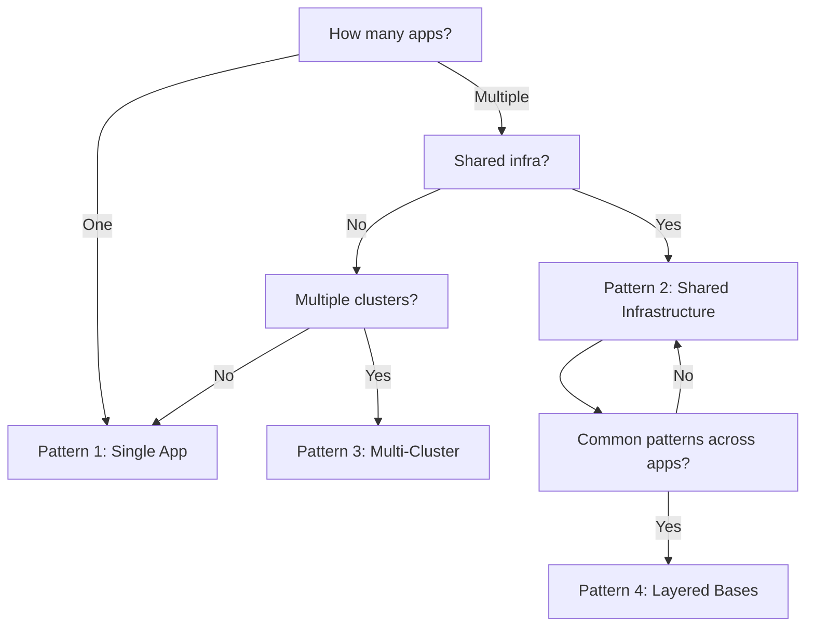

# How to Structure Kustomize Base and Overlays for Flux

Author: [nawazdhandala](https://github.com/nawazdhandala)

Tags: Flux CD, GitOps, Kubernetes, Kustomize, Base, Overlays, Repository Structure

Description: Learn best practices for organizing Kustomize base and overlay directories in a Flux CD-managed GitOps repository for maintainability and scalability.

---

## Introduction

A well-organized repository is the foundation of a successful GitOps workflow. When using Flux CD with Kustomize, the directory structure determines how easily your team can add new applications, create new environments, and troubleshoot issues. Poor structure leads to duplication, confusion, and configuration drift.

This guide covers proven patterns for structuring Kustomize bases and overlays in a Flux-managed repository, from single-application setups to large multi-team organizations.

## Core Concepts

Before diving into structures, here is a quick refresher on the key terms:

- **Base**: A directory containing Kubernetes manifests and a `kustomization.yaml` that references them. Bases are meant to be shared and should not contain environment-specific values.
- **Overlay**: A directory with its own `kustomization.yaml` that references one or more bases and applies modifications (patches, images, replicas, labels, etc.).
- **Flux Kustomization**: A custom resource that tells Flux which path in the Git repository to reconcile.

## Pattern 1: Single Application with Multiple Environments

This is the simplest and most common pattern. One application deployed to multiple environments.

```
repo/
  apps/
    myapp/
      base/
        deployment.yaml
        service.yaml
        configmap.yaml
        kustomization.yaml
      overlays/
        dev/
          kustomization.yaml
        staging/
          kustomization.yaml
        production/
          kustomization.yaml
  clusters/
    my-cluster/
      myapp-dev.yaml          # Flux Kustomization -> apps/myapp/overlays/dev
      myapp-staging.yaml       # Flux Kustomization -> apps/myapp/overlays/staging
      myapp-production.yaml    # Flux Kustomization -> apps/myapp/overlays/production
```

The base `kustomization.yaml` references the raw manifests.

```yaml
# apps/myapp/base/kustomization.yaml
apiVersion: kustomize.config.k8s.io/v1beta1
kind: Kustomization
resources:
  - deployment.yaml
  - service.yaml
  - configmap.yaml
```

Each overlay references the base and applies customizations.

```yaml
# apps/myapp/overlays/staging/kustomization.yaml
apiVersion: kustomize.config.k8s.io/v1beta1
kind: Kustomization
resources:
  - ../../base
replicas:
  - name: myapp
    count: 3
images:
  - name: myorg/myapp
    newTag: "v1.2.0"
```

## Pattern 2: Multiple Applications with Shared Infrastructure

When you have several applications that share infrastructure components (like a database or message queue), organize shared components separately.

```
repo/
  infrastructure/
    base/
      namespace.yaml
      network-policies.yaml
      kustomization.yaml
    overlays/
      dev/
        kustomization.yaml
      production/
        kustomization.yaml
  apps/
    frontend/
      base/
        deployment.yaml
        service.yaml
        kustomization.yaml
      overlays/
        dev/
          kustomization.yaml
        production/
          kustomization.yaml
    backend/
      base/
        deployment.yaml
        service.yaml
        kustomization.yaml
      overlays/
        dev/
          kustomization.yaml
        production/
          kustomization.yaml
  clusters/
    my-cluster/
      infrastructure-dev.yaml
      infrastructure-production.yaml
      frontend-dev.yaml
      frontend-production.yaml
      backend-dev.yaml
      backend-production.yaml
```

Use Flux Kustomization dependencies to ensure infrastructure is applied before applications.

```yaml
# clusters/my-cluster/frontend-production.yaml
apiVersion: kustomize.toolkit.fluxcd.io/v1
kind: Kustomization
metadata:
  name: frontend-production
  namespace: flux-system
spec:
  interval: 10m
  path: ./apps/frontend/overlays/production
  prune: true
  sourceRef:
    kind: GitRepository
    name: flux-system
  # Wait for infrastructure to be ready before deploying the app
  dependsOn:
    - name: infrastructure-production
```

## Pattern 3: Multi-Cluster Deployments

When managing multiple clusters, add a cluster dimension to your directory structure.

```
repo/
  apps/
    webapp/
      base/
        deployment.yaml
        service.yaml
        kustomization.yaml
      overlays/
        dev/
          kustomization.yaml
        production/
          kustomization.yaml
  clusters/
    us-east-1/
      webapp-production.yaml
    eu-west-1/
      webapp-production.yaml
    ap-southeast-1/
      webapp-production.yaml
```

Each cluster directory contains Flux Kustomization resources. The overlays themselves can be shared across clusters, with cluster-specific configuration handled through Flux's `postBuild` substitution.

```yaml
# clusters/us-east-1/webapp-production.yaml
apiVersion: kustomize.toolkit.fluxcd.io/v1
kind: Kustomization
metadata:
  name: webapp-production
  namespace: flux-system
spec:
  interval: 10m
  path: ./apps/webapp/overlays/production
  prune: true
  sourceRef:
    kind: GitRepository
    name: flux-system
  postBuild:
    substitute:
      CLUSTER_REGION: "us-east-1"
      CLUSTER_NAME: "prod-us-east"
```

## Pattern 4: Layered Bases for Shared Configuration

When multiple applications share common configuration patterns, create a layered base structure.

```
repo/
  bases/
    common/
      resource-quotas.yaml
      limit-ranges.yaml
      kustomization.yaml
    microservice/
      deployment-template.yaml
      service-template.yaml
      kustomization.yaml        # references ../common as a resource
  apps/
    user-service/
      base/
        kustomization.yaml      # references ../../bases/microservice
        deployment-patch.yaml   # service-specific overrides
      overlays/
        production/
          kustomization.yaml
    order-service/
      base/
        kustomization.yaml      # references ../../bases/microservice
        deployment-patch.yaml
      overlays/
        production/
          kustomization.yaml
```

The shared microservice base provides a template that all microservices inherit.

```yaml
# bases/microservice/kustomization.yaml
apiVersion: kustomize.config.k8s.io/v1beta1
kind: Kustomization
resources:
  - ../common
  - deployment-template.yaml
  - service-template.yaml
```

Each application base references the shared base and applies service-specific patches.

```yaml
# apps/user-service/base/kustomization.yaml
apiVersion: kustomize.config.k8s.io/v1beta1
kind: Kustomization
resources:
  - ../../bases/microservice
patches:
  - path: deployment-patch.yaml
```

## Rules for a Clean Structure

### 1. Bases Should Be Environment-Agnostic

Never put environment-specific values in a base. Bases should work with sensible defaults, and overlays should customize.

```yaml
# GOOD: base has a default replica count
spec:
  replicas: 1

# BAD: base hardcodes a production value
spec:
  replicas: 10
```

### 2. Keep Overlays Thin

Overlays should primarily contain a `kustomization.yaml` with transformer configurations (images, replicas, labels) and small patches. If an overlay has many large files, consider whether some should be moved to the base.

### 3. One Flux Kustomization per Overlay

Each overlay should have exactly one Flux Kustomization resource pointing to it. This gives you independent reconciliation and clear ownership.

### 4. Use Consistent Naming

Adopt a naming convention and stick to it across all applications.

```
apps/{app-name}/base/
apps/{app-name}/overlays/{environment}/
clusters/{cluster-name}/{app-name}-{environment}.yaml
```

### 5. Separate Infrastructure from Applications

Infrastructure resources (namespaces, RBAC, network policies, CRDs) should live in their own directory tree, separate from application code. Use Flux `dependsOn` to enforce ordering.

## Validating Your Structure

Use `kustomize build` to validate each overlay before committing.

```bash
# Validate all overlays in the repository
for overlay in apps/*/overlays/*/; do
  echo "Building: $overlay"
  kustomize build "$overlay" > /dev/null || echo "FAILED: $overlay"
done
```

You can also use Flux's built-in dry-run capability.

```bash
# Dry-run a specific Kustomization
flux diff kustomization webapp-production --path ./apps/webapp/overlays/production
```

## Directory Structure Decision Tree

Use this to pick the right pattern for your situation.



## Conclusion

The right directory structure depends on the scale and complexity of your deployments. Start simple with Pattern 1 and evolve as needs grow. The key principles remain the same across all patterns: keep bases environment-agnostic, keep overlays thin, maintain consistent naming, and give each overlay its own Flux Kustomization resource. Following these principles will keep your Flux-managed GitOps repository maintainable as it scales.
