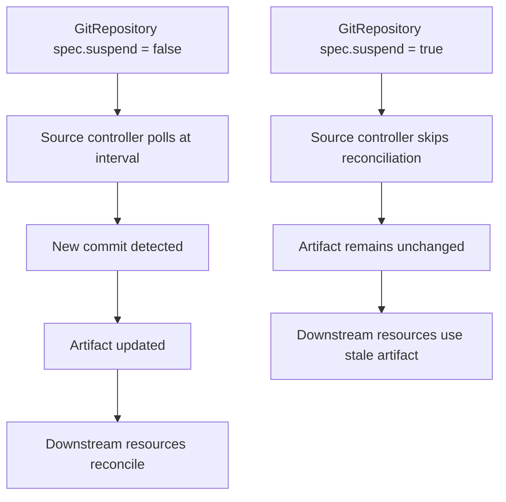

# How to Suspend and Resume GitRepository in Flux

Author: [nawazdhandala](https://github.com/nawazdhandala)

Tags: Flux CD, GitOps, Kubernetes, GitRepository, Suspend, Resume, Maintenance

Description: Learn how to suspend and resume Flux CD GitRepository reconciliation for maintenance windows, debugging, and controlled deployments.

---

There are times when you need to temporarily stop Flux from syncing changes from a Git repository. You might be performing maintenance on the repository, debugging a deployment issue, or preparing a batch of changes that should not be deployed incrementally. Flux provides the `spec.suspend` field on GitRepository resources to pause reconciliation without deleting the resource. This guide covers how to suspend and resume GitRepository sources using both the CLI and YAML manifests.

## Prerequisites

Before you begin, make sure you have:

- A Kubernetes cluster with Flux CD installed
- The Flux CLI (`flux`) installed locally
- `kubectl` access to your cluster
- An existing GitRepository resource

## How Suspension Works

When you set `spec.suspend: true` on a GitRepository, the Flux source controller stops polling the remote repository for changes. The last fetched artifact remains available, so any Kustomizations or HelmReleases that depend on this source continue to use the existing artifact. No new commits are detected or downloaded until the resource is resumed.



## Step 1: Suspend a GitRepository Using the Flux CLI

The simplest way to suspend a GitRepository is with the Flux CLI.

```bash
# Suspend the GitRepository to stop reconciliation
flux suspend source git my-app
```

You will see confirmation output.

```
► suspending source git my-app in flux-system namespace
✔ source git suspended
```

Verify the suspension.

```bash
# Check that the GitRepository shows as suspended
flux get source git my-app
```

The output will show `SUSPENDED` as `True`.

```
NAME    REVISION              SUSPENDED   READY   MESSAGE
my-app  main@sha1:abc123def   True        True    stored artifact for revision 'main@sha1:abc123def'
```

## Step 2: Suspend a GitRepository Using YAML

You can also set the suspend field directly in the GitRepository manifest.

```yaml
# gitrepository-suspended.yaml
# GitRepository with reconciliation suspended
apiVersion: source.toolkit.fluxcd.io/v1
kind: GitRepository
metadata:
  name: my-app
  namespace: flux-system
spec:
  interval: 5m
  url: https://github.com/your-org/my-app.git
  ref:
    branch: main
  # Suspend reconciliation
  suspend: true
```

```bash
# Apply the suspended GitRepository
kubectl apply -f gitrepository-suspended.yaml
```

Or patch an existing resource.

```bash
# Patch the GitRepository to suspend it
kubectl patch gitrepository my-app -n flux-system \
  --type=merge \
  -p '{"spec":{"suspend":true}}'
```

## Step 3: Resume a GitRepository Using the Flux CLI

When you are ready to resume syncing, use the resume command.

```bash
# Resume the GitRepository to restart reconciliation
flux resume source git my-app
```

You will see confirmation output.

```
► resuming source git my-app in flux-system namespace
✔ source git resumed
◎ waiting for GitRepository reconciliation
✔ GitRepository reconciliation completed
✔ fetched revision main@sha1:def456ghi
```

The source controller immediately performs a reconciliation when you resume, so you do not need to wait for the next interval.

## Step 4: Resume a GitRepository Using YAML

Set `spec.suspend` to `false` or remove the field entirely.

```yaml
# gitrepository-resumed.yaml
# GitRepository with reconciliation active
apiVersion: source.toolkit.fluxcd.io/v1
kind: GitRepository
metadata:
  name: my-app
  namespace: flux-system
spec:
  interval: 5m
  url: https://github.com/your-org/my-app.git
  ref:
    branch: main
  # Reconciliation is active (this is the default)
  suspend: false
```

```bash
# Apply to resume
kubectl apply -f gitrepository-resumed.yaml
```

Or patch the resource.

```bash
# Patch the GitRepository to resume it
kubectl patch gitrepository my-app -n flux-system \
  --type=merge \
  -p '{"spec":{"suspend":false}}'
```

## Step 5: Suspend All GitRepository Sources

During cluster-wide maintenance, you may want to suspend all GitRepository sources at once.

```bash
# Suspend all GitRepository sources in the flux-system namespace
flux suspend source git --all -n flux-system
```

To resume all of them afterward.

```bash
# Resume all GitRepository sources in the flux-system namespace
flux resume source git --all -n flux-system
```

## Use Cases for Suspension

### Maintenance Windows

Suspend sources before performing maintenance on the Git server or the Kubernetes cluster to prevent unexpected deployments.

```bash
# Before maintenance: suspend all sources
flux suspend source git --all -n flux-system

# Perform maintenance...

# After maintenance: resume all sources
flux resume source git --all -n flux-system
```

### Debugging Deployment Issues

When a bad commit is deployed and you need time to investigate, suspending the source prevents further changes from being deployed while you debug.

```bash
# Suspend to freeze the current state while debugging
flux suspend source git my-app

# Investigate the issue
kubectl logs -n my-app deployment/my-app
kubectl describe kustomization my-app -n flux-system

# Fix the issue in Git, then resume
flux resume source git my-app
```

### Batch Deployments

If you want to merge several pull requests before deploying them as a batch, suspend the source, merge your PRs, then resume.

```bash
# Suspend before merging multiple PRs
flux suspend source git my-app

# Merge PR #1, PR #2, PR #3 in Git...

# Resume to deploy all changes at once
flux resume source git my-app
```

### Controlled Rollouts

Suspend the source in production while testing changes in staging. Resume only after staging validation passes.

```bash
# Suspend production source
flux suspend source git prod-app -n flux-system

# Validate in staging...
flux get kustomization staging-app

# Resume production after staging looks good
flux resume source git prod-app -n flux-system
```

## Monitoring Suspended Sources

It is good practice to monitor for GitRepository resources that have been suspended for too long, as they may have been forgotten.

```bash
# List all suspended GitRepository sources
kubectl get gitrepositories -A -o json | \
  jq -r '.items[] | select(.spec.suspend==true) | "\(.metadata.namespace)/\(.metadata.name)"'
```

You can also set up a Prometheus alert for long-running suspensions.

```yaml
# prometheus-alert-suspended-sources.yaml
# Alert when a GitRepository has been suspended for more than 24 hours
apiVersion: monitoring.coreos.com/v1
kind: PrometheusRule
metadata:
  name: flux-suspended-sources
  namespace: flux-system
spec:
  groups:
  - name: flux.rules
    rules:
    - alert: GitRepositorySuspendedTooLong
      expr: gotk_suspend_status{kind="GitRepository"} == 1
      for: 24h
      labels:
        severity: warning
      annotations:
        summary: "GitRepository {{ $labels.name }} has been suspended for over 24 hours"
        description: "Check if this GitRepository was intentionally left suspended."
```

## Summary

The `spec.suspend` field on Flux GitRepository resources gives you precise control over when synchronization happens. Use `flux suspend source git` and `flux resume source git` for quick CLI-based control, or set `spec.suspend` in your YAML manifests for declarative management. Suspension is useful during maintenance windows, debugging sessions, batch deployments, and controlled rollouts. Always remember to resume suspended sources when maintenance is complete and consider monitoring for sources that have been suspended longer than expected.
