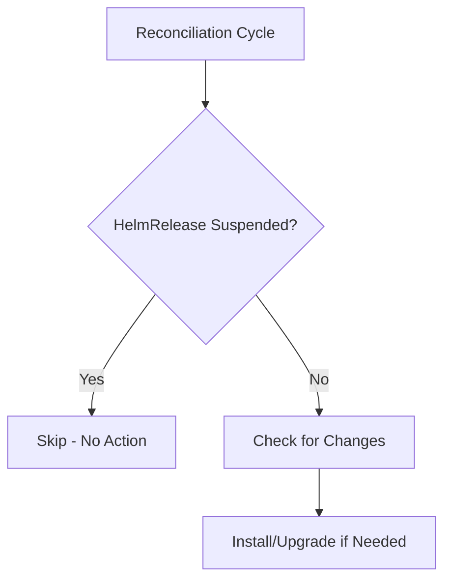

# How to Suspend and Resume HelmRelease in Flux

Author: [nawazdhandala](https://github.com/nawazdhandala)

Tags: Flux CD, GitOps, Kubernetes, Helm, HelmRelease, Suspend, Resume, Operations

Description: Learn how to suspend and resume HelmRelease reconciliation in Flux CD to temporarily pause GitOps automation for maintenance or debugging.

---

## Introduction

There are times when you need to temporarily stop Flux from reconciling a HelmRelease. Perhaps you are debugging a failing deployment, performing manual maintenance, or testing changes interactively before committing them to Git. The `spec.suspend` field and the corresponding `flux suspend` and `flux resume` CLI commands let you pause and restart HelmRelease reconciliation without deleting or modifying the resource.

## How Suspend Works

When a HelmRelease is suspended, the Helm Controller skips it during reconciliation cycles. No install, upgrade, rollback, or uninstall operations are performed. The HelmRelease remains in its current state until it is resumed.



## Suspending via CLI

The simplest way to suspend a HelmRelease is with the Flux CLI.

```bash
# Suspend a HelmRelease
flux suspend helmrelease my-app -n default
```

This sets `spec.suspend: true` on the HelmRelease resource. You can also use the short alias `hr`.

```bash
# Suspend using the short alias
flux suspend hr my-app -n default

# Verify the HelmRelease is suspended
flux get helmreleases -n default
```

The output will show `True` in the SUSPENDED column.

## Resuming via CLI

Resume the HelmRelease to restart reconciliation.

```bash
# Resume a HelmRelease
flux resume helmrelease my-app -n default

# Or using the short alias
flux resume hr my-app -n default
```

This sets `spec.suspend: false` and immediately triggers a reconciliation.

## Suspending via Manifest

You can also suspend a HelmRelease declaratively by setting `spec.suspend: true` in the manifest.

```yaml
# helmrelease.yaml - Suspended HelmRelease
apiVersion: helm.toolkit.fluxcd.io/v2
kind: HelmRelease
metadata:
  name: my-app
  namespace: default
spec:
  interval: 10m
  # Suspend reconciliation
  suspend: true
  chart:
    spec:
      chart: my-app
      version: "1.x"
      sourceRef:
        kind: HelmRepository
        name: my-repo
        namespace: flux-system
  values:
    replicaCount: 2
```

To resume, set `suspend: false` or remove the field entirely (it defaults to `false`).

```yaml
# helmrelease.yaml - Resumed HelmRelease
apiVersion: helm.toolkit.fluxcd.io/v2
kind: HelmRelease
metadata:
  name: my-app
  namespace: default
spec:
  interval: 10m
  # Omit suspend or set to false to resume
  suspend: false
  chart:
    spec:
      chart: my-app
      version: "1.x"
      sourceRef:
        kind: HelmRepository
        name: my-repo
        namespace: flux-system
  values:
    replicaCount: 2
```

## Suspending via kubectl

You can also use kubectl to patch the HelmRelease directly.

```bash
# Suspend using kubectl patch
kubectl patch helmrelease my-app -n default \
  --type=merge \
  -p '{"spec":{"suspend":true}}'

# Resume using kubectl patch
kubectl patch helmrelease my-app -n default \
  --type=merge \
  -p '{"spec":{"suspend":false}}'
```

## Use Cases for Suspend

### Debugging a Failing Deployment

When a HelmRelease keeps failing and triggering remediation, suspend it to stop the cycle while you investigate.

```bash
# Stop the failing reconciliation loop
flux suspend hr my-app -n default

# Investigate the issue
kubectl describe helmrelease my-app -n default
kubectl logs -n flux-system deploy/helm-controller | grep my-app
kubectl get pods -n default -l app.kubernetes.io/name=my-app

# Fix the issue in Git, then resume
flux resume hr my-app -n default
```

### Manual Testing

Suspend a HelmRelease to test manual Helm changes before committing them to Git.

```bash
# Suspend Flux management
flux suspend hr my-app -n default

# Make manual changes for testing
helm upgrade my-app my-repo/my-app \
  --set replicaCount=5 \
  --set image.tag=canary \
  -n default

# Test the changes...

# When done, resume Flux (it will revert to the GitOps state)
flux resume hr my-app -n default
```

### Planned Maintenance

Suspend during maintenance windows to prevent Flux from interfering.

```bash
# Suspend all HelmReleases in a namespace before maintenance
for hr in $(flux get helmreleases -n production --no-header | awk '{print $1}'); do
  flux suspend hr "$hr" -n production
done

# Perform maintenance...

# Resume all HelmReleases after maintenance
for hr in $(flux get helmreleases -n production --no-header | awk '{print $1}'); do
  flux resume hr "$hr" -n production
done
```

### Preventing Reconciliation During Incident Response

During an incident, you may need to prevent automated changes from making things worse.

```bash
# Emergency suspend all HelmReleases in a namespace
for hr in $(flux get helmreleases -n production --no-header | awk '{print $1}'); do
  flux suspend hr "$hr" -n production
done

# Handle the incident...

# Resume when stable
for hr in $(flux get helmreleases -n production --no-header | awk '{print $1}'); do
  flux resume hr "$hr" -n production
done
```

## Checking Suspend Status

There are several ways to check if a HelmRelease is suspended.

```bash
# Using the Flux CLI
flux get helmreleases -n default

# Using kubectl
kubectl get helmrelease my-app -n default -o jsonpath='{.spec.suspend}'

# List all suspended HelmReleases across the cluster
kubectl get helmreleases -A -o json | \
  jq '.items[] | select(.spec.suspend == true) | {name: .metadata.name, namespace: .metadata.namespace}'
```

## What Happens on Resume

When a HelmRelease is resumed:

1. The `spec.suspend` field is set to `false`
2. An immediate reconciliation is triggered
3. Flux checks the current state against the desired state
4. If drift is detected (for example, from manual changes during suspend), Flux reconciles back to the desired state

```bash
# Resume triggers immediate reconciliation
flux resume hr my-app -n default

# Watch the reconciliation happen
flux get helmreleases -n default --watch
```

## Suspend Does Not Affect Running Workloads

Suspending a HelmRelease only stops Flux from managing it. The deployed Helm release and its resources (Pods, Services, etc.) continue running normally. No resources are scaled down or deleted when you suspend.

## GitOps Considerations

If you suspend a HelmRelease via the CLI or kubectl, the `spec.suspend: true` change is only in the cluster, not in Git. This means:

- Flux's Kustomize Controller may revert `suspend: true` if it reconciles the Git source
- For a persistent suspend, commit `suspend: true` to Git

```bash
# For a persistent suspend, update the manifest in Git
# Edit helmrelease.yaml to add suspend: true
git add helmrelease.yaml
git commit -m "Suspend my-app HelmRelease for maintenance"
git push
```

## Conclusion

Suspending and resuming HelmReleases is an essential operational tool in Flux CD. Use `flux suspend hr` to pause reconciliation during debugging, manual testing, or maintenance windows, and `flux resume hr` to restart automated management. The operation is safe, non-destructive, and immediately reversible. For persistent suspension, commit the `suspend: true` change to Git to prevent the Kustomize Controller from reverting it.
