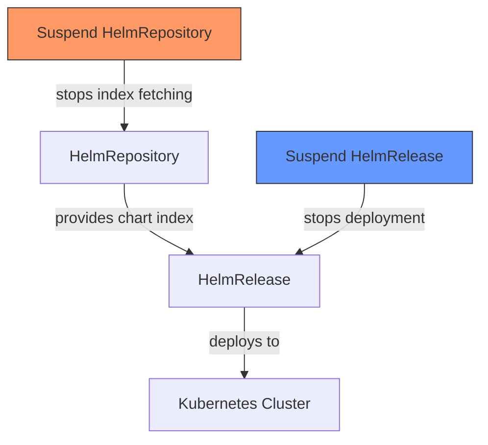

# How to Suspend and Resume HelmRepository in Flux

Author: [nawazdhandala](https://github.com/nawazdhandala)

Tags: Flux CD, GitOps, Kubernetes, Helm, HelmRepository, Suspend, Resume, Maintenance

Description: Learn how to suspend and resume HelmRepository reconciliation in Flux CD for maintenance windows, troubleshooting, and controlled upgrade workflows.

---

Flux CD continuously reconciles your HelmRepository sources on the configured interval, fetching the latest repository index and making new chart versions available. Sometimes you need to temporarily pause this behavior. Whether you are performing cluster maintenance, debugging a failing source, or controlling when upgrades roll out, the suspend and resume feature gives you that control. This guide covers how to use it effectively.

## Why Suspend a HelmRepository

There are several scenarios where suspending a HelmRepository is useful:

- **Maintenance windows**: Prevent Flux from pulling new chart versions during a planned maintenance period
- **Troubleshooting**: Stop reconciliation while you investigate a failing source without it retrying and generating noise in logs
- **Controlled rollouts**: Suspend the source, update HelmRelease versions, then resume to trigger a coordinated deployment
- **Rate limiting**: Temporarily stop fetching from a registry that is rate-limiting your requests
- **Repository migration**: Suspend the old source while you set up and validate the new one

## Suspending with the Flux CLI

The simplest way to suspend a HelmRepository is with the Flux CLI:

```bash
# Suspend a specific HelmRepository
flux suspend source helm prometheus-community -n flux-system
```

Verify the suspension:

```bash
# Check that the HelmRepository shows as suspended
flux get sources helm -n flux-system
```

The output will show `True` in the `SUSPENDED` column for the suspended repository.

## Resuming with the Flux CLI

To resume reconciliation:

```bash
# Resume the HelmRepository and trigger an immediate reconciliation
flux resume source helm prometheus-community -n flux-system
```

The `resume` command both removes the suspension and triggers an immediate reconciliation, so you do not need to wait for the next interval.

## Suspending with kubectl

You can also suspend a HelmRepository by patching the resource directly. This is useful in automation scripts or when you do not have the Flux CLI installed:

```bash
# Suspend a HelmRepository using kubectl patch
kubectl patch helmrepository prometheus-community -n flux-system \
  --type=merge -p '{"spec":{"suspend":true}}'
```

Resume with:

```bash
# Resume a HelmRepository using kubectl patch
kubectl patch helmrepository prometheus-community -n flux-system \
  --type=merge -p '{"spec":{"suspend":false}}'
```

## Suspending Declaratively in Git

For a GitOps workflow, you can set the `suspend` field directly in your HelmRepository manifest and commit it to Git:

```yaml
# HelmRepository with suspend enabled declaratively
apiVersion: source.toolkit.fluxcd.io/v1
kind: HelmRepository
metadata:
  name: prometheus-community
  namespace: flux-system
spec:
  interval: 60m
  url: https://prometheus-community.github.io/helm-charts
  # Set to true to suspend reconciliation
  suspend: true
```

This approach is fully auditable since the suspension is tracked in your Git history with a commit message explaining why.

## Suspending All HelmRepositories

During a major maintenance window, you may want to suspend all HelmRepositories at once:

```bash
# Suspend all HelmRepositories in the flux-system namespace
flux get sources helm -n flux-system -o json | \
  jq -r '.[] | .name' | \
  xargs -I {} flux suspend source helm {} -n flux-system
```

Resume all of them:

```bash
# Resume all HelmRepositories in the flux-system namespace
flux get sources helm -n flux-system -o json | \
  jq -r '.[] | .name' | \
  xargs -I {} flux resume source helm {} -n flux-system
```

Alternatively, use kubectl to suspend all at once:

```bash
# Suspend all HelmRepositories using kubectl
kubectl get helmrepository -n flux-system -o name | \
  xargs -I {} kubectl patch {} -n flux-system \
  --type=merge -p '{"spec":{"suspend":true}}'
```

## Suspending HelmReleases vs HelmRepositories

It is important to understand the difference between suspending a HelmRepository and suspending a HelmRelease:



- **Suspending a HelmRepository** stops Flux from fetching the latest chart index. Existing HelmReleases continue to run with their current chart versions, but no new versions will be discovered.
- **Suspending a HelmRelease** stops Flux from deploying or upgrading the Helm release. The HelmRepository continues to fetch updates, but they will not be applied.

You can suspend both for complete freeze:

```bash
# Suspend both the source and the release for a complete freeze
flux suspend source helm prometheus-community -n flux-system
flux suspend helmrelease kube-prometheus-stack -n monitoring
```

## Controlled Upgrade Workflow

Here is a practical workflow for controlled upgrades using suspend and resume:

```bash
# Step 1: Suspend the HelmRepository to prevent new versions from being fetched
flux suspend source helm prometheus-community -n flux-system

# Step 2: Update the HelmRelease to pin a specific chart version
kubectl patch helmrelease kube-prometheus-stack -n monitoring \
  --type=merge -p '{"spec":{"chart":{"spec":{"version":"67.5.0"}}}}'

# Step 3: Resume the HelmRepository to fetch the specific version
flux resume source helm prometheus-community -n flux-system

# Step 4: Force reconciliation of the HelmRelease
flux reconcile helmrelease kube-prometheus-stack -n monitoring

# Step 5: Verify the upgrade completed successfully
flux get helmreleases -n monitoring
kubectl get pods -n monitoring
```

## Checking Suspension Status

You can check whether a HelmRepository is suspended in several ways:

```bash
# Using the Flux CLI
flux get sources helm -n flux-system

# Using kubectl with jsonpath
kubectl get helmrepository -n flux-system -o custom-columns=\
NAME:.metadata.name,\
SUSPENDED:.spec.suspend,\
READY:.status.conditions[0].status,\
AGE:.metadata.creationTimestamp

# Check a specific repository
kubectl get helmrepository prometheus-community -n flux-system \
  -o jsonpath='{.spec.suspend}'
```

## Automation with Cron Jobs

For regular maintenance windows, automate suspension and resumption with Kubernetes CronJobs:

```yaml
# CronJob to suspend all HelmRepositories every Friday at 10 PM
apiVersion: batch/v1
kind: CronJob
metadata:
  name: suspend-helm-repos
  namespace: flux-system
spec:
  schedule: "0 22 * * 5"  # Friday at 10 PM
  jobTemplate:
    spec:
      template:
        spec:
          serviceAccountName: flux-maintenance
          containers:
            - name: suspend
              image: bitnami/kubectl:latest
              command:
                - /bin/sh
                - -c
                - |
                  kubectl get helmrepository -n flux-system -o name | \
                  xargs -I {} kubectl patch {} -n flux-system \
                  --type=merge -p '{"spec":{"suspend":true}}'
          restartPolicy: OnFailure
---
# CronJob to resume all HelmRepositories every Monday at 6 AM
apiVersion: batch/v1
kind: CronJob
metadata:
  name: resume-helm-repos
  namespace: flux-system
spec:
  schedule: "0 6 * * 1"  # Monday at 6 AM
  jobTemplate:
    spec:
      template:
        spec:
          serviceAccountName: flux-maintenance
          containers:
            - name: resume
              image: bitnami/kubectl:latest
              command:
                - /bin/sh
                - -c
                - |
                  kubectl get helmrepository -n flux-system -o name | \
                  xargs -I {} kubectl patch {} -n flux-system \
                  --type=merge -p '{"spec":{"suspend":false}}'
          restartPolicy: OnFailure
```

## Monitoring Suspension Events

Track when repositories are suspended and resumed by watching Kubernetes events:

```bash
# Watch for suspension-related events
kubectl get events -n flux-system --field-selector involvedObject.kind=HelmRepository --watch
```

You can also set up Flux notifications to alert your team when a source is suspended:

```yaml
# Alert on HelmRepository suspension changes
apiVersion: notification.toolkit.fluxcd.io/v1
kind: Alert
metadata:
  name: helm-repo-suspension-alerts
  namespace: flux-system
spec:
  providerRef:
    name: slack
  eventSeverity: info
  eventSources:
    - kind: HelmRepository
      name: "*"
      namespace: flux-system
```

The suspend and resume feature in Flux CD provides essential operational control over your GitOps pipeline. Use it for maintenance windows, controlled rollouts, and troubleshooting. Combined with the declarative Git-based approach, every suspension and resumption can be tracked, reviewed, and audited through your normal Git workflow.
