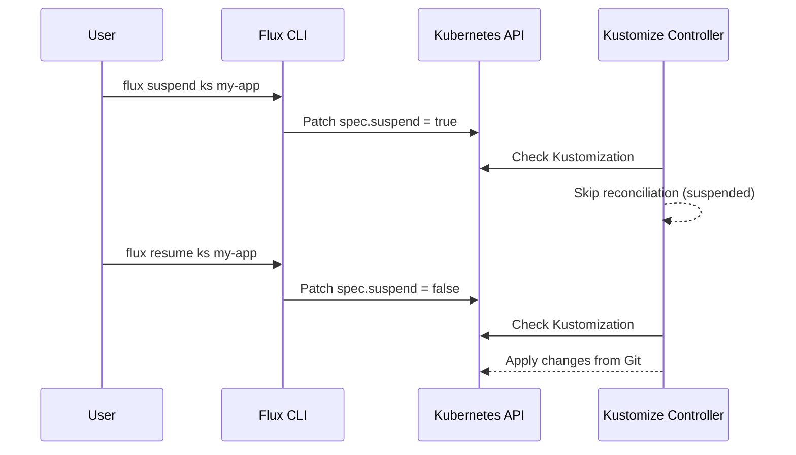

# How to Suspend and Resume Kustomization in Flux

Author: [nawazdhandala](https://github.com/nawazdhandala)

Tags: Flux CD, GitOps, Kubernetes, Kustomize, Kustomization, Suspend, Resume

Description: Learn how to suspend and resume Kustomization reconciliation in Flux CD to temporarily halt or restart GitOps-driven deployments.

---

## Introduction

When managing Kubernetes clusters with Flux CD, there are situations where you need to temporarily stop a Kustomization from reconciling. Perhaps you are performing manual maintenance, debugging an issue, or rolling out a sensitive change that requires human oversight. Flux provides built-in commands to suspend and resume Kustomization objects, giving you fine-grained control over the reconciliation lifecycle.

This guide walks you through the process of suspending and resuming Kustomizations using the Flux CLI, explains what happens under the hood, and covers practical use cases.

## Prerequisites

Before you begin, ensure you have:

- A Kubernetes cluster with Flux CD installed
- The `flux` CLI installed and configured
- At least one Kustomization resource deployed in your cluster

## Understanding Suspension in Flux

When you suspend a Kustomization, Flux sets the `spec.suspend` field to `true` on the Kustomization object. This tells the kustomize-controller to skip reconciliation for that resource. No changes from the Git repository will be applied until the Kustomization is resumed.

Here is a diagram showing the suspension lifecycle:



## Suspending a Kustomization

To suspend a Kustomization, use the `flux suspend ks` command followed by the name of the Kustomization resource.

```bash
# Suspend a Kustomization named "my-app" in the flux-system namespace
flux suspend ks my-app
```

You should see output confirming the suspension:

```text
► suspending kustomization my-app in flux-system namespace
✔ kustomization suspended
```

If your Kustomization is in a different namespace, specify it with the `--namespace` flag:

```bash
# Suspend a Kustomization in a specific namespace
flux suspend ks my-app --namespace=production
```

## Verifying Suspension Status

After suspending, you can verify the status by getting the Kustomization details.

```bash
# Check the status of the suspended Kustomization
flux get ks my-app
```

The output will show `True` under the `SUSPENDED` column:

```text
NAME    REVISION        SUSPENDED  READY  MESSAGE
my-app  main@sha1:abc   True       True   Applied revision: main@sha1:abc
```

You can also inspect the raw Kubernetes resource to confirm the `spec.suspend` field:

```bash
# View the Kustomization YAML to verify the suspend field
kubectl get kustomization my-app -n flux-system -o yaml | grep suspend
```

Expected output:

```yaml
  suspend: true
```

## Resuming a Kustomization

When you are ready to allow reconciliation again, use the `flux resume ks` command.

```bash
# Resume the suspended Kustomization
flux resume ks my-app
```

You should see output confirming the resume and a triggered reconciliation:

```text
► resuming kustomization my-app in flux-system namespace
✔ kustomization resumed
◎ waiting for Kustomization reconciliation
✔ Kustomization reconciliation completed
✔ applied revision main@sha1:def456
```

The resume command not only sets `spec.suspend` back to `false` but also triggers an immediate reconciliation, so any pending changes from the Git repository are applied right away.

## Suspending All Kustomizations

In some scenarios, such as cluster-wide maintenance, you may want to suspend all Kustomizations at once. You can achieve this with a simple loop.

```bash
# Suspend all Kustomizations in the flux-system namespace
flux get ks --no-header | awk '{print $1}' | xargs -I {} flux suspend ks {}
```

To resume all of them:

```bash
# Resume all Kustomizations in the flux-system namespace
flux get ks --no-header | awk '{print $1}' | xargs -I {} flux resume ks {}
```

## Suspending via YAML Manifest

You can also suspend a Kustomization declaratively by editing the manifest in your Git repository. This is useful when you want the suspension to be tracked in version control.

```yaml
# kustomization.yaml - Kustomization resource with suspend enabled
apiVersion: kustomize.toolkit.fluxcd.io/v1
kind: Kustomization
metadata:
  name: my-app
  namespace: flux-system
spec:
  interval: 10m
  # Set suspend to true to halt reconciliation
  suspend: true
  sourceRef:
    kind: GitRepository
    name: my-repo
  path: ./clusters/production
  prune: true
```

When you commit and push this change, Flux will process the update and suspend itself from further reconciliations. To resume, set `suspend: false` or remove the field entirely and push again.

## Common Use Cases

### Maintenance Windows

Suspend Kustomizations before performing manual changes to the cluster, preventing Flux from overwriting your work:

```bash
# Suspend before maintenance
flux suspend ks my-app

# Perform manual maintenance tasks
kubectl scale deployment my-app --replicas=0 -n production

# Resume after maintenance is complete
flux resume ks my-app
```

### Debugging Deployments

When troubleshooting a failing deployment, suspend the Kustomization to prevent repeated failed reconciliation attempts while you investigate:

```bash
# Suspend to stop retry loop during debugging
flux suspend ks my-app

# Investigate the issue
kubectl describe deployment my-app -n production
kubectl logs -l app=my-app -n production

# Fix the issue in Git, then resume
flux resume ks my-app
```

### Staged Rollouts

Suspend downstream Kustomizations while verifying an upstream change:

```bash
# Suspend the production Kustomization while testing in staging
flux suspend ks production-app

# Verify staging is healthy
flux get ks staging-app

# Once staging is confirmed, resume production
flux resume ks production-app
```

## Troubleshooting

If suspension or resumption does not work as expected, check the following:

1. Verify you have the correct Kustomization name and namespace.
2. Ensure your Flux CLI version matches the Flux controllers running in the cluster.
3. Check RBAC permissions -- your kubeconfig must have permission to patch Kustomization resources.

```bash
# Check the kustomize-controller logs for any errors
kubectl logs -n flux-system deploy/kustomize-controller --tail=50
```

## Conclusion

Suspending and resuming Kustomizations is a fundamental operational capability in Flux CD. It gives you a safe mechanism to pause GitOps reconciliation during maintenance windows, debugging sessions, or staged rollouts. Whether you use the imperative `flux suspend ks` and `flux resume ks` commands or the declarative `spec.suspend` field, Flux makes it straightforward to control when changes are applied to your cluster.
