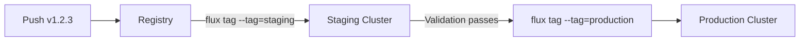

# How to Tag OCI Artifacts with Flux CLI

Author: [nawazdhandala](https://github.com/nawazdhandala)

Tags: Flux CD, GitOps, Kubernetes, OCI, Flux CLI, Container Registry, Tagging, Versioning

Description: Learn how to use the Flux CLI to tag OCI artifacts in container registries for version management, promotion workflows, and environment-based deployments.

---

## Introduction

The Flux CLI provides the `flux tag artifact` command to add tags to existing OCI artifacts in a container registry without re-pushing the artifact content. This is useful for promotion workflows (tagging an artifact as `staging` or `production`), creating aliases like `latest`, and implementing semantic versioning strategies.

Tagging operates entirely on the registry side. It does not download or re-upload the artifact data. Instead, it creates a new tag that points to the same manifest digest, making it a fast and efficient operation.

## Prerequisites

Before you begin, ensure you have:

- The `flux` CLI installed (v0.35 or later)
- Access to an OCI-compliant container registry with existing artifacts
- Write permissions to the target repository in the registry
- Registry credentials configured via `docker login`

## Authenticating with the Registry

The `flux tag artifact` command requires write access to the registry. Log in before tagging.

```bash
# Log in to GitHub Container Registry
echo $GITHUB_TOKEN | docker login ghcr.io -u $GITHUB_USER --password-stdin

# Log in to Docker Hub
echo $DOCKER_TOKEN | docker login -u $DOCKER_USER --password-stdin
```

## Tagging an Artifact

Use `flux tag artifact` to add a new tag to an existing artifact. Specify the source artifact by its current tag, then provide the new tag.

```bash
# Add the "latest" tag to the artifact currently tagged "1.0.0"
flux tag artifact oci://ghcr.io/my-org/my-app-manifests:1.0.0 \
  --tag=latest
```

On success, the command confirms the new tag.

```bash
# Expected output
# ► tagging artifact
# ✔ artifact tagged as ghcr.io/my-org/my-app-manifests:latest
```

## Adding Multiple Tags

You can add multiple tags to a single artifact by running the command multiple times or by using the `--tag` flag repeatedly.

```bash
# Tag the artifact with multiple labels for different purposes
flux tag artifact oci://ghcr.io/my-org/my-app-manifests:1.0.0 \
  --tag=latest

flux tag artifact oci://ghcr.io/my-org/my-app-manifests:1.0.0 \
  --tag=stable

flux tag artifact oci://ghcr.io/my-org/my-app-manifests:1.0.0 \
  --tag=production
```

## Environment-Based Promotion Workflow

A common pattern is to promote artifacts through environments by tagging them with environment names. This allows your OCIRepository resources in each environment to track a specific tag.



Here is how to implement this workflow.

```bash
# Step 1: Push the artifact with a version tag from CI
flux push artifact oci://ghcr.io/my-org/my-app-manifests:1.2.3 \
  --path=./deploy \
  --source="$(git config --get remote.origin.url)" \
  --revision="main/$(git rev-parse HEAD)"

# Step 2: Promote to staging by adding the "staging" tag
flux tag artifact oci://ghcr.io/my-org/my-app-manifests:1.2.3 \
  --tag=staging

# Step 3: After validation, promote to production
flux tag artifact oci://ghcr.io/my-org/my-app-manifests:1.2.3 \
  --tag=production
```

In each cluster, the OCIRepository tracks its environment-specific tag.

```yaml
# ocirepository-staging.yaml
# OCIRepository in the staging cluster tracks the "staging" tag
apiVersion: source.toolkit.fluxcd.io/v1beta2
kind: OCIRepository
metadata:
  name: my-app
  namespace: flux-system
spec:
  interval: 1m
  url: oci://ghcr.io/my-org/my-app-manifests
  ref:
    tag: staging
```

```yaml
# ocirepository-production.yaml
# OCIRepository in the production cluster tracks the "production" tag
apiVersion: source.toolkit.fluxcd.io/v1beta2
kind: OCIRepository
metadata:
  name: my-app
  namespace: flux-system
spec:
  interval: 5m
  url: oci://ghcr.io/my-org/my-app-manifests
  ref:
    tag: production
```

## Tagging by Digest

You can also tag an artifact by referencing its digest instead of an existing tag. This is useful when you want to promote a specific, known-good version.

```bash
# Tag a specific digest as "production"
flux tag artifact oci://ghcr.io/my-org/my-app-manifests@sha256:a1b2c3d4e5f6a1b2c3d4e5f6a1b2c3d4e5f6a1b2c3d4e5f6a1b2c3d4e5f6a1b2 \
  --tag=production
```

## Automating Tagging in CI/CD

Integrate tagging into your CI/CD pipeline for automatic promotion.

```yaml
# .github/workflows/promote.yaml
name: Promote Artifact
on:
  workflow_dispatch:
    inputs:
      version:
        description: 'Version to promote'
        required: true
      environment:
        description: 'Target environment (staging or production)'
        required: true
        type: choice
        options:
          - staging
          - production

jobs:
  promote:
    runs-on: ubuntu-latest
    permissions:
      packages: write
    steps:
      # Install Flux CLI
      - name: Setup Flux CLI
        uses: fluxcd/flux2/action@main

      # Authenticate with GHCR
      - name: Login to GHCR
        uses: docker/login-action@v3
        with:
          registry: ghcr.io
          username: ${{ github.actor }}
          password: ${{ secrets.GITHUB_TOKEN }}

      # Tag the artifact with the target environment
      - name: Promote artifact
        run: |
          flux tag artifact \
            oci://ghcr.io/${{ github.repository }}/manifests:${{ inputs.version }} \
            --tag=${{ inputs.environment }}

      # Verify the tag was applied
      - name: Verify
        run: |
          flux list artifacts \
            oci://ghcr.io/${{ github.repository }}/manifests
```

## Verifying Tags

After tagging, verify that the tags are correctly assigned.

```bash
# List all artifacts and their tags in the repository
flux list artifacts oci://ghcr.io/my-org/my-app-manifests
```

The output shows each tag alongside its digest, allowing you to confirm that multiple tags point to the same artifact.

## Tagging Best Practices

Here are recommended practices for tagging OCI artifacts in Flux workflows:

- **Use immutable version tags**: Tags like `1.0.0` should never be reassigned to a different digest.
- **Use mutable environment tags**: Tags like `staging` and `production` are meant to move between versions as you promote.
- **Record the version-to-digest mapping**: Keep a log of which version tags correspond to which digests for audit purposes.
- **Avoid `latest` in production**: The `latest` tag is convenient for development but provides no version information for debugging.
- **Tag in CI/CD, not manually**: Automate tagging to avoid human error and maintain audit trails.

## Troubleshooting

**Tag not found on source artifact**: Ensure the source tag or digest exists. Use `flux list artifacts` to check.

**Permission denied**: Verify that your registry credentials have write access. Read-only tokens cannot create tags.

**Tag did not update in cluster**: Flux reconciles at the configured interval. Either wait for the next reconciliation or force one.

```bash
# Force Flux to reconcile and pick up the new tag
flux reconcile source oci my-app -n flux-system
```

## Summary

The `flux tag artifact` command enables efficient promotion workflows by adding tags to existing OCI artifacts without re-uploading content. Key takeaways:

- Tagging is a registry-side operation and does not transfer artifact data
- Use environment-specific tags (`staging`, `production`) for promotion workflows
- Combine version tags with environment tags for traceable deployments
- Automate tagging in CI/CD pipelines for consistent, auditable promotions
- Verify tags with `flux list artifacts` after applying them
