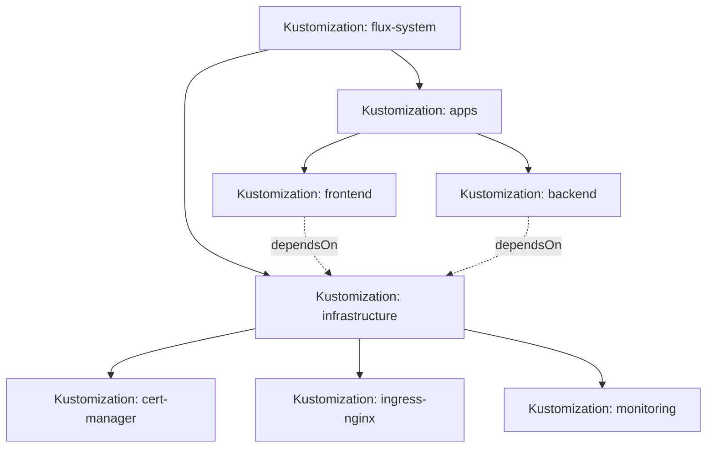

# How to Trace Kustomization Dependencies with flux tree in Flux

Author: [nawazdhandala](https://github.com/nawazdhandala)

Tags: Flux CD, GitOps, Kubernetes, Kustomize, Troubleshooting, Dependencies, CLI

Description: Learn how to use the flux tree command to visualize and trace Kustomization dependency chains in your Flux CD managed clusters.

---

When managing complex Kubernetes deployments with Flux CD, understanding the relationships between your Kustomizations, HelmReleases, and other Flux resources becomes critical. The `flux tree` command provides a powerful way to visualize these dependency hierarchies directly from the command line. In this guide, you will learn how to use `flux tree ks` to trace dependencies, troubleshoot reconciliation issues, and understand your deployment topology.

## What Is flux tree?

The `flux tree` command displays a tree view of Flux resources and their dependencies. When used with the `ks` (short for `kustomization`) subcommand, it shows all the child resources that a given Kustomization manages, including nested Kustomizations, HelmReleases, and the Kubernetes objects they create.

This is especially useful when you have a multi-layered GitOps structure where a root Kustomization references other Kustomizations, which in turn deploy workloads via HelmReleases or plain manifests.

## Basic Usage

The simplest invocation lists the resource tree for a specific Kustomization.

```bash
# Show the dependency tree for a Kustomization named "infrastructure"
flux tree ks infrastructure
```

This outputs a tree structure showing all resources owned by the `infrastructure` Kustomization, including their kind, namespace, name, and readiness status.

## Viewing the Full Cluster Tree

If you want to see the tree for all Kustomizations in the `flux-system` namespace, you can use the following command.

```bash
# Show the dependency tree for all Kustomizations in flux-system namespace
flux tree ks --namespace flux-system
```

## Understanding the Output

A typical output from `flux tree ks` looks like this.

```bash
# Example output from flux tree ks infrastructure
flux tree ks infrastructure --namespace flux-system

# Output:
# Kustomization/flux-system/infrastructure
# ├── Kustomization/flux-system/cert-manager
# │   ├── HelmRelease/cert-manager/cert-manager
# │   │   ├── Deployment/cert-manager/cert-manager
# │   │   ├── Deployment/cert-manager/cert-manager-cainjector
# │   │   └── Deployment/cert-manager/cert-manager-webhook
# │   └── HelmRepository/cert-manager/jetstack
# ├── Kustomization/flux-system/ingress-nginx
# │   ├── HelmRelease/ingress-nginx/ingress-nginx
# │   │   ├── Deployment/ingress-nginx/ingress-nginx-controller
# │   │   └── Service/ingress-nginx/ingress-nginx-controller
# │   └── HelmRepository/ingress-nginx/ingress-nginx
# └── Kustomization/flux-system/monitoring
```

Each level of indentation represents a parent-child ownership relationship. The root is your target Kustomization, and all items beneath it are resources it manages.

## Using the --compact Flag

For large deployments, the full tree can be overwhelming. Use `--compact` to show only Flux resources (Kustomizations, HelmReleases, HelmRepositories) without the underlying Kubernetes objects.

```bash
# Show only Flux-managed resources, excluding leaf Kubernetes objects
flux tree ks infrastructure --compact
```

## Tracing a Specific Dependency Chain

When debugging why a particular workload is not reconciling, you can trace back through the dependency chain. Here is a typical multi-layer Kustomization setup that you might want to trace.

```yaml
# Root Kustomization: clusters/production/infrastructure.yaml
apiVersion: kustomize.toolkit.fluxcd.io/v1
kind: Kustomization
metadata:
  name: infrastructure
  namespace: flux-system
spec:
  interval: 10m
  sourceRef:
    kind: GitRepository
    name: flux-system
  path: ./infrastructure
  prune: true
  # dependsOn creates an explicit ordering dependency
  dependsOn: []
```

```yaml
# Child Kustomization: infrastructure/cert-manager/kustomization.yaml
apiVersion: kustomize.toolkit.fluxcd.io/v1
kind: Kustomization
metadata:
  name: cert-manager
  namespace: flux-system
spec:
  interval: 10m
  sourceRef:
    kind: GitRepository
    name: flux-system
  path: ./infrastructure/cert-manager
  prune: true
  # This Kustomization depends on infrastructure being ready
  dependsOn:
    - name: infrastructure
```

To see how these relate at runtime, run the tree command.

```bash
# Trace the full tree including readiness status
flux tree ks infrastructure --namespace flux-system
```

## Combining with Other Flux Commands

The `flux tree` command works well in combination with other Flux CLI commands for a complete debugging workflow.

```bash
# Step 1: See the full dependency tree
flux tree ks apps --namespace flux-system

# Step 2: Check events for a specific Kustomization that appears unhealthy
flux events --for Kustomization/apps --namespace flux-system

# Step 3: Get detailed status of a specific Kustomization
flux get ks apps --namespace flux-system

# Step 4: Force reconciliation of the root Kustomization
flux reconcile ks apps --namespace flux-system --with-source
```

## Visualizing the Dependency Graph

For documentation or team discussions, you can conceptualize your Flux dependency tree as a directed graph.



Dotted lines represent `dependsOn` relationships, while solid lines represent ownership (parent manages child).

## Common Issues and Tips

**Tree shows no children**: If `flux tree ks` shows a Kustomization with no children, the Kustomization might not have reconciled yet, or the path in the source may be incorrect. Check with `flux get ks <name>` to see its status.

**Namespace matters**: Always specify `--namespace` if your Kustomization is not in the default namespace. Flux Kustomizations are typically in `flux-system`.

**Cross-namespace ownership**: `flux tree` follows ownership references across namespaces, so a Kustomization in `flux-system` that deploys resources to `production` will still show those resources in the tree.

```bash
# List trees across all namespaces
flux tree ks --all-namespaces
```

## Summary

The `flux tree ks` command is an essential tool for understanding and debugging Flux CD deployments. It provides immediate visibility into the dependency hierarchy of your Kustomizations, making it easier to trace reconciliation chains, identify broken dependencies, and communicate your deployment architecture to team members. Pair it with `flux events` and `flux get` for a complete observability workflow over your GitOps pipeline.
