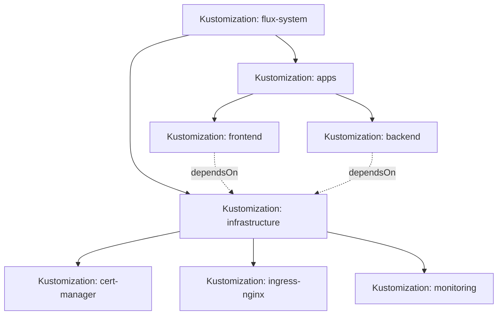

# How to Trace Kustomization Dependencies with flux tree in Flux

Author: [nawazdhandala](https://github.com/nawazdhandala)

Tags: Flux CD, GitOps, Kubernetes, Kustomize, Troubleshooting, Dependencies, CLI

Description: Learn how to use the flux tree command to visualize and trace Kustomization dependency chains in your Flux CD managed clusters.

---

When managing complex Kubernetes deployments with Flux CD, understanding the relationships between your Kustomizations, HelmReleases, and other Flux resources becomes critical. The `flux tree` command provides a powerful way to visualize these resource hierarchies directly from the command line. In this guide, you will learn how to use `flux tree ks` to trace the resources reconciled by a Kustomization, troubleshoot reconciliation issues, and understand your deployment topology.

## What Is flux tree?

The `flux tree` command displays a tree view of resources reconciled by Flux. When used with the `ks` (alias for `kustomization`) subcommand, it shows the resource inventory that a given Kustomization manages, including nested Kustomizations, HelmReleases, and Kubernetes objects recorded in the Kustomization and Helm release inventories.

This is especially useful when you have a multi-layered GitOps structure where a root Kustomization references other Kustomizations, which in turn deploy workloads via HelmReleases or plain manifests.

## Basic Usage

The simplest invocation lists the resource tree for a specific Kustomization.

```bash
# Show the resource tree for a Kustomization named "infrastructure"

flux tree ks infrastructure
```

This outputs a tree structure showing the resources recorded for the `infrastructure` Kustomization, including their kind, namespace, and name.

## Viewing the Full Cluster Tree

If you want to inspect the trees for Kustomizations in the `flux-system` namespace, first list the Kustomizations and then run `flux tree ks` for the root or individual Kustomization you want to inspect.

```bash
# List Kustomizations in flux-system namespace
flux get ks --namespace flux-system

# Show the resource tree for a specific Kustomization
flux tree ks infrastructure --namespace flux-system
```

## Understanding the Output

A typical output from `flux tree ks` looks like this.

```bash
# Example output from flux tree ks infrastructure
flux tree ks infrastructure --namespace flux-system

# Output:
# Kustomization/flux-system/infrastructure
# ├── Kustomization/flux-system/cert-manager
# │   ├── HelmRelease/cert-manager/cert-manager
# │   │   ├── Deployment/cert-manager/cert-manager
# │   │   ├── Deployment/cert-manager/cert-manager-cainjector
# │   │   └── Deployment/cert-manager/cert-manager-webhook
# │   └── HelmRepository/cert-manager/jetstack
# ├── Kustomization/flux-system/ingress-nginx
# │   ├── HelmRelease/ingress-nginx/ingress-nginx
# │   │   ├── Deployment/ingress-nginx/ingress-nginx-controller
# │   │   └── Service/ingress-nginx/ingress-nginx-controller
# │   └── HelmRepository/ingress-nginx/ingress-nginx
# └── Kustomization/flux-system/monitoring
```

Each level of indentation represents resources found in the reconciled inventory. The root is your target Kustomization, and all items beneath it are resources it manages.

## Using the --compact Flag

For large deployments, the full tree can be overwhelming. Use `--compact` to show only Flux resources (Kustomizations, HelmReleases, HelmRepositories) without the underlying Kubernetes objects.

```bash
# Show only Flux-managed resources, excluding leaf Kubernetes objects
flux tree ks infrastructure --compact
```

## Tracing a Specific Resource Chain

When debugging why a particular workload is not reconciling, you can trace through the resource tree and then inspect any explicit Kustomization dependencies separately. Here is a typical multi-layer Kustomization setup that you might want to inspect.

```yaml
# Root Kustomization: clusters/production/infrastructure.yaml
apiVersion: kustomize.toolkit.fluxcd.io/v1
kind: Kustomization
metadata:
  name: infrastructure
  namespace: flux-system
spec:
  interval: 10m
  sourceRef:
    kind: GitRepository
    name: flux-system
  path: ./infrastructure
  prune: true
```

```yaml
# Child Kustomization: infrastructure/cert-manager/kustomization.yaml
apiVersion: kustomize.toolkit.fluxcd.io/v1
kind: Kustomization
metadata:
  name: cert-manager
  namespace: flux-system
spec:
  interval: 10m
  sourceRef:
    kind: GitRepository
    name: flux-system
  path: ./infrastructure/cert-manager
  prune: true
  # This Kustomization is managed by the infrastructure Kustomization
```

To see how these relate at runtime, run the tree command.

```bash
# Trace the full resource tree
flux tree ks infrastructure --namespace flux-system
```

## Combining with Other Flux Commands

The `flux tree` command works well in combination with other Flux CLI commands for a complete debugging workflow.

```bash
# Step 1: See the full resource tree
flux tree ks apps --namespace flux-system

# Step 2: Check events for a specific Kustomization that appears unhealthy
flux events --for Kustomization/apps --namespace flux-system

# Step 3: Get detailed status of a specific Kustomization
flux get ks apps --namespace flux-system

# Step 4: Force reconciliation of the root Kustomization
flux reconcile ks apps --namespace flux-system --with-source
```

## Visualizing the Dependency Graph

For documentation or team discussions, you can conceptualize your Flux resource tree as a directed graph.


```mermaid
graph TD
    A[Kustomization: flux-system] --> B[Kustomization: infrastructure]
    A --> C[Kustomization: apps]
    B --> D[Kustomization: cert-manager]
    B --> E[Kustomization: ingress-nginx]
    B --> F[Kustomization: monitoring]
    C --> G[Kustomization: frontend]
    C --> H[Kustomization: backend]
    G -.->|dependsOn| B
    H -.->|dependsOn| B
```

Solid lines represent inventory relationships (parent Kustomization manages child resources). Dotted lines represent `dependsOn` relationships that you define in the Kustomization specs; `flux tree` does not draw those edges directly.

## Common Issues and Tips

**Tree shows no children**: If `flux tree ks` shows a Kustomization with no children, the Kustomization might not have reconciled yet, or the path in the source may be incorrect. Check with `flux get ks <name>` to see its status.

**Namespace matters**: Always specify `--namespace` if your Kustomization is not in the default namespace. Flux Kustomizations are typically in `flux-system`.

**Cross-namespace ownership**: `flux tree` follows ownership references across namespaces, so a Kustomization in `flux-system` that deploys resources to `production` will still show those resources in the tree.

```bash
# List Kustomizations across all namespaces, then inspect the one you need
flux get ks --all-namespaces
flux tree ks infrastructure --namespace flux-system
```

## Summary

The `flux tree ks` command is an essential tool for understanding and debugging Flux CD deployments. It provides immediate visibility into the resource inventory of your Kustomizations, making it easier to trace reconciliation chains, identify unhealthy resources, and communicate your deployment architecture to team members. Pair it with `flux events` and `flux get` for a complete observability workflow over your GitOps pipeline.
